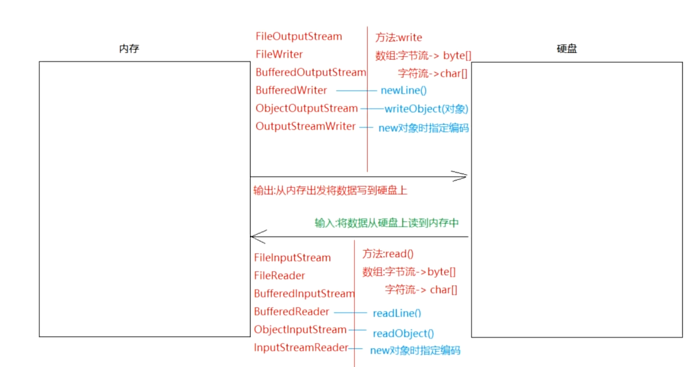

# Java

> 版本：Java8之前分别对应JDK版本为 `JDK1.X`，Java8之后和主版本一致，即 `JDKX`

## DOS命令(win)

|              作用              |                               命令                                |
| :----------------------------: | :---------------------------------------------------------------: |
|            切换盘符            | 盘符名:<br />注意：盘符名不区分大小写，计算机上必须要有指定的盘符 |
| 查看当前路径下的文件或者文件夹 |                                dir                                |
|      进入到指定的文件夹下      |                           cd 文件夹名称                           |
|       进入到多级文件夹下       |                     cd 文件夹名称\文件夹名称                      |
|         退到上一级目录         |                           cd.. 或 cd ..                           |
|       直接退到磁盘根目录       |                           cd\ 或 cd \                             |
|              清屏              |                                cls                                |
|           退出黑窗口           |                               exit                                |
|           创建文件夹           |                         mkdir 文件夹名称                          |
|         创建多级文件夹         |                    mkdir 文件夹名称\文件夹名称                    |
|           删除文件夹           |  rd 文件夹名称<br />注意：删除的文件必须是空的，且不会放入回收站  |
|            删除文件            |            del 文件名.后缀名<br />注意：不会放入回收站            |
|          批量删除文件          |              del \*.后缀名<br />注意：不会放入回收站              |

<br>

## 安装

> [JDK17 下载地址](https://www.oracle.com/java/technologies/javase/jdk17-archive-downloads.html)
>
> 注意：安装路径不能有中文和空格

<br />

## 环境变量

为了在任意目录下面都能使用 `java` 和 `javac` 命令，需要配置环境变量。

::: info

- 方法一：直接将 `/java/bin` 目录粘贴到环境变量 `Path` 配置中（不推荐）
- 方法二：新建系统变量 `JAVA_HOME: C:\App\Java`（bin目录上一级目录），编辑 `Path`， 引用 `JAVA_HOME` 变量，`%JAVA_HOME%\bin`
- 方法三：JDK 安装之后会自带环境变量 `javapath`，位于 `C:\Program Files\Common Files\Oracle\Java\javapath`，可以删除

:::

<br />

## 基础

### 1. 注意事项

- `class` 代表的就是类，类是 Java 程序最基本的组成单元，所有代码都需要在类中写
- `class` 后面跟的名字叫做类名，要和 java 文件名保存一致；如果不一致，需要移除 `public` 关键字声明
- 一个 java 文件中可以写多个 `class`， 但是只能有一个 `public class`，建议一个 java 文件只写一个 `class`
- `main()` 方法必须写在带 `public` 的类中

<br />

### 2. printIn和print区别

相同点：

- 都是输出语句

不同点：

- printIn：输出之后自带换行效果
- print：输出之后不带换行效果

<br />

### 3. 常量

分类：

- 整数常量：所有整数
- 小数常量：所有带小数点的
- 字符常量：带单引号的''，且只能有一个内容
- 字符串常量：带双引号的，内容随意
- 布尔常量：true | false
- 空常量：null，表示数据不存在，不能直接使用

<br />

### 4. 变量

数据类型：

- 基本数据类型：4类8种
  - 整型：byte、short、int、long(定义的变量后面加L)
  - 浮点型：float(定义的变量后面加F)、double(默认小数类型)
  - 字符型：char
  - 布尔型：boolean
- 引用数据类型：类、数组、接口、枚举、注解

|   数据类型   |   关键字    | 内存占用 | 取值范围                        |
| :----------: | :---------: | :------: | ------------------------------- |
|    字节型    |    byte     | 1个字节  | -128 至 127                     |
|    短整型    |    short    | 2个字节  | -32768 至 32767                 |
|     整型     | int（默认） | 4个字节  | -2^31 至 2^31-1<br />正负21个亿 |
|    长整型    |    long     | 8个字节  | -2^63 至 2^63-1<br />19位数字   |
| 单精度浮点型 |    float    | 4个字节  | 1.4013E-45 至 3.4028E+38        |
| 双精度浮点型 |   double    | 8个字节  | 4.9E-324 至 1.7977E+308         |
|    字符型    |    char     | 2个字节  | 0 至 2^16-1                     |
|   布尔类型   |   boolean   | 1个字节  | true \| false                   |

定义：

- `数据类型 变量名 = 值;`
- `数据类型 变量名; 变量名 = 值;`
- 连续定义相同类型：`数据类型 变量名1, 变量名2, 变量名3; 变量名1 = 值; 变量名2 = 值; 变量名3 = 值;`
- 连续定义相同类型：`数据类型 变量名1 = 值, 变量名2 = 值, 变量名3 = 值;`

::: warning

字符串不属于基本数据类型，属于引用数据类型，用 `String` 表示；

`String` 是一个类，只不过字符串在定义时可以和基本数据类型格式一样

:::

::: tip float 和 double 的区别

1. float的小数位只有23位二进制，能表示的最大十进制为2的23次方(8388608)，是7位数，所以float型代表的小数位为7位
2. double的小数位只有52位二进制，能表示的最大十进制为(4503599627370496)，是16位数，所以double型代表的小数位为16位

:::

::: warning

1. float和double类型不能直接参与运算，会有精度损失
2. 变量必须初始化赋值后才能使用
3. 在同一个作用域(一对大括号中)不能重复定义变量
4. 不同作用域中的数据尽量不要随意互相访问

:::

<br />

### 5. IDEA快捷键

| 快捷键                  | 功能                                   |
| :---------------------- | :------------------------------------- |
| Alt + Enter             | 导入包，自动修正代码                   |
| Ctrl + Y                | 删除光标所在行                         |
| Ctrl + D                | 复制光标所在行的内容，插入光标位置下面 |
| Ctrl + Alt + L          | 格式化代码                             |
| Ctrl + /                | 单行注释                               |
| Ctrl + Shift + /        | 选中代码注释，多行注释，再按取消注释   |
| Alt + Shift + 上下箭头  | 上下移动当前代码行                     |
| Ctrl + Shift + 上下箭头 | 上下移动代码块                         |

<br />

### 6. 键盘录入Scanner

> 概述：是Java定义好的一个类
>
> 作用：将数据通过键盘录入的形式放到代码中参与运行
>
> 位置：`java.util`
>
> 使用：
>
> 1. 导包：通过导包找到要使用的类 -> 导包位置：类上 `import java.util.Scanner`
> 2. 创建对象： `Scanner 变量名 = new Scaner(System.in)`
> 3. 调用方法，实现键盘录入

| 方法            | 说明                                         |
| --------------- | -------------------------------------------- |
| `nextInt()`     | 输入整数int型的                              |
| `next()`        | 输入字符串String型的，遇到空格和回车结束录入 |
| `nextLine()`    | 输入字符串String型的，遇到回车结束录入       |
| `nextDouble()`  | 输入小数double型的                           |
| `nextBoolean()` | 输入布尔boolean型                            |

<br />

### 7. Random随机数

> 概述：是Java自带的一个类
>
> 作用：可以在指定的范围内随机生成一个整数
>
> 位置：`java.util`
>
> 使用：
>
> 1. 导包：`import java.util.Random`
> 2. 创建对象：`Random 变量名 = new Random()`
> 3. 调用方法：生成随机数

| 方法                 | 说明                                |
| -------------------- | ----------------------------------- |
| `nextInt()`          | 在int型的取值范围内随机生成一个整数 |
| `nextInt(int bound)` | 在0至bound-1范围内随机生成一个整数  |

<br />

### 8. 数组

> 动态初始化：`类型[] 数组名 =  new 类型[长度]` 或者 `类型 数组名[] = new 类型[长度]`
>
> 简化的静态初始化：`类型[] 数组名 = {元素1，元素2，...}`

| API      | 说明         |
| -------- | ------------ |
| `length` | 获取数组长度 |

<br />

### 9. 内存图

java中，将内存划分成5块：

1. 栈Stack：主要运行方法，运行完毕之后，需要出栈

2. 堆Heap：保存的是对象、数组，每new一次，都会在堆内存中开辟空间，并为这个空间分配一个地址值，堆内存中的数据都是有默认值的

   整数：0，小数：0.0，字符：'\u0000'，布尔：false，引用：null

3. 方法区：代码的“预备区”，记录了类的信息及方法的信息，代码运行之前，需要先进内存（方法区）

4. 本地方法栈：专门运行native方法（本地方法），对Java功能的扩充

5. 寄存器：CPU存储相关

<br />

### 10. 方法

通用定义格式：

```java
修饰符 返回值类型 方法名(参数) {
  方法体
  return 结果
}
```

<br />

## 面向对象

1. 测试类：带main方法的类，主要是运行代码的

2. 实体类：是一类事物的抽象表现形式

3. 对象：一类事物的具体提现

   - 使用：

     1. 导包：`import 包名 类名`：如果两个类在同一个包下，使用对方的成员不需要导包；如果两个类不在同一个包下，使用对方的成员需要导包

        特殊包：`java.lang` 使用时不需要导包，如 `String`

     2. 创建对象：`类名 对象名 = new 类名()`

     3. 调用成员：`对象名.属性 | 方法`

::: tip 成员变量和局部变量的区别

1. 定义位置不同：成员变量定义在类中方法外，局部变量定义在方法中或参数位置
2. 初始化值不同：成员变量有默认值，不赋值也可以使用；局部变量没有默认值，需要先赋值再使用
3. 作用范围不同：成员变量作用于整个类，局部变量只作用于自己所在的方法中
4. 内存位置不同：成员变量位于堆中，跟着对象走；局部变量在栈中，跟着方法走
5. 生命周期不同：成员变量随着对象的创建而产生，随着对象的消失而销毁；局部变量随着方法的调用而产生，随着方法的出栈而销毁

:::

<br />

## JavaBean

IDEA快捷键：`Alt + Insert`

> 概念：非抽象类，是公共类，有私有属性，有构造方法，设置get & set 方法获取和设置私有属性
>
> 和数据库表关联：
>
> - 类名 -> 表名
> - 属性 -> 列名
> - 对象 -> 表中一行数据
> - 属性值 -> 表中单元格中的数据

将基本类型数据定义成包装类

<br />

## 继承

::: tip

- 成员变量访问特点：看等号左边是谁，先调用谁中的成员变量
- 成员方法访问特点：看等号右边new的是谁，先调用谁中的方法

:::

::: warning

- 构造方法不能继承，也不能被重写
- 私有方法可以继承，但不能被重写
- 静态方法可以继承，但不能被重写
- 类只能单继承，可以多层继承

:::

### 方法的重写

> 概述：子类中有一个和父类方法名以及参数列表相同的方法
>
> 前提：继承
>
> 访问：看new的是谁，先调用谁中的，如果new的是子类，调用子类重写的方法，子类没有就找父类
>
> 检测：在方法上添加注解：`@override` 不报错就是重写

::: warning 注意事项

1. 子类重写父类方法之后，权限必须要保证大于等于父类权限 `public -> protected -> 默认 -> private`
2. 重写的方法名和参数列表要一致
3. 私有方法、静态方法、构造方法不能被重写
4. 子类重写父类方法之后，返回值类型应该是父类方法返回值类型的子类类型

:::

<br />

### super

new子类对象时，会先初始化父类（先调用父类的无参构造方法）

原因：每个构造方法的第一行，默认都会有一个 `super()`，不写jvm会自动提供

> 概述：代表的是父类引用
>
> 作用：可以调用父类中的成员

使用：

1. 在子类构造方法中调用父类的构造方法：`super()` 或 `super(实参)`
2. 调用父类成员变量：`super.变量名`
3. 调用父类成员方法：`super.方法()`

<br />

### this

> 概述：代表的是当前对象

作用：

1. 区分重名的成员变量和局部变量
2. 调用当前对象的成员

使用：

1. 调用当前对象的构造，在构造函数中写：**不能和 `super()` 同时调用，且必须在第一行**
   - `this()`：调用当前对象的无参构造
   - `this(实参)`：调用当前对象的有参构造
2. 调用当前对象的成员变量：`this.成员变量名`
3. 调用当前对象的成员方法：`this.成员方法名()`

<br />

## 接口

> 定义：`public interface 接口名 {}`
>
> 实现：`public class 类名 implements 接口名 {}`

使用：

- 实现类实现接口
- 重写接口中的抽象方法
- 创建实现类对象(接口不能直接new对象)
- 调用重写的方法

::: tip

- 接口可以多继承，一个接口可以继承多个接口：`public interface A extends B, C {}`
- 接口可以多实现：一个类了可以实现一个或多个接口：`public class A implements A, B {}`
- 一个子类可以继承一个父类的同时实现一个或者多个接口：`public class Child extends Parent implements A, B {}`
  - 注意：继承和实现接口时，只要是父类或者接口中的抽象方法，子类或者实现类都要重写

:::

### 成员

1. 抽象方法
   - 格式：`public abstruct 返回值类型 方法名(形参)` (不写 public abstract 默认也有)
   - 使用：
     1. 定义实现类，实现接口
     2. 重写抽象方法
     3. 创建实现类对象，调用重写的方法
2. 默认方法
   - 格式：`public default 返回值类型 方法名(形参) { 方法体 return xxx }`
   - 使用：
     1. 定义实现类，实现接口
     2. 默认方法可重写，可以不重写
     3. 创建实现类对象，调用默认方法
3. 静态方法
   - 格式：`public static  返回值类型 方法名(形参) { 方法体 return xxx }`
   - 使用：接口名.方法()
4. 成员变量
   - 格式：`public static final 数据类型 变量名 = 值`，final修饰的变量不能二次赋值，可以视为常量(不写 public static final 默认也有)
   - 使用：接口名.成员变量

::: tip

- 默认方法和静态方法，可以作为临时加的小功能来使用
- 被 static final 修饰的成员变量需要初始化时手动赋值，习惯将成员变量名大写

:::

::: warning

- 当一个类实现多个接口时，如果接口中的抽象方法有重名且参数列表相同，只需要重写一次
- 当一个类实现多个接口时，如果接口中的默认方法有重名且参数列表相同，必须重写一次默认方法
-

:::

::: info 接口和抽象类的区别

相同点：

- 都位于继承体系的顶端，用于被其他类实现或者继承
- 都不能new
- 都包含抽象方法，其子类或者实现类都必须重写这些抽象方法

不同点：

- 抽象类：一般作为父类使用，可以有成员变量、构造函数、成员方法、抽象方法等
- 接口：成员单一，一般抽取接口都是方法，视为功能的大集合
- 类不能多继承，接口可以多继承

:::

- 接口作为方法参数和返回值，传递的是实现类对象
- 抽象类作为方法参数和返回值，传递的是其子类对象
- 普通类作为方法参数和返回值，传递的是对象

<br />

## 多态

::: tip 前提

- 必须有子父类继承或者接口实现关系
- 必须有方法的重写
- new 对象，父类引用指向子类对象：`Fu fu = new Zi()`，大类型包含小类型，指向哪个对象，就使用哪个对象的重写方法

:::

::: warning

- 多态下，只能调用重写的方法，不能直接调用子类特有功能(可以向下转型，再调用)
- 形参传递父类类型，调用此方法父类类型可以接收任意它的子类对象，传递哪个子类对象，就调用哪个子类对象重写的方法

:::

<br />

### 成员访问特点

- 成员变量：看等号左边是谁，调用谁的属性

- 成员方法：看等号右边new对象是谁，调用谁的方法，子类没有，再找父类

<br />

### 转型

- 向上转型：将小类型转成大类型，父类引用指向子类对象：`double b = 1;`

- 向下转型(强转)：将大类型强制转成小类型，`父类类型 对象名1 = new 子类对象(); 子类类型 对象名2 = (子类类型) 对象名1;`

::: danger

1. 如果等号左右两边类型不一致，转型会出现类型转换异常(ClassCastException)
2. 解决：`instance of`，类型收缩判断

:::

<br />

## 权限修饰符

| 修饰符    | 含义                                                                                      |
| --------- | ----------------------------------------------------------------------------------------- |
| public    | 公共的，最高权限，**在哪里都能访问**                                                      |
| protected | 受保护的，**可以在当前类、同包不同类、子类中访问**                                        |
| default   | 默认的，不写权限修饰符就是默认的，不能直接写出default，**可以在当前类、同包不同类中访问** |
| private   | 私有的，可以通过 get/set 访问私有变量，**只能在当前类中访问**                             |

::: tip 建议使用

- 属性：用 `private`，封装思想，通过 get/set 调用
- 成员方法：用 `public`，便于调用
- 构造函数：用 `public`，便于new对象

:::

<br />

## final

> 作用：修饰符
>
> 注意：不能和 abstract 同时使用

| 修饰对象 | 格式                                            | 特点                                         |
| -------- | ----------------------------------------------- | -------------------------------------------- |
| 类       | `权限修饰符 final 类名{}`                       | 修饰的类不能被继承                           |
| 方法     | `权限修饰符 final 返回值类型 方法名() {}`       | 修饰的方法不能被重写                         |
| 局部变量 | `权限修饰符 final 数据类型 变量名 = 值`         | 修饰的变量不能修改                           |
| 对象     | `权限修饰符 final 数据类型 对象名 = new 对象()` | 修饰的对象地址值不能改变，里面属性值可以修改 |
| 成员变量 | `权限修饰符 final 数据类型 变量名 = 值`         | 需要手动赋值，不能修改                       |

<br />

## 代码块

### 构造代码块

> 特点：优先于构造方法执行，每new一次，就会执行一次

```java
{
  xxx
}
```

<br />

### 静态代码块

> 特点：优先于构造代码块和构造方法执行，且只执行一次
>
> 使用场景：初始化某些数据，比如数据库连接

```java
static {
  xxx
}
```

<br />

## 内部类

当一个事物的内部，还有一个部分需要完整的结构去描述，而这个内部的完整结构又只为外部事物提供服务，那么整个内部的完整结构最好使用内部类。

- 内部类可以被四种权限修饰符修饰
- 内部类可以定义属性、方法、构造等
- 内部类访问外部类成员变量：`外部类.this.成员变量`

### 静态成员内部类

> 格式：直接在定义内部类的时候加上 static 关键字
>
> 调用：`外部类.内部类 对象名 = new 外部类.内部类()`

```java
public class A {
  static class B {
    ...
  }
}
```

::: info

- 可以被final或abstract修饰，规则同关键字
- 不能调用外部的非静态成员

:::

<br />

### 非静态成员内部类

> 调用： `外部类.内部类 对象名 = new 外部类().new 内部类()`

```java
public class A {
  class B {
    ...
  }
}
```

<br />

### 局部内部类

> 格式：可以定义在方法中、代码块中、构造方法中
>
> 调用：先在定义处new内部类对象，然后在实现类中直接调用

<br />

### 匿名内部类

> 定义：没有显示声明出类名的内部类

::: info 常规实现接口/抽象类方法

1. 想实现接口/抽象类，使用一次抽象方法，先创建一个实现类，实现接口或者继承抽象类
2. 重写抽象方法
3. new 实现类对象
4. 调用重写后的抽象方法

:::

```java
/*
 * 匿名内部类四合一
 */
new 接口/抽象类() {
  重写抽象方法
}.重写的抽象方法();

// or
类名 对象名 = new 接口/抽象类() {
  重写的抽象方法
}
对象名.重写的抽象方法();
```

<br />

## 异常

Throwable:

- Error错误：代码出现了重大错误，需要重写代码，需要大的改动
- Exception异常：代码出现了小问题
  - 编译时期异常：
    - 编译爆红，语法错误除外
    - Exception以及子类(除了RuntimeException)
  - 运行时期异常：
    - 运行报错，RuntimeException以及子类

<br />

### 异常处理

方式一：`throws`

> 格式： `throws 异常`
>
> 位置：在方法参数和方法体之前，即) {之间
>
> 意义：上抛异常，和jvm处理方式相同，会阻断后面的代码执行
>
> 处理多个异常：`throws 异常1,异常2...`，如果多个异常之间有子父类继承关系，可以之间throws父类异常，也可以直接 `throws Exception`

方式二：`try catch`

```java
// 格式，可以单个catch处理单个异常，也可以多个catch处理多个异常
try {
  可能出现异常的代码
} catch(异常 对象名) {
  处理异常代码，通常是保存到日志文件
} catch (异常 对象名) {
  处理异常代码
} catch ... {
  xxx
} finally {

}
```

::: info

- 如果父类方法抛了异常，子类重写之后可抛可不抛
- 如果父类方法没有抛异常，子类重写之后不能抛

:::

<br />

### 自定义异常

1. 定义一个类
2. 如果继承 Exception，就是编译时期异常；如果继承 RuntimeException，就是运行时期异常
3. throw自定义异常，然后通过 `throws` 或者 `try catch` 处理

Throwable类的方法(打印异常信息)：

- `String toString()`：输出异常类型和设置的异常信息
- `String getMessage()`：输出设置的异常信息
- `void printStackTree()`：打印调用栈和详细信息

<br />

## Object类

> 概述：是所有类的根类(父类)，所有的类都会直接或者间接继承此类

| 方法                  | 意义                                                                                            |
| --------------------- | ----------------------------------------------------------------------------------------------- |
| `String toString()`   | 返回该对象的字符串表现形式，如果没有重写该方法，直接输出地址值；可通过Alt + insert 快速生成重写 |
| `boolean equals(xxx)` | 针对基本类型，比较的是值；针对引用类型，比较的是地址值                                          |
| `clone()`             | 复制一个属性值一样的新对象，需要被克隆的对象实现cloneable，重写clone方法                        |

<br />

## Comparable

> 位置：位于 `java.lang` 包中

Java给引用类型的大小比较，指定了一个标准接口，就是 `java.lang.comparable`

1. 哪个类的对象要比较大小，哪个类就实现该接口，并重写方法，方法体就是如何比较大小
2. 对象比较大小时，通过对象调用 `compareTo` 方法，根据方法的返回值决定大小：
   - this(调用方法的对象) 减 指定对象(传入方法的参数对象) 大于0，返回正整数
   - this(调用方法的对象) 减 指定对象(传入方法的参数对象) 小于0，返回负整数
   - this(调用方法的对象) 减 指定对象(传入方法的参数对象) 等于0，返回0

<br />

## Comparator

> 位置：`java.util` 包中

1. 编写一个类，称之为比较器类型，实现 `java.util.Comparator` 接口，并重写方法，方法体就是如何比较大小
2. 比较大小时，通过比较器类型的对象调用 compare(o1, o2)方法，将要比较的两个对象作为参数传入，根据返回值决定大小：
   - o1 对象 减 o2 大于0，返回正整数
   - o1 对象 减 o2 小于0，返回负整数
   - o1 对象 减 o2 等于0， 返回0

<br />

## String

该类代表字符串，声明的是字符串对象，存储在堆空间，因为字符串不可变，所以相同字符串对象会共享，指向同一个堆内存地址。

```java
String s1 = "abc";
String s2 = "abc";
System.out.printIn(s1 == s2); // true
```

::: info

- 如果字符串拼接是字面值拼接，不会产生新对象
- 如果字符串拼接有变量拼接，会产生新对象

:::

| 方法                                        | 功能                                                           |
| ------------------------------------------- | -------------------------------------------------------------- |
| `boolean equals(string)`                    | 比较字符串内容是否相等                                         |
| `boolean equalsIgnoreCase(string)`          | 比较字符串内容是否相等，忽略大小写                             |
| `int length()`                              | 获取字符串长度                                                 |
| `String concat(string)`                     | 字符串拼接，返回新的字符串                                     |
| `char charAt(int index)`                    | 根据索引获取对应的字符                                         |
| `int indexOf(string)`                       | 获取字符串第一次出现的索引位置                                 |
| `String subString(beginIndex [, endIndex])` | 截取字符串，有结束索引时不含结尾，否则截取到最后，返回新字符串 |
| `char[] toCharArray()`                      | 将字符串转成char数组                                           |
| `byte[] getBytes()`                         | 将字符串转成byte数组                                           |
| `String replace(string1, string2)`          | 替换字符串string1为string2                                     |
| `byte[] getBytes(charsetName)`              | 按照指定的编码将字符串转成byte数组                             |
| `String[] split(regex)`                     | 按照指定的正则规则分割字符串，返回切割后的数组                 |
| `boolean contains(string)`                  | 判断是否包含指定的字符串                                       |
| `boolean endsWith(string)`                  | 判断是否以指定字符串结尾                                       |
| `boolean startsWith(string)`                | 判断是否以指定字符串开头                                       |
| `String toLowerCase()`                      | 将字符串转小写                                                 |
| `String toUpperCase()`                      | 将字符串转大写                                                 |
| `String trim()`                             | 去除字符串两端空格                                             |

<br />

## StringBuilder

> 概述：一个可变的字符串序列，此类提供了一个与 `StringBuffer` 兼容的一套API，但是不保证同步(现成不安全，效率高)
>
> 作用：主要是字符串拼接
>
> 格式：`StringBuilder()` 或 `StringBuilder(String str)`

因为String拼接会产生新的字符串对象，会在堆内存中开辟新的空间，如果拼接次数多了，会占用内存，效率较低；

`StringBuilder` 底层自带一个缓冲区(没有被final修饰的byte数组)，拼接字符串之后都会在此缓冲区中保存，在拼接的过程中，不会随意产生新对象，节省内存。

| 方法                                 | 说明                              |
| ------------------------------------ | --------------------------------- |
| `StringBuilder append(任意类型数据)` | 字符串拼接，返回StringBuilder自己 |
| `StringBuilder reverse()`            | 字符串翻转，返回StringBuilder自己 |
| `String toString()`                  | 将StringBuilder转成String         |

<br />

## Math

> 概述：数学工具类
>
> 作用：主要用于数学运算
>
> 特点：构造方法私有了；方法都是静态的
>
> 使用：类名.方法()直接调用

| 方法                          | 说明                 |
| ----------------------------- | -------------------- |
| `int Math.abs(int x)`         | 求参数的绝对值       |
| `double Math.ceil(double x)`  | 向上取整             |
| `double Math.floor(double x)` | 向下取整             |
| `long Math.round(double x)`   | 四舍五入             |
| `int Math.max(int a, int b)`  | 求两个数之间的较大值 |
| `int Math.min(int a, int b)`  | 求两个数之间的较小值 |

<br />

## BigInteger

> 作用：处理超大整数
>
> 构造：`BigInteger(String val)` 参数的格式必须是String的数字形式
>
> 使用：`BigInteger a = new BigInteger(String "x")`，a必须是整数形式的字符串
>
> 上限：42亿的21亿次方，近似于无限

| 方法                                   | 说明                 |
| -------------------------------------- | -------------------- |
| `BigInteger x.add(BigInteger a)`       | 加                   |
| `BigInteger x.substract(BigInteger a)` | 减                   |
| `BigInteger x.multiply(BigInteger a)`  | 乘                   |
| `BigInteger x.divide(BigInteger a)`    | 除                   |
| `int a.intValue()`                     | 将BigInteger转成int  |
| `long a.longValue()`                   | 将BigInteger转成long |

<br />

## BigDecimal

> 作用：直接使用float或者double类型参与运算，会出现精度损失，此类就是解决精度问题
>
> 使用：
>
> - 构造方法形式：`BigDecimal a = new BigDecimal(String "x")`，x必须是字符串
> - 静态方法形式：`BigDecimal a = BigDecimal.valueOf(double x)`，此方法初始化时可以传入double型数据

| 方法                                                             | 说明说明                                                                                                                                                |
| ---------------------------------------------------------------- | ------------------------------------------------------------------------------------------------------------------------------------------------------- |
| `BigDecimal x.add(BigDecimal a)`                                 | 加                                                                                                                                                      |
| `BigDecimal x.substract(BigDecimal a)`                           | 减                                                                                                                                                      |
| `BigDecimal x.multiply(BigDecimal a)`                            | 乘                                                                                                                                                      |
| `BigDecimal x.divide(BigDecimal a)`                              | 除，如果除不尽会报错                                                                                                                                    |
| `BigDecimal x.divide(BigDecimal a, int scale, int roundingMode)` | 除，可以设置保留几位小数和取舍方式<br />`static int ROUND_UP`：向上加1<br />`static int ROUND_DOWN`：直接舍去<br />`static int ROUND_HALF_UP`：四舍五入 |
| `double a.doubleValue()`                                         | 将BigDecimal转成double                                                                                                                                  |

::: warning BigDecimal除法过时解决

使用 `BigDecimal x.divide(BigDecimal a, int scale, RoundingMode roundMode)`：仅最后一个参数类型变为枚举：

- `RoundingMode.UP`：向上加1
- `RoundingMode.DOWN`：直接舍去
- `RoundingMode.HALF_UP`：四舍五入

:::

<br />

## Date

> 概述：表示特定的瞬间，精确到毫秒
>
> 常识：
>
> - 1000ms = 1s
> - 时间原点：1970年1月1日 0时0分0秒(UNIX系统起始时间)，叫做格林威治时间，在0时区上
>
> 使用：`Date x = new Date()`，无参默认获取当前系统时间，有long型参数指毫米，从时间原点起算

<br />

## Calendar

> 概述：日历抽象类
>
> 使用：`Calendar x = Calendar.getInstance()`，获取日历类对象

| 方法                              | 说明                                                     |
| --------------------------------- | -------------------------------------------------------- |
| `int get(int filed)`              | 返回给定日历字段的值                                     |
| `void set(int field, int value)`  | 将给定的日历字段设置为指定的值                           |
| `void add(int field, int amount)` | 根据日历的规则，为给定的日历字段添加或者减去指定的时间量 |
| `Date getTime()`                  | 将Calendar转为可操作的Date对象                           |

<br />

## SimpleDateFormat

> 概述：日期格式化类
>
> 使用：`SimpleDateFormat sdf = SimpleDateFormat(String pattern)`

| 方法                            | 说明                               |
| ------------------------------- | ---------------------------------- |
| `String sdf.format(Date date)`  | 将Date对象按照指定的格式转成String |
| `Date sdf.parse(String source)` | 将符合日期格式的字符串转成Date对象 |

<br />

## JDK8新日期类

> 位置：`java.time` 包中

### LocalDate

> 概述：获取本地年月日

- 创建对象：`static LocalDate now()`
- 创建指定日期对象：`static LocalDate of(int year, int month, int dayOfMonth)`

<br />

### LocalDateTime

> 概述：获取本地年月日时分秒

- 创建对象：`static LocalDateTime now()`
- 创建指定时分秒对象：`static LocalDateTime of(int year, Month month, int dayOfMonth, int hour, int minute, int second)`

| 共有方法                            | 说明                           |
| ----------------------------------- | ------------------------------ |
| `int getYear()`                     | 获取年份                       |
| `int getMonthValue()`               | 获取月份                       |
| `int getDayOfMonth()`               | 获取月中的第几天               |
| `LocalDate withYear(int year)`      | 设置年份                       |
| `LocalDate withMonth(int month)`    | 设置月份                       |
| `LocalDate withDayOfMonth(int day)` | 设置月中的天数                 |
| `LocalDate plusxxx()`               | 设置日期字段的偏移量，向后偏移 |
| `LocalDate minusxxx()`              | 设置日期字段的偏移量，向前偏移 |

<br />

### Period

> 概述：计算日期之间的偏差
>
> 使用：`static Period between(LocalDate d1, LocalDate d2)`

| 方法              | 说明         |
| ----------------- | ------------ |
| `int getYears()`  | 获取相差的年 |
| `int getMonths()` | 获取相差的月 |
| `int getDays()`   | 获取相差的天 |

<br />

### Duration

> 概述：计算时分秒之间的偏差
>
> 使用：`static Duration between(Temporal startInclusive, Temporal endExclusive)`
>
> - Temporal：是一个接口，实现类是LocalDate、LocalDateTime
> - 因为要操作时分秒，所以参数要传递LocalDateTime

| 方法          | 说明         |
| ------------- | ------------ |
| `toDays()`    | 获取相差天数 |
| `toHours()`   | 获取相差小时 |
| `toMinutes()` | 获取相差分钟 |
| `toMills()`   | 获取相差毫秒 |

<br />

### DateTimeFormatter

> 概述：日期格式化类
>
> 获取：通过指定格式获取对象 `DateTimeFormatter dtf = DateTimeFormatter.ofPattern(String pattern)`

| 方法                                            | 说明                                                                                                                                              |
| ----------------------------------------------- | ------------------------------------------------------------------------------------------------------------------------------------------------- |
| `String dtf.format(TemporalAccessor temporal)`  | 将日期对象按照指定的规则转成String<br />TemporalAccessor是接口，子接口有Temporal<br />Temporal的实现类：LocalDate、LocalDateTime                  |
| `TemporalAccessor dtf.parse(charSequence text)` | 将符合规则的字符串转成日期对象<br />如果要将TemporalAccessor转成LocalDateTime，需要使用`LocalDateTime ldt = LocalDateTime.from(temporalAccessor)` |

<br />

## System

> 概述：系统相关的，是一个工具类
>
> 特点：
>
> - 构造方法私有，不能使用new
> - 方法都是静态的，直接调用

| 方法                                                                                   | 说明                                                                                                                                                       |
| -------------------------------------------------------------------------------------- | ---------------------------------------------------------------------------------------------------------------------------------------------------------- |
| `static long currentTimeMillis()`                                                      | 返回以毫秒为单位的当前时间，可以测效率                                                                                                                     |
| `static void exit(int status)`                                                         | 终止当前正在运行Java虚拟机                                                                                                                                 |
| `static void arraycopy(Object src, int srcPos, Object dest, int destPops, int length)` | 数组复制<br />src：源数组<br />srcPos：从源数组的哪个索引开始复制<br />dest：目标数组<br />destPos：从目标数组哪个索引开始粘贴<br />length：复制多少个元素 |

<br />

## Arrays

> 概述：数组工具类
>
> 特点：
>
> - 构造方法私有，不能直接new
> - 方法都是静态的，直接调用

| 方法                                                 | 说明                                          |
| ---------------------------------------------------- | --------------------------------------------- |
| `static String toString(int[] a)`                    | 按照格式打印数组元素<br />[元素1，元素2，...] |
| `static void sort(int[] a)`                          | 生序排序                                      |
| `staic int binarySearch(int[], a, int key)`          | 二分查找(前提是升序)                          |
| `static int[] copyOf(int[] original, int newLength)` | 数组扩容                                      |

<br />

## 包装类

> 概述：基本类型对应的类
>
> 作用：将基本类型转成包装类，从而让基本类型拥有类的特性

| 基本类型  | 包装类      | 缓存对象      |
| --------- | ----------- | ------------- |
| `byte`    | `Byte`      | -128~127      |
| `short`   | `Short`     | -128~127      |
| `int`     | `Integer`   | -128~127      |
| `long`    | `Long`      | -128~127      |
| `float`   | `Float`     | 无            |
| `double`  | `Double`    | 无            |
| `char`    | `Charactor` | 0~127         |
| `boolean` | `Boolean`   | true 和 false |

### Integer

装箱：将基本类型转成包装类：

- `static Integer valueOf(int i)`
- `static Integer valueOf(String s)`

拆箱：将包装类转成基本类型：

- `int intValue()`

### 基本类型和String的转换

- 基本类型转String：

  - 方式一：+ 拼接
  - 方式二：`static String valueOf(int i)`

- String转基本类型：每个包装类中都有一个类似的方法 `parseXXX`

  | 位置    | 方法                                  | 说明            |
  | ------- | ------------------------------------- | --------------- |
  | Byte    | static byte parseByte(String s)       | String转byte    |
  | Short   | static short parseShort(String s)     | String转short   |
  | Integer | static int parseInt(String s)         | String转int     |
  | Long    | static long parseLong(String s)       | String转long    |
  | Float   | static float parseFloat(String s)     | String转float   |
  | Double  | static double parseDouble(String s)   | String转double  |
  | Boolean | static boolean parseBoolean(String s) | String转boolean |

<br />

## 多线程

> 主线程：CPU和内存之间为main方法开辟的通道，专门为main方法服务的线程

### 创建线程

**第一种方式：继承线程类**

1. 继承线程类：`extends Thread`
2. 重写run方法，设置线程任务
3. 创建自定义线程类对象，调用start启动线程，jvm会自动调用run方法

::: warning

- 开启一个线程，会开启一个栈空间，去运行对应的线程代码
- 同一个线程对象不能连续多次调用start，如果需要多次调用，需要new一个新对象

:::

| 方法                                | 说明                                                                       |
| ----------------------------------- | -------------------------------------------------------------------------- |
| `start()`                           | 开启线程，jvm自动调用run方法                                               |
| `run()`                             | 设置线程任务，Thread重写了Runnable接口中的run方法                          |
| `getName()`                         | 获取线程名称                                                               |
| `setName()`                         | 设置线程名称                                                               |
| `static Thread currentThread()`     | 获取正在执行的线程对象<br />此方法在哪个线程中使用，获取的就是哪个线程对象 |
| `static void sleep(long millis)`    | 线程睡眠，超时后会自动醒来继续执行                                         |
| `void setPriority(int newPriority)` | 设置线程优先级，优先级越高，抢占CPU使用权几率越大                          |
| `int getPriority()`                 | 获取线程优先级                                                             |
| `void setDaemon(boolean on)`        | 设置为守护线程，当非守护线程执行完毕，守护线程就要结束                     |
| `static void yield()`               | 礼让线程，让当前线程让出CPU使用权                                          |
| `void join()`                       | 插入线程，也叫插队线程                                                     |

::: danger

在重写的run方法中有异常只能trycatch，不能throws，因为父类Thread没有抛异常，所以子类不能抛异常

:::

**第二种方式：实现Runnable接口**

1. 重写类，实现Runnable接口
2. 重写run方法，设置线程任务
3. 利用Thread类的构造方法：`Thread(Runnable target)`，创建Thread对象，将自定义的类作为参数传递到Thread构造中
4. 调用start方法，启动线程

**第三种方式：实现Callbale接口**

> 概述：是一个接口，类似于Runnable
>
> 方法：实现 `V call()`，设置线程任务，类似于run方法

::: info call() 和 run() 的区别

- call有返回值，有异常可以throws
- run没有返回值，有异常不可以throws
- 获取call返回值，`FutureTask<T>`

:::

```java
{
  MyCallable mca = new MyCallable();
  FutureTask<String> futureTask = new FutureTask<>(myCallbale);
  Thread t1 = new Thread(futureTask);
  t1.start();
}
```

**第四种方式：线程池**

之前一个线程任务，需要创建一个线程对象去执行，用完还要销毁线程对象，如果线程任务多了，就需要频繁创建线程对象和销毁线程对象，这样会耗费内存资源。

1. 创建线程池对象：`Executors` 工具类
2. 获取线程池对象：`static ExecutorService newFixedThreadPool(int nThreads) `
3. 执行线程任务：`ExecutorService` 中的方法
   - `Future<> submit(Runnable task)`：提交一个Runnable的任务执行
   - `Future<> submit(Callable<T> task)`：提交一个callable任务执行
   - 通过Future中的get()方法，获取call方法返回值
4. 关闭线程池：`ExecutorService void shutdown()`，启动有序关闭，其中先前提交的任务将别执行，不会接受新任务

<br />

### 线程安全

> 概述：当多个线程访问同一个资源时， 导致数据有问题

<br />

### 同步代码块

```java
synchronized(任意对象) {
  线程可能出现不安全的代码
}

// 任意对象：就是锁对象，必须要是同一个对象
```

一个线程拿到锁之后，会进入到同步代码块中执行。在此期间，其他线程拿不到锁，无法进入同步代码块，需要在同步代码块外排队等待，等待同步代码块代码执行完毕，锁释放之后，等待的线程才能抢到锁再进入同步代码块中执行。

<br />

### 同步方法

**非静态同步方法：默认锁对象是this**

```java
修饰符 synchronized 返回值类型 方法名(参数) {
  方法体
  return 结果
}
```

**同步静态方法：默认锁对象是Class本身**

```java
修饰符 static synchronized 返回值类型 方法名(参数) {
  方法体
  return 结果
}
```

<br />

### 死锁

> 概述：指的是两个或者两个以上的线程在执行的过程中由于竞争同步锁而产生的一种阻塞现象；如果没有外力的作用，将无法继续执行下去，这种现象称之为死锁。一般出现在同步代码块的嵌套中。

<br />

### 线程状态

当线程被创建并启动之后，既不是一启动就进入了执行状态，也不是一直处于执行状态。在线程的生命周期中，`java.lang.Thread.State` 给出了6种线程状态。

| 线程状态                | 发生条件                                                                                                                                                                  |
| ----------------------- | ------------------------------------------------------------------------------------------------------------------------------------------------------------------------- |
| NEW(新建)               | 线程刚被创建，但是并未启动，还没调用start方法                                                                                                                             |
| Runnable(可运行)        | 线程可以在jvm中运行的状态，可能正在运行自己的代码，也可能没有，取决于CPU                                                                                                  |
| Blocked(锁阻塞)         | 当一个线程试图获取一个对象锁，而该对象锁被其他的线程持有，则该线程进入该状态<br />当该线程持有锁时，该线程将变成Runnable状态                                              |
| Waiting(无限等待)       | 一个线程在等待另一个线程执行一个(唤醒)动作时，该线程进入Waiting状态<br />进入这个状态之后是不能自动唤醒的，必须等待另一个线程调用notify或者notifyAll方法才能唤醒          |
| Timed Waiting(计时等待) | 同Waiting状态，有几个方法有超时参数，调用他们将进入Timed Waiting状态<br />这一状态将一直保持到超时期满或者接收到唤醒通知<br />常用方法有`Thread.sleep()`、`Object.wait()` |
| Terminated(被终止)      | 因为run方法正常退出而死亡，或者没有因为捕获的异常终止了run方法而死亡。或者调用过时方法stop()                                                                              |

::: info sleep(time) 和 wait(time) 区别

- sleep(time)：线程睡眠，在睡眠的过程中，线程不会释放锁，此时其他线程抢不到锁，设置的时间一旦超时，自动醒来，继续执行
- wait(time)：线程等待，在等待的过程中会释放锁，其他线程有可能会抢到锁；如果在等待的过程中被唤醒或者时间超时，会和其他线程重写抢锁，抢到了继续执行，抢不到则进入锁阻塞。
- wait()：空参wait，线程进入到无限等待状态，会释放锁，需要其他线程调用notify(一次唤醒一条等待的线程，且是随机的)或者notifyAll方法；被唤醒之后，会和其他的线程重写抢锁，抢到了继续执行，抢不到进入锁阻塞。
- wait()和notify()都需要锁对象调用，所以两个方法都需要用到同步代码块中，且都必须被同一个锁对象调用

:::

<br />

### Lock锁

> 概述：是一个接口，由 `ReentrantLock` 实现类实现
>
> 使用：需要锁的线程代码之前lock()，finally中释放锁

| 方法       | 说明   |
| ---------- | ------ |
| `lock()`   | 上锁   |
| `unlock()` | 释放锁 |

<br />

## 定时器

> 构造方法：`Timer()`

| 方法                                                         | 说明                                                                                                    |
| ------------------------------------------------------------ | ------------------------------------------------------------------------------------------------------- |
| `void schedule(TimerTask task, Date firstTime, long period)` | task：抽象类，是Runnable的实现类<br />firstTime：从什么时间开始执行<br />period：执行多少时间，单位毫秒 |

<br />

## 集合框架

特点：

- 只能存储引用数据类型的数据
- 长度可变
- 集合中有大量的方法，方便操作

分类：

- 单列集合：一个元素一个组成部分，如 `list.add("张三")`
- 双列集合：一个元素两个组成部分，key & value， 如 `map.put("name", "李四")`

单列集合顶级接口：`Collection`

- 子接口 `List` 继承
  - 实现类 `ArrayList`：
  - 实现类 `LinkedList`：
  - 实现类 `Vector`：(使用少)
- 子接口 `Set` 继承
  - 实现类 `HashSet`：
    - 元素无序
    - 元素不可重复
    - 无索引
    - 线程不安全
    - 底层数据结构：哈希表
  - 实现类 `LinkedSet` 继承 `HashSet`：
    - 元素有序
    - 元素不可重复
    - 无索引
    - 线程不安全
    - 底层数据结构：哈希表 + 双向链表
  - 实现类 `TreeSet`：
    - 可对元素进行排序
    - 元素不可重复
    - 无索引
    - 线程不安全
    - 底层数据结构：红黑树

<br />

## Collection接口

> 概述：单列集合的顶级接口
>
> 使用：`Collection<E> 对象名 = new 实现类对象<E>()`
>
> 子级：`List`接口、`Set`接口

| 方法                                        | 说明                                       |
| ------------------------------------------- | ------------------------------------------ |
| `boolean add(E e)`                          | 将给定的元素添加到当前集合中               |
| `boolean addAll(Collection<T extends E> c)` | 将另一个集合元素添加到当前集合中(集合合并) |
| `void clear()`                              | 清除集合中所有的元素                       |
| `boolean contains(Object o)`                | 判断当前集合中是否包含指定的元素           |
| `boolean isEmpty()`                         | 判断当前集合中是否有元素                   |
| `boolean remove(Object o)`                  | 将指定的元素从集合中删除                   |
| `int size()`                                | 返回集合中的元素个数                       |
| `Object[] toArray()`                        | 把集合中的元素，存储到数组中               |

| 集合工具类方法                                          | 说明                           |
| ------------------------------------------------------- | ------------------------------ |
| `boolean addAll(Collection<? super T> c, T...elements)` | 批量添加元素                   |
| `void shuffle(List<> list)`                             | 将集合中的元素顺序打乱         |
| `void sort(List<T> list)`                               | 将集合中的元素按照默认规则排序 |
| `void sort(List<T> list, Comparator<? super T> c)`      | 将集合中的元素按照指定规则排序 |

<br />

## 迭代器

> 概述：Iterator接口，遍历集合
>
> 使用：`Iterator<E> iterator()`

| 方法                | 说明                       |
| ------------------- | -------------------------- |
| `boolean hasNext()` | 判断集合中是否有下一个元素 |
| ` E next()`         | 获取下一个元素             |

<br />

## List接口

### ArrayList

- 元素有序
- 元素可重复
- 有索引
- 线程不安全
- 底层数据结构：数组

| 方法                             | 说明                 |
| -------------------------------- | -------------------- |
| `boolean add(E e)`               | 将元素添加到集合尾部 |
| `void add(int index, E element)` | 在指定位置添加元素   |
| `boolean remove(Object o)`       | 删除指定的元素       |
| `E remove(int index)`            | 删除指定索引的元素   |
| `E set(int index, E element)`    | 修正指定索引的元素   |
| `E get(int index)`               | 获取指定索引的元素   |
| `int size()`                     | 获取集合元素个数     |

<br />

### LinkedList

- 元素有序
- 元素可重复
- 有索引
- 线程不安全
- 底层数据接口：双向链表

| 方法                 | 说明                                       |
| -------------------- | ------------------------------------------ |
| `void addFirst(E e)` | 将指定元素插入列表开头                     |
| `void addLast(E e)`  | 将指定元素插入列表结尾                     |
| `E getFirst()`       | 返回列表第一个元素                         |
| `E getLast()`        | 返回列表最后一个元素                       |
| `E removeFirst()`    | 移除列表第一个元素                         |
| `E removeLast()`     | 移除列表最后一个元素                       |
| `E pop()`            | 从列表所表示的堆栈处弹出一个元素，头部移除 |
| `void push(E e)`     | 将元素推入此列表所表示的堆栈，头部添加     |
| `boolean isEmpty()`  | 判断列表是否有元素                         |

<br />

### 增强for

> 概述：遍历集合或数组
>
> 格式：`for(元素类型 变量名:要遍历的集合名或数组名) { 变量名就代表每一个元素 }`
>
> 快捷键：集合名或者数组名.for

::: info

- 增强for遍历集合时，底层实现原理为迭代器
- 增强for遍历数据时，底层实现原理为普通for

:::

<br />

## 泛型

> 概述：`<>`表示
>
> 作用：统一数据类型，防止将来的数据转换异常

::: warning

- 泛型中的类型必须是引用类型
- 如果泛型不写，默认类型为Object

:::

### 泛型类

> 概述：new对象时确定泛型

```java
public class XXX<E> {

}
```

<br />

### 泛型方法

> 概述：调用的时候确定泛型

```java
修饰符 <E> 返回值类型 方法名(E e) {

}
```

<br />

### 泛型接口

> 概述：实现接口的时候还没确定泛型，只能在new对象时确定泛型

```java
修饰符 interface 接口名<E> {}
```

<br />

### 泛型通配符

> 概述：不确定类型时使用
>
> 格式：`<?>`

<br />

### 泛型的上下限

> 概述：可以规定泛型的范围
>
> 上限：只能接受 extends 后面的本类类型及子类类型，`<? extends 类型>`
>
> 下限：只能接受 super 后面的本类类型及父类类型，`<? super 类型>`

<br />

## Set接口

> 概述：和Map密切相关，Map的遍历需要先变成单列集合，只能变成Set集合

### HashSet

> 概述：是Set接口的实现类
>
> 特点：
>
> - 元素唯一
> - 元素无序
> - 无索引
> - 线程不安全
>
> 数据结构：哈希表
>
> - JDK8之前：哈希表 = 数组 + 链表
> - JDK8之后：哈希表 = 数组 + 链表 + 红黑树

::: info 去重过程

1. 先计算元素的哈希值(重写hashCode方法)，再比较内容(重写equals方法)
2. 先比较哈希值，如果哈希值不一样，存
3. 如果哈希值一样，再比较内容
   1. 如果内容不一样，存
   2. 如果内容一样，去重

:::

::: tip 存储自定义类型去重

重写hashCode和equals方法，快捷键直接生成

:::

<br />

### LinkedHashSet

> 概述：是HashSet的子类
>
> 特点：
>
> - 元素唯一
> - 元素有序
> - 无索引
> - 线程不安全
>
> 数据结构：哈希表 + 双向链表

<br />

### TreeSet

> 概述：是Set的实现类
>
> 特点：
>
> - 对元素进行排序
> - 无索引
> - 不能存null
> - 线程不安全
> - 元素唯一
>
> 数据结构：红黑树

```java
// 无参构造
new TreeSet()

// 有参构造
new TreeSet(Comparator <? super E> comparator)
```

<br />

## 哈希值

> 概述：是由计算机算出来的一个十进制数，可以看作是对象的地址值
>
> 使用：`public native int hashCode()`，如果不重写该方法，默认计算对象的哈希值，即对象的地址值；如果重写了，计算的是对象内容的哈希值

::: warning

- 哈希值不一样，内容肯定不一样
- 哈希值一样，内容也有可能不一样

:::

<br />

## Map

> 概述：双列集合的顶级接口，元素由键值对组成
> 实现类：`HashMap`、`TreeMap`、`HashTable`

::: tip 自定义对象类型去重

重写自定义对象类型的hashCode和equals方法

:::

### HashMap

特点：

- key唯一，value可重复
- 无序
- 无索引
- 线程不安全
- 可以存null键，null值

数据结构：哈希表

| 方法1                             | 说明                                           |
| --------------------------------- | ---------------------------------------------- |
| `V put(K key, V value)`           | 添加元素，返回被覆盖的value                    |
| `V remove(Object key)`            | 根据key删除                                    |
| `V get(Object key)`               | 根据key获取value                               |
| `boolean containsKey(Object key)` | 判断集合中是否包含指定的key                    |
| `Collection<V> values()`          | 获取集合中所有的value，转存到Collections集合中 |
| `Set<K> KeySet()`                 | 将Map中的key获取出来，转存到Set集合中          |
| `Set<Map.Entry<K,V>> entrySet()`  | 获取Map中的键值对，转存到Set集合中             |

<br />

### LinkedHashMap

> 概述：继承自HashMap

特点：

- key唯一，value可重复
- 有序
- 无索引
- 线程不安全
- 可以存null键，null值

数据结构：哈希表 + 双向链表

<br />

### HashTable

特点：

- key唯一，value可重复
- 无序
- 无索引
- 线程安全
- 不可以存null键，null值

数据结构：哈希表

<br />

### Properties

> 概述：继承自HashTable

特点：

- key唯一，value可重复
- 无序
- 无索引
- 线程安全
- 不可以存null键，null值
- key和value都是String类型

数据结构：哈希表

| 方法                                           | 说明                                             |
| ---------------------------------------------- | ------------------------------------------------ |
| `Object setProperty(String key, String value)` | 存键值对                                         |
| `String getProperty(String key)`               | 根据key获取value                                 |
| `Set<String> stringPropertyNames()`            | 获取所有的key，保存到set集合中，相当于KeySet方法 |
| `void load(InputStream inStream)`              | 将流中的数据加载到Properties集合中               |

::: tip 创建配置文件

1. 在模块下右键 -> file -> 取名为xxx.properties
2. 在xxx.properties文件中写配置数据：
   - key=value形式
   - key和value都是String类型，但是不要加双引号
   - 每个键值对写完之后，需要换行再写下一对
   - 键值对之间最好不要有空格
   - 键值对最好不要使用中文

:::

<br />

### TreeMap

> 概述：实现Map接口

特点：

- key唯一，value可重复
- 可以对key进行排序
- 无索引
- 线程安全
- 不可以存null键，null值

数据结构：红黑树

<br />

## IO流

### File类

> 概述：文件和目录路径名的抽象表示

| 属性和构造方法                      | 说明                                                       |
| ----------------------------------- | ---------------------------------------------------------- |
| `static String pathSeparator`       | 与系统有关的路径分隔符，`；`                               |
| `static String separator`           | 与系统有关的默认名称分隔符，`\` 或 `/`                     |
| `File(String parent, String child)` | 根据所填写的路径创建File对象                               |
| `File(File parent, String child)`   | 根据所填写的路径创建File对象                               |
| `File(String pathname)`             | 根据所填写的路径创建File对象                               |
|                                     |                                                            |
| `String getAbsolutePath()`          | 获取绝对路径                                               |
| `String getPath()`                  | 获取封装路径，即new时候传入的路径                          |
| `String getName()`                  | 获取文件或文件夹名称                                       |
| `long length()`                     | 获取文件的字节数                                           |
| `boolean createNewFile()`           | 创建文件                                                   |
| `boolean mkdirs()`                  | 创建文件夹                                                 |
| `boolean delete()`                  | 删除文件，不经过回收站，删除文件夹时，必须保证文件夹是空的 |
| `boolean isDirectory()`             | 判断是否为文件夹                                           |
| `boolean isFile()`                  | 判断是否为文件                                             |
| `boolean exist()`                   | 判断文件或文件夹是否存在                                   |
| `String[] list()`                   | 遍历指定的文件夹                                           |
| `File[] listFiles()`                | 遍历指定的文件(推荐)                                       |

<br />

### 字节流

> 概述：万能流，一切皆字节
>
> 字节输出流：`OutputStream` 抽象类
>
> 字节输入流：`InputStream` 抽象类

<br />

#### 字节输出流

> 子类：`FileOutputStream`
>
> 作用：往硬盘上写数据
>
> 构造：`FileOutputStream(File file)` | `FileOutputStream(String name)` | `FileOutputSteam(String path, boolean append)`

特点：

- 指定的文件如果没有，输出流会自动创建
- 每执行一次，默认都会创建一个新的文件，覆盖老文件
- 如果要追加内容不覆盖，构造时传入第二个参数 `append: true`

| 方法                                     | 说明                     |
| ---------------------------------------- | ------------------------ |
| `void write(int b)`                      | 一次写一个字节           |
| `void write(byte[] b)`                   | 一次写一个字节数组       |
| `void write(byte[] b, int off, int len)` | 一次写一个字节数组一部分 |
| `void close()`                           | 关闭资源                 |

<br />

#### 字节输入流

> 子类：`FileInputStream`
>
> 作用：将数据从硬盘上读取到内存中，通常用于复制操作
>
> 构造：`FileInputStream(File file)` | `FileInputStream(String path)`

| 方法                                   | 说明                                               |
| -------------------------------------- | -------------------------------------------------- |
| `int read()`                           | 一次读一个字节，返回的是读取的字节                 |
| `int read(byte[] b)`                   | 一次读取一个字节数组，返回的是读取的字节个数       |
| `int read(byte[] b, int off, int len)` | 一次读取一个字节数组一部分，返回的是读取的字节个数 |
| `void close()`                         | 关闭资源                                           |

::: warning

- 一个流对象，读完之后，就不能继续；除非new一个新对象
- 流关闭之后，流对象就不能继续使用
- 每个文件末尾都会有一个“结束标记”，read方法如果读到标记，直接返回-1

:::

<br />

### 字符流

> 概述：专门操作文本文档
>
> 字符输出流：`Writer` 抽象类
>
> 字符输入流：`Reader` 抽象类

<br />

#### 字符输入流

> 概述：`Reader` 是一个抽象类
>
> 子类：`FileReader`
>
> 作用：将文本文档中的内容读取到内存中来
>
> 构造：`FileReader(File file)` | `FileReader(String path)`

| 方法                                 | 说明                                          |
| ------------------------------------ | --------------------------------------------- |
| `int read()`                         | 一次读取一个字符，返回的是读取字符对应的int值 |
| `int read(char[] cbuf)`              | 一次读取一个字符数组，返回的是读取个数        |
| `int read(char[], int off, int len)` | 一个读取一个字符数组一部分，返回的是读取个数  |
| `void close()`                       | 关闭资源                                      |

<br />

#### 字符输出流

> 概述：`Writer` 是一个抽象类
>
> 子类：`FileWriter`
>
> 作用：将内容写入到文件中
>
> 构造：`FileWriter(File file)` | `FileWriter(String fileName)` | `FileWriter(String fileName, boolean append)`

| 方法                                        | 说明                       |
| ------------------------------------------- | -------------------------- |
| `void write(int c)`                         | 一次写一个字符             |
| `void write(char[] cbuf)`                   | 一次写一个字符数组         |
| `void write(char[] cbuf, int off, int len)` | 一次写一个字符数组的一部分 |
| `void write(String str)`                    | 直接写一个字符串           |
| `void flush()`                              | 将缓冲区中的内容刷到文件中 |
| `void close()`                              | 关闭资源                   |

<br />

### 异常处理

用 `try(创建对象) { 可能出现异常的代码 } catch() {} ` 包裹，会自动关闭资源

<br />

### 字节缓冲流

> 概述：缓冲流中底层带一个长度为8192的数组(缓冲区)，此时读和写都是在内存中完成的(在缓冲区之间完成)，内存中的读写效率非常高，使用之前需要将基本流包装成缓冲流，new对象时，传递基本流。
>
> 子类：
>
> - 字节缓冲输出流：`BufferedOutputStream`，构造 `BufferedOutputStream(OutputSteam out)`，使用和 `FileOutputSteam` 一样
> - 字节缓冲输入流：`BufferedInputStream`，构造 `BufferefInputStream(InputSteam in)`，使用和 `FileInputSteam` 一样

::: info

- 使用缓冲流的时候，不用单独关闭基本流，因为缓冲流close方法底层会自动关闭基本流
- 缓冲流底层先依靠基本流将数据读出来，然后交给缓冲流，由于缓冲流缓冲区是8192，所以每次读取8192个字节放到缓冲区中，然后将输入流缓冲区中的数据交给输出流缓冲区，再利用基本流将数据写到硬盘上
- 操作代码时的len，是在两个缓冲区中操作数据，将输入流缓冲区中的数据读到，然后写到输出流缓冲区中。等待输出流缓冲区满，再依靠基本流将数据写到硬盘上

:::

<br />

### 字符缓冲流

> 子类：
>
> - 字符缓冲输出流：`BufferedWriter`，构造 `BufferedWriter(Writer w)`，使用和 `FileWriter` 一样，特有方法 `newLine()` 换行
> - 字符缓冲输入流：`BufferedReader`，构造 `BufferedReader(Reader r)`，使用和 `FileReader` 一样，特有方法 `String readLine()`，一次读一行，如果读到结束标记，返回null

<br />

### 转换流

::: info

- 字节流在读取中文在编码一致的情况下，也不要边读边看，因为如果读字节不准、读不全，输出的内容可能会出现乱码
- 字符流读取文本文档的内容，如果编码一致，不会出现乱码问题；编码不一致，也会出现乱码

:::

**输入转换流：**

> 概述：是字节流通向字符流的桥梁，读数据
>
> 构造：`InputStreamReader(InputStream in, String charsetName)`
>
> 作用：可以直接指定编码，按照指定的编码去读内容，基本用法和 `FileReader` 一样

**输出转换流：**

> 概述：是字符流通向字节流的桥梁，写数据
>
> 构造：`OutputStreamWriter(OutputStream out, String charsetName)`
>
> 作用：可以直接指定编码，按照指定的编码去写内容，基本用法和 `FileWriter` 一样

<br />

### 序列化流

> 作用：写对象
>
> 构造：`new ObjectOutputStream(FileOutputStream xxx)`
>
> 方法：`writeObject(Object obj)`
>
> 注意：想要将对象序列化到文件中，被序列化的对象需要实现 `Serializable` 接口

::: tip 不想被序列化的操作

属性或者方法前加 `transient` 修饰符修饰

:::

<br />

### 反序列化流

> 作用：读对象
>
> 构造：`new ObjectInputStream(FileInputStream xxx)`
>
> 方法：`readObject(Object obj)`

::: warning 反序列化时出现序列号冲突

序列化之后，修改源码，没有重新序列化后直接反序列化，就会出现序列化冲突 `InvalidClassException` 。

解决：将序列号定死，不管怎么修改源码，序列号都是这个，在被序列化的对象中加入 `public static final long xxx = xxxL;`

:::

<br />

### 打印流

> 构造：`new PrintStream(String fileName)`

| 方法                            | 说明                                         |
| ------------------------------- | -------------------------------------------- |
| `println()`                     | 原样打印输出，自带换行                       |
| `print()`                       | 打印输出，不换行                             |
| `void close()`                  | 关闭资源                                     |
| `PrintStream(OutputStream out)` | 可以依靠OutputStream的续写功能完成打印流续写 |

::: tip 改变流向

`System.setOut(xxx)`：将原本打印到控制台的流，转向特定对象

:::

<br />

### 工具包

> 概述：`Commons-io` 工具包，简化IO开发
>
> 使用：添加第三方jar包(压缩包，里面装的都是class文件)

::: info 如何引入jar包

1. 在当前模块下创建文件夹，取名为lib或libs
2. 将jar包放入文件夹中
3. 选择jar包，右键add as library

:::

| 方法                                                           | 说明                                  |
| -------------------------------------------------------------- | ------------------------------------- |
| `IOUtils.copy(FileInputStream input, FileOutputStream output)` | 复制                                  |
| `IOUtils.closeQueitly(任意流对象)`                             | 自动释放资源，处理close方法抛出的异常 |
| `FileUtils.copyDirectoryToDirectory(File src, File dest`)`     | 递归复制整个目录                      |
| `FileUtils.writeStringToFile(File file, String str)`           | 写字符串到文本文件中                  |
| `FileUtils.readFileToString(File file)`                        | 读取文本文件，返回字符串              |

<br />

### 快速记忆

- 输出：将内存存放数据写到硬盘上
  - `FileOutputStream`、`FileWriter`、`BufferedOutputStream`、`BufferedWriter`、`ObjectOutputStream`、`OutputStreamWriter`
  - 方法：`write`
- 输入：将硬盘存放数据读取到内存



<br />

## 网络编程

### UDP协议编程

- `DatagramSocket`：好比寄快递找的快递公司
- `DatagramPacket`：好比快递公司打包

**发送端**：

1. 创建 `DatagramSocket` 对象，空参代表随机指定可用端口号，有参代表指定端口号
2. 创建 `DatagramPacket` 对象，将数据进行打包，传递要发送的数据byte[]，接收端IP，接收端端口号
3. 发送数据
4. 释放资源

**服务端(接收端)：**

1. 创建 `DatagramSocket` 对象，指定服务端的端口号
2. 接收数据包
3. 解析数据包
4. 释放资源

<br />

### TCP协议编程

**客户端：**

1. 创建socket对象，指明服务端的IP及端口号
2. 调用socket中的 `getOutputStream`，往服务端发送请求
3. 调用socket的 `getInputStream`，读取服务端响应回来的数据
4. 关流

**服务端：**

1. 创建ServerSocket对象，设置端口号
2. 调用ServerSocket中的accept方法，等待客户端连接，返回socket对象
3. 调用socket中的 `getInputStream`，用于读取客户端发送的数据
4. 调用socket中的 `getOutputStream`，用于给客户端响应数据
5. 关闭资源

<br />

### 文件上传

客户端：

1. 创建socket对象，设置IP和端口号
2. 创建FileInputStream，用于读取本地上的图片
3. 调用socket中的 `getOutputStream`，用于将读取到的本地上的图片写到服务端
4. 边读边写

服务端：

1. 创建ServerSocket对象，设置端口号
2. 调用socket中的 `getInputStream`，用于读取客户端发送过来的图片
3. 创建 `FileOutputStream`，将读取到的图片写到硬盘上
4. 边读边写

<br />

### 随机ID

```java
import java.util.UUID;

public class UUId {
  public static void main(String[] args) {
    String s = UUID.randmUUID().toString(); // 生成一个十六进制的随机数
    System.out.println("s=" + s);
  }
}
```

<br />

## Lombok

1. 下载插件，jetbrains2022+不用下载
2. 导入jar包
3. 修改设置，通过注解方式自动生成javaBean相关代码，省去手动
4. 类上使用 `@Data`，自动添加getter/setter、toString、equals、hashCode，有参构造需手动添加注解 `@AllArgsConstructor `，无参构造需要手动添加 `@NoArgsConstructor`

<br />

## JDK8新特性

### Lambda表达式

> 前提：必须是函数式接口(有且只有一个抽象方法的接口，其他成员无所谓)做方法参数传递，可以使用 `@FunctionalInterface` 检测
>
> 格式：`() -> {}`
>
> - ()：重写方法的参数位置
> - ->：将参数传递到方法体中
> - {}：重写方法的方法体

```java
public class Demo {
  public static void main(String[] args) {
    new Thread(new Runnable() {
      @Override
      public void run() {
        System.out.println("执行了");
      }
    }).start();

    // 使用JDK8的Lambda表达式
    new Thread(() -> System.out.println("执行了")).start();
  }
}
```

::: tip 省略规则

- 调用方法，以匿名内部类的形式传递实参
- 从new接口开始，到重写方法的方法名结束，选中删除
- 在重写方法的参数后面，方法体的{前面，加上 ->
- 重写方法的参数类型可以省略，只有一句方法体语句也可以省略{}和;

<br />

### 函数式接口

#### Supplier

> 位置：`java.util.function.Supplier<T>`
>
> 方法：`T get()`，获取想要类型的数据

<br />

#### Consumer

> 位置：`java.util.function.Consumer<T>` ，消费型接口
>
> 方法：`void accept(T t)`，消费一个指定泛型的数据

<br />

#### Function

> 位置：`java.util.function.Function<T, R>`，用来根据一个类型的数据得到另一个类型的数据
>
> 方法：`R apply(T t)`，根据类型T参数获取类型R的结果

<br />

#### Predicate

> 位置：`java.util.function.Predicate<T>` ，判断型接口
>
> 方法：`boolean test(T t)`，用于判断的方法

<br />

### Stream流

> 概述：是一种“流式编程”，可以看作是“流水线”
>
> 集合：`Collection` 中的方法，`Stream<E> stream()`，如 `list.stream()`
>
> 数组：`static <T> Stream<T> of (T... values)`，如 `Stream.of(x1, x2, ...)`

| 方法                                                                        | 说明                                                             |
| --------------------------------------------------------------------------- | ---------------------------------------------------------------- |
| `void forEach(Consumer<? super T> action)`                                  | 逐一处理，遍历<br />使用完成后，Stream流不能继续使用             |
| `long count()`                                                              | 统计元素个数<br />也是终结方法，使用完成后，Stream流不能继续使用 |
| `Stream<T> filter(Predicate<? super T> predicate)`                          | 根据条件进行元素过滤<br />返回一个新的Stream流对象               |
| `Stream<T> limit(long maxSize)`                                             | 获取流对象中的前n个元素<br />返回一个新的Stream流对象            |
| `Stream<T> skip(long n)`                                                    | 跳过流对象中的前n个元素<br />返回一个新的Stream流对象            |
| `static <T> Stream<T> concat(Stream<? extends T> a, Stream<? extends T> b)` | 将两个流对象合成一个流                                           |
| `collect(Collectors.toXXX())`                                               | 将流对象转成集合对象                                             |
| `Stream<T> distinct()`                                                      | 元素去重，依赖hashCode和equals方法<br />返回一个新的Stream流对象 |
| `Stream<R> map(Function<T, R> mapper)`                                      | 转换流中的数据类型<br />返回一个新的Stream流对象                 |

<br />

### 方法引用

> 概述：引用方法，被引用的方法要写在重写方法里面；被引用的方法从参数上、返回值上要和所在重写方法一致，而且引用的方法最好是操作重写方法的参数值的
>
> 使用：在Lambda表达式基础上，移除重写方法参数，移除->，移除被引用方法的参数，将被引用方法的 `.` 改成 `::`

**对象名--引用成员方法：**

格式：`对象::成员方法名`

**类名--引用静态方法：**

格式：`类名::静态方法名`

**类--构造引用：**

格式：`构造方法名称::new`

**数组--数组引用：**

格式：`数组的数据类型[]::new`

<br />

## Java9-17新特性

- java9+：接口中新增私有方法，将接口中公共代码抽取，供接口内部使用
- java9+：与匿名内部类共同使用钻石操作符<>，即匿名内部类也支持类型自动推断
- java9+：try..catch升级，在try之上声明IO对象和初始化，在try(IO流对象1;IO流对象2;...)中直接使用IO流对象，也会自动关闭资源
- java10+：局部变量类型自动推断，定义变量时可以不用确定具体的数据类型，使用 `var x = xxx`
- java12+：switch升级，移除case后面的 `:`，换成 `-> {}`，可以省略break，也不会出现case穿透性
- java13+：引入yield语句，用于返回值；无返回值的使用break，有返回值的使用yield
- java15+：文本块(多行字符串)，即不需要转义，提高可读可写性，使用 `"""xxx"""`，正文和前引号之间必须换行
- java16+：instanceof模式匹配，不需要编写先通过instanceof判断再强制转换的代码
- java16+：Record类，本质是一个final类，所有属性都是final修饰，自动编译出get、hashCode、equals、toString，便于创建一个常量类
  - Record只有一个全参构造
  - 重写的equals方法比较所有属性值
  - 可以在Record声明的类中定义静态字段、静态方法或实例方法
  - 不能再Record声明的类中定义实例字段
  - 类不能声明为abstract
  - 不能显示的声明父类，默认父类是 `java.lang.Record`
  - 没有子类
- java17+：密封类，使用 `sealed` 修饰类和接口，格式：
  - `修饰符 sealed class 密封类 [extends 父类] [implements 父接口] permits 子类 {}`
  - `修饰符 sealed interface 接口 [extends 父接口们] permits 实现类 {}`
  - 注意：
    - 一个类继承密封类或者实现密封接口，该类必须是 `sealed | non-sealed | final` 修饰的
    - sealed 修饰的类或接口必须有子类或者实现类
  - 如：`public sealed class Animal permits Dog, cat {}`、`public non-sealed class Dog extends Animal {}`

<br />

## 单元测试

> 概述：Junit是一个单元厕所框架，可以代替main方法去执行其他的方法
>
> 作用：可以单独执行一个方法，测试该方法能否跑通
>
> 注意：是第三方工具，使用前需要导入jar包

使用：

1. 导入jar包，解压
2. 定义方法，在方法上加注解 `@Test`
3. 执行方法
   - 点击左侧的执行按钮，单独执行该方法
   - 点击类名左侧的执行按钮，执行当前类中所有测试方法

::: warning

- @Test不能修饰静态方法
- @Test不能修饰带参数的方法
- @Test不能修饰带返回值的方法

:::

**其他注解：**

- `@Before`：在 @Test之前执行，有多少个@Test执行，@Before就执行多少次，一般用作初始化一些数据
- `@After`：在@Test之后执行，有多少个@Test执行，@After就执行多少次，一般用作释放资源使用

<br />

## 反射

::: info

- class对象：class文件对应的对象
- class类：描述class对象的类

:::

> 概述：解剖class对象的一个技术，能解剖出成员变量、成员方法、构造方法

### 获取class对象

- 方式1：调用Object中的getClass方法，`Class <?> getClass()`
- 方式2(推荐)：不管是基本类型还是引用类型，jvm都为其提供了一个静态成员 `class`
- 方式3：Class类中的静态方法，`static Class<?> forName(String className)`，className -> 代表类的全限定名(包名.类名)

<br />

### 获取class对象中的构造方法

| Class方法                                                           | 说明                                                                                                    |
| ------------------------------------------------------------------- | ------------------------------------------------------------------------------------------------------- |
| `Constructor<?>[] getConstructors()`                                | 获取所有public的构造                                                                                    |
| `Constructor<T> getConstructor(Class<?>... parameterTypes)`         | 获取指定的public构造<br />如果获取空参构造，参数不用写<br />如果获取有参构造，参数写参数类型的class对象 |
| `T constructor.newInstance(Object... initargs)`                     | 创建对象<br />参数为构造方法的实参<br />**此方法为Constructor类提供的方法**                             |
| `T class.newInstance()` (已废弃)                                    | 根据空参构造创建对象<br />前提是被反射的类中必须有public的空参构造                                      |
| `Constructor<?>[] getDeclaredConstructors()`                        | 获取所有构造方法，包括私有的                                                                            |
| `Constructor<?> getDeclaredConstructor(Class<?>... parameterTypes)` | 获取指定的构造方法，包括私有的                                                                          |
| `void setAccessible(boolean flag)`                                  | 调用父类AccessibleObject中的方法，修改访问权限<br />flag为true表示解除私有权限                          |

<br />

### 获取class对象中的成员方法

| Class方法                                                           | 说明                                                                           |
| ------------------------------------------------------------------- | ------------------------------------------------------------------------------ |
| `Method[] getMethods()`                                             | 获取所有public方法，包括父类中的public方法                                     |
| `Method getMethod(String name, Class<?>... parameterTypes)`         | 获取指定的public成员方法<br />name：方法名                                     |
| `Method getDeclaredMethod(String name, Class<?>... parameterTypes)` | 获取指定的成员方法，包括私有的                                                 |
| `void setAccessible(boolean flag)`                                  | 调用父类AccessibleObject中的方法，修改访问权限<br />flag为true表示解除私有权限 |

| Method方法                                  | 说明                                                         |
| ------------------------------------------- | ------------------------------------------------------------ |
| `Object invoke(Object obj, Object... args)` | 执行方法<br />obj：根据构造new出来的对象<br />args：方法实参 |
| `Method[] getDeclaredMethods()`             | 获取所有的成员方法，包括私有的                               |

<br />

### 获取class对象中的成员变量

| Class方法                             | 说明                                   |
| ------------------------------------- | -------------------------------------- |
| `Field[] getFields()`                 | 获取所有public属性的成员变量           |
| `Field[] getDeclaredFields()`         | 获取所有属性变量，包括私有的           |
| `Field getField(String name)`         | 获取指定的public属性的变量             |
| `Field getDeclaredField(String name)` | 获取指定的public属性的变量，包括私有的 |

| Field方法                            | 说明                                                                           |
| ------------------------------------ | ------------------------------------------------------------------------------ |
| `void set(Object obj, Object value)` | 为属性赋值，相当于javabean的set方法                                            |
| `Object get(Object obj)`             | 获取属性值                                                                     |
| `void setAccessible(boolean flag)`   | 调用父类AccessibleObject中的方法，修改访问权限<br />flag为true表示解除私有权限 |

<br />

### 配置文件

> 位置：在module文件夹下创建resources文件夹，将xxx.properties配置文件放入，设置文件夹为 `resources root`，后面会将配置文件直接复制到out根目录

用类加载器解析：

```java
Properties pro = new Properties();
ClassLoader classLoader = 当前类.class.getClassLoader();
InputStream in = classLoader.getResourceAsStream("文件名");
pro.load(in);
pro.getProperty("xxx");
```

- 根据解析出来的className，创建class对象
- 根据解析出来的methodName，获取对象的方法
- invoke执行方法

<br / >

## 注解

> 概述：注解(Annotation)属性，本质上是抽象方法
>
> 定义：`public @interface 注解名{}`
>
> 定义属性：增强注解的作用，`数据类型 属性名()` 或 `数据类型 属性名() default 值`

### 使用

> 概述：为注解中的属性赋值
>
> 使用位置：类上、方法上、成员变量上、局部变量上、参数位置等
>
> 使用格式：`@注解名(属性名 = 值，xxx)`

<br />

### 解析

> 概述：将注解中的属性值获取出来，涉及接口 `AnnotatedElement`

| 方法                                                                       | 说明                           |
| -------------------------------------------------------------------------- | ------------------------------ |
| `boolean isAnnotationPresent(Class<? extends Annotation> annotationClass)` | 判断指定位置上有没有指定的注解 |
| `getAnnotation(Class<T> annotationClass)`                                  | 获取指定的注解                 |

<br />

### 元注解

> 概述：就是管理注解的注解，控制注解的使用位置和加载位置(生命周期)
>
> 使用：
>
> 1. `@Target` 控制注解的使用位置，属性 `ElementType[] value()`是一个枚举
>
>    - TYPE：控制注解能使用在类上
>    - FIELD：控制注解能使用在属性上
>    - METHOD：控制注解能使用在方法上
>    - PARAMETER：控制注解能使用在参数上
>    - CONSTRUCTOR：控制注解能使用在构造上
>    - LOCAL_VARIABLE：控制注解能使用在局部变量上
>
> 2. `@Retention` 控制注解的生命周期(加载位置)，属性：`RetentionPolicy value()` 是一个枚举
>
>    - SOURCE：控制注解能在源码中出现(默认)
>    - CLASS：控制注解能在class文件中出现
>    - RUNTIME：控制注解能在内存中出现

<br />

## 枚举

> 概述：是一种引用类型，父类 `Enum`，每一个枚举值都是当前枚举类的对象，枚举类中的枚举值都是本类类型，默认大写，写完所有枚举值后面加;
>
> 定义：`public enum 枚举类名 {}`
>
> 使用：类名直接调用

| 方法                | 说明                     |
| ------------------- | ------------------------ |
| String toString()   | 返回枚举值的名字         |
| values()            | 返回所有的枚举值         |
| valueOf(String str) | 将一个字符串转成枚举类型 |

<br />

## 学习步骤

Spring框架是一个开源的Java企业级开发框架，提供了一个全面的编程和配置模型，旨在简化企业级应用程序的开发。它通过提供通用的基础设施服务，降低了应用开发的复杂度，尤其是在构建分布式系统和企业级应用时。

### Spring框架的核心概念

1. **控制反转（IoC）**：Spring最重要的特性之一是控制反转，它帮助管理对象的生命周期，通过依赖注入（DI）将对象之间的依赖关系解耦，减少了组件间的耦合性。
2. **面向切面编程（AOP）**：Spring支持面向切面编程，允许你将横切关注点（如日志、事务管理等）与业务逻辑分开。
3. **事务管理**：Spring提供了统一的事务管理接口，可以整合JTA、JDBC、Hibernate等多种事务管理机制。
4. **持久层支持**：Spring提供了对JDBC、ORM（如Hibernate）、JPA等持久层技术的集成。
5. **Spring容器**：Spring的IoC容器负责管理对象的创建、配置和生命周期，基于XML或Java注解配置。

### Spring Boot、Spring Cloud、Spring MVC的关系

1. **Spring Framework**：是Spring生态的基础框架，包含了核心的IoC、AOP、事务管理等功能。
2. **Spring MVC**：是Spring框架的一部分，用于构建Web应用。它实现了Model-View-Controller设计模式，提供了处理HTTP请求和响应的功能。Spring MVC可以单独使用，也可以与其他Spring组件（如Spring Boot）集成。
3. **Spring Boot**：是基于Spring的一个快速开发框架，旨在简化Spring应用的开发，提供了开箱即用的功能。Spring Boot自动配置了许多常见的Spring功能，避免了繁琐的XML配置，甚至可以通过注解完成配置。Spring Boot通常用于构建独立的、生产级别的Spring应用。它集成了Spring MVC、Spring Data、Spring Security等技术，但也支持其他Spring模块。
4. **Spring Cloud**：是Spring的一个子项目，旨在为构建分布式系统提供基础设施支持，特别是微服务架构。它提供了一系列工具和库来简化分布式系统中的常见问题，比如服务发现（Eureka）、配置管理（Spring Cloud Config）、负载均衡（Ribbon）、断路器（Hystrix）等。

### 它们的关系

- **Spring Framework**是整个Spring生态的基础，提供了IoC、AOP等核心功能。
- **Spring MVC**是Spring Framework中的一部分，用于构建Web应用。
- **Spring Boot**基于Spring Framework简化了配置和开发流程，可以自动化配置Spring组件，尤其适用于微服务架构。
- **Spring Cloud**基于Spring Boot，进一步提供了分布式系统所需的解决方案和功能，用于构建微服务架构。

### 学习步骤

1. **掌握Java基础**：了解Java语言基础，尤其是面向对象编程、集合、异常处理、线程等。
2. **学习Spring Framework**：
   - 学习Spring的核心概念：IoC（依赖注入）、AOP（面向切面编程）。
   - 学习Spring容器和Bean管理。
   - 学习Spring事务管理、数据访问（JDBC、Hibernate、JPA等）。
3. **学习Spring MVC**：
   - 理解Spring MVC的工作原理，掌握如何处理HTTP请求、控制器的定义和映射、视图解析等。
   - 了解Spring的RESTful Web服务和数据绑定功能。
4. **学习Spring Boot**：
   - 学习Spring Boot的自动配置、嵌入式Web服务器（如Tomcat、Jetty）、创建独立应用。
   - 学习Spring Boot的配置文件（application.properties/yml）。
   - 学习如何使用Spring Boot构建微服务。
5. **学习Spring Data**：
   - 学习Spring Data JPA、Spring Data MongoDB等，用于简化数据访问层的开发。
6. **学习Spring Security**：
   - 学习如何通过Spring Security实现身份认证和授权。
7. **学习Spring Cloud**（如果要构建微服务架构）：
   - 学习Spring Cloud中的服务发现、配置管理、负载均衡、熔断器等模块。
   - 学习如何使用Spring Cloud进行微服务架构的开发。

### 学习资源推荐

- **官方文档**：
  - [Spring官网](https://spring.io/)
  - [Spring Boot文档](https://docs.spring.io/spring-boot/docs/current/reference/html/)
  - [Spring Cloud文档](https://spring.io/projects/spring-cloud)
- **书籍推荐**：
  - 《Spring实战》：经典的Spring框架入门书籍。
  - 《Spring Boot实战》：专注于Spring Boot的应用开发。
  - 《Spring Cloud微服务实战》：适合学习微服务架构的书籍。
- **学习平台**：
  - [Spring官方教程](https://spring.io/guides)
  - [Udemy、Coursera等在线课程平台]：很多Spring框架相关的实战课程。

总之，Spring的学习是一个逐步深入的过程，建议从Spring基础开始，逐步向Spring Boot、Spring Cloud等更高层次的技术扩展。
