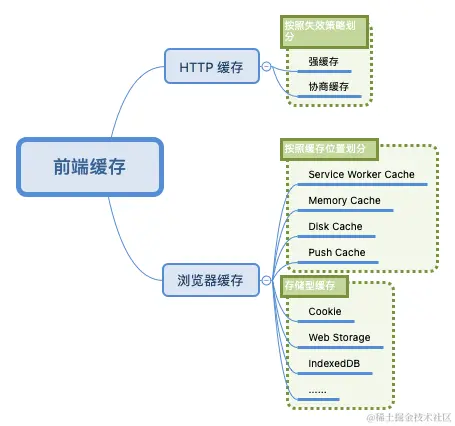
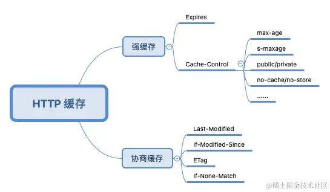
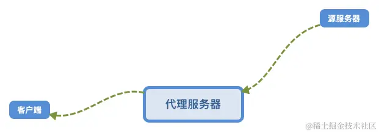
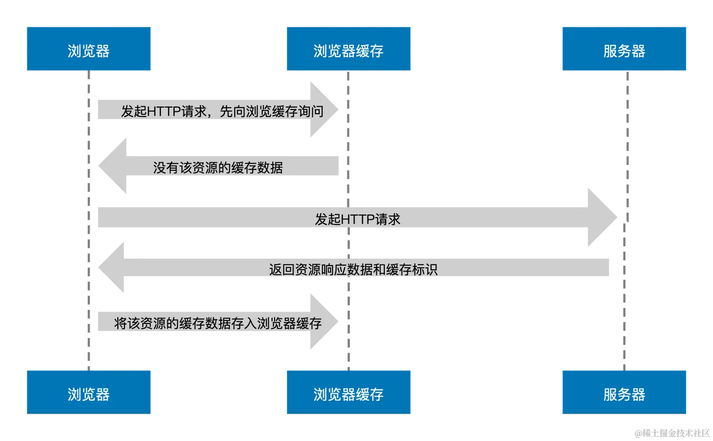
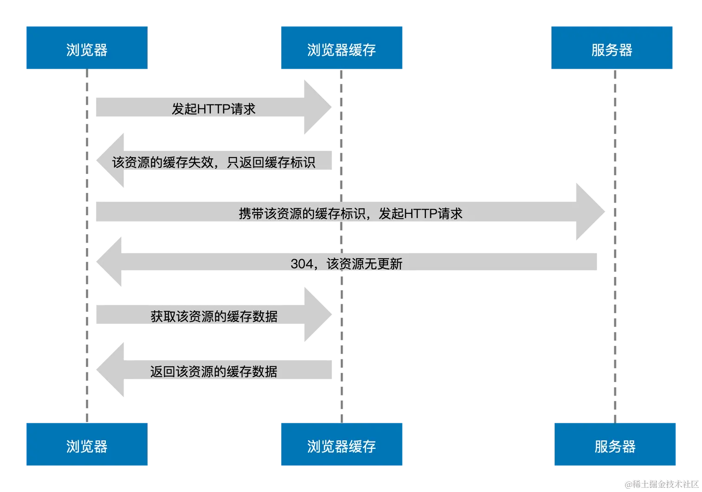
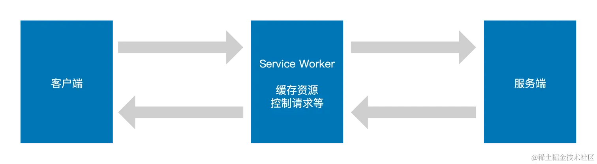

# 前端缓存



## HTTP 缓存

HTTP 请求部分又可以称为前端工程师眼中的 HTTP，它主要发生在客户端，请求是由“报文”的形式发送的，请求报文由三部分组成：**请求行、请求报头和请求正文**。同样 HTTP 响应部分的响应报文也由三部分组成：**状态行、响应报头和响应正文**。

报头是由一系列中间用冒号 “:” 分隔的键值对组成，我们把它称为**首部字段**，其由首部字段名和字段值构成。分为四种类型：

- [通用首部字段](https://link.juejin.cn/?target=https%3A%2F%2Fwww.w3.org%2FProtocols%2Frfc2616%2Frfc2616-sec4.html%23sec4.5)（请求报头和响应报头都会用到的首部）
- [请求首部字段](https://link.juejin.cn/?target=https%3A%2F%2Fwww.w3.org%2FProtocols%2Frfc2616%2Frfc2616-sec5.html%23sec5.3)（请求报头用到的首部）
- [响应首部字段](https://link.juejin.cn/?target=https%3A%2F%2Fwww.w3.org%2FProtocols%2Frfc2616%2Frfc2616-sec6.html%23sec6.2)（响应报头用到的首部）
- [实体首部字段](https://link.juejin.cn/?target=https%3A%2F%2Fwww.w3.org%2FProtocols%2Frfc2616%2Frfc2616-sec7.html%23sec7.1)（针对请求报头和响应报头实体部分使用的首部）



### 强缓存

和强缓存有关的首部字段名主要有两个：`Expires` 和 `Cache-Control`。

<br />

#### Expires

- 定义：Expires 首部字段是 `HTTP/1.0` 中定义缓存的字段，其给出了缓存过期的**绝对时间**，即在此时间之后，响应资源过期，属于**实体首部字段**。
- 作用：表示该资源将在该时间之后过期，而在该时间之前浏览器可以直接从浏览器缓中读取数据，无需再次请求服务器。注意这里**无需再次请求服务器**便是命中了强缓存。

```http
Expires: Wed, 11 May 2022 03:50:47 GMT
```

::: warning

因为 Expires 设置的缓存过期时间是一个绝对时间，所以会受客户端时间的影响而变得不精准。

:::



#### Cache-Control

- 定义：Cache-Control 首部字段是 `HTTP/1.1` 中定义缓存的字段，其用于控制缓存的行为，可以组合使用多种指令，多个指令之间可以通过 “,” 分隔，属于**通用首部字段**。常用的指令有：`max-age、s-maxage、public/private、no-cache/no store` 等。

- 作用：

  - `max-age`：缓存过期的**相对时间**，单位为秒数。当其与 Expires 同时出现时，**max-age 的优先级更高**。但往往为了做向下兼容，两者都会经常出现在响应首部中。同时 max-age 还可在请求首部中被使用，告知服务器客户端希望接收一个存在时间（age）不大于多少秒的资源。

  - `s-maxage`： 与 max-age 不同之处在于，其只适用于公共缓存服务器，比如资源从源服务器发出后又被中间的代理服务器接收并缓存。**当使用 s-maxage 指令后，公共缓存服务器将直接忽略 Expires 和 max-age 指令的值。**
  - `public`：表示该资源可以被任何节点缓存（包括客户端和代理服务器）
  - `private`：表示该资源只提供给客户端缓存，代理服务器不会进行缓存。**同时当设置了 private 指令后 s-maxage 指令将被忽略。**
  - `no-store`：**在请求和响应中都可以使用**，代表不进行任何缓存
  - `no-cache`：在请求首部中被使用时，表示告知（代理）服务器不直接使用缓存，要求向源服务器发起请求；而当在响应首部中被返回时，表示客户端可以缓存资源，但每次使用缓存资源前都**必须**先向服务器确认其有效性，这对每次访问都需要确认身份的应用来说很有用。

```http
Cache-Control: max-age:3600, s-maxage=3600, public
Cache-Control: no-cache
```

也可以在HTML文件中修改资源请求首部(优先级低于请求头中的 `cache-control`)：

```html
<meta http-equiv="Cache-Control" content="no-cache" />
```

<br />

### 协商缓存

#### Last-Modified & If-Modified-Since

- 定义：Last-Modified 代表资源的最后修改时间，属于**响应首部字段**。当浏览器第一次接收到服务器返回资源的 Last-Modified 值后，其会把这个值存储起来，并再下次访问该资源时通过携带 If-Modified-Since 请求首部发送给服务器验证该资源有没有过期。

- 作用：如果在 If-Modified-Since 字段指定的时间之后**资源发生了更新**，那么服务器会将更新的资源发送给浏览器（状态码200）并返回最新的 Last-Modified 值，浏览器收到资源后会更新缓存的 If-Modified-Since 的值。

  如果在 If-Modified-Since 字段指定的时间之后**资源都没有发生更新**，那么服务器会返回状态码 `304 Not Modified` 的响应。

```http
Last-Modified: Fri , 14 May 2021 17:23:13 GMT
If-Modified-Since: Fri , 14 May 2021 17:23:13 GMT
```

<br />

#### Etag & If-None-Match

- 定义：Etag 用于代表资源的唯一性标识，服务器会按照指定的规则生成资源的标识，其属于**响应首部字段**。当资源发生变化时，Etag 的标识也会更新。同样的，当浏览器第一次接收到服务器返回资源的 Etag 值后，其会把这个值存储起来，并在下次访问该资源时通过携带 If-None-Match 请求首部发送给服务器验证该资源有没有过期。
- 作用：如果服务器发现 If-None-Match 值与 Etag 不一致时，说明服务器上的文件已经被更新，那么服务器会发送更新后的资源给浏览器并返回最新的 Etag 值，浏览器收到资源后会更新缓存的 If-None-Match 的值。

```http
Etag: "29322-09SpAhH3nXWd8KIVqB10hSSz66"
If-None-Match: "29322-09SpAhH3nXWd8KIVqB10hSSz66"
```

<br />

### 缓存过程



观察目标：浏览器调试工具 -> 网络面板 -> `size` & `time` 列

<br />

#### 强缓存

- 过程：当浏览器发起 HTTP 请求时，会向浏览器缓存进行一次询问，若浏览器缓存没有该资源的缓存数据，那么浏览器便会向服务器发起请求，服务器接收请求后将资源返回给浏览器，浏览器会将资源的响应数据存储到浏览器缓存中，这便是**强缓存的生成过程**。在发起请求时浏览器缓存告诉浏览器它那有该资源的缓存数据并且还没有过期，于是浏览器直接加载了缓存中的数据资源，**浏览器并没有和服务器进行交互**。

  **强缓存是否新鲜取决于两个关键词：*缓存新鲜度*和*缓存使用期***。

  <br />

  **缓存新鲜度**

  - 公式：`缓存新鲜度 = max-age || (expires - date)`
  - 当 max-age 存在时缓存新鲜度等于 max-age 的秒数，是一个时间单位，就像保质期为 6 个月一样；当 max-age 不存在时，缓存新鲜度等于 `expires - date` 的值
  - **Date 表示创建报文的日期时间**，可以理解为服务器（包含源服务器和代理服务器）返回新资源的时间，和 expires 一样是一个绝对时间

  <br />

  **缓存使用期**

  - 定义：**缓存使用期可以理解为浏览器已经使用该资源的时间**。相比食品的使用期与当前日期和生产日期有关，**缓存使用期主要与响应使用期、传输延迟时间和停留缓存时间有关**

  - 公式：`缓存使用期 = 响应使用期 + 传输延迟时间 + 停留缓存时间`

  - 响应使用期：

    - 公式：

      ```js
      apparent_age = max(0, response_time - date_value)
      响应使用期 = max(apparent_age, age_value)
      ```

    - max(0, response_time - date_value)：`response_time`（浏览器缓存收到响应的本地时间）是电脑客户端缓存获取到响应的本地时间，而 date_value（响应首部 date 值） 上面已经介绍过是服务器创建报文的时间，两者相减与 0 取最大值

    - age_value：（响应首部 age 值），**Age 表示推算资源创建经过时间，可以理解为源服务器在多久前创建了响应或在代理服务器中存贮的时长**，单位为秒

  - 传输延迟时间

    - 定义：**传输延迟时间可以理解为浏览器缓存发起请求到收到响应的时间差**
    - 公式：`传输延迟时间 = response_time - request_time`
    - 说明：`response_time` 代表浏览器缓存收到响应的本地时间，`request_time` 代表浏览器缓存发起请求的本地时间，两者相减便得到了传输延迟时间

  - 停留缓存时间

    - 定义：表示资源在浏览器上已经缓存的时间
    - 公式：`停留缓存时间 = now - response_time`
    - 说明：`now` 代表电脑客户端的当前时间，`response_time` 代表浏览器缓存收到响应的本地时间，两者相减便得到了停留缓存时间。

<br />

**影响强缓存试用期因素**

```json
{
  'age_value'：'响应首部 age 值'
  'date_value'：'响应首部 date 值'
  'request_time'：'浏览器缓存发起请求的本地时间'
  'response_time'：'浏览器缓存收到响应的本地时间'
  'now'：'客户端当前时间'
}
```

::: warning

以上 request_time、response_time 和 now 取的都是客户端本地时间，而 now 则是修改客户端本地时间直接导致强缓存失效的“罪魁祸首”。

**因此一旦修改了电脑客户端本地时间为未来时间，缓存使用期的计算便会受到影响，主要是停留缓存时间会变大，从而导致缓存使用期超出缓存新鲜度范围（强缓存失效）。** 这便是 max-age 仍然受到本地时间影响的原因所在。

:::

<br />

#### 协商缓存



- 过程：浏览器发起 HTTP 请求后浏览器缓存发现该请求的资源失效，便将其**缓存标识**返回给浏览器，于是浏览器携带该缓存标识向服务器发起 HTTP 请求，之后服务器根据该标识判断这个资源其实没有更新过，最终返回 `304` 给浏览器，浏览器收到无更新的响应后便转向浏览器缓存获取数据。

::: tip

eTag 的优先级要高于 last-modified，当两者同时出现时，只有 eTag 会生效。只要有这两个缓存标识之一，在强缓存失效后浏览器便会携带它们向服务器发起请求

:::

::: warning

last-modified 是一个时间，最小单位为秒，试想一下，如果资源的修改时间非常快，快到毫秒级别，那么服务器会误认为该资源仍然是没有修改的，这便导致了资源无法在浏览器及时更新的现象。

另外还有一种情况，比如服务器资源确实被编辑了，但是其实资源的实质内容并没有被修改，那么服务器还是会返回最新的 last-modified 时间值，但是我们并不希望浏览器认为这个资源被修改而重新加载。

为了避免以上现象的发生，在特殊的场景下，我们便需要使用 eTag。

:::

<br />

#### 启发式缓存

- 过程：报头中没有用来确定强缓存过期时间的字段，这便无法使用缓存新鲜度公式，虽然有与协商缓存相关的 `last-modified` 首部，但并不会走协商缓存，反而**浏览器会触发启发式缓存**。
- 公式：`缓存新鲜度 = max(0,（date - last-modified)) * 10%`

<br />

### 缓存方案

::: details **刷新页面或再次访问时大部分资源都命中了强缓存，唯独率先加载的 HTML 资源走了协商缓存**

因为像 JS、CSS 等资源经过像 `webpack` 这样的打包工具打包后可以自动生成 `hash` 文件名，每次部署到服务器上后发生变化的资源 hash 名会更新，浏览器会当作一个新的资源去向服务器请求，没有更新的资源便会优先读取浏览器缓存。

而 HTML 不同，其文件名不会改变，我们期望浏览器每次加载时都应该向服务器询问是否更新，否则会出现新版本发布后浏览器读取缓存 HTML 文件导致页面空白报错（旧资源被删除）或应用没有更新（读取了旧资源）的问题。

:::

::: tip 缓存方案

- **频繁变动的资源，比如 HTML， 采用协商缓存**
- **CSS、JS、图片资源等采用强缓存，使用 hash 命名**

:::

```yaml
# 浏览器强缓存失效的服务器响应报头
Cache-Control: max-age=0
Last-Modified: Sat, 04 Sep 2021 08:59:40 GMT
```

在资源 0 秒就失效的情况下存在协商缓存触发条件的 `Last-Modified` 标识，这样每次访问加载的 HTML 资源就会确保是最新的，解决了 HTML 怕被浏览器强缓存的烦恼。

<br />

### webpack中的hash模式

在 webpack 中 hash 可以分为三种类型：**hash、chunkhash、contenthash**，每一种类型 hash 的生成规则和作用也不同。

<br />

#### hash

`hash` 属于项目级别的 hash，意思就是整个项目中只要有文件改变该 hash 值就会变化，同时所有文件也都共用该 hash 值。

```js
module.exports = {
  output: {
    path: config.build.assetsRoot,
    filename: utils.assetsPath('js/[name].[hash:8].js'),
    chunkFilename: utils.assetsPath('js/[name].[hash:8].min.js')
  },
  plugins: [
    // 将 js 中引入的 css 进行分离
    new ExtractTextPlugin({ filename: utils.assetsPath('css/[name].[hash:8].css'), allChunks: true }),
  ]
}
```

::: danger

最终打包输出的资源文件名 hash 值都一样，按照缓存策略进行分析，浏览器加载所有资源都将重新请求服务器，导致没有改动资源的加载浪费，因此不建议在项目中采用这种方式进行构建。

:::

<br />

#### chunkhash

`chunkhash` 与 hash 不同，其属于入口文件级别的 hash，会根据入口文件（entry）的依赖进行打包，同时为了避免一些公共库、插件被打包至入口文件中，我们可以借助 `CommonsChunkPlugin` 插件进行公共模块的提取：

```js
module.exports = {
  entry: utils.getEntries(),
  output: {
    path: config.build.assetsRoot,
    filename: utils.assetsPath('js/[name].[chunkhash:8].js'),
    chunkFilename: utils.assetsPath('js/[name].[chunkhash:8].min.js'),
  },
  plugins: [
    // 将 js 中引入的 css 进行分离
    new ExtractTextPlugin({ filename: utils.assetsPath('css/[name].[chunkhash:8].css') }),
    // 分离公共 js 到 vendor 中
    new webpack.optimize.CommonsChunkPlugin({
      name: 'vendor', // 文件名
      minChunks(module, count) {
        // 声明公共的模块来自 node_modules 文件夹，把 node_modules、common 文件夹以及使用了2次依赖的都抽出来
        return (
          module.resource
          && (/\.js$/.test(module.resource) || /\.vue$/.test(module.resource))
          && (module.resource.indexOf(path.join(__dirname, '../node_modules')) === 0 || module.resource.indexOf(path.join(__dirname, '../src/common')) === 0 || count >= 2)
        )
      }
    }),
    // 将运行时代码提取到单独的 manifest 文件中，防止其影响 vendor.js
    new webpack.optimize.CommonsChunkPlugin({
      name: 'runtime',
      chunks: ['vendor']
    })
  ]
}
```

上述配置我们将需要抽离的公共模块提取到了 vendor.js 中，同时也将 webpack 运行文件提取到了 runtime.js 中，**这些公共模块一般除了升级版本外永远不会改动，我们希望浏览器能够将其存入强缓存中，不受其他业务模块的修改导致文件 chunkhash 名称变动的影响。**

最终我们打包出的模块拥有不同的 chunkhash 名称，重新打包只会影响有变动的模块重新生成 chunkhash

<br />

#### contenthash

`contenthash` 是属于文件内容级别的 hash，其会根据文件内容的变化而变化，一般用于解决以下问题：

比如上方的 home.js 中单独引入了 home.css 文件，那么当 js 文件被修改后，就算 css 文件并没有被修改，由于该模块发生了改变，同样会导致 css 文件也被重复构建。此时，针对 css 使用 contenthash 后，只要其内容不变就不会被重复构建。

```js
module.exports = {
  output: {
    path: config.build.assetsRoot,
    filename: utils.assetsPath('js/[name].[chunkhash:8].js'),
    chunkFilename: utils.assetsPath('js/[name].[chunkhash:8].min.js'),
  },
  plugins: [
    // 将 js 中引入的 css 进行分离，使用 contenthash 判断内容的改变
    new ExtractTextPlugin({ filename: utils.assetsPath('css/[name].[contenthash:8].css'), allChunks: true }),
  ]
}
```

<br />

#### 总结

::: tip

**当在 module 中使用 loader 设置图片或者字体的文件名时，如包含 hash 或 chunkhash 都是不生效的，默认会使用 contenthash。**

:::

```js
module.exports = {
  module: {
    rules: [{
      test: /\.(png|jpe?g|gif|svg)(\?.*)?$/,
      loader: 'url-loader',
      options: {
        limit: 5,
        name: utils.assetsPath('img/[name].[hash:8].[ext]') // 设置的 hash 值不会生效
      }
    }, {
      test: /\.(woff2?|eot|ttf|otf)(\?.*)?$/,
      loader: 'url-loader',
      options: {
        limit: 2,
        name: utils.assetsPath('fonts/[name].[hash:8].[ext]') // 设置的 hash 值不会生效
      }
    }]
  }
}
```

::: tip 使用方法

**将 chunkhash 和 contenthash 组合使用才能最大化的利用 HTTP 缓存中强缓存的优势，减少不必要的资源重复请求，提升网页的整体打开速度。**

:::

<br />

### Chrome的加载模式

Chrome 具备三种加载模式，除了通过快捷键的方式触发，这三种模式只在开发者工具打开时才能够使用，此时我们打开开发者工具，在浏览器刷新按钮上右键鼠标便会展示这几种模式：`正常重新加载、硬性重新加载、清空缓存并硬性重新加载` 。

**正常重新加载**

- 作用：刷新网页，和刷新按钮效果一样，此模式大多数资源会命中强缓存
- 快捷键：`Ctrl + R` 或 `F5`

<br />

**硬性重新加载**

- 作用：使用硬性重新加载后所有资源的请求首部都被加上了 `cache-control: no-cache` 和 `pragma: no-cache`，两者的作用都表示告知（代理）服务器不直接使用缓存，要求向源服务器发起请求，而 pragma 则是为了兼容 HTTP/1.0。

  因此**硬性重新加载并没有清空缓存，而是禁用缓存**，其效果类似于在开发者工具 Network 面板勾选了 `Disable cache` 选项。

- 快捷键：`Ctrl + Shift + R` 或 `Ctrl + F5`

<br />

**清空缓存并硬性重新加载**

- 作用：比硬性重新加载多了清空缓存的操作，因此**触发该操作会将浏览器存储的本地缓存都清空掉后再重新向服务器发送请求**，同时其影响的并不是当前网站，所有访问过的网站缓存都将被清除。

::: details 为什么 Ctrl + F5 还是命中缓存？

资源异步加载命中缓存不受硬性重新加载控制：硬性重新加载并没有清空缓存，当异步资源在页面加载完后插入时，其加载时仍然优先读取缓存，如果使用清空缓存并硬性重新加载便不会出现这种现象。

:::

::: tip

**如果采用开发者工具 Network 面板勾选 `Disable cache` 选项方式，那么异步资源也不会读取缓存，原因是缓存被提前禁用了，这与硬性重新加载不同。**

Base64 格式的图片被塞进 memory cache 可以视作浏览器为节省渲染开销的“自保行为”，不管是首次加载还是清空缓存都不奏效。

:::

<br />

## Nginx 与跨域问题

::: details 跨域问题

如果前端访问后端跨域，首先要检查的便是服务端或者 Nginx 配置的 Access-Control-Allow-Origin 是否包含前端域名。

有些时候 Access-Control-Allow-Origin 被设置成 \* 代表允许所有域名访问，但可能还会报如下跨域问题：`credentials mode`，问题产生的根源其实是在前端，比如前端使用 `Axios` 请求库时如果开启了 `axios.defaults.withCredentials = true // 允许携带 cookie`

其代表允许请求头携带 `cookie `，那么服务端配置 Access-Control-Allow-Origin 时就不能为 \*，或者针对该类型的接口前端请求关闭该配置即可。

同时当前端配置了 `axios.defaults.withCredentials = true` 时，服务端需配置 `access-control-allow-credentials: true`。

如果浏览器发起了**预检请求**(浏览器控制台经常会看到的 `OPTIONS` 请求)，那么可能还需要配置 `access-control-allow-methods` 和 `access-control-allow-headers` 报头为允许的值。

:::

### 修改跨域相关配置

```nginx
server {
    listen 80;
    location / {
        add_header Access-Control-Allow-Origin *;
        add_header Access-Control-Allow-Methods 'PUT,POST,GET,DELETE,OPTIONS';
        add_header Access-Control-Allow-Headers 'Content-Type,Content-Length, Authorization, Accept,X-Requested-With';

        if ($request_method = 'OPTIONS') {
            return 204;
        }
    }
}
```

保存后需重启nginx，配置才会生效，运行 `nginx -s reload` 命令。

<br />

### 修改缓存相关配置

nginx 作为一个代理服务器，当处理静态资源时资源的一些如 eTag、last-modified 等首部大都是由源服务器返回的，一般在 nginx 配置中不会对其进行修改，而主要修改的是缓存方式和过期时间的配置。

比如我们不想 html 文件命中强缓存，希望其走协商缓存，可以添加如下响应报头配置：

```nginx
server {
    listen 80;
    location / {
    		add_header Test 'xxx';

        if ($request_filename ~* .*.(html|htm)$) {
     			 # 此时上层 add_header 并不会生效
            add_header Cache-Control 'no-cache';
        }
    }
}
```

::: tip

**当且仅当当前层级上未定义任何 add_header 时，才可以从上层继承 add_header**。而上述的 if 模块便属于层级的概念，因此上层的 add_header 并不会起作用。

如果 if 中没有写任何的 add_header，那么上层的 add_header 才会起作用

:::

而像 js、css 和图片这样的静态资源，我们希望浏览器命中强缓存，nginx 可以设置相应的过期时间：

```nginx
server {
  listen 80;
  location ~ .*.(gif|jpg|jpeg|png|bmp|swf|js|css)$ {
    # 过期时间 1天
    expires 1d;
  }
}
```

上述配置我们以 1 天为例，最终浏览器将返回响应报头 `Cache-Control: max-age=86400`。

<br />

## 浏览器缓存

### Memory Cache & Disk Cache

**Memory Cache**

- 定义：内存缓存
- 优点：获取速度快、优先级高，从内存中获取资源耗时为 0 ms
- 缺点：生命周期短，当网页关闭后内存就会释放，同时虽然内存非常高效，但它也受限制于计算机内存的大小，是有限的。

**Disk Cache**

- 定义：磁盘缓存，是存储在计算机硬盘中的一种缓存
- 优点：生命周期长，不触发删除操作则一直存在
- 缺点：获取资源的速度相对内存缓存较慢
- 过程：Disk Cache 会根据保存下来的资源的 HTTP 首部字段来判断它们是否需要重新请求，如果重新请求那便是强缓存的失效流程，否则便是生效流程。

<br />

### 浏览器缓存机制

<br />

#### 缓存获取顺序

按照缓存顺序来讲，当一个资源准备加载时，浏览器会根据其**三级缓存原理**进行判断。

1. 浏览器会率先查找内存缓存，如果资源在内存中存在，那么直接从内存中加载
2. 如果内存中没找到，接下去会去磁盘中查找，找到便从磁盘中获取
3. 如果磁盘中也没有找到，那么就进行网络请求，并将请求后符合条件的资源存入内存和磁盘中

<br />

#### 缓存存储优先级

磁盘缓存会将命中强缓存的 js、css、图片等资源都收入囊中，也省去我们担心它“挑食”的问题。而内存缓存不这样，为了保持“苗条的身材”，它不得不控制“饮食”，尽可能的去挑选适合自己的“食物”。

1. 除了 base64 的图片永远从内存加载外，其他大部分资源会从磁盘加载
2. 图片资源（非 base64）也有和 JS 资源类似，浏览器内存缓存生效的前提下，资源的执行加载时间会影响其是否被内存缓存
3. CSS 资源比较与众不同，其被磁盘缓存的概率远大于被内存缓存

- 非标准解释：因为 CSS 文件加载一次就可渲染出来，我们不会频繁读取它，所以它不适合缓存到内存中，但是 JS 之类的脚本却随时可能会执行，如果脚本在磁盘当中，我们在执行脚本的时候需要从磁盘取到内存中来，这样 IO 开销就很大了，有可能导致浏览器失去响应。

<br />

#### Preload & Prefetch

preload 也被称为预加载，其用于 link 标签中，可以指明哪些资源是在页面加载完成后即刻需要的，浏览器会在主渲染机制介入前预先加载这些资源，并不阻塞页面的初步渲染。

例如：

```html
<link rel="preload" href="https://i.snssdk.com/slardar/sdk.js" as="script" />
```

::: info

当使用 preload 预加载资源后，该资源一直会从磁盘缓存中读取，JS、CSS 及图片资源都有同样的表现，这主要还是和资源的渲染时机有关，在渲染机制还没有介入前的资源加载不会被内存缓存。

:::

prefetch 则表示预提取，告诉浏览器加载下一页面可能会用到的资源，浏览器会利用空闲状态进行下载并将资源存储到缓存中。

例如：

```html
<link rel="prefetch" href="https://i.snssdk.com/slardar/sdk.js" />
```

::: info

使用 prefetch 加载的资源，刷新页面时大概率会从磁盘缓存中读取，如果跳转到使用它的页面，则直接会从磁盘中加载该资源。

:::

<br />

### Service Worker

PWA：**渐进式 Web 应用程序仍然是 Web 应用程序，但其支持渐进式增强，在现代浏览器中可以使用新功能，如果新功能不可用，用户仍然可以获得核心的体验。**

PWA特性：

- 功能强大（在现代 API、WebAssembly 和新的即将推出的 API 之间，Web 应用程序比以往任何时候都更强大）
- 可靠性（无论网络如何，可靠的渐进式 Web 应用程序都会让用户感觉到快速）
- 可安装（已安装的渐进式 Web 应用程序在独立窗口中运行，而不是在浏览器 tab 页中运行）

<br />



#### 概念

本质上是一种用 JavaScript 编写的脚本，其作为一个独立的线程，它可以使应用程序能够控制网络请求，缓存这些请求以提高性能，并提供对缓存内容的离线访问。

Service Worker 依赖两个 API 使应用程序离线工作：[Cache](https://link.juejin.cn/?target=https%3A%2F%2Fdeveloper.mozilla.org%2Fzh-CN%2Fdocs%2FWeb%2FAPI%2FCache)（应用程序数据的持久性内容存储）和 [Fetch](https://link.juejin.cn/?target=https%3A%2F%2Fdeveloper.mozilla.org%2Fzh-CN%2Fdocs%2FWeb%2FAPI%2FFetch_API)（一种从网络检索内容的标准方法）。**Service Worker 缓存是持久的，独立于浏览器缓存或网络状态。**

<br />

#### 生命周期

包含三部分：

- 注册
- 安装
- 激活

默认情况下 Service Worker 的作用范围不能超出其脚本所在的路径，如果上述脚本放在根目录下，那么代表项目根目录下的所有请求都可以代理。当然也可以在注册时指定对应的作用域：

```js{3}
// 设置代理 xxx 目录下的请求
navigator.serviceWorker.register('/sw.js', {
    scope: '/xxx'
})
```

一旦浏览器执行了注册流程后，在 sw.js 文件中，其便会尝试执行 Service Worker 的 install 安装事件，该事件只会触发一次，即在首次注册或者有新的 Service Worker 之后执行。在安装事件中我们可以下载并预缓存应用的部分内容，以便在用户下次访问时立即得到加载。

```js
// sw.js

// 此版本的 Service Worker 中使用的两个缓存的名称，更新任意一个缓存名称，都将再次触发安装事件
const PRECACHE = 'precache-v1'
const RUNTIME = 'runtime'

// 想被缓存的本地资源列表
const PRECACHE_URLS = [
  'index.html',
  './', // index.html 的别名
  'styles.css',
  '../../styles/main.css',
  'demo.js'
]

// 安装事件中缓存预先我们想要缓存的资源
self.addEventListener('install', (event) => {
  event.waitUntil(
    // 调用浏览器 CacheStorage open 方法
    caches.open(PRECACHE)
      .then(cache => cache.addAll(PRECACHE_URLS))
      .then(self.skipWaiting()) // self.skipWaiting 可以阻止等待，让新的 Service Worker 安装成功后立即激活
  )
})
```

在安装事件中我们会缓存预先想要缓存的资源，成功安装 Service Worker 后，它会过渡到激活阶段。如果有前一个 Service Worker 控制的打开页面存在，则新的 Service Worker 会进入一个 waiting 状态。新的 Service Worker 仅在不再加载任何仍在使用旧 Service Worker 的页面时激活，这确保在任何给定时间只有一个版本的 Service Worker 正在运行。

我们也可以调用 `skipWaiting()` 方法阻止 Service Worker 等待，让新的 Service Worker 安装成功后立即激活。

当新的 Service Worker 激活时，其会触发 `active` 事件，我们可以使用 `addEventListener` 来监听 activate 事件。在此事件中我们通常会清理过期的缓存：

```js
// sw.js

// active 事件负责清理过期缓存
self.addEventListener('activate', (event) => {
  const currentCaches = [PRECACHE, RUNTIME]

  event.waitUntil(
    caches.keys().then((cacheNames) => {
      return cacheNames.filter(cacheName => !currentCaches.includes(cacheName))
    }).then((cachesToDelete) => {
      return Promise.all(cachesToDelete.map((cacheToDelete) => {
        return caches.delete(cacheToDelete) // 删除不存在的过期缓存
      }))
    }).then(() => self.clients.claim()) // 启用新的 Service Worker
  )
})
```

一旦激活，Service Worker 将控制在其范围内加载的所有页面，新的 Service Worker 只会在我们关闭并重新打开应用时启用，或者调用 `clients.claim()` 方法。

<br />

#### 优先从缓存获取资源

一般会采用**缓存回退网络**的方式进行代码的编写，即拦截请求时如果缓存中存在该资源则直接获取，否则再向服务端请求资源并进行缓存。

```js
// sw.js

// fetch 处理事件会处理同源资源的响应，如果缓存中存在，则会直接返回缓存资源
self.addEventListener('fetch', (event) => {
  // 跳过跨域请求
  if (event.request.url.startsWith(self.location.origin)) {
    event.respondWith(
      // 从缓存中匹配请求的资源
      caches.match(event.request).then((cachedResponse) => {
        // 存在则直接返回
        if (cachedResponse) {
          return cachedResponse
        }

        // 不存在则回退网络请求
        return caches.open(RUNTIME).then((cache) => {
          return fetch(event.request).then((response) => {
            // 拷贝响应资源存入 runtime 缓存.
            return cache.put(event.request, response.clone()).then(() => {
              return response
            })
          })
        })
      })
    )
  }
})

```

::: warning

出于安全考虑，Service worker 只能在 https 及 localhost 下被使用。

:::

<br />

### 存储型缓存

<br />

#### 网站登录背后逻辑

::: details 服务端自动植入

1. 服务端登录接口可以在返回前端的响应报头中设置首部字段 `set-cookie` 来将 token 信息植入浏览器 cookie 中

   - set-cookie 指令值包含了必选项 `<cookie-name>=<cookie-value>` 值和名的形式，同时还包括了可选项 Path（路径）、Domain（域名）、Max-Age（有效时间）等，以分号分隔。

   - 服务端可以返回多个 set-cookie 指令来达到设置多个 cookie 的目的。最终我们可以在开发者工具 Application 面板中查看当前网页设置的 cookie 值。

2. 之后前端调用任何同域下的接口时，浏览器会自动将网站的 cookie 值附加在请求头中传给后端进行校验，前端则不需要关心 token 的存取问题。

:::

::: details 前端手动存储

1. 相比服务端自动植入，前端存储的方式不受限于浏览器环境，比如像 APP 或小程序等一些没有浏览器 cookie 的环境下也可以使用该种方式。服务端登录接口成功后直接将用户的 token 信息通过响应实体的方式返回给前端。

2. 前端获取到 token 信息后可以通过前端存储方法将数据持久化缓存起来，并在退出后手动清除。同时在调用后端接口时需要手动将 token 传递给服务端。

   ```js
   // axios配置示例
   import axios from 'axios'

   export function http params) {
      et instance = axios.create({
        aseURL: 'https://juejin.cn',
      )

      et token = localStorage.getItem('token') // 从缓存中获取对应 name 值

      eturn instance({
        rl: '/xxx/xxx',
        ethod: 'post',
        ata: params,
        eaders: {
          x-token': token // 前端手动设置自定义 token 响应头

      )
   }
   ```

:::

<br />

#### 存储方案

##### Cookie

1. Cookie 的存储空间很小，不能超过 4KB，因此这一缺点也限制了它用于存储较大容量数据的能力。
2. Cookie 在同域下会伴随着每一次资源请求的请求报头传递到服务端进行验证，假如 CDN 资源和主站采用了同样的域名，那么必然会造成因 Cookie 传输带来的巨大性能浪费，因此可以将 CDN 的域名与主站区分开来来规避这一问题。

```js
// 浏览器原始Cookie API

// 存储 Cookie
document.cookie = 'name=juejin; domain=juejin.cn'

// 读取 Cookie
// 只能通过 document.cookie 读取所有 Cookie 并进行字符串截取，非常不便

// 删除 Cookie
const date = new Date()

date.setTime(date.getTime() - 10000) // 设置一个过期时间

document.cookie = `name=test; domain=juejin.cn; expires=${date.toGMTString()}`
```

第三方库：[js-cookie](https://link.juejin.cn/?target=https%3A%2F%2Fwww.npmjs.com%2Fpackage%2Fjs-cookie)

```js
import Cookies from 'js-cookie'

// 存储 Cookie
Cookies.set('name', 'juejin', { domain: 'juejin.cn' })

// 读取 Cookie
Cookies.get('name')

// 删除 Cookie
Cookies.remove('name')
```

<br />

##### Web Storage

- 在验证用户身份及维持状态方面，Cookie 有明显的特点和优势，但其并不是存储网页数据的小能手，相反 Web Storage 在这方面却有显著的优势。Web Storage 作为 HTML5 推出的浏览器存储机制，其又可分为 `Session Storage` 和 `Local Storage` 。
- 在存储简单的数据类型时，Web Storage 提供的原始 API 可以轻松完成任务，但是一旦数据类型变为 Object 类型时，如果没有提前采用序列化方法 `JSON.stringify` 转化为字符串对象，那么最终获取的值会变成 `[object Object]`。

```js
// storage 封装，增加过期时间和自动序列化反序列化

const storage = {
  // 存储方法
  setStorage(key, value, duration) {
    const data = {
      value,
      expiryTime: !duration || isNaN(duration) ? 0 : this.getCurrentTimeStamp() + Number.parseInt(duration)
    }

    localStorage[key] = JSON.stringify(data) // 进行序列化操作
  },
  // 获取方法
  getStorage(key) {
    const data = localStorage[key]

    if (!data || data === 'null') {
      return null
    }

    const now = this.getCurrentTimeStamp()
    let obj

    try {
      obj = JSON.parse(data) // 进行反序列化操作
    }
    catch (e) {
      return null
    }

    if (obj.expiryTime === 0 || obj.expiryTime > now) {
      return obj.value
    }

    return null
  },
  // 删除方法
  removeStorage(key) {
    localStorage.removeItem(key)
  },
  // 获取当前时间戳
  getCurrentTimeStamp() {
    return Date.parse(new Date())
  }
}
```

第三方库：[web-storage-cache](https://link.juejin.cn/?target=https%3A%2F%2Fwww.npmjs.com%2Fpackage%2Fweb-storage-cache)

<br />

##### IndexedDB

详细使用方法见 HTML 章节 [IndexedDB](../html/indexedDB)

<br />

> 参考：
>
> [前端缓存技术与方案解析](https://juejin.cn/book/6994678547826606095/section)
