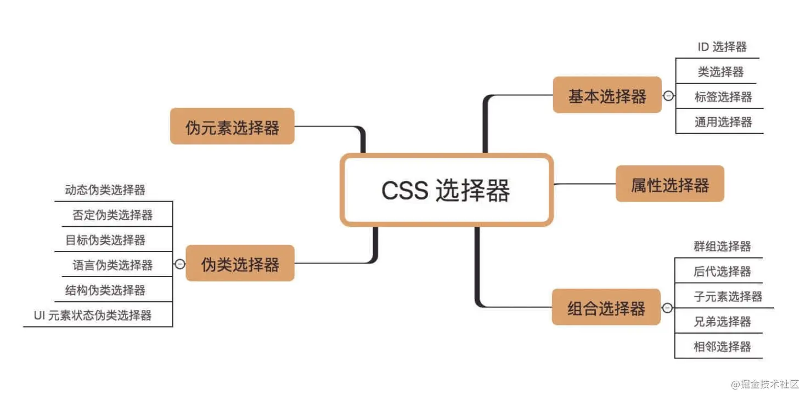
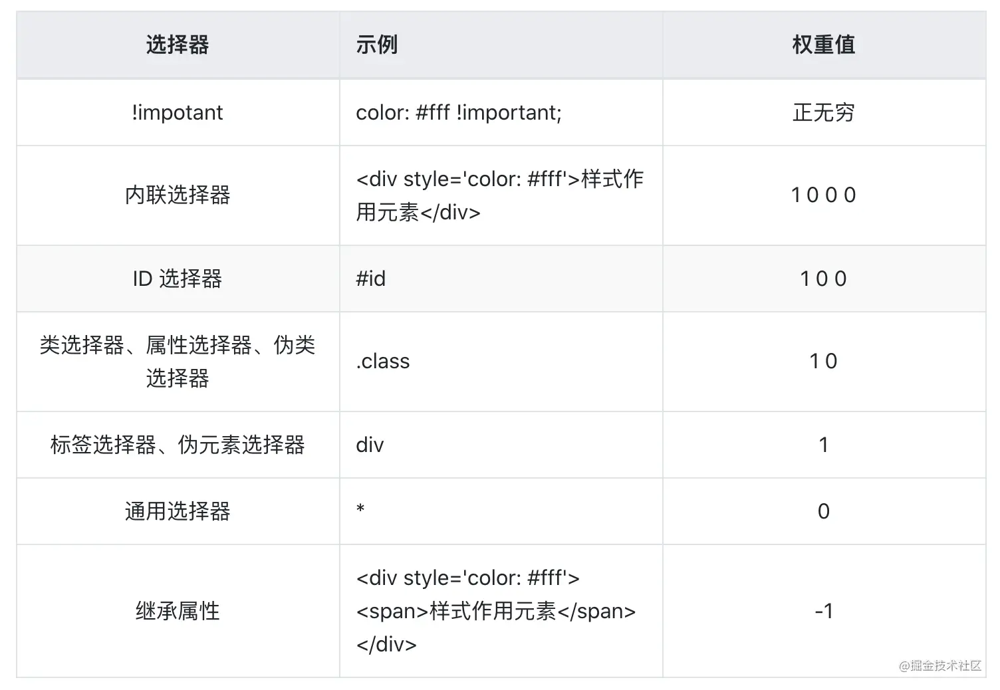
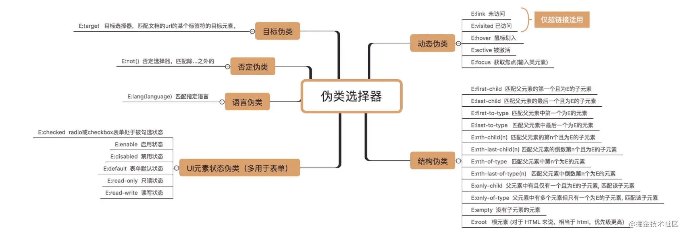

# 选择器

## 基本类型

可以分为4类：**选择器**、**选择符**、**伪类** 和 **伪元素**。



1. 选择器：平常使用的 CSS 声明块前面的标签、类名等。

2. 选择符：

   - 表示后代关系的空格 ( )：匹配所有子元素
   - 表示父子关系的尖括号 (>)：只会匹配第一代子元素

     ::: details 使用场景

     1. 状态类名控制。如使用 `.active` 类名进行状态切换，会遇到祖先和后代都存在 `.active` 切换的场景，此时子选择符是必需的，以免影响后代元素。
     2. 标签受限。
     3. 层级位置与动态判断。

     :::

   - 表示相邻兄弟关系的加号 (+)：用于选择相邻的兄弟元素，但只能选择后面一个兄弟。

     ::: tip

     会忽略文本节点和注释节点，只认元素节点

     :::

     ::: details 实现类似 :first-child 的效果

     由于相邻兄弟选择符只能匹配后一个元素，因此第一个元素就会落空，永远不会被匹配，于是自然而然就实现了非首列表元素的匹配。

     :::

   - 表示随后兄弟关系的弯弯 (~)：匹配后面的所有兄弟元素

     ::: tip

     会忽略文本节点和注释节点，只认元素节点

     :::

   - 表示列关系的双管道 (||)：浏览器暂不支持

3. 伪类：特征是其前面会有一个冒号 ( : )，通常与浏览器行为和用户行为相关联，可以看成是 CSS 世界的 JavaScript。

4. 伪元素：特征是其前面会有两个冒号 ( :: )，常见的有 `::before`，`::after`，`::first-letter`，`::first-line`等。

## 选择器的优先级



划分为0~5这6个等级，其中前4个等级由 CSS 选择器决定，后2个等级由书写形式和特定语法决定。

- **0级**：通配选择器、选择符和逻辑组合伪类。其中：

  - 通配符写作星号 (\*)
  - 选择符指+、>、~、空格、||
  - 逻辑组合伪类有 `:not()`、`:is()`、`:where`等。这些伪类本身并不影响 CSS 优先级，影响优先级的是括号里面的选择器。优先级为0。

- **1级**：标签选择器

- **2级**：类选择器、属性选择器、伪类选择器

- **3级**：ID 选择器

- **4级**：`style` 属性内联

- **5级**：`!important` （唯一推荐使用的场景就是使 JavaScript 设置无效）

### 优先级的计算规则

出现一个 0 级选择器，优先级数值 +0；出现一个 1 级选择器，优先级数值 +1；出现一个 2 级选择器，优先级数值 +10；出现一个 3 级选择器，优先级数值 +100。

| 选择器                    | 计算值 | 计算规则                                                                                   |
| ------------------------- | ------ | ------------------------------------------------------------------------------------------ |
| \* { }                    | 0      | 1 个 0 级通配选择器，优先级数值为 0                                                        |
| dialog { }                | 1      | 1 个 1 级标签选择器，优先级数值为 1                                                        |
| ul > li { }               | 2      | 2 个 1 级标签选择器，1 个 0 级选择符，优先级数值为 1+0+1 = 2                               |
| li > ol + ol { }          | 3      | 3 个 1 级标签选择器，2 个 0 级选择符，优先级数值为 1+0+1+0+1 = 3                           |
| .foo { }                  | 10     | 1 个 2 级类名选择器，优先级数值为 10                                                       |
| a:not([rel=nofollow]) { } | 11     | 1 个 1 级标签选择器，1 个 0 级否定伪类，1 个 2 级属性选择器，优先级数值为 1+0+10 = 11      |
| a:hover { }               | 11     | 1 个 1 级标签选择器，1 个 2 级伪类，优先级数值为 1+10 = 11                                 |
| ol li.foo { }             | 12     | 2 个 1 级标签选择器，1 个 0 级空格选择符，1 个 2 级类名选择器，优先级数值为 1+0+1+10 = 12  |
| li.foo.bar { }            | 21     | 1 个 1 级标签选择器，2 个 2 级类名选择器，优先级数值为 1+10+10 = 21                        |
| #foo { }                  | 100    | 1 个 3 级 ID 选择器，优先级数值为 100                                                      |
| #foo .bar p { }           | 111    | 1 个 3 级 ID 选择器，1 个 2 级类名选择器，1 个 1 级标签选择器，优先级数值为 100+10+1 = 111 |

::: warning

1. 当 CSS 选择器的优先级数值一样的时候，后渲染的选择器的优先级更高。遵循“后来居上”原则。
2. CSS 选择器的优先级与 DOM 元素的层级位置没有任何关系。

:::

::: tip 增加优先级的小技巧

1. 重复选择器自身：`.foo.foo {}`
2. 借助必然会存在的属性选择器：`.foo[class] {}`

:::

<br />

### 选择器的命名

在 HTML 中，标签和属性都是不区分大小写的，而属性值是区分大小写的。

于是，相对应地，在 CSS 中，标签选择器不区分大小写，**属性选择器**中的属性也不区分大小写，而类选择器和 ID 选择器本质上是属性值，因此要区分大小写。

| 选择器类型        | 示例           | 是否对大小写敏感 |
| ----------------- | -------------- | ---------------- |
| 标签选择器        | div { }        | 不敏感           |
| 属性选择器-纯属性 | [attr]         | 不敏感           |
| 属性选择器        | [attr=val]     | 属性值敏感       |
| 类选择器          | .container { } | 敏感             |
| ID 选择器         | #container { } | 敏感             |

::: tip

支持属性选择器中的属性值不区分大小写，在 ] 前面加一个 i `[CLASS~=CONTENT i] {}`

:::

选择器首字符支持的字符类型是 a~z、A~Z、、以及非 ASCII 字符（中文、全角字符等），后面的字符支持的字符类型是 a~z、A~Z、\_、-、0~9、以及非 ASCII 字符（中文、全角字符等）。对于其他没有出现的字符，只要对它们执行转移重新编码一下也能使其成为支持的字符类型。

::: tip 命名建议

1. 使用短命名
2. 使用组合命名，前缀最好不要超过 4 个字符
3. 如果是小项目，则直接采用面向语义的命名方式；如果是多人合作的大项目，则两种方式都用。

:::

::: tip 最佳实践

1. 不要使用 ID 选择器
2. 不要嵌套选择器
   1. 影响渲染性能：一是标签选择器，而是过深的嵌套
   2. 性能排序如下：ID 选择器 > 类选择器 > 标签选择器 > 通配选择器 > 属性选择器 > 部分伪类
3. 全部使用无嵌套的纯类名选择器
4. 命名书写：
   1. 建议使用小写，使用英文单词或缩写，对于专有名词，可以使用拼音
   2. 对于组合命名，可以短横线或下划线连接，可以组合使用短横线和下划线
   3. 设置统一前缀

:::

<br />

## 元素选择器

主要包括两类：一类是标签选择器，一类是通配符选择器。

::: warning

1. 元素选择器是唯一不能重复自身的选择器：类选择器、ID选择器和属性选择器都可以重复自身
2. 级联使用的时候，元素选择器必须写在最前面

:::

## 属性选择器

ID选择器和类选择器都属于属性选择器。

::: tip

推荐把类选择器放在属性值匹配选择器或者伪类选择器的后面，因为 CSS 选择器解析是从右往左进行的，类名放在后面性能会更好

```css
:hover.foo {
}

```

:::

### 属性值直接匹配选择器

包括4种：

- `[attr]`：表示只要包含指定的属性就匹配，如 `[disabled]` 。

- `[attr="val"]`：表示属性值完全匹配选择。

  ::: tip

  - 不区分单引号和双引号，引号也可以省略
  - 引号省略的情况下如果属性包含空格，需要转义

  :::

- `[attr~="val"]`：属性值单词完全匹配选择器，专门用来匹配属性中的单词。

- `[attr|="val"]`：属性值起始片段完全匹配选择器，表示具有attr属性的元素，其值要么正好是val，要么是以val外加短横线-(U+002D)开头。

<br />

### 属性值正则匹配选择器

包括3种：

- `[attr^="val"]`：匹配attr属性值以字符val开头的元素。
- `[attr$="val"]`：匹配attr属性值以字符val结尾的元素。
- `[attr*="val"]`：匹配attr属性值包含字符val的元素。

::: tip

可以忽略属性值大小写，如 `[attr*="val" i]`

:::

<br />



## 用户行为伪类

### 手型经过伪类 :hover

`:hover` 触发是即时的。

::: tip

更多适用于桌面端状态反馈

:::

<br />

### 激活状态伪类 :active

可以用于设置元素激活状态的样式，可以通过点击鼠标主键，也可以通过手指或者触控笔点击触摸屏触发激活状态。

具体表现如下：点击按下触发 `:active` 伪类样式，点击抬起取消 `:active` 伪类样式的应用。支持任意的HTML元素。

::: tip

更多适用于移动端状态反馈

:::

::: danger 注意

移动端Safari浏览器下，此伪类默认无效，需要设置任意的 `touch` 事件才支持，并不推荐。

建议使用原生样式实现触摸高亮反馈：

```css{2}
body {
  -webkit-tap-highlight-color: rgab(0, 0, 0, .05);
}
```

:::

::: details 伪类与数据上报

```css
.button:active::after {
  content: url('./pixel.gif?action=click&id=button1');
  display: none;
}

```

:::

<br />

### 焦点伪类 :focus

在当前元素处于聚焦状态的时候才匹配。

默认只能匹配特定的元素：

- 非disabled状态的表单元素
- 包含href属性的\<a\>元素
- \<area\>元素
- HTML5中的\<summary\>元素
- 设置了 `contenteditable` 属性的普通元素
- 设置了 `tabindex` 属性的普通元素，0：可被Tab键索引，-1：不可被tab键索引

<br />

### 整体焦点伪类 :focus-within

在当前元素或者是当前元素的任意子元素处于聚焦状态的时候都会匹配。

<br />

### 键盘焦点伪类 :focus-visible

元素聚焦，同时浏览器认为聚焦轮廓应该显示。解决了Chrome鼠标点击元素和键盘tab访问同时outline高亮问题。

::: details chrome解决方案

```css
:focus:not(:focus-visible) {
  outline: 0;
}

```

:::

<br />

## URL 定位伪类

遵循 `love-hate` 顺序：`:link` -> `:visited` -> `:hover` -> `:active`

- `:link`：匹配页面上href链接没有访问过的\<a\>元素

  - 对已经访问过的无效，且必须设置访问过的元素的css属性
  - 只能适用于 \<a\> 元素

- `:visited`：支持的css有限

  - 仅支持：`color | border-color | outline-color | column-rule-color`
  - 没有半透明
  - 只能重置，不能凭空设置
  - 无法获取设置和呈现的色值：使用js的 `getComputedStyle()` 方法无法获取到。

- `:any-link`：超链接伪类，替代 `:link`

  - 匹配所有设置了href属性的链接元素，包括 `<a>、<link>、<area>`
  - 匹配所有匹配 `:link` 伪类或者 `:visited` 伪类的元素

- `:target`：匹配URL锚点对应的元素。

  ::: tip 使用技巧

  不把父元素当作锚链元素，把 `display: none` 元素当作锚链元素，利用兄弟选择器控制状态变化，不会有页面滚动体验，还可以保持刷新后页面交互状态保持，因为url的hash保存了对应的锚链状态。

  :::

  ::: warning 缺点

  一是对 DOM 结构有要求，锚链元素需要放在前面；二是布局效果并不稳定，因为页面可能存在其他锚链干扰。

  :::

<br />

## 输入伪类

### 输入控件状态

<br />

#### :enabled & :disabled

- 作用：用于匹配表单元素是可用还是禁用状态

```html
<input disabled />
```

```css
:disabled {
  background: #f0f0f3;
}

```

::: warning

- 设置 `contenteditable = "true"` 和设置 `tabindex` 属性的元素不能匹配 `:enabled`。

- 设置了 `display: none` 或者 `visibility: hidden` 的元素依然可以匹配 `:enabled` 和 `:disabled`。

- 表单元素默认就是 `:enabled` 状态，因此在js中作用更大，可以过滤所有可用表单元素。

:::

::: tip :disabled 使用场景

**尽量使用原生按钮实现交互效果！**

历史遗留原因，网页中的按钮多使用\<a\>元素，对于禁用状态，很多人会使用 `pointer-events: none` 来控制，虽然点击无效，但是键盘Tab依然可用访问，按回车键也依然可以触发点击事件，实现的其实是一个伪禁用。同时，设置了 `pointer-events: none` 的元素无法显示 `title` 提示，可用性反而下降。

:::

<br />

#### :read-only & :read-write

- 作用：用于匹配输入框元素是否只读，还是可读可写

::: warning

只作用于 `<input>` 和 `<textarea>` 元素

:::

::: danger 注意：和 :disabled 的区别

- 设置 `readonly` 的输入框不能输入内容，但可以被表单提交
- 设置 `disabled` 的输入框不能输入内容，也不能被表单提交

:::

<br />

#### :placeholder-shown

- 作用：占位符显示伪类，当输入框的placeholder内容显示的时候，匹配该输入框

::: tip 使用场景

空值判断：输入框没有内容时可以通过伪元素提示内容

:::

<br />

#### :default

- 作用：只能作用于表单元素上，表示处于默认选项状态的表单元素，让用户在选择一组数据时，依然知道默认选项是什么。

::: warning

- 如果 `<option>` 没有设置 `selected` 属性，浏览器会默认呈现第一个，此时第一个选项不会匹配 `:default` 伪类。
- 要想匹配此伪类，`selected` 必须为true。同样，对于单复选框，`checked` 也必须为true。

:::

::: tip 使用场景

单复选框的“推荐标记”

:::

<br />

### 输入值状态

<br />

#### :checked

- 作用：选中选项伪类

::: info 为何不直接使用[checked]属性选择器？

1. `:checked` 只能匹配标准表单控件元素，不能匹配其他普通元素，即使这个元素设置了 `checked` 属性。但是 `[checked]` 属性选择器却可以与任意元素匹配。
2. `[checked]` 属性的变化并非实时的，`[disabled]` 属性的状态变化是实时的。
3. 伪类可以正确匹配从祖先元素那里继承过来的状态，但是属性选择器却不可以

:::

::: tip 使用场景

**只要 `<label>` 元素的for属性和单复选框的id一致，点击`<label>` 元素就等同于点击单复选框！**

1. 自定义单复选框
2. 开关效果
3. 标签/列表/素材的选择

:::

<br />

#### :indeterminate

- 作用：不确定值伪类，半选状态

- 适用元素：单选框、复选框、进度条元素 `<progress>`

对于单选框元素，当所有name属性值一样的单选框都没有被选中的时候会匹配；如果单选框元素没有设置name属性，则其自身没有被选中的时候也会匹配该伪类。**只要任意一个单选框被选中，所有单选框元素都会丢失对:indeterminate伪类的匹配。**

::: tip

这个伪类可以用来提示用户尚未选择任何单选项，如果用户有选中单选项，则提示自动消失。

:::

<br />

### 输入值验证

<br />

#### :valid & :invalid

- 作用：匹配input元素pattern，做校验

::: warning

:valid伪类匹配的页面一加载就会被触发，对用户不友好

:::
::: tip

- 可以使用 `<form>` 元素原生的 `checkValidity()` 方法，返回整个表单是否验证通过的布尔值。
- :invalid伪类还可以直接匹配 `<form>` 元素

:::

<br />

#### :in-range & :out-of-range

- 作用：与 `min` 属性和 `max` 属性密切相关，常用来匹配 `number` 类型的输入框或 `range` 类型的输入框。

<br />

#### :required & :optional

- 作用：`:required` 伪类用来匹配设置了 `required` 属性的表单元素，表示这个元素必填或必写。只要表单元素没有设置 `required` 属性，都可以匹配 `:optional` 伪类，甚至按钮也可以匹配。

<br />

## 树结构伪类

### :root

- 作用：表示文档根元素 `<html>`

::: warning

在 Shadow DOM中，`:root` 伪类是无效的，应该使用专门为此场景设计的 `:host` 伪类。

:::

- 应用场景

1. 滚动条出现页面不跳动

   ```css
   :root {
     overflow-x: hidden;
   }
   :root body {
     position: absolute;
     width: 100vw;
     overflow: hidden;
   }

   ```

```

```

```

```

```

```

2. CSS 变量

   `html` 选择器负责样式，`:root` 伪类负责变量。

<br />

### :empty

1. 用来匹配空标签元素
2. 可以匹配前后闭合的替换元素，如 `<button>` 元素和 `<textarea>` 元素
3. 可以匹配非闭合元素，如 `<input>` 、`` 、 `<hr>`元素等

::: warning

1. 不会匹配有注释的元素
2. 不会匹配带有空格或换行的元素
3. 不会匹配 `::before` 和 `::after` 伪元素有内容的元素

:::

::: details 使用场景

1. 隐藏空元素：当模块容器包含内外边距时，可以直接隐藏空白区域

   ```css
   .cs-module:empty {
     display: none;
   }

   ```

````

```

```

2. 字段缺失智能提示

   ```css
   td:empty::before {
     content: '-';
   }

```

```

```

````

3. 动态ajax加载数据为空时

   ```css
   .cs-search-module:empty::before {
     content: '暂无内容';
   }
   ```

````

```

```

````

:::

<br />

### 子索引伪类

::: danger

此类伪类都是用来匹配子元素的，必须是独立标签的元素，文本节点、注释节点无法匹配。

如果要匹配文字，只有 `::first-line` 和 `::first-letter` 两个伪元素可以实现。

:::

<br />

#### :first-child & :last-child

- 作用：对应匹配第一个子元素和最后一个子元素

<br />

#### :only-child

- 作用：匹配没有任何兄弟元素的元素，在匹配的时候会忽略前后的文本内容。

<br />

#### :nth-child() & :nth-last-child()

- 作用：匹配同类型子元素，前者从前往后匹配，后者从后望前匹配
- 参数：支持一个参数，必填，可以是关键字值或者函数符号。
  - 关键字值：
    - odd：匹配第奇数个元素
    - even：匹配第偶数个元素
  - 函数符号：
    - An + B：A/B为固定数值，必须为整数；n为从1开始的自然序列，n前面可以有负号。

**第一个子元素的匹配序号是1，小于1的计算序号会被忽略。**

```css
/* 匹配第4~10个<li>元素 */
li:nth-child(n + 4):nth-child(-n + 10) {
  backgroundcolor: gray;
}

```

::: details 适用场景

适用于列表数量不可控的场景，如表格、列表等。

1. 斑马线条纹
2. 列表边缘对齐
3. 固定区间的列表高亮

:::

<br />

### 匹配类型的子索引伪类

<br />

#### :first-of-type & :last-of-type

- 作用：前者匹配当前标签类型元素的第一个，后者匹配当前标签类型元素的最后一个

<br />

#### :only-of-type

- 作用：匹配唯一的标签类型的元素。

<br />

#### :nth-of-type & :nth-last-of-type()

- 作用：匹配指定索引的当前标签类型元素；前者从前往后匹配，后者从后往前开始匹配

::: tip 与 :nth-child() 对比

相同点：语法相同。

不同点：`:nth-of-type()` 伪类的匹配范围是所有相同标签的相邻元素，而 `:nth-of-child()` 伪类会匹配所有相邻元素，而无视元素类型。

:::

<br />

## 逻辑组合伪类

共四个：`:not(), :is(), :where(), :has()`，这四个伪类自身的优先级都是0。

### 否定伪类:not()

- 作用：当前元素与括号里面的选择器不匹配，则该伪类会进行匹配。

::: details 细节

1. `:not()` 伪类优先级为0，最终优先级由括号里面的表达式决定
2. 该伪类可以不断级联，如 `input:not(:disabled):not(:read-only) {}`
3. 该伪类目前尚不支持多个表达式，也不支持选择符，只能支持简单选择器

:::

::: tip 使用场景

用于样式重置，可优化替代全局样式重置

:::

<br />

### 任意匹配伪类:is()

- 作用：可以把括号中的选择器依次分配出去，对于那种复杂的有很多逗号分隔的选择器很有用。

::: details 细节

1. `:is()` 伪类优先级为0，最终优先级由括号里面的表达式决定
2. 参数可以是复杂选择器或复杂选择器列表

:::

::: tip 使用场景

简化选择器

:::

<br />

### 任意匹配伪类:where()

::: warning

含义、语法、作用和 `:is()` 一样，唯一的区别是优先级不一样，`:where()` 优先级永远是0，参数里的选择器的优先级被完全忽略

:::

<br />

### 关联伪类:has()

- 作用：实现类似“父选择器”和“前面兄弟选择器”的功能
- 版本：`chrome 105+`

```css
// example
a:has(svg) {} // 匹配含有<svg>元素的<a>元素
h1:has(+ p) {} // 匹配后面跟随<p>元素的<h1>元素
```

<br />

# 其他伪类

### :host

- 作用：匹配Shadow DOM 根元素

要想让CSS不受全局CSS的影响，目前只有一个方法，就是创建 Shadow DOM，把样式写在其中，此时该Shadow DOM的根元素（ShadowRoot）就是使用 `:host` 伪类进行匹配。

<br />

### :host()

- 作用：匹配Shadow DOM 根元素

::: tip 与 :host 的区别

该伪类可以根据根元素的ID、类名或者属性进行有区别的匹配

:::

<br />

### :host-context()

- 作用：匹配Shadow DOM 根元素

::: tip 与 :host() 的区别

该伪类可以借助 Shadow DOM 根元素的上下文元素（即父元素）来匹配

:::

::: danger 注意

`Safari` 和 `Firefox` 全系不支持该伪类

:::

<br />

### :fullscreen()

- 作用：用来匹配处于全屏状态的DOM元素的，`::backdrop` 伪元素是用来匹配浏览器默认的黑色全屏背景元素的

<br />

### :dir()

- 作用：方向伪类，匹配特定文档流方向伪类。无论元素是否设置 `dir` 属性，抑或有没有直接使用 `direction` 属性从而改变了文档流方向，`:dir()` 伪类都可以准确匹配。
- 语法：`:dir(ltr | rtl)`
- 参数说明：`ltr` 表示图文从左往右排列，`rtl` 表示图文从右往左排列。
- 版本：`Chrome 120+ -> 2023-12-08`

<br />

### :lang()

- 作用：匹配指定语言环境下的元素，`<html>` 元素的 `lang` 属性指定匹配。

<br />

### :playing() & :paused()

- 作用：前者匹配正在播放的音视频元素，后者匹配处于停止状态的音视频元素

::: danger 注意

仅 `Safari` 支持

:::

```

```
