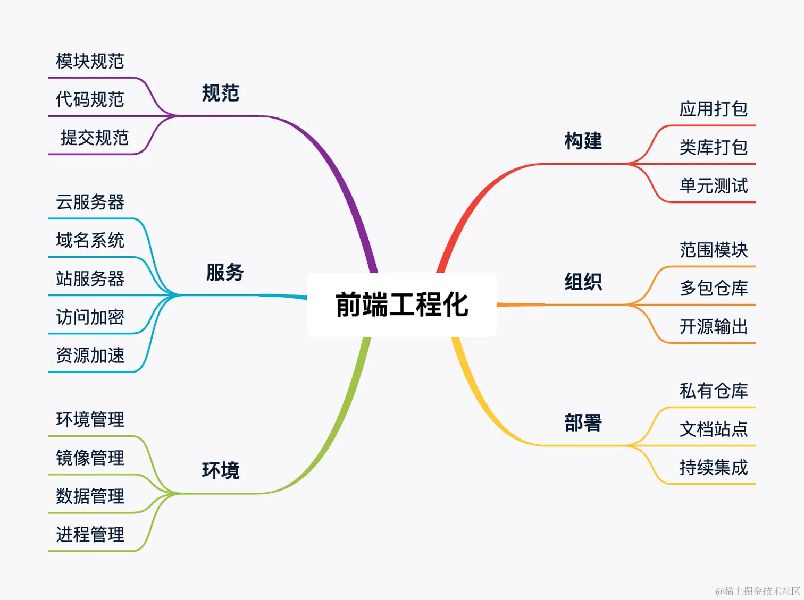
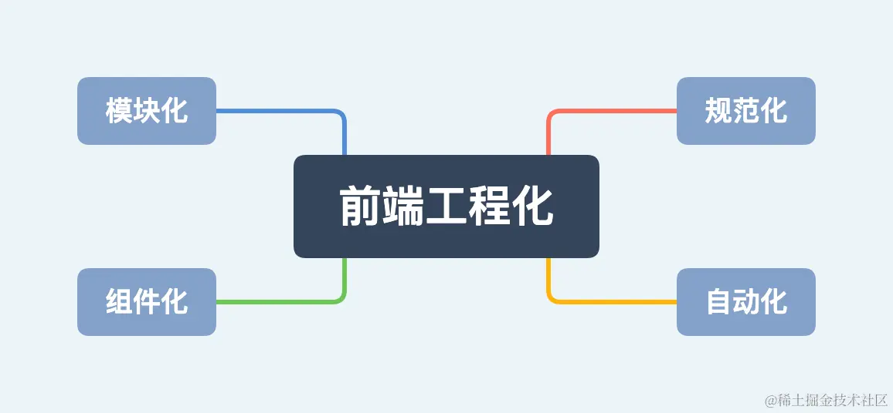
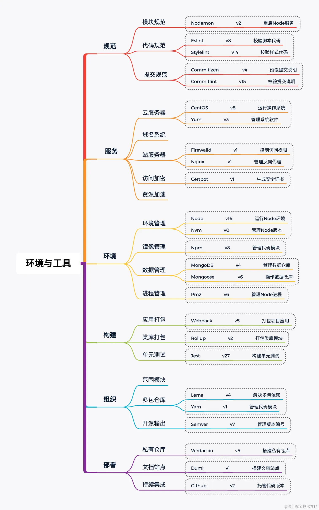
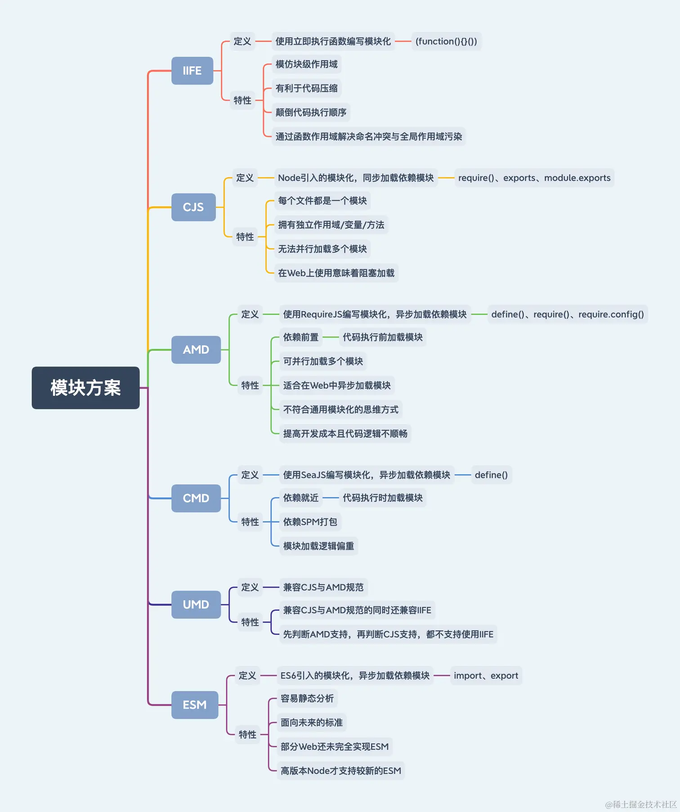

# 前端工程化

## Babel

> 版本：此章节所有版本为7+
>
> 功能：
>
> - 转义ES6+语法的代码，保证新的语法也可以在旧版本的浏览器中运行，但不会转换新的API
> - 通过polyfill方式在目标环境中添加缺失的特性
> - 源码转换

| 包名                              | 说明                                                                                                                                             |
| --------------------------------- | ------------------------------------------------------------------------------------------------------------------------------------------------ |
| `@babel/core`                     | Babel的核心包                                                                                                                                    |
| `@babel/cli`                      | Babel提供的命令行工具，主要提供Babel命令                                                                                                         |
| `@babel/preset-env`               | 预设的插件集合，根据配置的目标环境生成插件列表并进行编译。目标环境由browserlist配置                                                              |
| `@babel/polifill`                 | 在目标环境中添加缺失的新特性，7.4.0+已废弃                                                                                                       |
| `@babel/types`                    | 插件，创建、修改、删除、查找AST的节点，只能对单一节点进行操作，通常配合插件 `@babel/traverse`<br />使用：`const types = require('@babel/types')` |
| `@babel/traverse`                 | 插件，遍历AST的所有节点，并使用指定的Visitor处理相关节点<br />使用：`const traverse = require('@babel/traverse').default`                        |
| `@babel/generator`                | 插件，代码合成<br />使用：`const generate = require('@babel/generator').default`                                                                 |
| `@babel/runtime`                  | 插件，生产环境使用                                                                                                                               |
| `@babel/plugin-transform-runtime` | 插件，对Babel编译过程中产生的helper方法进行重新聚合利用，以达到减少打包体积的目的。还可以避免全局补丁污染，对打包过的bundler提供“沙箱”式的补丁   |

<br />

### 配置文件

有4种配置文件：

| 配置文件          | 说明                                                                                                                    |
| ----------------- | ----------------------------------------------------------------------------------------------------------------------- |
| `babel.config.js` | 官方推荐，项目级别配置，会影响整个项目的代码，包括 `node_modules`<br />遵循commonJS规范，使用 `module.exports` 导出配置 |
| `.babelrc`        | 只影响本项目中的代码<br />JSON数据结构                                                                                  |
| `babel字段`       | `package.json` 中的配置字段                                                                                             |
| `.babelrc.js`     | 内容与 `.babelrc` 相同，但需要 `module.exports` 导出配置                                                                |

::: warning

配置文件中 `plugins` 如果配置了多个插件，执行顺序是从前往后

:::

<br />

### 工作过程

| 工作过程           | 说明                                                                                |
| ------------------ | ----------------------------------------------------------------------------------- |
| 解析(parse)        | 将源码转换成AST，树上的每一个节点都代表源码中的一种结构<br />分为词法分析和语法分析 |
| 转换(transform)    | 对AST做一些特殊处理，使其符合编译器的期望，主要使用转换插件实现                     |
| 代码生成(generate) | 将转换过的AST生成新的代码                                                           |

::: warning

preset 和 plugin 从形式上差不多，但是应用顺序不同。

babel 会按照如下顺序处理插件和 preset：

1. 先应用 plugin，再应用 preset
2. plugin 从前到后，preset 从后到前

这个顺序是 babel 的规定。

:::

<br />

### polyfill

方式一：使用 `@babel/polyfill`，直接提供了可改变全局的API，会造成全局污染。7.4.0+已废弃

- 第一种在入口文件添加：`import '@babel/polyfill'`

- 第二种在webpack的entry配置中添加：

  ```js
  // webpack.config.js

  module.exports = {
    entry: ['@babel/polyfill', './xxx']
  }
  ```

方式二：7.4.0+版本使用

- 第一种在入口文件添加：

```js
import 'core-js/stable'
import 'regenerator-runtime/runtime'
```

- 第二种在配置文件配置：useBuiltIns 就是使用 polyfill （corejs）的方式，是在入口处全部引入（entry），还是每个文件引入用到的（usage），或者不引入（false）

  ```js
  {
      "presets": [["@babel/preset-env", {
          "targets": "> 0.25%, not dead",
          "useBuiltIns": "usage",// or "entry" or "false"
          "corejs": 3
      }]]
  }
  ```

<br />

### 工程配置

- `@babel/preset-env`: 用于按需转换 JavaScript 语法

- `@babel/plugin-transform-runtime`: 用于引入共享的 helper 函数，避免每个文件重复代码。通过使用 `plugin-transform-runtime`，Babel 会将常用的 helper 函数抽离到 `@babel/runtime` 包中，而不再每个文件中都生成一次。比如 `regeneratorRuntime` 这样的 `async/await` 相关的 helper 函数，会被抽离出来，减小最终打包的体积。

- `@babel/runtime`: 这是插件所需要的辅助函数库

```bash
npm install -D @babel/preset-env @babel/plugin-transform-runtime @babel/runtime
```

```js
module.exports = {
  presets: [
    [
      '@babel/preset-env',
      {
        targets: '> 0.25%, not dead', // 根据目标环境自定义
        useBuiltIns: 'usage', // 按需加载 polyfill
        corejs: 3, // 使用 core-js 3.x 版本
      },
    ],
  ],
  plugins: [
    ['@babel/plugin-transform-runtime', {
      corejs: 3
    }] // 减少冗余 helper 函数
  ]
}
```

<br />

## Jest

Jest能识别3种测试用例，分别是以 `test.js` 结尾的、以 `spec.js` 结尾的，以及在 `test` 文件中的。运行测试用例时会在整个项目中查找这三种情况，只要识别出任意一种就会执行。

```js
// basic.spec.js

const { sum } = require('../basic')

describe('basic test', () => {
  test('adds 1 + 3 to equal 4', () => {
    const total = sum(1, 3)
    expect(total).toBe(4)
  })
})

// 运行测试用例
// npx jest
```

<br />

### 异步代码测试

- 回调函数：不推荐，增加了回调函数作为参数对被测试函数的依赖

  ```js
  test('test async code with cb', () => {
    function cb(data) {
      expect(data.userId).toBe(1)
      done()
    }
    fetchData(cb)
  })
  ```

- promise式：

  ```js
  test('test async code with promise', () => {
    // 验证测试期间是否调用了一定数量的断言，如果未调用指定数量的断言，则测试失败
    expect.assertions(number)

    fetchData().then((data) => {
      expect(data.code).toEqual(0)
    })
  })
  ```

  ```js
  // 使用matcher匹配器

  // fullfilled
  test('test async code', () => {
    return expect(fetchData()).resolves.toEqual({
      xxx
    })
  })

  // rejected
  test('test async code', () => {
    expect.assertions(1)
    return expect(fetchData()).rejects.toMatch('Error')
  })
  ```

- `async/await`：推荐

  ```js
  test('test async code with async/await', async () => {
    const res = await fetchData()
    expect(res.code).toBe(1)
  })
  ```

<br />

### 前置和后置函数

- `setUp()`对应的前置函数是 `beforeEach()` 和 `beforeAll()`， 前者是每次都执行，后者是只执行一次
- `tearDown()` 对应的后置函数是 `afterEach()` 和 `afterAll()`，前者是每次都执行，后者是只执行一次

<br />

### 测试覆盖率

- 语句覆盖率(%Stmts)：每个语句是否都执行了
- 分支覆盖率(%Branch)：每个if代码块是否都执行了
- 函数覆盖率(%Funcs)：每个函数是否都执行了
- 行覆盖率(%Lines)：每一行是否都执行了

```bash
# 生成测试覆盖率报告
npx jest --coverage
```

<br />



- **规范篇**：熟悉`模块/代码/提交`三大开发阶段规范，通过规范约束自己，保障工作质量与提升开发效率
- **服务篇**：熟悉`云服务器/域名系统/站服务器`部署服务环境，掌握整体部署与工具配置，学会独立上线应用与服务
- **环境篇**：熟悉`Node/Nvm/Npm`部署开发环境，独立搭建一个`接口服务`，实践`环境/镜像/数据/进程`四种`Node`应用方式
- **构建篇**：熟悉`构建工具`打包类库模块，独立封装一个`类库模块`，结合`测试用例`保障代码的生产质量
- **组织篇**：熟悉`Monorepo模式`管理多包仓库，独立维护一个`多包仓库`，结合`Npm Scope`发布模块到公共仓库
- **部署篇**：熟悉`自动化工具`部署前端项目，独立打造一个`私有仓库`与`文档站点`，结合`CI/CD`在提交代码时自动部署到公网
  
  

## 模块化目录结构

```text
// Web 项目
project
├─ dist          # 输出目录
│  ├─ prod         # 生产环境执行代码
│  └─ test         # 测试环境执行代码
├─ src           # 源码目录
│  ├─ apis         # 接口模块：包括全局接口请求的功能，控制数据定向转换
│  ├─ assets       # 资源模块：包括样式、脚本、字体、图像、音频、视频等资源文件
│  ├─ components   # 组件模块：包括全局通用的基础组件、皮肤主题和字体图标
│  ├─ layouts      # 布局模块：包括以布局为最小粒度的组件集合，由至少一个基础组件组成
│  ├─ flows        # 流程模块：包括以流程为最小粒度的组件集合，由至少一个基础组件组成
│  ├─ pages        # 页面模块：包括以页面为最小粒度的组件集合，由至少一个基础组件组成
│  ├─ routes       # 路由模块：包括全局页面跳转的功能，控制页面自由切换
│  ├─ stores       # 数据模块：包括全局数据状态的功能，控制数据驱动视图
│  ├─ views        # 视图模块：包括以视图为最小粒度的组件集合，由至少一个基础组件组成
│  ├─ utils        # 工具模块：包括全局通用的常量与方法
│  ├─ index.html   # 模板入口文件
│  ├─ index.js     # 脚本入口文件
│  └─ index.scss   # 样式入口文件
└─ package.json
```

```text
// Node 项目
project
├─ dist          # 输出目录
│  ├─ prod         # 生产环境执行代码
│  └─ test         # 测试环境执行代码
├─ src           # 源码目录
│  ├─ assets       # 资源模块：包括样式、脚本、字体、图像、音频、视频等资源文件
│  ├─ models       # 模型模块：包括全局数据模型的功能
│  ├─ routes       # 路由模块：包括全局接口请求的功能
│  ├─ utils        # 工具模块：包括全局通用的常量与方法
│  └─ index.js     # 脚本入口文件
└─ package.json
```

<br />

## 模块化方案



::: tip

- `同步加载`包括`IIFE`与 `CJS`
- `异步加载`包括 `AMD`、`CMD` 和 `ESM`
- 浏览器可兼容 `IIFE`与 `AMD`
- 服务器可兼容 `CJS`
- 浏览器与服务器都兼容 `CMD`、`UMD` 和 `ESM`

:::

|          | CJS                                                        | ESM                                              |
| -------- | ---------------------------------------------------------- | ------------------------------------------------ |
| 语法类型 | 动态                                                       | 静态                                             |
| 关键声明 | `require`                                                  | `export` 和 `import`                             |
| 加载方式 | 运行时加载                                                 | 编译时加载                                       |
| 加载行为 | 同步加载                                                   | 异步加载                                         |
| 书写位置 | 任何位置                                                   | 顶层位置                                         |
| 指针指向 | `this` 指向当前模块                                        | `this` 指向 `undefined`                          |
| 执行顺序 | 首次引用时 `加载模块`<br />再次引用时 `读取缓存`           | 引用时生成 `只读引用`<br />执行时才是正式取值    |
| 属性引用 | 基本类型属于 `复制不共享`<br />引用类型属于 `浅拷贝且共享` | 所有类型属于 `动态只读引用`                      |
| 属性改动 | 工作空间可修改引用的值                                     | 工作空间不可修改引用的值，但可通过引用的方法修改 |

::: tip

- **运行时加载**指整体加载模块生成一个对象，再从对象中获取所需的属性方法去加载。最大特性是`全部加载`，只有运行时才能得到该对象，无法在编译时做静态优化。
- **编译时加载**指直接从模块中获取所需的属性方法去加载。最大特性是`按需加载`，在编译时就完成模块加载，效率比其他方案高，无法引用模块本身(`本身不是对象`)，但可拓展`JS`高级语法(`宏与类型校验`)。

:::

<br />

## 代码规范

<br />

## 提交规范

`Angular提交规范`的格式包括`Header`、`Body`和`Footer`三个内容。`Header`为必填项，`Body`与`Footer`为可缺省项，这些内容通过以下结构组成一个完整的提交格式。

```bash
<type>(<scope>): <subject>
# 空一行
<body>
# 空一行
<footer>
```

### Header

该部分仅书写一行，包括三个字段，分别是`type`、`scope`和`subject`。

- **type**：用于说明`commit`的提交类型，必选
- **scope**：用于说明`commit`的影响范围，可选
- **subject**：用于说明`commit`的细节描述，可选

| 类型       | 功能 | 描述                               |
| ---------- | ---- | ---------------------------------- |
| `feat`     | 功能 | 新增功能，迭代项目需求             |
| `fix`      | 修复 | 修复缺陷，修复上一版本存在问题     |
| `docs`     | 文档 | 更新文档，仅修改文档不修改代码     |
| `style`    | 样式 | 变动格式，不影响代码逻辑           |
| `refactor` | 重构 | 重构代码，非新增功能也非修复缺陷   |
| `perf`     | 性能 | 优化性能，提高代码执行性能         |
| `test`     | 测试 | 新增测试，追加测试用例验证代码     |
| `build`    | 构建 | 更新构建，改动构建工具或外部依赖   |
| `ci`       | 脚本 | 更新脚本，改动CI或执行脚本配置     |
| `chore`    | 事务 | 变动事务，改动其他不影响代码的事务 |
| `revert`   | 回滚 | 回滚版本，撤销某次代码提交         |
| `merge`    | 合并 | 合并分支，合并分支代码到其他分支   |
| `sync`     | 同步 | 同步分支，同步分支代码到其他分支   |
| `impr`     | 改进 | 改进功能，升级当前功能模块         |

`scope`用于说明`commit`的影响范围。简要说明本次改动的影响范围，例如根据功能可划分为`数据层`、`视图层`和`控制层`，根据交互可划分为`组件`、`布局`、`流程`、`视图`和`页面`。从`Angular`以往的提交说明来看，还是建议你在提交时对`scope`补全。

`subject`用于说明`commit`的细节描述。文字一定要精简精炼，无需太多备注，因为`Body`部分可备注更多细节，同时尽量遵循以下规则。

- 以动词开头
- 使用第一人称现在时
- 首个字母不能大写
- 结尾不能存在句号(`.`)

<br />

### Body

该部分可书写多行，对`subject`做更详尽的描述，内容应包括`改动动机`与`改动前后对比`。

<br />

### Footer

该部分只适用两种情况，分别是`不兼容变动`与`问题关闭`。

- **不兼容变动**：当前代码与上一版本不兼容，则以`BREAKING CHANGE`开头，关联`变动描述`、`变动理由`和`迁移方法`
- **问题关闭**：当前代码已修复某些`Issue`，则以`Closes`开头，关联目标`Issue`

<br />

## 部署提交格式化

使用 `commitizen` 的 `git cz` 命令可代替原生的 `git commit` 命令，帮助开发者生成符合规范的提交说明。在此还需指定一个符合Angular提交规范的书写配置[cz-conventional-changelog](https://link.juejin.cn/?target=https%3A%2F%2Fgithub.com%2Fcommitizen%2Fcz-conventional-changelog)，使得 `commitizen` 根据指定规范帮助开发者生成提交说明。

<br />
