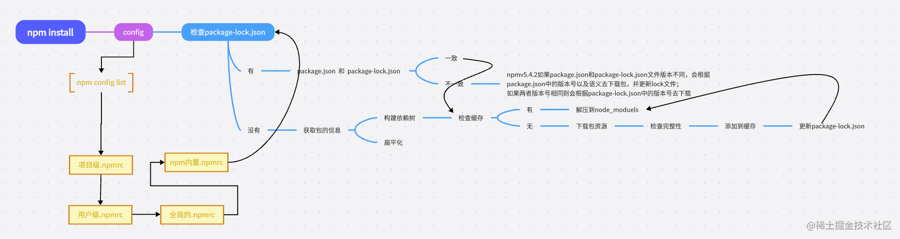

# NPM

## scripts命令

npm 是如何管理和执行各种 scripts 的呢？作为 npm 内置的核心功能之一，npm run 实际上是 npm run-script 命令的简写。当我们运行 npm run xxx 时，基本步骤如下：

1. 从 package.json 文件中读取 scripts 对象里面的全部配置；
2. npm 在执行指定 script 之前会把 node_modules/.bin 加到环境变量 $PATH 的前面，这意味着任何内含可执行文件的 npm 依赖都可以在 npm script 中直接调用
3. 以传给 npm run 的第一个参数作为键，本例中为 xxx，在 scripts 对象里面获取对应的值作为接下来要执行的命令，如果没找到直接报错；
4.
5. 在系统默认的 shell 中执行上述命令，系统默认 shell 通常是 bash，windows 环境下可能略有不同

::: tip

`npm run` 可以列出所有脚本命令

:::

<br />

### 串行

- 语法：用 `&&` 符号把多条 `npm script` 按先后顺序串起来

```json{7}
{
  "scripts": {
    "lint:js": "eslint --fix *.js",
    "lint:css": "stylelint *.css",
    "lint:json": "jsonlint *.json",
    "lint:markdown": "markdownlint --config .markdownlint.json *.md",
    "lint": "npm run lint:js && npm run lint:css && npm run lint:json && npm run lint:markdown"
  }
}
```

::: warning

串行执行的时候如果前序命令失败（通常进程退出码非0），后续全部命令都会终止

:::

<br />

### 并行

- 语法：语法：用 `&` 符号把多条 `npm script` 按先后顺序串起来

```json{7}
{
  "scripts": {
    "lint:js": "eslint --fix *.js",
    "lint:css": "stylelint *.css",
    "lint:json": "jsonlint *.json",
    "lint:markdown": "markdownlint --config .markdownlint.json *.md",
    "lint": "npm run lint:js & npm run lint:css & npm run lint:json & npm run lint:markdown"
  }
}
```

::: tip

- 跟 js 里面同时发起多个异步请求非常类似，它只负责触发多条命令，而不管结果的收集。

- 对于长时间子任务，可以添加 wait，便可以使用 `ctrl + c` 结束进程。如： `npm run lint:js & npm run lint:css & npm run lint:json & wait`

:::

<br />

### 更好的执行方式

> 第三方库：[npm-run-all](https://github.com/mysticatea/npm-run-all?tab=readme-ov-file)
>
> 作用：实现更轻量和简洁的多命令运行

1. 安装

   ```bash
   npm i npm-run-all -D
   ```

2. 使用

   ```json{8,19}
   // 串行执行
   {
     "scripts": {
       "lint:js": "eslint --fix *.js",
       "lint:css": "stylelint *.css",
       "lint:json": "jsonlint *.json",
       "lint:markdown": "markdownlint --config .markdownlint.json *.md",
       "lint": "npm-run-all lint:* test:*"
     }
   }

   // 并行执行，不用增加wait
   {
     "scripts": {
       "lint:js": "eslint --fix *.js",
       "lint:css": "stylelint *.css",
       "lint:json": "jsonlint *.json",
       "lint:markdown": "markdownlint --config .markdownlint.json *.md",
       "lint": "npm-run-all --parallel lint:* test:*"
     }
   }
   ```

<br />

### 传递参数

> 语法：`-- 参数`

```json{5}
// 把--fix参数传递给lint:js
{
  "scripts": {
    "lint:js": "eslint *.js",
    "lint:js:fix": "npm run lint:js -- --fix"
  }
}
```

<br />

### 钩子函数

npm script 的设计者为命令的执行增加了类似生命周期的机制，具体来说就是 `pre` 和 `post` 钩子脚本。这种特性在某些操作前需要做检查、某些操作后需要做清理的情况下非常有用。

1. 覆盖率收集工具 [nyc](https://github.com/istanbuljs/nyc)，是覆盖率收集工具 [istanbul](https://istanbul.js.org/) 的命令行版本，istanbul 支持生成各种格式的覆盖率报告

   ```bash
   npm i nyc opn-cli -D
   ```

2. 打开 html 文件的工具 [opn-cli](https://github.com/sindresorhus/opn-cli)，是能够打开任意程序的工具 [opn](https://github.com/sindresorhus/opn) 的命令行版本

```json
// 把代码检查、测试运行、覆盖率收集串起来
{
  "scripts": {
    "precover": "rm -rf coverage",
    "cover": "nyc --reporter=html npm test",
    "postcover": "rm -rf .nyc_output && opn coverage/index.html"
  }
}
```

1. precover，收集覆盖率之前把之前的覆盖率报告目录清理掉
2. cover，直接调用 nyc，让其生成 html 格式的覆盖率报告
3. postcover，清理掉临时文件，并且在浏览器中预览覆盖率报告

<br />

### 环境变量

1. 预定义变量：`npm run env | grep npm_package | sort` (grep命令需bash)
   - windows环境下使用预定义变量方式为：`%npm_package_xxx%`
   - linux环境下使用预定义变量方式为：`$npm_package_xxx`
2. 自定义变量：在 `package.json` 中添加自定义属性，但是不可以在自定义变量的声明中使用预定义变量

<br />

### 跨平台兼容

| 特性         | cross-env                     | cross-var                                  |
| :----------- | :---------------------------- | :----------------------------------------- |
| **主要功能** | 设置环境变量                  | 在脚本中使用变量替换                       |
| **典型用途** | `NODE_ENV=production`         | `echo $VAR` 或 `echo $npm_package_version` |
| **解决痛点** | Windows设置环境变量的语法问题 | Windows使用Unix变量语法的问题              |
| **使用场景** | 构建时设置环境                | 在脚本中引用已存在的变量                   |

::: tip

- 所有使用引号的地方，建议使用双引号，并且加上转义
- 没做特殊处理的命令比如 eslint、stylelint、mocha、opn 等工具本身都是跨平台兼容的

:::

<br />

#### 系统操作

npm script 中涉及到的文件系统操作包括文件和目录的创建、删除、移动、复制等操作，而社区为这些基本操作也提供了跨平台兼容的包，列举如下：

- [rimraf](https://github.com/isaacs/rimraf) 或 [del-cli](https://www.npmjs.com/package/del-cli)，用来删除文件和目录，实现类似于 `rm -rf` 的功能
- [cpr](https://www.npmjs.com/package/cpr)，用于拷贝、复制文件和目录，实现类似于 `cp -r` 的功能
- [make-dir-cli](https://www.npmjs.com/package/make-dir-cli)，用于创建目录，实现类似于 `mkdir -p` 的功能

改动说明：

- `rm -rf` 直接替换成 `rimraf`
- `mkdir -p` 直接替换成 `make-dir`
- `cp -r` 的替换需特别说明下，`cpr` 默认是不覆盖的，需要显示传入 `-o` 配置项，并且参数必须严格是 `cpr <source> <destination> [options]` 的格式，即配置项放在最后面

<br />

#### 环境变量

Linux 和 Windows 下引用变量的方式是不同的，Linux 下直接可以用 `$npm_package_name`，而 Windows 下必须使用 `%npm_package_name%`，使用 [cross-env](https://www.npmjs.com/package/cross-env) 来实现 npm script 的跨平台兼容。

```json
{
  "scripts": {
    "test": "cross-env NODE_ENV=test mocha tests/"
  }
}
```

<br />

### node脚本替代scripts命令

shelljs 为我们提供了各种常见命令的跨平台支持，比如 cp、mkdir、rm、cd 等命令

```js
const chalk = require('chalk')
const { rm, cp, mkdir, exec, echo } = require('shelljs')

console.log(chalk.green('1. remove old coverage reports...'))
rm('-rf', 'coverage')
rm('-rf', '.nyc_output')

console.log(chalk.green('2. run test and collect new coverage...'))
exec('nyc --reporter=html npm run test')

console.log(chalk.green('3. archive coverage report by version...'))
mkdir('-p', 'coverage_archive/$npm_package_version')
cp('-r', 'coverage/*', 'coverage_archive/$npm_package_version')

console.log(chalk.green('4. open coverage report for preview...'))
exec('npm-run-all --parallel cover:serve cover:open')
```

```json
{
  "scripts": {
    "cover": "node xxx.js"
  }
}
```

::: tip

- 简单的文件系统操作，建议直接使用 shelljs 提供的 cp、rm 等替换；
- 部分稍复杂的命令，比如 nyc 可以使用 exec 来执行，也可以使用 istanbul 包来完成；
- 在 exec 中也可以大胆的使用 npm script 运行时的环境变量，比如 `$npm_package_version`

:::

<br />

## npm install 原理



::: tip

package-lock.json 帮我们做了缓存，他会通过 name + version + integrity 信息生成一个唯一的key，这个key能找到对应的index-v5 下的缓存记录 也就是npm cache 文件夹下的 `_cacahe`，如果发现有缓存记录，就会找到tar包的hash值，然后将对应的二进制文件解压到node_modeules。

:::

> 本节参考：[Nodejs第四章](https://xiaoman.blog.csdn.net/article/details/132038474)

## npm run 原理

读取 package json 的 scripts 对应的脚本命令，查找规则是：

1. 先从当前项目的 `node_modules/.bin` 去查找
2. 如果没找到就去全局的 `node_modules` 去找
3. 如果还没找到就去环境变量查找
4. 再找不到就进行报错

::: info 跨平台脚本

- `.sh` 文件是给 `Linux unix Macos` 使用
- `.cmd` 给windows的cmd使用
- `.ps1` 给windows的powerShell 使用

:::

## npm 包发布

1. `npm adduser`：打开npm创建用户，注意此处需把 `registry` 地址改为npm官方地址，否则跳转会出错
2. `npm login`：登录
3. `npm publish`：发布，如果出现403说明包名被占用

## npm 私服

优点：

- 可以离线使用，你可以将npm私服部署到内网集群，这样离线也可以访问私有的包
- 提高包的安全性，使用私有的npm仓库可以更好的管理你的包，避免在使用公共的npm包的时候出现漏洞
- 提高包的下载速度，使用私有 npm 仓库，你可以将经常使用的 npm 包缓存到本地，从而显著提高包的下载速度，减少依赖包的下载时间。这对于团队内部开发和持续集成、部署等场景非常有用

### 搭建步骤

- 工具：[Verdaccio](https://verdaccio.org/zh-CN/)
- 安装：`npm install verdaccio -g`
- 基本命令：
  - 创建账号：`npm adduser --registry http://localhost:4873/`
  - 发布：`npm publish --registry http://localhost:4873/`
  - 指定开启端口，默认4873：`verdaccio --listen 9999`
  - 从指定源安装：`npm install --registry http://localhost:4873`
  - 从私服仓库删除：`npm unpublish <package-name> --registry http://localhost:4873`

### package.json

<br />

必须包含 `name` 和 `version` 字段，`Node.js` module 还需要 `main` 字段。

- `name`: 包含您的包的名称，并且必须是小写字母和一个单词，并且可以包含连字符和下划线。
- `version`: 必须采用 x.x.x 形式并遵循[语义版本控制准则](https://docs.npmjs.com/about-semantic-versioning)。
- `author`(可选): 作者信息，格式`Your Name <email@example.com> (http://example.com)`

<br />

设置默认值：

```bash
npm set init-author-email "example-user@example.com"
npm set init-author-name "example_user"
npm set init-license "MIT"
```

<br />

### README.md

`npm` 包自述文件必须位于包的根目录中。

<br />

### unscoped public packages

未限定范围的包始终是公共的，并且仅通过包名称引用

<br />

## npm init

初始化生成 `package.json`，可以使用 `npm init -f` 或者 `npm init -y` ，直接跳过问答环境，快速生成。

### 配置初始化字段默认值

```bash
npm config set init.author.name "xxx"
npm config set init.author.email "xxx"
npm config set init.author.url "xxx"
npm config set init.license "MIT"
npm config set init.version "0.0.1"
```

::: tip

将默认配置和 -f 参数结合使用，能让你用最短的时间创建 `package.json`

:::

<br />

## npm run xxx

- **&&**：串行执行命令

- **&**：并行执行命令
- 第三方工具：[npm-run-all](https://github.com/mysticatea/npm-run-all/)

## hooks

- prexxx：命令前执行
- xxx：命令执行
- postxxx：命令后执行

## 环境变量

`npm run env` 可以拿到完整的变量列表，可以通过 grep 过滤（Windows环境下需启用bash）。

`npm run env | grep npm_package | sort`

## 跨平台

- [rimraf](https://github.com/isaacs/rimraf) 或 [del-cli](https://www.npmjs.com/package/del-cli)，用来删除文件和目录，实现类似于 `rm -rf` 的功能；
- [cpr](https://www.npmjs.com/package/cpr)，用于拷贝、复制文件和目录，实现类似于 `cp -r` 的功能；
- [make-dir-cli](https://www.npmjs.com/package/make-dir-cli)，用于创建目录，实现类似于 `mkdir -p` 的功能；
- cross-var：实现跨平台的变量引用，轻量可以选择 `cross-var-no-babel`
- cross-env：设置环境变量，直接在设置了环境变量的命令前面加上 cross-env 即可
- [scripty](https://github.com/testdouble/scripty)：脚本命令拆分

::: warning

关于 npm script 的跨平台兼容，还有几点需要大家注意：

- 所有使用引号的地方，建议使用双引号，并且加上转义；
- 没做特殊处理的命令比如 eslint、stylelint、mocha、opn 等工具本身都是跨平台兼容的；
- 还是强烈建议有能力的同学能使用 Linux 做开发，只要你入门并且熟练了，效率提升会惊人；
- 短时间内继续拥抱 Windows 的同学，可以考虑看看 Windows 10 里面引入的 [Subsystem](https://msdn.microsoft.com/en-us/commandline/wsl/about)，让你不用虚拟机即可在 Windows 下使用大多数 Linux 命令。

:::

<br />

##### 1. 安装node

```shell
node -v
npm -v
```

##### 2. 安装依赖

```shell
npm install | i 依赖名称   			// 局部安装
npm install | i 依赖名称  -g    // 全局安装
```

##### 3. 卸载依赖

```shell
npm uninstall 依赖名称     			// 局部卸载
npm uninstall 依赖名称 -g  			// 全局卸载
```

> **npm i 和 npm install 的区别**
>
> **实际使用的区别点主要如下(windows下)：**
>
> 1. 用 `npm i `安装的模块无法用 `npm uninstall` 删除，用 `npm uninstall i` 才卸载掉
> 2. `npm i` 会帮助检测与当前node版本最匹配的npm包版本号，并匹配出来相互依赖的npm包应该提升的版本号
> 3. 部分npm包在当前node版本下无法使用，必须使用建议版本
> 4. 安装报错时intall肯定会出现npm-debug.log 文件， `npm i` 不一定

##### 4. 查看已安装的依赖

```shell
npm list -g --depth=0 						// 查看全局安装的依赖
npm list --depth=0						    // 查看局部安装的依赖
```

cnpm 的坑：package-lock.json是用来锁定安装时的包的版本号，如果之前用 npm 安装产生了package-lock.json，后面再用cnpm来安装package.json、package-lock.json安装可能会跟你安装的依赖包不一致，这是因为 **cnpm 不受package-lock.json影响，只会根据package.json进行下载**。

#### 1. 更新

npm 的最新版本是最新的稳定版本。安装 Node.js 时，会自动安装 npm。但是，npm 的发布频率比 Node.js 高，因此要安装最新的稳定版 npm，请在命令行上运行：

```shell
npm install npm@latest -g
```

::: tip 提示

NOTE: 以下 `package` 相关均为无作用域 `package`

:::

<br />

#### 2. 配置

```shell
# get detail config
npm config ls -l

# 以下设置Windows需同步更新环境变量

# 设置全局安装路径
npm config set prefix '磁盘路径' -g
# 获取全局安装路径
npm config get prefix -g

# 设置全局缓存路径
npm config set cache '磁盘路径' -g
# 获取全局缓存路径
npm config get cache -g
```

<br />

#### 3. 调试

<br />

##### 1. npm-debug.log

如果需要生成 `npm-debug.log` 文件，可以运行以下命令之一。

```shell
# for install
npm install --timing

# for publish
npm publish --timing

# get .npm directory, npm-debug.log inside
npm config get cache
```

<br />

##### 2. 一般错误

```shell
# clean cache
npm cache clean

# for install
npm install XXX --verbose
```

<br />

#### 4. package.json 字段

```json
// example
{
  "name": "my-awesome-package",
  "version": "1.0.0"
}
```

- **name**: 必需。包含您的包的名称，必须是小写字母和一个单词，并且可以包含连字符和下划线。
- **version**: 必需。必须采用 x.x.x 格式并遵循语义版本控制指南。
- author: 可选。邮箱及网站都是可选。`Your Name <email@example.com> (http://example.com)`

<br />

#### 5. 初始化

```shell
# 创建package.json

npm init
```

<br />

##### 1. 自定义初始化

1. 在主目录中，创建一个名为 .npm-init.js 的文件

2. 要添加自定义问题，请使用文本编辑器，使用 `prompt` 功能添加问题

   ```js
   module.exports = prompt('what\'s your favorite flavor of ice cream, buddy?', 'I LIKE THEM ALL')
   ```

3. 要添加自定义字段，请使用文本编辑器将所需字段添加到 .npm-init.js 文件

   ```js
   module.exports = {
     customField: 'Example custom field',
     otherCustomField: 'This example field is really cool'
   }
   ```

<br />

##### 2. 默认初始化

```shell
npm init --yes | -y
```

- `name`: 当前文件夹名称
- `version`: `1.0.0`
- `description`: info from the README, or an empty string `""`
- `scripts`: 默认创建一个空的 `test` 命令
- `keywords`: empty
- `author`: empty
- `license`: `ISC`
- `bugs`: 当前目录中的信息（如果存在）
- `homepage`: 当前目录中的信息（如果存在）

```shell
# 为初始化命令设置配置选项

npm set init.author.email "example-user@example.com"
npm set init.author.name "example_user"
npm set init.license "MIT"
```

<br />

#### 6. 创建 package

创建将在另一个应用程序需要您的模块时加载的文件。

```js
exports.printMsg = function () {
  console.log('This is a message from the demo package')
}
```

```shell
# 发布

npm publish --access public
```

::: warning 注意

npm 包 README 文件必须位于包的根目录中。

:::

<br />

#### package

package是由 `package.json` 文件描述的文件或目录。package必须包含 `package.json` 文件才能发布到 npm 注册表。

<br />

##### package 格式

- a) 包含由 `package.json` 文件描述的程序的文件夹
- b) 包含 (a) 的压缩包
- c) 解析为 (b) 的URL
- d) 使用 (c) 在注册表上发布的 `<name>@<version>`
- e) 指向 (d) 的 `<name>@<tag>`
- f) 具有满足 (e) 的最新标记的 `<name>`
- g) 一个 git url，在克隆时会解析成 (a)

用于 npm 包的 Git URL 可以通过以下方式格式化：

- `git://github.com/user/project.git#commit-ish`
- `git+ssh://user@hostname:project.git#commit-ish`
- `git+http://user@hostname/project/blah.git#commit-ish`
- `git+https://user@hostname/project/blah.git#commit-ish`

::: tips

commit-ish 可以是可以作为参数提供给 git checkout 的任何标记、sha 或分支。默认的 commit-ish 是 master

:::

<br />

#### module

##### 格式

满足以下其中之一：

- 包含 package.json 文件的文件夹，其中包含 `main` 字段
- 一个 JavaScript 文件

::: warnings 注意

只有具有 `package.json` 文件的模块也是包。

:::
<br />

## package.json

### 字段说明

| 常规字段名 | 说明                                                                                                                                                                   |
| ---------- | ---------------------------------------------------------------------------------------------------------------------------------------------------------------------- | ---------- | ---------------------------------------------------------------- |
| `name`     | 必须，且唯一                                                                                                                                                           |
| `version`  | 必须，且遵循Semantic Version，参考 [语义化版本](./semver)，查看npm包的版本信息：<br />查看最新版本：`npm view xxx version` <br />查看所有版本：`npm view xxx versions` |
| `keywords` | 可选，包关键字                                                                                                                                                         |
| `scripts`  | 脚本命令，可以结合 `prexxx` 和 `postxxx` 完成前后钩子执行                                                                                                              |
| `files`    | 是一个数组配置，指定文件列表，当npm包发布时，会指定哪些文件被推送到npm服务器。如果指定的是文件夹，那么文件夹下的所有文件都会被提交                                     |
| `main`     | 指定加载的入口文件，在browser和node环境都可使用。如果不指定，会尝试加载根目录的 `index.js                                                                              | index.json | index.node`，都没有找到则报错，通过指定详细路径import或者require |
| `module`   | 指定ESM规范的入口文件，在browser和node环境都可使用                                                                                                                     |
| `browser`  | 指定browser环境下的入口文件，一般node有的API浏览器端会报错，需要指定特殊文件入口                                                                                       |
| `bin`      | 指定可执行文件路径，会使用 `npm link` 命令将这些文件导入到全局路径中，以便在任意目录下执行                                                                             |
| `config`   | 配置scripts运行的配置参数，如端口port等，字段会自动映射到 `npm_package_config_xxx` 的环境变量中                                                                        |

| 第三方字段    | 说明                                                                                                                                                          |
| ------------- | ------------------------------------------------------------------------------------------------------------------------------------------------------------- |
| `unpkg`       | CDN服务配置                                                                                                                                                   |
| `jsdelivr`    | CDN服务配置                                                                                                                                                   |
| `sideEffects` | 该项为webpack的辅助配置，是webpack4新增的特性，用来声明该包或模块是否包含副作用。不开启此配置项，引入的包或模块不管是否有副作用，只要没有用到，就会被完整移除 |
| `typings`     | TS的入口文件，作用与main配置相同                                                                                                                              |
| `lint-staged` | 暂存文件检查工具，通常和 gitHooks 一起使用                                                                                                                    |
| `gitHooks`    | 配置git钩子命令                                                                                                                                               |
| `standard`    | 代码检查和优化的工具库配置                                                                                                                                    |
| `browserlist` | 设置浏览器的兼容情况                                                                                                                                          |
| `babel`       | babel编译配置                                                                                                                                                 |

<br />

## 参考

> [用 npm script 打造超溜的前端工作流](https://www.kancloud.cn/sllyli/npm-script/1243450)
