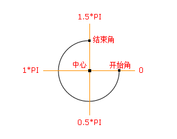

# canvas

## 设置画布

```html
<canvas id="canvas"></canvas>
```

初始化的画布有个默认 `300x150` 的大小，我们也可以手动设置画布的大小，设置画布有三种方式：

- HTML方式：

  ```html
  <canvas width="400" height="200"></canvas
  ```

- CSS方式：

  ```css
  #canvas {
    width: 400px;
    height: 200px;
  }

  ```

```

```

```

```

```

```

- js方式：

  ```js
  const canvas = document.getElementById('canvas')
  canvas.width = 400
  canvas.height = 200
  ```

````

```

```

<br />

## API

### 绘制

|     API      |    描述     |
| :----------: | :---------: |
|    `fill`    |    填充     |
|  `fillRect`  |  填充矩形   |
|   `stroke`   |    描边     |
| `strokeRect` |  描边矩形   |
|    `arc`     | 创建弧/曲线 |

<br />

### 颜色、样式和阴影

| 属性            | 描述                                     |
| :-------------- | :--------------------------------------- |
| `fillStyle`     | 设置或返回用于填充绘画的颜色、渐变或模式 |
| `strokeStyle`   | 设置或返回用于笔触的颜色、渐变或模式     |
| `shadowColor`   | 设置或返回用于阴影的颜色                 |
| `shadowBlur`    | 设置或返回用于阴影的模糊级别             |
| `shadowOffsetX` | 设置或返回阴影距形状的水平距离           |
| `shadowOffsetY` | 设置或返回阴影距形状的垂直距离           |

| 方法                     | 描述                                    |
| ------------------------ | --------------------------------------- |
| `createLinearGradient()` | 创建线性渐变（用在画布内容上）          |
| `createPattern()`        | 在指定的方向上重复指定的元素            |
| `createRadialGradient()` | 创建放射状/环形的渐变（用在画布内容上） |
| `addColorStop()`         | 规定渐变对象中的颜色和停止位置          |

<br />

### 线条样式

| 属性         | 描述                                     |
| ------------ | ---------------------------------------- |
| `lineCap`    | 设置或返回线条的结束端点样式             |
| `lineJoin`   | 设置或返回两条线相交时，所创建的拐角类型 |
| `lineWidth`  | 设置或返回当前的线条宽度                 |
| `miterLimit` | 设置或返回最大斜接长度                   |

<br />

## 绘制

想要在canvas上绘制图形，首先需要通过 `HTMLCanvasElement.getContext()` 拿到canvas元素的上下文，通过这个上下文对canvas进行绘制，canvas作为画布，可以将这个上下文理解为画笔🖌️。

<br />

### 弧/曲线

> 语法：`context.arc(x, y, r, sAngle, eAngle, counterclockwise)`
>
> 参数：
>
> - x: 圆的中心的 x 坐标
> - y: 圆的中心的 y 坐标
> - r: 圆的半径
> - `sAngle`: 起始角，以弧度计。（弧的圆形的三点钟位置是 0 度）
> - `eAngle`: 结束角，以弧度计
> - `counterclockwise`: 可选。规定应该逆时针还是顺时针绘图。false = 顺时针，true = 逆时针



```js
const canvas = document.getElementById('canvas')
const context = canvas.getContext('2d')
const cx = canvas.width = 400
const cy = canvas.height = 200

// 画圆
context.arc(100, 100, 20, 0, Math.PI * 2, true)

// 画半圆
context.arc(100, 100, 20, 0, Math.PI * 1.0, false)

// 画弧
context.beginPath()
context.arc(100, 75, 50, 0, 1.5 * Math.PI)
context.strokeStyle = 'red' // 设置描边颜色为红色
context.stroke() // 进行路线
```

<br />

### 线

> 语法：
>
> - 设置起始点：`context.moveTo(x, y)`
> - 设置目标点：`context.lineTo(x, y)`
>
> 参数：
>
> - x：路径的目标位置的 x 坐标
> - y：路径的目标位置的 y 坐标

```js
const canvas = document.getElementById('canvas')
const context = canvas.getContext('2d')
const cx = canvas.width = 400
const cy = canvas.height = 200

context.beginPath() // 开始一条路径
context.moveTo(50, 50) // 绘制直线的起点位置
context.lineTo(100, 100) // 添加一个新点，然后在画布中创建从上一个点到该点的线条
context.stroke()
```

::: warning

没有设置`moveTo()` ，则第一个 `lineTo()` 将充当 `moveTo` 的作用

:::

<br />

### 矩形

> 参数：
>
> - x：矩形左上角的 x 坐标
> - y：矩形左上角的 y 坐标
> - width：矩形的宽度，以像素计
> - height：矩形的高度，以像素计

```javascript
const canvas = document.getElementById('canvas')
const context = canvas.getContext('2d')
const cx = canvas.width = 400
const cy = canvas.height = 200

context.fillRect(x, y, width, height) // 填充矩形
context.strokeRect(x, y, width, height) // 描边矩形
ctx.clearRect(20, 20, 100, 50) // 抠除一个 100x50 的矩形
```

```javascript
const canvas = document.getElementById('canvas')
const context = canvas.getContext('2d')
const cx = canvas.width = 400
const cy = canvas.height = 200

context.beginPath()
context.fillStyle = '#fff'
context.fillRect(10, 10, 100, 100) // 绘制实心矩形
context.strokeStyle = '#fff' // 线条
context.strokeRect(130, 10, 100, 100) // 绘制空心矩形

ctx.fillStyle = '#000' // 绘制抠除矩形
ctx.fillRect(0, 0, 300, 150) // 绘制一个宽300，高150的矩形
ctx.clearRect(20, 20, 100, 50) // 清除一个 100x50 的区域
```

## 参考

> [参考](https://juejin.cn/post/6847902224975298574)

```

```
````
