# WebGL

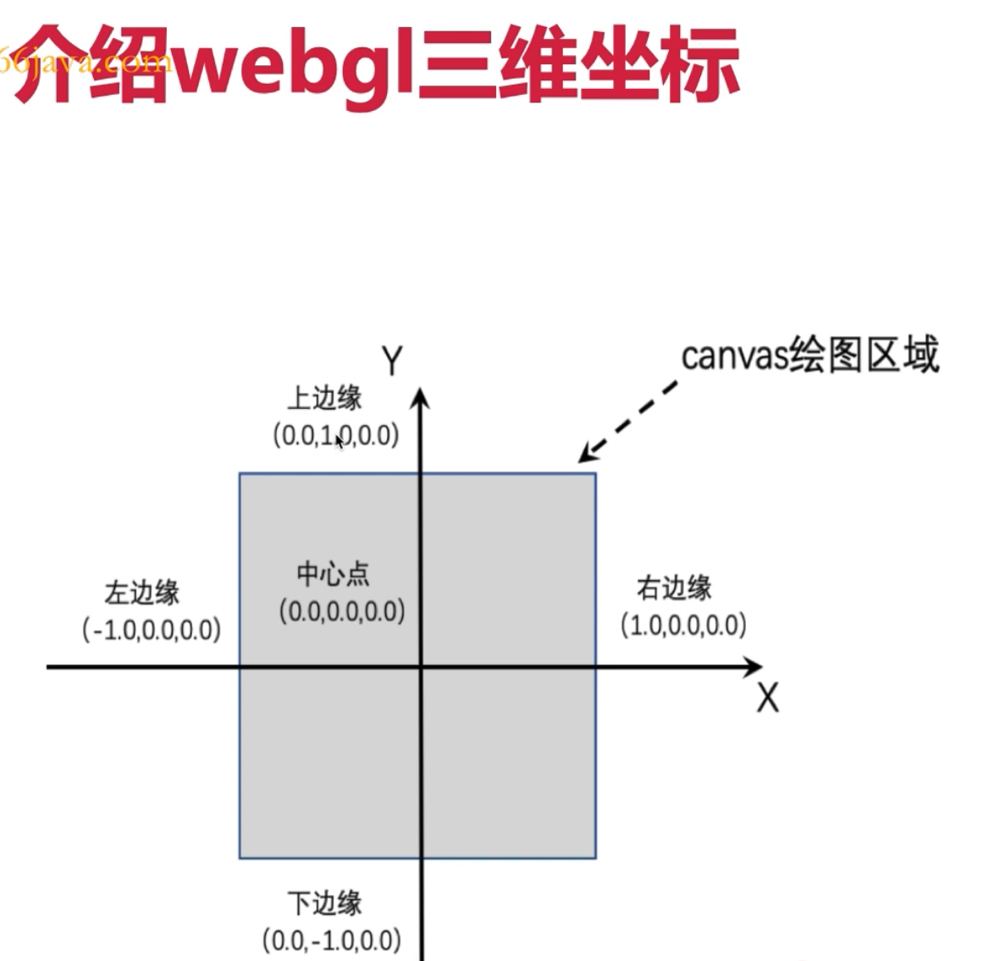

## 实例

### 基础使用

```html
<canvas id="canvas" width="600" height="300"> 你的浏览器不支持 Canvas </canvas>

```

```js
// 绘制一个红色的矩形
const canvas = document.getElementById('canvas')
const gl = canvas.getContext('webgl')
gl.clearColor(1.0, 0.0, 0.0, 1.0)
gl.clear(gl.COLOR_BUFFER_BIT)
```

<br />

## 渲染流程

1. 图元装配过程：将独立的 _顶点坐标_ 装配成几何图形，图形的类型由 `gl.drawArrays()` 第一个参数确定
2. 光栅化：将装配好的图形转换为片元
3. 剔除：对于不透明物体，背面对于观察者来说是不可见的。那么在渲染过程中，就会将不可见的部分剔除，不参与绘制。节省渲染开销
4. 裁剪：在可视范围之外的事物是看不到的。图形生成后，有的部分可能位于可视范围之外，这一部分会被裁剪掉，不参与绘制

<br />

## API

### clearColor

> 作用：指定清空 canvas 的颜色
>
> 语法：`gl.clearColor(r, g, b, a)`
>
> 参数：4个，取值区间为0.0~1.0

<br />

### clear

> 作用：清空 canvas
>
> 语法：`gl.clear(buffer)`
>
> 参数：3种类型
>
> - `gl.COLOR_BUFFER_BIT`：清空颜色缓存
> - `gl.DEPTH_BUFFER_BIT`：清空深度缓冲区
> - `gl.STENCIL_BUFFER_BIT`：清空模板缓冲区

::: tip 使用要求

- `gl.clear(gl.COLOR_BUFFER_BIT)` 和 `gl.clearColor(0.0, 0.0, 0.0, 1.0)` 搭配
- `gl.clear(gl.DEPTH_BUFFER_BIT)` 和 `gl.clearDepth(1.0)`
- `gl.clear(gl.STENCIL_BUFFER_BIT)` 和 `gl.clearStencil(0)`

:::

<br />

### drawArrays

> 作用：绘制图形
>
> 语法：`gl.drawArrays(mode, first, count)`
>
> 参数：
>
> - `mode`：绘制图形的模式
>   - `gl.POINTS`：绘制单个点
>   - `gl.LINES`：单独线段，在一对顶点之间画一条线，如果顶点是奇数，最后一个会被忽略
>   - `gl.LINE_STRIP`：连接线段，绘制一条到下一个顶点的直线，不会闭合终点和起点
>   - `gl.LINE_LOOP`：闭合线，绘制一条直线到下一个顶点，会闭合终点和起点
>   - `gl.TRIANGLES`：单独的三角形，超过3个顶点时，count 需要是3的倍数
>   - `gl.TRIANGLE_STRIP`：条带状三角形
>   - `gl.TRIANGLE_FAN`：飘带状三角形
> - `first`：从哪个顶点开始绘制
> - `count`：绘制几个顶点

## 着色器

### 创建着色器

```js
function initShader(gl, VERTEX_SHADER_SOURCE, FRAGMENT_SHADER_SOURCE) {
  // 创建顶点着色器
  const vertexShader = gl.createShader(gl.VERTEX_SHADER)
  gl.shaderSource(vertexShader, VERTEX_SHADER_SOURCE)
  gl.compileShader(vertexShader)
  if (!gl.getShaderParameter(vertexShader, gl.COMPILE_STATUS)) {
    console.error('ERROR compiling vertex shader!', gl.getShaderInfoLog(vertexShader))
    return
  }

  // 创建片元着色器
  const fragmentShader = gl.createShader(gl.FRAGMENT_SHADER)
  gl.shaderSource(fragmentShader, FRAGMENT_SHADER_SOURCE)
  gl.compileShader(fragmentShader)
  if (!gl.getShaderParameter(fragmentShader, gl.COMPILE_STATUS)) {
    console.error('ERROR compiling fragment shader!', gl.getShaderInfoLog(fragmentShader))
    return
  }

  // 创建着色器程序
  const program = gl.createProgram()
  gl.attachShader(program, vertexShader)
  gl.attachShader(program, fragmentShader)
  gl.linkProgram(program)
  if (!gl.getProgramParameter(program, gl.LINK_STATUS)) {
    console.error('ERROR linking program!', gl.getProgramInfoLog(program))
    return
  }

  gl.useProgram(program)
  return program
}
```

<br />

### attribute变量

<br />

#### 声明变量

> 语法：`存储限定符 类型 变量名;`
>
> 如：`attribute vec4 xxx;`

::: danger

只传递顶点数据，只能在顶点着色器中使用，不能在片元着色器中使用

:::

<br />

#### 获取变量

> 语法：`gl.getAttribLocation(program, name)`
>
> 参数：
>
> - `program`：程序对象
> - `name`：指定想要获取存储地址的 _attribute_ 变量的名称
>
> 返回值：变量的存储地址

<br />

#### 变量赋值

> 语法：`gl.vertexAttrib4f(location, v1, v2, v3, v4)`
>
> 参数：
>
> - `location`：指定 _attribute_ 变量的存储地址
> - v1：第一个分量的值
> - v2：第二个分量的值
> - v3：第三个分量的值
> - v4：第四个分量的值

::: info 同族函数，参数不同

- `gl.vertexAttrib1f(location, v1)`
- `gl.vertexAttrib2f(location, v1, v2)`
- `gl.vertexAttrib3f(location, v1, v2, v3)`

:::

<br />

### uniform变量

<br />

#### 声明变量

> 语法：`存储限定符 类型 变量名;`
>
> 如：`uniform vec4 xxx;`

::: danger

和 attribute 变量不同，可以在片元着色器中使用，也可以在顶点着色器中使用

:::

<br />

#### 获取变量

> 语法：`gl.getUniformLocation(program, name)`
>
> 参数：
>
> - `program`：程序对象
> - `name`：指定想要获取存储地址的 _attribute_ 变量的名称
>
> 返回值：变量的存储地址

<br />

#### 变量赋值

> 语法：`gl.uniform4f(location, v1, v2, v3, v4)`
>
> 参数：
>
> - `location`：指定 uniform 的存储地址
> - `v1`：第一个分量的值
> - `v2`：第二个分量的值
> - `v3`：第三个分量的值
> - `v4`：第四个分量的值

::: info 同族函数，参数不同

与 attribute 变量不同之处在于，片元着色器源代码中声明的是什么类型的变量，变量赋值时就需要调用对应的函数

- `gl.uniform1f(location, v1)`
- `gl.uniform2f(location, v1, v2)`
- `gl.uniform3f(location, v1, v2, v3)`

:::

<br />

### varying 变量

::: warning

需要在顶点着色器和片元着色器中同时声明 varying 变量

:::

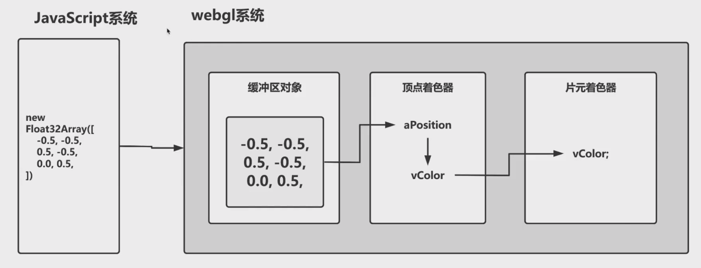

<br />

### 设置精度

> 语法：`precision mediump float;`
>
> 作用：设置浮点数精度
>
> 参数：
>
> - `highp`：高精度
> - `mediump`：中精度
> - `lowp`：低精度

::: danger

片元着色器默认没有精度，必须先设置精度，否则会报错

:::

<br />

## 缓冲区

### 缓冲区对象

> 定义：是 webGL 系统中的一块内存区域，可以一次性地向缓冲区对象中填充大量的顶点数据，然后将这些数据保存在其中，供顶点着色器使用
>
> 场景：解决多个顶点数据问题

::: info 类型化数组

在 webGL 中，需要处理大量的相同类型数据，所以引入类型化数组，这样程序就可以预知到数组中的数量类型，提高性能

:::

::: details 类型化数组类型

- `Int8Array`：8位整型
- `UInt8Array`：8位无符号整型
- `Int16Array`：16位整型
- `UInt16Array`：16位无符号整型
- `Int32Array`：32位整型
- `UInt32Array`：32位无符号整型
- `Float32Array`：单精度32位浮点型
- `Float64Array`：双精度64位浮点型

:::

<br />

1. 创建顶点数据

   ```js
   const points = new Float32Array([
     xx,
     xx,
     xx,
     xx,
     xx,
     xx
   ])
   ```

2. 创建缓冲区对象

   > 语法：`const buffer = gl.createBuffer();`

3. 绑定缓冲区对象

   > 语法：`gl.bindBuffer(target, buffer)`
   >
   > 参数：
   >
   > - `buffer`： 已经创建好的缓冲区对象
   > - `target`：
   >   - `gl.ARRAY_BUFFER`：表示缓冲区存储的是顶点的数据
   >   - `gl.ELEMENT_ARRAY_BUFFER`：表示缓冲区存储的是顶点的索引值

4. 将数据写入缓冲区对象

   > 语法：`gl.bufferData(target, data, type)`
   >
   > 参数：
   >
   > - `target`：同上` bindBuffer` 的 `target`
   > - `data`：写入缓冲区的顶点数据，如程序中的 points
   > - `type`：表示如何使用缓冲区对象中的数据
   >   - `gl.STATIC_DRAW`：写入一次，多次绘制
   >   - `gl.STREAM_DRAW`：写入一次，绘制若干次
   >   - `gl.DYNAMIC_DRAW`：写入多次，绘制多次

5. 将缓冲区对象分配给一个 _attribute_ 变量

> 语法：`gl.vertexAttribPointer(location, size, type, normalized, stride, offset)`
>
> 参数：
>
> - `location`：_attribute_ 变量的存储位置
> - `size`：指定每个顶点所使用数据的个数
> - `type`：指定数据格式，要和顶点数据格式保持一致
>   - `gl.FLOAT`：浮点型
>   - `gl.UNSIGNED_BYTE`：无符号字节
>   - `gl.SHORT`：短整型
>   - `gl.UNSIGNED_SHORT`：无符号短整型
>   - `gl.INT`：整型
>   - `gl.UNSIGNED_INT`：无符号整型
> - `normalized`：表示是否将数据归一化到 [0, 1] [-1, 1] 这个区间
> - `stride`：两个相邻顶点之间的字节数
> - `offset`：数据偏移量

6. 开启 _attribute_ 变量

   > 语法：`gl.enableVertexAttribArray(location)`
   >
   > 参数：
   >
   > - `location`：变量的存储地址

7. 禁用 _attribute_ 变量

   > 语法：`gl.disableVertexAttribArray(location)`
   >
   > 参数：
   >
   > - `location`：变量的存储地址

<br />

### 缓冲区使用流程

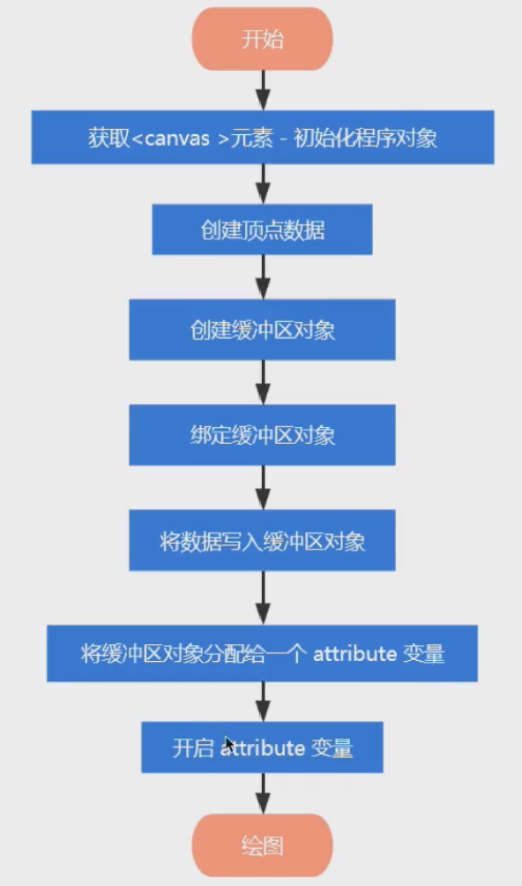

<br />

### 缓冲区执行过程

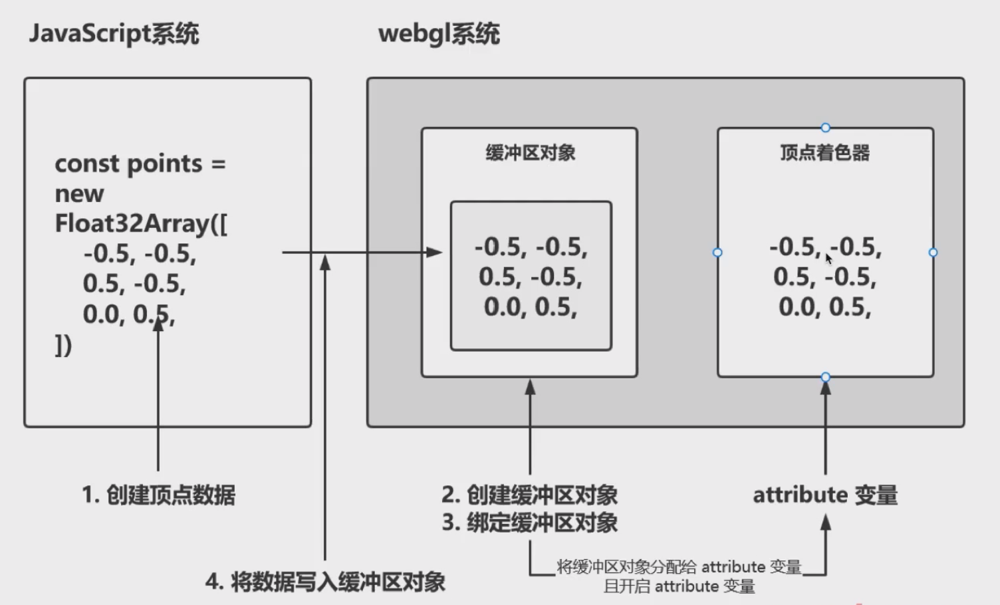

<br />

### 多缓冲区流程

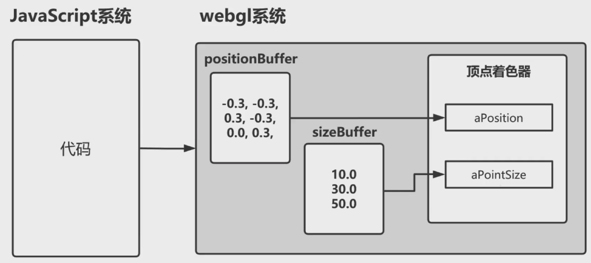

<br />

### 数据偏移执行流程

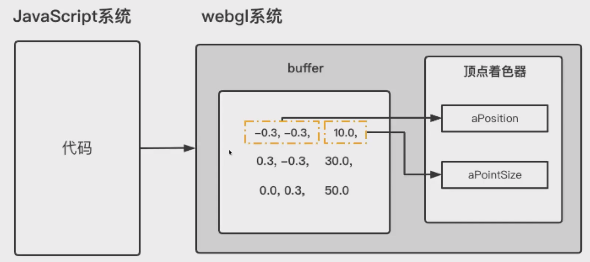

<br />

```js
// 图形平移

import { initShader } from './index.js'

const canvas = document.getElementById('canvas')
const gl = canvas.getContext('webgl')

// 顶点着色器源码
const VERTEX_SHADER_SOURCE = `
      attribute vec4 aPosition;
      attribute float aTranslate;

      void main() {
        // 要绘制的点的坐标
        gl_Position = vec4(aPosition.x + aTranslate, aPosition.y, aPosition.z, 1.0);
        // 点的大小
        gl_PointSize = 10.0;
      }
    `

// 片元着色器源码
const FRAGMENT_SHADER_SOURCE = `
      void main() {
        gl_FragColor = vec4(0.9, 1.0, 0.0, 1.0);
      }
    `

// 初始化着色器
const program = initShader(gl, VERTEX_SHADER_SOURCE, FRAGMENT_SHADER_SOURCE)

// 获取 attribute 变量的存储位置
const aPosition = gl.getAttribLocation(program, 'aPosition')
const aTranslate = gl.getAttribLocation(program, 'aTranslate')
// 顶点数据
const data = new Float32Array([
  -0.5,
  -0.5,
  0.5,
  -0.5,
  -0.5,
  0.5,
])
// 创建缓冲区对象
const buffer = gl.createBuffer()
// 绑定缓冲区对象
gl.bindBuffer(gl.ARRAY_BUFFER, buffer)
// 将数据写入缓冲区对象
gl.bufferData(gl.ARRAY_BUFFER, data, gl.STATIC_DRAW)
// 将缓冲区对象分配给一个 attribute 变量
gl.vertexAttribPointer(aPosition, 2, gl.FLOAT, false, 0, 0)
// 开启 attribute 变量
gl.enableVertexAttribArray(aPosition)

// 平移数据
let x = -1
setInterval(() => {
  x += 0.01
  if (x > 1) {
    x = -1
  }
  gl.vertexAttrib1f(aTranslate, x)
  gl.drawArrays(gl.TRIANGLES, 0, 3)
}, 60)
```

<br />

## 矩阵

> 定义：就是纵横排列的数据表格（m行n列）
>
> 作用：把一个点转换到另一个点

<br />

### gl.uniformMatrix4fv

> 语法：`gl.uniformMatrix4fv(location, transpose, array)`
>
> 参数：
>
> - `location`：指定 uniform 变量的存储位置
> - `transpose`：在 webGL 中恒为 false
> - `array`：矩阵数组

<br />

### 平移矩阵

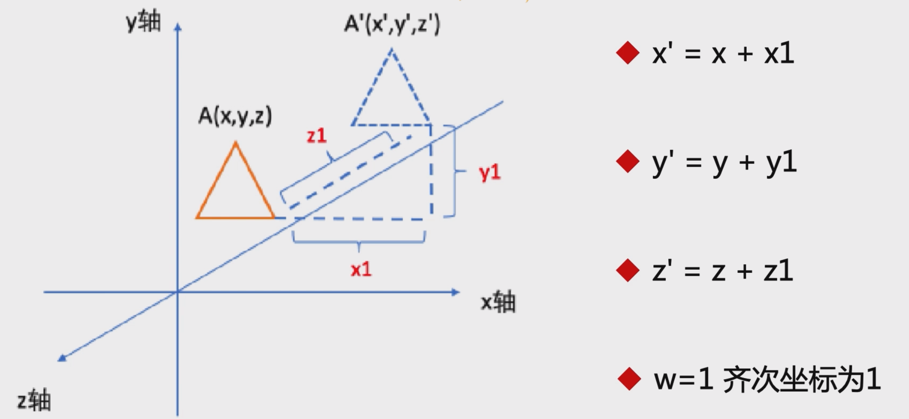

```js
function getTranslateMatrix(x = 0, y = 0, z = 0) {
  return new Float32Array([
    1.0,
    0.0,
    0.0,
    0.0,
    0.0,
    1.0,
    0.0,
    0.0,
    0.0,
    0.0,
    1.0,
    0.0,
    x,
    y,
    z,
    1.0,
  ])
}
```

<br />

### 缩放矩阵

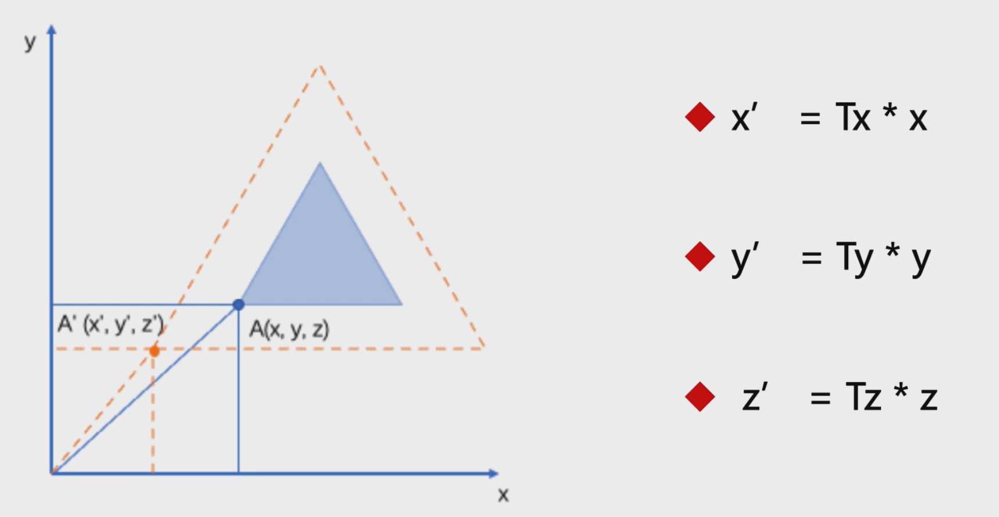

```js
function getScaleMatrix(x = 1, y = 1, z = 1) {
  return new Float32Array([
    x,
    0.0,
    0.0,
    0.0,
    0.0,
    y,
    0.0,
    0.0,
    0.0,
    0.0,
    z,
    0.0,
    0.0,
    0.0,
    0.0,
    1.0,
  ])
}
```

<br />

### 旋转矩阵

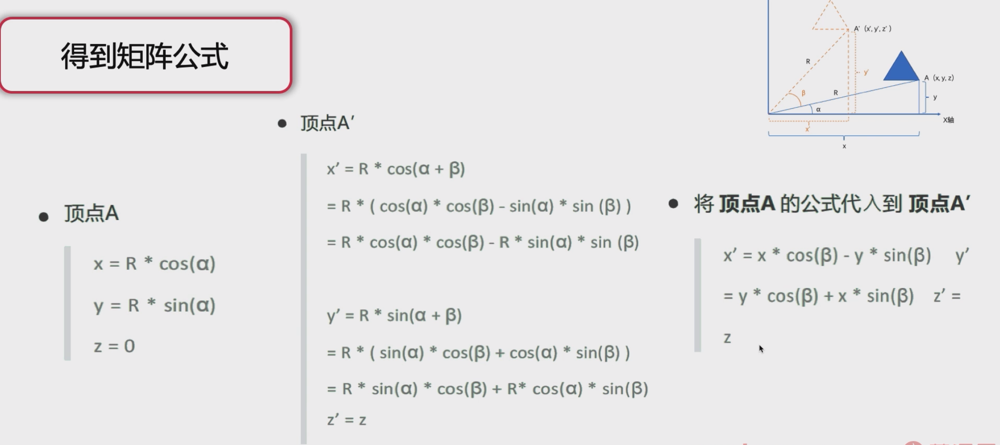

```js
/**
 * 获取旋转矩阵，绕Z轴旋转
 * @param deg
 * @returns {Float32Array}
 */
function getRotateMatrix(deg) {
  return new Float32Array([
    Math.cos(deg),
    Math.sin(deg),
    0.0,
    0.0,
    -Math.sin(deg),
    Math.cos(deg),
    0.0,
    0.0,
    0.0,
    0.0,
    1.0,
    0.0,
    0.0,
    0.0,
    0.0,
    1.0,
  ])
}
```

<br />

### 矩阵复合相乘

- 矩阵A右乘矩阵B：A的列乘以B的行，得到行为主序的新矩阵
- 矩阵A左乘矩阵B：A的行乘以B的列，得到列为主序的新矩阵

```js
/**
 * 矩阵相乘
 * @param matrix1
 * @param matrix2
 * @returns {Float32Array}
 */
function mixMatrix(matrix1, matrix2) {
  const result = new Float32Array(16)

  for (let i = 0; i < 4; i++) {
    result[i] = matrix1[i] * matrix2[0] + matrix1[i + 4] * matrix2[1] + matrix1[i + 8] * matrix2[2] + matrix1[i + 12] * matrix2[3]
    result[i + 4] = matrix1[i] * matrix2[4] + matrix1[i + 4] * matrix2[5] + matrix1[i + 8] * matrix2[6] + matrix1[i + 12] * matrix2[7]
    result[i + 8] = matrix1[i] * matrix2[8] + matrix1[i + 4] * matrix2[9] + matrix1[i + 8] * matrix2[10] + matrix1[i + 12] * matrix2[11]
    result[i + 12] = matrix1[i] * matrix2[12] + matrix1[i + 4] * matrix2[13] + matrix1[i + 8] * matrix2[14] + matrix1[i + 12] * matrix2[15]
  }
  return result
}
```

<br />

## 纹理

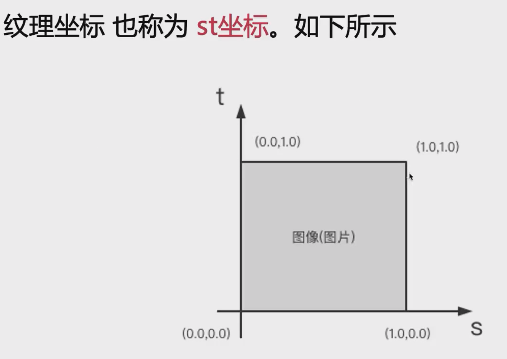

在 webGL 里需要通过纹理坐标和图形顶点坐标的映射关系来确定贴图

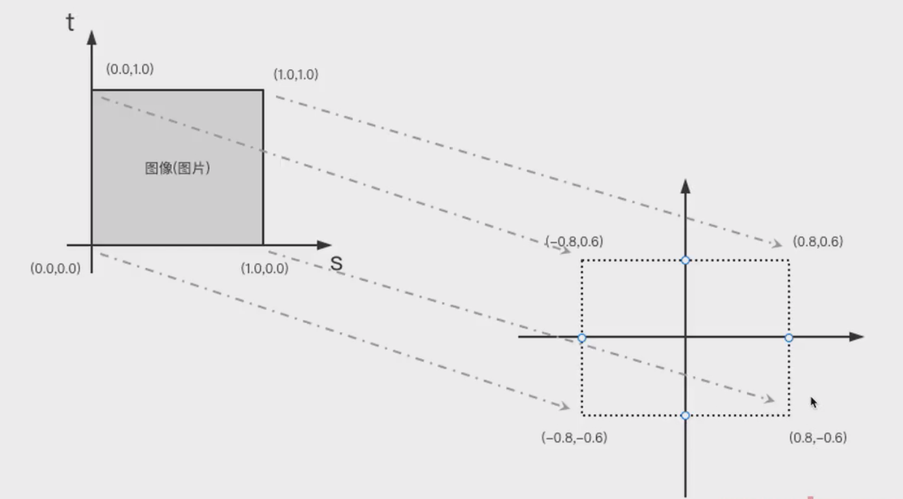

<br />

### 创建纹理对象

> 语法：`const texture = gl.createTexture();`
>
> 作用：纹理对象主要用于存储纹理图像数据

<br />

### 删除纹理对象

> 语法：`gl.deleteTexture(texture);`
>
> 作用：删除纹理对象

<br />

### 进行图片Y轴翻转

> 语法：`gl.pixelStorei(gl.UNPACK_FLIP_Y_WEBGL, 1);`
>
> 作用：进行坐标转换映射

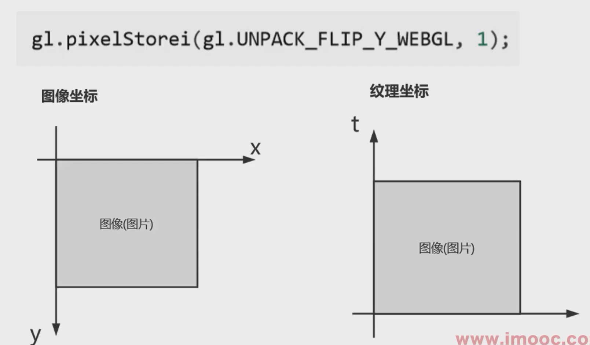

<br />

### 开启纹理单元

> 语法：`gl.activeTexture(gl.TEXTURE0)`
>
> 作用：webGL 是通过纹理单元来管理纹理对象，每个纹理单元管理一张纹理对象

<br />

### 绑定纹理对象

> 语法：`gl.bindTexture(type, texture)`
>
> 参数：
>
> - type：
>   - `gl.TEXTURE_2D`：二维纹理
>   - `gl.TEXTURE_CUBE_MAP`：立方体纹理
> - texture：纹理对象

<br />

### 配置纹理参数

> 语法：`gl.texParameteri(type, pname, param)`
>
> 参数：
>
> - type：
>   - `gl.TEXTURE_2D`：二维纹理
>   - `gl.TEXTURE_CUBE_MAP`：立方体纹理
> - pname：
>   - `gl.TEXTURE_MAG_FILTER`：放大
>   - `gl.TEXTURE_MIN_FILTER`：缩小
>   - `gl.TEXTURE_WRAP_S`：横向（水平填充）
>   - `gl.TEXTURE_WRAP_T`：纵向（垂直填充）
> - param：
>   - 赋值给 `gl.TEXTURE_MAG_FILTER` 和 `gl.TEXTURE_MIN_FILTER`
>     - `gl.NEAREST`：使用像素颜色值
>     - `gl.LINEAR`：使用四周的加权平均值
>   - 赋值给 `gl.TEXTURE_WRAP_S` 和 `gl.TEXTURE_WRAP_T`
>     - `gl.REPEAT`：平铺重复
>     - `gl.MIRRORED_REPEAT`：镜像对称
>     - `gl.CLAMP_TO_EDGE`：边缘延伸

<br />

### 配置纹理图像

> 语法：`gl.textImage2D(type, level, internalformat, format, dataType, image)`
>
> 参数：
>
> - type：
>   - `gl.TEXTURE_2D`：二维纹理
>   - `gl.TEXTURE_CUBE_MAP`：立方体纹理
> - level：0
> - internalformat：图像内部格式
>   - `gl.RGB`：
>   - `gl.RGBA`：
>   - `gl.ALPHA`：
>   - `gl.LUMINANCE`：使用物体表面的红绿蓝分量的加权平均值来计算
>   - `gl.LUMINANCE_ALPHA`：
> - format：纹理的内部格式，必须和 `internalformat` 相同
> - dataType：纹理数据的数据类型
>   - `gl.UNSIGNED_BYTE`：无符号整型，每个颜色分量占一个字节
>   - `gl.UNSIGNED_SHORT_5_6_5`：RGB分量占5、6、5bit
>   - `gl.UNSIGNED_SHORT_4_4_4`：RGBA分量占4、4 、4 、4bit
>   - `gl.UNSIGNED_SHORT_5_5_5-1`：RGBA分量占5 、5 、5 、1bit
> - image：图片对象

<br />

## OpenGL ES语言基础

特性：

- 大小写敏感
- 强制分号
- 程序入口：着色器语言通过 main 函数作为程序入口，且没有任何返回值 `void main() {}`
- 强类型语言：变量的使用和赋值必须是相同类型
  - 基本类型：
    - `float`：单精度浮点数
    - `int`：整型
    - `bool`：布尔值
  - 变量声明：
    - 数字字母下划线
    - 不能以数字开头
    - 不能是关键字或保留字
    - 不能以 `gl_、webgl_、_webgl_` 作为开头
  - 类型和类型转换：
    - `int()` 此方法将数据转换为整型
    - `float()` 转为浮点型
    - `bool()` 转为布尔值

<br />

### 矢量和矩阵

<br />

#### 矢量声明

- `vec2、vec3、vec4` 具有2、3、4个浮点数元素的矢量
- `ivec2、ivec3、ivec4` 具有2、3、4个整型元素的矢量
- `bvec2、bvec3、bvec4` 具有2、3、4个布尔值元素的矢量

<br />

#### 赋值

需要通过*构造函数*来进行赋值：`vec4 position = vec4(0.0, 0.0, 0.0, 1.0);`

<br />

#### 访问矢量里的分量

- `x, y, z, w` 访问顶点坐标的分量

- `s, t, p, q` 访问纹理坐标的分量

- 混合获取，得到新的矢量内容：

  ```c
  vec4 position = vec4(0.1, 0.2, 0.3, 1.0);

  position.xy = vec2(0.1, 0.2);
  position.yx = vec2(0.2, 0.1);
  position.zyx = vec3(0.3, 0.2, 0.1);
  ```

<br />

#### 矩阵声明

- `mat2`：2\*2的浮点数元素矩阵
- `mat3`：3\*3的浮点数元素矩阵
- `mat4`：4\*4的浮点数元素矩阵

<br />

#### 矩阵入参

::: warning

矩阵参数是列主序的

:::

```c
mat4 m = mat4(
	1.0, 5.0, 9.0, 13.0,
  2.0, 6.0, 10.0, 14.0,
  3.0, 7.0, 11.0, 15.0,
  4.0, 8.0, 12.0, 16.0,
);
```

<br />

### 纹理取样器

- 取样器有两种：`sampler2D` 和 `samplerCube`

- 只能使用 `uniform` 变量

  ```c
  // 声明二维纹理
  uniform sampler2D uSampler;

  // 声明立方体纹理
  unifor samplerCube uSamplerCube;
  ```

<br />

#### 二维纹理的使用

```js
// 创建纹理对象
const texture = gl.createTexture()

// 翻转图片的 Y 轴
gl.pixelStorei(gl.UNPACK_FLIP_Y_WEBGL, 1)

// 开启一个纹理单元
gl.activeTexture(gl.TEXTURE0)

// 绑定纹理对象
gl.bindTexture(gl.TEXTURE_2D, texture)

// 配置纹理参数
// 处理放大缩小
gl.texParameteri(gl.TEXTURE_2D, gl.TEXTURE_MAG_FILTER, gl.LINEAR)
gl.texParameteri(gl.TEXTURE_2D, gl.TEXTURE_MIN_FILTER, gl.LINEAR)

// 处理纹理环绕
gl.texParameteri(gl.TEXTURE_2D, gl.TEXTURE_WRAP_S, gl.CLAMP_TO_EDGE)
gl.texParameteri(gl.TEXTURE_2D, gl.TEXTURE_WRAP_T, gl.CLAMP_TO_EDGE)

// 配置纹理图像
gl.texImage2D(gl.TEXTURE_2D, 0, gl.RGB, gl.RGB, gl.UNSIGNED_BYTE, img)

// 将纹理单元传递给片元着色器
gl.uniform1i(uSampler, 0)
```

<br />

#### 立方体纹理的使用

需要处理六个面

```js
const cubeMap = gl.createTexture()
gl.activeTexture(gl.TEXTURE1)
gl.bindTexture(gl.TEXTURE_CUBE_MAP, cubeMap)
gl.pixelStorei(gl.UNPACK_FLIP_Y_WEBGL, true)

// 配置纹理参数
// 处理放大缩小
gl.texParameteri(gl.TEXTURE_CUBE_MAP, gl.TEXTURE_MAG_FILTER, gl.LINEAR)
gl.texParameteri(gl.TEXTURE_CUBE_MAP, gl.TEXTURE_MIN_FILTER, gl.LINEAR)

// 处理纹理环绕
gl.texParameteri(gl.TEXTURE_CUBE_MAP, gl.TEXTURE_WRAP_S, gl.CLAMP_TO_EDGE)
gl.texParameteri(gl.TEXTURE_CUBE_MAP, gl.TEXTURE_WRAP_T, gl.CLAMP_TO_EDGE)

// 配置纹理图像
gl.texImage2D(gl.TEXTURE_CUBE_MAP_POSITIVE_Z, 0, gl.RGB, gl.RGB, gl.UNSIGNED_BYTE, imgs[0])
gl.texImage2D(gl.TEXTURE_CUBE_MAP_POSITIVE_Z, 0, gl.RGB, gl.RGB, gl.UNSIGNED_BYTE, imgs[1])
gl.texImage2D(gl.TEXTURE_CUBE_MAP_POSITIVE_X, 0, gl.RGB, gl.RGB, gl.UNSIGNED_BYTE, imgs[2])
gl.texImage2D(gl.TEXTURE_CUBE_MAP_POSITIVE_X, 0, gl.RGB, gl.RGB, gl.UNSIGNED_BYTE, imgs[3])
gl.texImage2D(gl.TEXTURE_CUBE_MAP_POSITIVE_Y, 0, gl.RGB, gl.RGB, gl.UNSIGNED_BYTE, imgs[4])
gl.texImage2D(gl.TEXTURE_CUBE_MAP_POSITIVE_Y, 0, gl.RGB, gl.RGB, gl.UNSIGNED_BYTE, imgs[5])

// 将纹理单元传递给片元着色器
gl.uniform1i(uSamplerCube, 1)
```

<br />

### 分支和循环

- 分支和循环方法和JS相同

- 跳出循环：
  - `continue、break` 和JS中相同
  - `discard`：只能在片元着色器中使用，表示放弃当前片元直接处理下一个片元

<br />

### 内置函数

角度函数：

- `radians`：角度转弧度
- `degress`：弧度转角度

三角函数：

- `sin`：正弦
- `cos`：余弦
- `tan`：正切
- `asin`：反正弦
- `acos`：反余弦
- `atan`：反正切

指数函数：

- `pow`：次方
- `exp`：自然质数
- `log`：对数
- `sqrt`：开平方
- `inversesqrt`：开平方的倒数

通用函数：

- `abs`：绝对值
- `min`：最小值
- `max`：最大值
- `mod`：取余数
- `sign`：取符号
- `floor`：向下取整
- `ceil`：向上取整
- `clamp`：限定范围
- `fract`：获取小数部分

几何函数：

- `length(x)`：计算向量x的长度
- `distance(x, y)`：计算向量x，y之间的距离
- `dot(x, y)`：计算向量x，y的点积
- `cross(x, y)`：计算向量x，y的差积
- `normailze(x)`：返回方向同x，长度为1的向量

<br />

### 存储限定词

- `const`：声明一个常量，定义之后不能被改变
- `attribute`：只能出现在顶点着色器中，只能声明为全局变量，表示逐顶点信息，单个顶点的信息
- `uniform`：可以同时出现在顶点着色器和片元着色器中。只读类型，强调一致性。用来存储的是影响所有顶点的数据，如变换矩阵。
- `varying`：从顶点着色器向片元着色器传递数据

<br />

#### 精度限定

作用是提升运行效率，削减内存开支

1. `highp、mediump、lowp`：

   - 可以单独针对某个变量声明精度：`mediump float f;`

   - 缺点是会出现精度歧义，不利于后期维护

2. `precision`：修改着色器的默认精度

::: info 什么时候使用精度限定

片元着色器中的 `float` 类型没有默认精度，所有如果需要在片元着色器中使用浮点型数据的时候，需要修改默认精度

:::

<br />

## 3D基础

- 视点：可以简易的理解为眼睛，也就是观察点
- 目标点：可以理解为要看的物体
- 上方向：也叫正方向

<br />

### 辅助函数

- 归一化函数：归一化到0-1的区间内
- 叉积：求两个平面的法向量
- 点积：求某点在x、y、z轴上的投影长度
- 向量差：获取视点到目标点之间的向量

```js
// 归一化函数
function normalize(arr) {
  let sum = 0
  for (let i = 0; i < arr.length; i++) {
    sum += arr[i] * arr[i]
  }
  const middle = Math.sqrt(sum)
  for (let i = 0; i < arr.length; i++) {
    arr[i] = arr[i] / middle
  }
}

// 叉积函数，获取法向量
function cross(a, b) {
  return new Float32Array([
    a[1] * b[2] - a[2] * b[1],
    a[2] * b[0] - a[0] * b[2],
    a[0] * b[1] - a[1] * b[0]
  ])
}

// 点积函数，获取投影长度
function dot(a, b) {
  return a[0] * b[0] + a[1] * b[1] + a[2] * b[2]
}

// 向量差
function minus(a, b) {
  return new Float32Array([
    a[0] - b[0],
    a[1] - b[1],
    a[2] - b[2]
  ])
}

// 视图矩阵获取
function getViewMatrix(eyeX, eyeY, eyeZ, lookAtX, lookAtY, lookAtZ, upX, upY, upZ) {
  // 视点
  const eye = new Float32Array([eyeX, eyeY, eyeZ])
  // 目标点
  const lookAt = new Float32Array([lookAtX, lookAtY, lookAtZ])
  // 上方向
  const up = new Float32Array([upX, upY, upZ])
  // 确定z轴
  const z = minus(eye, lookAt)
  normalize(z)
  normalize(up)

  // 确定x轴
  const x = cross(z, up)

  normalize(x)

  // 确定y轴
  const y = cross(x, z)

  return new Float32Array([
    x[0],
    y[0],
    z[0],
    0,
    x[1],
    y[1],
    z[1],
    0,
    x[2],
    y[2],
    z[2],
    0,
    -dot(x, eye),
    -dot(y, eye),
    -dot(z, eye),
    1
  ])
}
```

<br />

### 正射投影

> 定义：就是把可视空间内的坐标映射到x[-1, 1]，y[-1, 1]，z[-1, 1] 的区间内

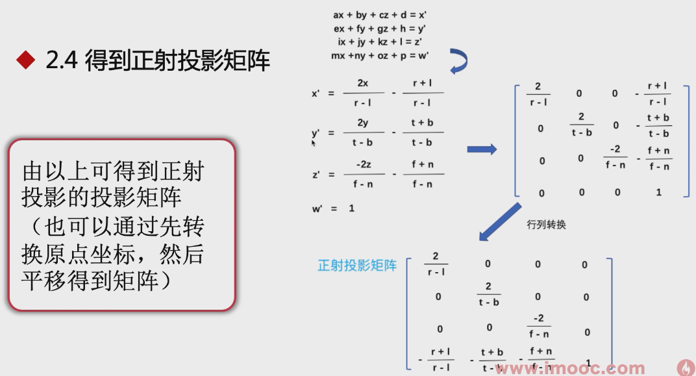

<br />

### 透视投影
