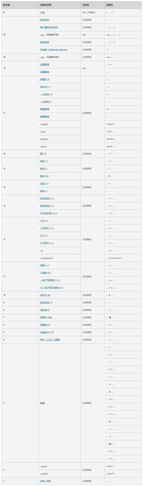
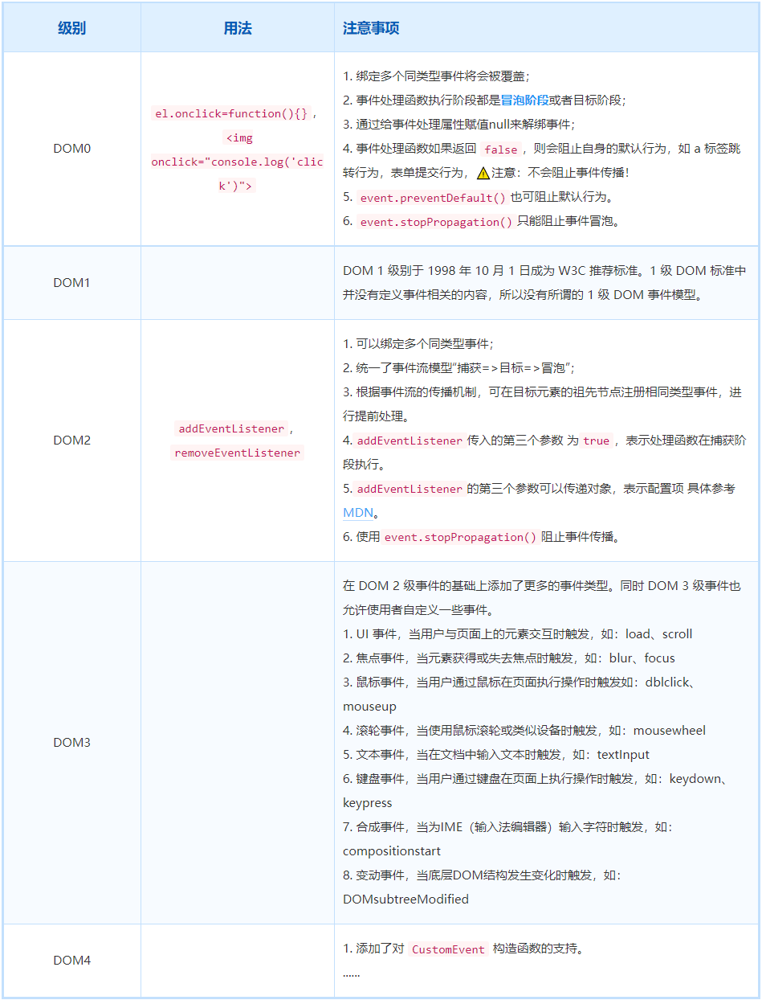
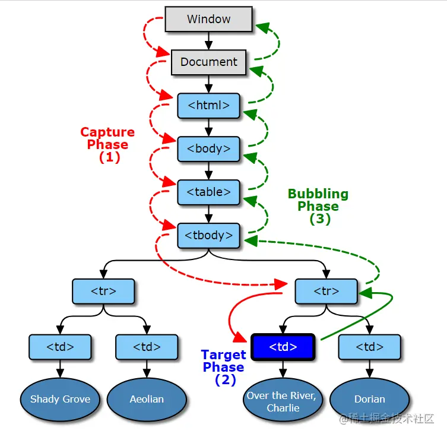

# JavaScript

## script标签

### 1. 推迟执行脚本

在 `<script>` 标签添加 `defer` 属性，会告诉浏览器应该立即开始下载，但执行应该推迟。只针对外部脚本文件有效。

1. 它们会在浏览器解析到结束的 `</html>` 标签后才会执行。`HTML5` 规范要求脚本按照它们出现的顺序执行，因此第一个推迟的脚本会在第二个推迟的脚本之前执行，而且两者都会在 `DOMContentLoaded` 事件之前执行。
2. 但实际当中，推迟执行的脚本不一定总是会按顺序执行或者在`DOMContentLoaded` 事件之前执行，因此最好只包含一个这样的脚本。

<br />

### 2. 异步执行脚本

在 `<script>` 标签添加 `async` 属性，会告诉浏览器应该立即开始下载，但执行应该推迟。只针对外部脚本文件有效，且不保证能按照它们出现的次序执行。

异步脚本不应该在加载期间修改 `DOM` ，保证会在页面的 `load` 事件之前执行，但可能会在 `DOMContentLoaded` 之前或之后。

<br />

### 3. 动态加载脚本

把 `HTMLElement` 元素添加到 `DOM` 且执行到这段代码之前不会发送请求。默认情况下，以这种方式创建的 `<script>` 元素是以异步方式加载的，相当于添加了 `async` 属性。

1. 以这种方式获取的资源对浏览器预加载器是不可见的，这会严重影响它们在资源获取队列中的优先级
2. 要想让预加载器知道这些动态请求文件的存在，可以在文档头部显式声明它们：`<link rel="preload" href="xxx.js">`

<br />

### 4. noscript标签

下列情况下，浏览器将显示包含在 `<noscript>` 中的内容：

1. 浏览器不支持脚本
2. 浏览器对脚本的支持被关闭

<br />

## 语言基础

### 1. 语法

1. `ECMAScript` 中一切都区分大小写

2. 标识符组成：

   - 第一个字符必须是一个字母、\_ 或 $

   - 剩下的其他字符可以是字母、\_ 、$、数字
   - 使用小驼峰大小写形式，第一个单词的首字母小写，后面每个单词的首字母大写

<br />

### 2. 变量

<br />

#### var

1. var声明作用域

   声明的范围是函数作用域，使用 var 操作符定义的变量会成为包含它的函数的局部变量，在函数内定义变量时省略 var 关键字，可以创建一个全局变量。

2. var 声明提升

   使用这个关键字声明的变量会自动提升到函数作用域顶部。

   提升（hoist）：把所有变量声明都拉到函数作用域的顶部。

<br />

#### let

1. 声明的范围是块作用域，块作用域是函数作用域的子集。
2. 暂时性死区：let 声明的变量不会在作用域中被提升，在 let 声明之前的执行瞬间被称为”暂时性死区“，在此阶段引用任何后面才声明的变量都会抛出 `ReferenceError`。
3. 与 var 不同，使用 let 在全局作用域中声明的变量不会成为 `window` 对象的属性。
4. 不能条件声明：不能检查前面是否已经使用 let 声明过同名变量，同时也就不可能在声明的情况下声明它。
5. 不允许重复声明。

::: warning

var 和 let 声明未初始化的变量都为`undefined`

:::

<br />

#### const

1. const 声明变量时必须同时初始化变量，尝试修改 const 声明的变量会导致运行时错误。

2. const 声明的限制只适用于它指向的变量的引用，可以修改声明的对象内部的属性。
3. 不允许重复声明。

<br />

### 3. 数据类型

有7种简单数据类型（也称为原始类型）：`undefined` 、`null`、`boolean`、`number`、`string`、`symbol`、`bigint`

有1种复杂数据类型：`object`

<br />

#### typeof 操作符

| 返回值      | 说明                         |
| ----------- | ---------------------------- |
| `undefined` | 值未定义                     |
| `boolean`   | 布尔类型                     |
| `string`    | 字符串类型                   |
| `number`    | 数值类型                     |
| `function`  | 函数类型                     |
| `symbol`    | 符号类型                     |
| `bigint`    | 大数值类型                   |
| `object`    | 值为对象（而不是函数）或null |

::: warning

对未声明的变量，只能执行一个有用的操作，就是对它调用 `typeof`

:::

<br />

#### Boolean 类型

| 数据类型    | 转换为 true 的值       | 转换为 false 的值 |
| :---------- | :--------------------- | :---------------- |
| `boolean`   | `true`                 | `false`           |
| `string`    | 非空字符串             | ’‘（空字符串）    |
| `bumber`    | 非零数值（包括无穷值） | 0、NaN            |
| `object`    | 任意对象               | null              |
| `undefined` | N/A（不存在）          | `undefined`       |

<br />

#### Number 类型

::: details 说明

- 使用 `IEEE 754` 格式表示整数和浮点值

- 八进制用 `0o` 前缀，十六进制用 `0x` 前缀，其中的字母大小写均可

- 使用八进制和十六进制创建的数值在所有数学操作中都被视为十进制数值

- 正零和负零在所有情况下都被认为是等同的

:::

1. 浮点值

   因为存储浮点值使用的内存空间是存储整数值的两倍，所以 `ECMAScript` 总是设法把值转换为整数。

   对于非常大或者非常小的数值，浮点值可以使用科学计数法来表示：`3.125e7 = 31250000`

2. 值的范围

   | 属性                       | 说明                                     |
   | -------------------------- | ---------------------------------------- |
   | `Number.MIN_VALUE`         | 最小数值：`5e-324`                       |
   | `Number.MAX_VALUE`         | 最大数值：`1.797 693 134 862 315 7e+308` |
   | `Number.MAX_SAFE_INTEGER`  | 最大安全整数值                           |
   | `Number.MIN_SAFE_INTEGER`  | 最小安全整数值                           |
   | `Number.POSITIVE_INFINITY` | 正无穷大：`+Infinity`                    |
   | `Number.NEGATIVE_INFINITY` | 负无穷大：`-Infinity`                    |
   | `Number.isFinite()`        | 判断数值是否有限大                       |
   | `Number.isInteger()`       | 判断数值是否是整数                       |
   | `Number.isSafeInteger`     | 判断数值是否是安全整数                   |
   |                            |                                          |
   |                            |                                          |

3. `NaN`

   表示本来要返回数值的操作失败了（而不是抛出错误），0、+0或-0相除会返回 `NaN`。

   任何设计 `NaN` 的操作始终返回 `NaN`，`NaN` 不等于包括 `NaN` 在内的任何值。

   判断 `NaN` 类型：`isNaN()`，任何不能转换为数值的值都会导致这个函数返回 true。

4. 数值转换
   有3个函数可以将非数值转换为数值：`Number()`、`parseInt()`、`parseFloat()`

   | 类型        | Number() / +                                                                                                   | parseInt()                                                                                                       | parseFloat()                                                                                                                          |
   | ----------- | -------------------------------------------------------------------------------------------------------------- | ---------------------------------------------------------------------------------------------------------------- | ------------------------------------------------------------------------------------------------------------------------------------- |
   | `boolean`   | true 为1，false 为0                                                                                            | `NaN`                                                                                                            | `NaN`                                                                                                                                 |
   | `number`    | 直接返回                                                                                                       | 返回整数                                                                                                         | 返回数值                                                                                                                              |
   | `null`      | 0                                                                                                              | `NaN`                                                                                                            | `NaN`                                                                                                                                 |
   | `undefined` | `NaN`                                                                                                          | `NaN`                                                                                                            | `NaN`                                                                                                                                 |
   | `string`    | 空字符串返回0，数值字符串返回转换十进制后数值，其余返回 `NaN`                                                  | 空字符串、第一个字符不是数值字符或+、-则返回 `NaN`，否则返回对应的十进制整数。也接受第二个参数，用于指定进制数。 | 只能解析十进制，忽略开头的0，不能指定第二参数，解析到字符串末尾或者到一个无效的浮点数值字符为止，意味着第二次及以后出现的小数点无效。 |
   | `object`    | 调用 `valueOf()` 方法，并按照上述规则转换。如果转换结果为 `NaN`，则调用`toString()` 方法，再按照上述规则转换。 | `NaN`                                                                                                            | `NaN`                                                                                                                                 |

<br />

#### String 类型

::: details 说明

- 表示0或多个16位 Unicode 字符序列，可以使用`“`、`’`、`标示
- 转义序列表示一个字符，所以只算一个字符，长度为1
- 字符串的长度可以通过其 `length` 属性获取

:::

::: tip 两种方式转换为 string 类型

- `toString()` ：可见于`number/boolean/string/object`；`null` 和 `undefined` 值没有 `toString()` 方法。默认情况下，返回数值的十进制字符串表示，通过传入底数，可以得到数值的其他有效基数的字符串表示
- `String()`：如果值有 `toString()` 方法，则调用该方法并返回结果；如果是 `null` 或者 `undefined`， 返回 `“null”` 或 `“undefined”`

:::

::: info 模板字面量

- _会保留换行符和空格_。

- 所有字符串插值都会使用 `toString()` 强制转换为字符串，而且任何 `JavaScript` 表达式都可以用于插值
- 模板字面量也支持定义标签函数，而通过标签函数可以自定义插值行为。标签会接收被插值记号分割后的模板和对每个表达式求值的结果

:::

<br />

#### Symbol类型

符号是原始值，且符号实例是唯一、不可变的。符号的用途是确保对象属性使用唯一标识符，不会发生属性冲突的危险。因为符号本身是原始类型，所以 `typeof` 操作符返回 `symbol`。不能用作构造函数，这样做是为了避免创建符号包装对象。

1. 全局符号注册表

   - `Symbol.for()`：在全局符号注册表中创建并重用符号，执行幂等操作，必须使用字符串键来创建。
   - `Symbol.keyFor()`：查询全局表，接收符号，返回对应的字符串键。

2. 使用符号作为属性

   凡是可以使用字符串或数值作为属性的地方，都可以使用符号。包括对象字面量属性和 `Object.defineProperty()/Object.defineProperties()` 定义的属性。

   - `Object.getOwnPropertyNames()`：返回对象实例的常规属性数组。
   - `Object.getOwnPropertySymbols()`：返回对象实例的符号属性数组。与上面互斥。
   - `Object.getOwnPropertyDescriptors()`：返回同时包含常规和符号属性描述符的对象。
   - `Reflect.ownKeys()`：返回两种类型的键。

3. 常用内置符号

   是全局函数 `Symbol` 的普通字符串属性，指向一个符号的实例。所有内置符号属性都是不可写、不可枚举、不可配置的。

   | 属性                        | 说明                                                                                                                                                                     |
   | --------------------------- | ------------------------------------------------------------------------------------------------------------------------------------------------------------------------ |
   | `Symbol.asyncIterator`      | 表示实现异步迭代器 API 的函数。`for-await-of` 循环会利用这个函数执行异步迭代操作                                                                                         |
   | `Symbol.hasInstance`        | 决定一个构造器对象是否认可一个对象是它的实例。这个属性定义在 `Function` 原型上，因此默认在所有函数和类上都可以调用。`Foo[Symbol.hasInstance](f)`                         |
   | `Symbol.isConcatSpreadable` | 一个布尔值，如果是 `true`，则意味着对象应该用 `Array.prototype.concat()` 打平其数组元素，会根据接收到的对象类型选择如何讲一个类数组对象拼接成数组实例。默认 `false`      |
   | `Symbol.iterator`           | 返回对象默认的迭代器                                                                                                                                                     |
   | `Symbol.match`              | 该方法用正则表达式去匹配字符串，由 `String.prototype.match()` 方法使用。正则表达式的原型上默认有这个函数的定义，因此所有正则表达式实例默认是这个 `String` 方法的有效参数 |
   | `Symbol.replace`            | 由 `String.prototype.replace()` 方法使用。接收两个参数，即字符串实例和替换字符串                                                                                         |
   | `Symbol.search`             | 该方法返回字符串中匹配正则表达式的索引。由 `String.prototype.search()` 方法使用。接收一个参数，即调用方法的字符串实例                                                    |
   | `Symbol.species`            | 该函数作为创建派生对象的构造函数。用该方法定义静态的获取器(getter)方法，可以覆盖新创建实例的原型定义                                                                     |
   | `Symbol.split`              | 该方法在匹配正则表达式的索引位置拆分字符串，由 `String.prototype.split()` 方法调用                                                                                       |
   | `Symbol.toPrimitive`        | 一个方法，改方法将对象转换为相应的原始值。根据提供给这个函数的参数（`string、number或default`），可以控制返回的原始值                                                    |
   | `Symbol.toStringTag`        | 一个字符串，该字符串用于创建对象的默认字符串描述，由 `String.prototype.toString()` 使用。内置类型已经指定，但自定义类实例还需要明确定义                                  |
   | `Symbol.unscopables`        | 一个对象，该对象所有的以及继承的属性，都会从关联对象的 `with` 环境绑定中排除。设置为 `true` ，就可以阻止该属性出现在 `with` 环境中                                       |

<br />

#### Object 类型

`Object` 是派生其他对象的基类，所有属性和方法在派生对象上同样存在。

有如下属性和方法：

- `constructor`：用于创建当前对象的函数
- `hasOwnProperty(propertyName)`：用于判断当前实例（不是原型）上是否存在给定的属性。要检查的属性名必须是字符串
- `isPrototypeof(object)`：用于判断当前对象是否是另一个对象的原型
- `propertyIsEnumerable(propertyName)`：用于判断给定的属性是否可以使用 `for-in` 语句枚举，属性名必须是字符串
- `toLocaleString()`：返回对象的字符串表示，该字符串反映对象所在的本地化执行环境
- `toString()`：返回对象的字符串表示
- `valueOf()`：返回对象对应的字符串、数值或布尔值表示，通常与 `toString()` 的返回值相同

<br />

### 4. 操作符

::: warning 应用给object类型的转换

在应用给对象时，操作符通常会调用 `valueOf()` 和/或 `toString()` 方法来取得可以计算的值

:::

<br />

#### 一元操作符

> 定义：只操作一个值的操作符叫一元操作符

<br />

**递增/递减操作符**

- 对于字符串，如果是有效的数值形式，则转换为数值再应用改变；如果不是有效的数值形式，则将变量的值设置为 `NaN`。变量类型从字符串变成数值
- 对于布尔值，如果是 `false`，则转换为0再应用改变；如果是 `true`，则转换为1再应用改变。变量类型从布尔值变为数值
- 对于浮点值，加1或者减1
- 如果是对象，则调用 `valueOf()` 方法取得可以操作的值。对得到的值应用上述规则，如果是 `NaN`，则调用 `toString()` 并再次应用其他规则。变量类型从对象变成数值

<br />

**一元加和减**

- 对于数值类型：一元加没有任何影响，一元减把数值变成负值
- 对于非数值类型：会执行与使用 `Number()` 转型函数一样的类型转换

<br />

#### 位操作符

::: details

- `ECMAScript` 中的所有数值都以 `IEEE 754 64` 位格式存储，但位操作并不直接应用到64位表示，而是先把值转换为32位整数，再进行位操作，之后再把结果转换为64位。

- 有符号整数使用32位的前31位表示整数值。第32位表示数值的符号，如0表示正，1表示负，称为符号位。特殊值 `NaN` 和 `Infinity` 在位操作中都会被当成0处理。

- 负值以一种称为二补数的二进制编码存储，在处理有符号整数时，我们无法访问第31位，通过以下三步计算得到：
  1. 确定绝对值的二进制表示（如：对于-18，先确定18的二进制表示）
  2. 找到数值的一补数，就是每个0变成1，每个1变成0
  3. 给结果加1

:::

- `~`：按位非，返回数值的一补数。最终效果是对数值取反并减1，但是位操作的速度快得多
- `&`：按位与，有两个操作数，将两个数的每一个位对齐，然后基于真值表规则，对每一位执行相应的与操作。两位都是1时返回1，任何一位为0时返回0
- `|`：按位或，有两个操作数，将两个数的每一个位对齐，然后基于真值表规则，对每一位执行相应的或操作。两位至少一位是1时返回1，两位都是0时返回0
- `^`：按位异或，有两个操作数，将两个数的每一个位对齐，然后基于真值表规则，对每一位执行相应的异或操作。只在一位是1时返回1（两位都是1或0，则返回0）
- `<<`：左移，会按照指定的位数将数值的所有位向左移动，数值右端空位补0，左移会保留符号位
- `>>`：有符号右移，会将数值的所有32位都向右移，同时保留符号位，有符号右移实际上是左移的逆运算。左侧符号位之后的空位用符号位填充
- `>>>`：无符号右移，会将数值的所有32位都向右移。对于正数，无符号右移与有符号右移结果相同。无符号右移会给空位补0，而不管符号位是什么

<br />

#### 布尔操作符

<br />

**逻辑非**

`!` 表示：有一个操作数，首先将操作数转换为布尔值，然后再对其取反。

同时使用两个叹号（!!），相当于调用了转型函数 `Boolean()`

<br />

**逻辑与**

`&&` 表示：有两个操作数。

- 如果第一个操作数是对象，则返回第二个操作数。
- 如果第二个操作数是对象，则只有第一个操作数求值为 `true`才返回该对象。
- 如果两个操作数都是对象，则返回第二个操作数。
- 如果有一个操作数是 `null`，则返回 `null`。
- 如果有一个操作数是 `NaN`，则返回 `NaN`。
- 如果有一个操作数是 `undefined`，则返回 `undefined`。

<br />

**逻辑或**

`||` 表示：有两个操作数。

- 如果第一个操作数是对象，则返回第一个操作数。
- 如果第一个操作数求值为 `false`，则返回第二个操作数。
- 如果两个操作数都是对象，则返回第一个操作数。
- 如果两个操作数是 `null`，则返回 `null`。
- 如果两个操作数是 `NaN`，则返回 `NaN`。
- 如果两个操作数是 `undefined`，则返回 `undefined`。

<br />

#### 乘性操作符

- 定义了3个乘性操作符：乘法、除法和取模。

- 在处理非数值时，操作数会在后台被使用 `Number()` 转型函数转换为数值。

<br />

**乘法操作符**

`*` 表示：用于计算两个数值的乘积。

- 如果操作数是数值，则执行常规的乘法运算，即两个正值相乘是正值，两个负值相乘也是正值，正负号不同的值相乘得到负值。如果不能表示乘积，则返回 `Infinity` 或 `-Infinity`。
- 如果有任一操作数是 `NaN`，则返回 `NaN`。
- 如果是 `Infinity` 乘以0，则返回 `NaN`。
- 如果是`Infinity` 乘以非0的有效数值，则根据第二个操作数的符号返回 `Infinity` / `-Infinity`。
- 如果是 `Infinity` 乘以 `Infinity`，则返回 `Infinity`。
- 如果有不是数值的操作数，则先在后台使用 `Number()` 转型函数将其转换为数值，然后再应用上述规则。

<br />

**除法操作符**

`/` 表示：用于计算第一个操作数除以第二个操作数的商。

- 如果操作数是数值，则执行常规的乘法运算，即两个正值相乘是正值，两个负值相乘也是正值，正负号不同的值相乘得到负值。如果不能表示乘积，则返回 `Infinity` 或 `-Infinity`。
- 如果有任一操作数是 `NaN`，则返回 `NaN`。
- 如果是 `Infinity` 除以 `Infinity`，则返回 `NaN`。
- 如果是0除以0，则返回 `NaN`。
- 如果是非0的有限值除以0，则根据第一个操作数的符号返回 `Infinity` 或 `-Infinity`。
- 如果是 `Infinity` 除以任何数值，则根据第二个操作数的符号返回 `Infinity` 或 `-Infinity`。
- 如果有不是数值的操作数，则先在后台使用 `Number()` 转型函数将其转换为数值，然后再应用上述规则。

<br />

**取模操作符**

`% `表示：

- 如果操作数是数值，则执行常规除法运算，返回余数。
- 如果被除数是无限值，除数是有限值，则返回 `NaN`。
- 如果被除数是有限值，除数是0，则返回 `NaN`。
- 如果是 `Infinity` 除以 `Infinity`，则返回 `NaN`。
- 如果被除数是有限值，除数是无限值，则返回被除数。
- 如果被除数是0，除数不是0，则返回0。
- 如果有不是数值的操作数，则先在后台使用 `Number()` 转型函数将其转换为数值，然后再应用上述规则。

<br />

#### 指数操作符

`Math.pow()` 现在有了操作符 `**`。

<br />

#### 关系操作符

执行比较两个值的操作，包括小于(<)，大于(>)，小于等于(<=)和大于等于(>=)，都返回布尔值，任何关系操作符在涉及比较 `NaN` 时都返回 `false`。

<br />

#### 相等操作符

等于 `==` 和不等于 `!=` 会先进行类型转换（通常称为强制类型转换）再确定操作数是否相等；全等 `===` 和不全等`!==` 在比较相等时不转换操作数。

等于和不等于比较规则：

- 如果任一操作数是布尔值，则将其转换为数值再比较是否相等。false转换为0，true转换为1
- 如果一个操作数是字符串，另一个操作数是数值，则尝试将字符串转换为数值，再比较是否相等
- 如果一个操作数是对象，另一个操作数不是，则调用对象的 `valueOf()` 方法取得其原始值，再根据前面的规则进行比较
- `null` 和 `undefined` 相等
- `null` 和 `undefined` 不能转换为其他类型的值再进行比较
- 如果有任一操作数是 `NaN`，则相等操作符返回false，不相等操作符返回为true。即使两个操作数都是 `NaN`，相等操作符也返回false，因为 `NaN` 不等于 `NaN`
- 如果两个操作数都是对象，则比较它们是不是同一个对象，比较地址指向

<br />

#### 逗号操作符

在赋值时使用逗号操作符分隔值，最终会返回表达式中最后一个值。

```js
const num = (5, 1, 4, 2, 0) // num = 0
```

<br />

### 5. 语句

<br />

#### for-in语句

是一种严格的迭代语句，用于枚举对象中的非符号键属性。`ECMAScript` 中对象的属性是无序的，因此 `for-in` 语句不能保证返回对象属性的顺序。

<br />

#### for-of语句

是一种严格的迭代语句，用于遍历可迭代对象的元素。会按照可迭代对象的 `next()` 方法产生值的顺序迭代元素。

<br />

#### 标签语句

用于给语句加标签。`xx:`

可以在标签后面通过 `break` 或 `continue` 语句引用，返回代码中特定的位置，主要应用场景是嵌套循环。

<br />

#### break和continue语句

`break` 语句用于立即退出循环，强制执行循环后的下一条语句。而 `continue` 语句也用于立即退出循环，但会再次从循环顶部开始执行。

<br />

#### switch语句

可以用于所有数据类型（在很多语言中，它只能用于数值），因此可以使用字符串甚至对象。其次，条件的值不需要是常量，也可以是变量或表达式。

`switch` 语句在比较每个条件的值时会使用全等操作符，因此不会强制转换数据类型。

<br />

## 变量、作用域与内存

### 1. 原始值与引用值

`ECMAScript` 变量可以包含两种不同类型的数据：原始值和引用值。原始值就是最简单的数据，引用值则是由多个值构成的对象。

1. 保存原始值的变量是按值访问的，操作的就是存储在变量中的实际值
2. 在操作对象时，实际操作的是对该对象的引用而非实际的对象本身。保存引用值的变量是按引用访问的

::: tip 复制值

1. 在通过变量把一个原始值赋值到另一个变量时，原始值会被复制到新变量的位置
2. 在把引用值从一个变量赋给另一个变量时，存储在变量中的值也会被复制到新变量所在的位置。区别在于，这里复制的值实际上是一个指针，它指向存储在堆内存中的对象。操作完成后，两个变量实际上指向同一个对象。

:::

::: tip 传递参数

`ECMAScript` 中所有函数的参数都是按值传递的。这意味着函数外的值会被复制到函数内部的参数中，就像从一个变量复制到另一个变量一样。

1. 如果是原始值，就跟原始值变量的复制一样；如果是引用值，就跟引用值变量的复制一样
2. 函数中的参数的值改变之后，原始的引用仍然没变
3. `ECMAScript` 中函数的参数就是局部变量

:::

<br />

### 4.2 执行上下文与作用域

#### 1.6 基础运算符



##### 1. 数学

- 加法 `+`
- 减法 `-`
- 乘法 `*`
- 除法 `/`
- 取余 `%`
- 求幂 `**`

#### 1.7 值的比较

`==`：当对不同类型的值进行比较时，JavaScript 会首先将其转化为数字（number）再判定大小。

相等性检查 `==` 和普通比较符 `> < >= <=` 的代码逻辑是相互独立的。

进行值的比较时，`null` 会被转化为数字，因此它被转化为了 `0`。这就是为什么 `null >= 0` 返回值是 true，`null > 0` 返回值是 false。

`undefined` 和 `null` 在相等性检查 `==` 中不会进行任何的类型转换，它们有自己独立的比较规则，所以除了它们之间互等外，不会等于任何其他的值。这就解释了为什么 `null == 0` 会返回 false。

所有的运算符都有返回值。自增/自减也不例外。前置形式返回一个新的值，但后置返回原来的值（做加法/减法之前的值）。

总结：

- 比较运算符始终返回布尔值。
- 字符串的比较，会按照“词典”顺序逐字符地比较大小。
- 当对不同类型的值进行比较时，它们会先被转化为数字（不包括严格相等检查）再进行比较。
- 在非严格相等 `==` 下，`null` 和 `undefined` 相等且各自不等于任何其他的值。
- 在使用 `>` 或 `<` 进行比较时，需要注意变量可能为 `null/undefined` 的情况。比较好的方法是单独检查变量是否等于 `null/undefined`。

#### 1.8 逻辑运算符

1. `||`

   > - 一个或运算 `||` 的链，将返回第一个真值，如果不存在真值，就返回该链的最后一个值。
   > - 短路求值：`||` 对其参数进行处理，直到达到第一个真值，然后立即返回该值，而无需处理其他参数

2. `&&`

   与运算 `&&` 的优先级比或运算 `||` 要高。

   `a && b || c && d` 跟 &&表达式加了括号完全一样：`(a && b) || (c && d)`

3. `!`

   两个非运算 `!!` 有时候用来将某个值转化为布尔类型;

   非运算符 `!` 的优先级在所有逻辑运算符里面最高，所以它总是在 `&&` 和 `||` 之前执行。

#### 1.9 空值合并运算符 ??

将值既不是 `null` 也不是 `undefined` 的表达式称为“已定义的（defined）”。

`a ?? b` 的结果是：

- 如果 `a` 是已定义的，则结果为 `a`
- 如果 `a` 不是已定义的，则结果为 `b`

`||` 无法区分 `false`、`0`、空字符串 `""` 和 `null/undefined`。它们都一样是假值（falsy values）。如果其中任何一个是 `||` 的第一个参数，那么我们将得到第二个参数作为结果。

与`||`之间重要的区别是：

- `||` 返回第一个 **真** 值。
- `??` 返回第一个 **已定义的** 值。

> - `??` 运算符的优先级非常低，仅略高于 `?` 和 `=`，因此在表达式中使用它时请考虑添加括号。
> - 如果没有明确添加括号，不能将其与 `||` 或 `&&` 一起使用。

#### 1.10 循环：while & for

```js
let i = 0
while (i < 3) { // 依次显示 0、1 和 2
  alert(i)
  i++
}
```

我们随时都可以使用 `break` 指令强制退出，普通 `break` 只会打破内部循环。

`continue` 指令是 `break` 的“轻量版”。它不会停掉整个循环。而是停止当前这一次迭代，并强制启动新一轮循环。

请注意非表达式的语法结构不能与三元运算符 `?` 一起使用。特别是 `break/continue` 这样的指令是不允许这样使用的。

> 标签是 `break/continue` 跳出嵌套循环以转到外部的唯一方法。
>
> **标签** 是在循环之前带有冒号的标识符，`break <labelName>` 语句跳出循环至标签处。
>
> `continue` 指令也可以与标签一起使用。在这种情况下，执行跳转到标记循环的下一次迭代。

#### 1.11 函数

**函数表达式是在代码执行到达时被创建，并且仅从那一刻起可用。**

一旦代码执行到赋值表达式 `let sum = function…` 的右侧，此时就会开始创建该函数，并且可以从现在开始使用（分配，调用等）。

函数声明则不同。

**在函数声明被定义之前，它就可以被调用。**

例如，一个全局函数声明对整个脚本来说都是可见的，无论它被写在这个脚本的哪个位置。

这是内部算法的原故。当 JavaScript **准备** 运行脚本时，首先会在脚本中寻找全局函数声明，并创建这些函数。我们可以将其视为“初始化阶段”。

在处理完所有函数声明后，代码才被执行。所以运行时能够使用这些函数。

箭头函数有些特别：它们没有自己的 `this`。如果我们在这样的函数中引用 `this`，`this` 值取决于外部“正常的”函数。

### 2. Object

#### 2.1 对象引用和复制

**当一个对象变量被复制 —— 引用则被复制，而该对象并没有被复制。**我们可以通过其中任意一个变量来访问该对象并修改它的内容。

```js
Object.assign(dest, [src1, src2, src3...])
```

- 第一个参数 `dest` 是指目标对象。
- 更后面的参数 `src1, ..., srcN`（可按需传递多个参数）是源对象。
- 该方法将所有源对象的属性拷贝到目标对象 `dest` 中。换句话说，从第二个开始的所有参数的属性都被拷贝到第一个参数的对象中。
- 调用结果返回 `dest`。

对象通过引用被赋值和拷贝。换句话说，一个变量存储的不是“对象的值”，而是一个对值的“引用”（内存地址）。因此，拷贝此类变量或将其作为函数参数传递时，所拷贝的是引用，而不是对象本身。

所有通过被拷贝的引用的操作（如添加、删除属性）都作用在同一个对象上。

为了创建“真正的拷贝”（一个克隆），我们可以使用 `Object.assign` 来做所谓的“浅拷贝”（嵌套对象被通过引用进行拷贝）或者使用“深拷贝”函数，例如 [\_.cloneDeep(obj)](https://lodash.com/docs#cloneDeep)。

#### 2.2 垃圾回收

对外引用不重要，只有传入引用才可以使对象可达。几个对象相互引用，但外部没有对其任意对象的引用，这些对象也可能是不可达的，并被从内存中删除。

###### 内部算法

垃圾回收的基本算法被称为 “mark-and-sweep”。

定期执行以下“垃圾回收”步骤：

- 垃圾收集器找到所有的根，并“标记”（记住）它们。
- 然后它遍历并“标记”来自它们的所有引用。
- 然后它遍历标记的对象并标记 **它们的** 引用。所有被遍历到的对象都会被记住，以免将来再次遍历到同一个对象。
- ……如此操作，直到所有可达的（从根部）引用都被访问到。
- 没有被标记的对象都会被删除。

#### 2.3 构造器和操作符 new

当一个函数被使用 `new` 操作符执行时，它按照以下步骤：

1. 一个新的空对象被创建并分配给 `this`。
2. 函数体执行。通常它会修改 `this`，为其添加新的属性。
3. 返回 `this` 的值。
4. 如果 `return` 返回的是一个对象，则返回这个对象，而不是 `this`。
5. 如果 `return` 返回的是一个原始类型，则忽略。

换句话说，带有对象的 `return` 返回该对象，在所有其他情况下返回 `this`。

```js
function User(name) {
  // this = {};（隐式创建）

  // 添加属性到 this
  this.name = name
  this.isAdmin = false

  // return this;（隐式返回）
}
```

在一个函数内部，我们可以使用 `new.target` 属性来检查它是否被使用 `new` 进行调用了。

对于常规调用，它为空，对于使用 `new` 的调用，则等于该函数

```js
function User(name) {
  if (!new.target) { // 如果你没有通过 new 运行我
    return new User(name) // ……我会给你添加 new
  }

  this.name = name
}

const john = User('John') // 将调用重定向到新用户
alert(john.name) // John
```

#### 2.4 可选链 ?.

可选链 `?.` 语法有三种形式：

1. `obj?.prop` —— 如果 `obj` 存在则返回 `obj.prop`，否则返回 `undefined`。
2. `obj?.[prop]` —— 如果 `obj` 存在则返回 `obj[prop]`，否则返回 `undefined`。
3. `obj.method?.()` —— 如果 `obj.method` 存在则调用 `obj.method()`，否则返回 `undefined`。

#### 2.5 Symbol

**Symbol 不会被自动转换为字符串**

如果我们真的想显示一个 Symbol，我们需要在它上面调用 `.toString()`，或者获取 `symbol.description` 属性，只显示描述（description）。

```js
let id = Symbol("id");
alert(id.toString()); // Symbol(id)

let id = Symbol("id");
alert(id.description); // id
```

Symbol 属性不参与 `for..in` 循环。`Object.keys(user)` 也会忽略它们,，相反，[Object.assign](https://developer.mozilla.org/zh/docs/Web/JavaScript/Reference/Global_Objects/Object/assign) 会同时复制字符串和 symbol 属性。

**全局 Symbol 注册表**。我们可以在其中创建 Symbol 并在稍后访问它们，它可以确保每次访问相同名字的 Symbol 时，返回的都是相同的 Symbol。

要从注册表中读取（不存在则创建）Symbol，请使用 `Symbol.for(key)`。还有一个反向调用：`Symbol.keyFor(sym)`，它的作用完全反过来：通过全局 Symbol 返回一个名字。

```js
// 通过 name 获取 Symbol
const sym = Symbol.for('name')
const sym2 = Symbol.for('id')

// 通过 Symbol 获取 name
alert(Symbol.keyFor(sym)) // name
alert(Symbol.keyFor(sym2)) // id
```

#### 2.6 对象-原始值转换

1. 所有的对象在布尔上下文（context）中均为 `true`。所以对于对象，不存在 to-boolean 转换，只有字符串和数值转换。
2. 数值转换发生在对象相减或应用数学函数时。例如，`Date` 对象（将在 [日期和时间](https://zh.javascript.info/date) 一章中介绍）可以相减，`date1 - date2` 的结果是两个日期之间的差值。
3. 至于字符串转换 —— 通常发生在我们像 `alert(obj)` 这样输出一个对象和类似的上下文中。

hint：当一个对象被用在需要原始值的上下文中时，例如，在 `alert` 或数学运算中，对象会被转换为原始值。`string`, `number`, `default`

当二元加法得到对象类型的参数时，它将依据 `"default"` hint 来对其进行转换。

此外，如果对象被用于与字符串、数字或 symbol 进行 `==` 比较，这时到底应该进行哪种转换也不是很明确，因此使用 `"default"` hint。

像 `<` 和 `>` 这样的小于/大于比较运算符，也可以同时用于字符串和数字。不过，它们使用 “number” hint，而不是 “default”。

除了一种情况（`Date` 对象，我们稍后会学到它）之外，所有内建对象都以和 `"number"` 相同的方式实现 `"default"` 转换。

**为了进行转换，JavaScript 尝试查找并调用三个对象方法：**

1. 调用 `obj[Symbol.toPrimitive](hint)` —— 带有 symbol 键 `Symbol.toPrimitive`（系统 symbol）的方法，如果这个方法存在的话，
2. 否则，如果 hint 是 `"string"` —— 尝试 `obj.toString()` 和 `obj.valueOf()`，无论哪个存在。
3. 否则，如果 hint 是 `"number"` 或 `"default"` —— 尝试 `obj.valueOf()` 和 `obj.toString()`，无论哪个存在。

如果没有 `Symbol.toPrimitive`，那么 JavaScript 将尝试找到它们，并且按照下面的顺序进行尝试：

- 对于 “string” hint，`toString -> valueOf`。
- 其他情况，`valueOf -> toString`。

这些方法必须返回一个原始值。如果 `toString` 或 `valueOf` 返回了一个对象，那么返回值会被忽略（和这里没有方法的时候相同）。

默认情况下，普通对象具有 `toString` 和 `valueOf` 方法：

- `toString` 方法返回一个字符串 `"[object Object]"`。
- `valueOf` 方法返回对象自身。
- 如果没有 `Symbol.toPrimitive` 和 `valueOf`，`toString` 将处理所有原始转换。

```js
const user = { name: 'John' }

alert(user) // [object Object]
alert(user.valueOf() === user) // true
```

对象到原始值的转换，是由许多期望以原始值作为值的内建函数和运算符自动调用的。

这里有三种类型（hint）：

- `"string"`（对于 `alert` 和其他需要字符串的操作）
- `"number"`（对于数学运算）
- `"default"`（少数运算符）

规范明确描述了哪个运算符使用哪个 hint。很少有运算符“不知道期望什么”并使用 `"default"` hint。通常对于内建对象，`"default"` hint 的处理方式与 `"number"` 相同，因此在实践中，最后两个 hint 常常合并在一起。

转换算法是：

1. 调用 `obj[Symbol.toPrimitive](hint)` 如果这个方法存在，
2. 否则，如果 hint 是`"string"`
   - 尝试 `obj.toString()` 和 `obj.valueOf()`，无论哪个存在。
3. 否则，如果 hint 是`"number"`或者`"default"`
   - 尝试 `obj.valueOf()` 和 `obj.toString()`，无论哪个存在。

在实践中，为了便于进行日志记录或调试，对于所有能够返回一种“可读性好”的对象的表达形式的转换，只实现以 `obj.toString()` 作为全能转换的方法就够了。

### 3. 数据类型

#### 3.1 数字类型

###### toString(base)

`base` 的范围可以从 `2` 到 `36`。默认情况下是 `10`。

常见的用例如下：

- **base=16** 用于十六进制颜色，字符编码等，数字可以是 `0..9` 或 `A..F`。
- **base=2** 主要用于调试按位操作，数字可以是 `0` 或 `1`。
- **base=36** 是最大进制，数字可以是 `0..9` 或 `A..Z`。所有拉丁字母都被用于了表示数字。对于 `36` 进制来说，一个有趣且有用的例子是，当我们需要将一个较长的数字标识符转换成较短的时候，例如做一个短的 URL。可以简单地使用基数为 `36` 的数字系统表示：

```js
alert(123456.0.toString(36)); // 2n9c
// JavaScript 语法隐含了第一个点之后的部分为小数部分。如果我们再放一个点，那么 JavaScript 就知道小数部分为空，现在使用该方法。

(123456).toString(36)
```

###### 舍入

`Math.floor`:

向下舍入：`3.1` 变成 `3`，`-1.1` 变成 `-2`。

`Math.ceil`:

向上舍入：`3.1` 变成 `4`，`-1.1` 变成 `-1`。

`Math.round`:

向最近的整数舍入：`3.1` 变成 `3`，`3.6` 变成 `4`，`-1.1` 变成 `-1`。

`Math.trunc`:（IE 浏览器不支持这个方法）

移除小数点后的所有内容而没有舍入：`3.1` 变成 `3`，`-1.1` 变成 `-1`。

#### 3.2 字符串

反引号的另一个优点是它们允许字符串跨行，反引号还允许我们在第一个反引号之前指定一个“模版函数”。语法是：`func`string``。函数 `func` 被自动调用，接收字符串和嵌入式表达式，并处理它们。

`length`属性表示字符串长度。

方括号是获取字符的一种现代化方法，而 `charAt` 是历史原因才存在的。它们之间的唯一区别是，如果没有找到字符，`[]` 返回 `undefined`，而 `charAt` 返回一个空字符串。

我们也可以使用 `for..of` 遍历字符。

```js
alert(`My\n`.length) // 3

const str = `Hello`

alert(str[1000]) // undefined
alert(str.charAt(1000)) // ''（空字符串）

for (const char of 'Hello') {
  alert(char) // H,e,l,l,o（char 变为 "H"，然后是 "e"，然后是 "l" 等）
}
```

[toLowerCase()](https://developer.mozilla.org/zh/docs/Web/JavaScript/Reference/Global_Objects/String/toLowerCase) 和 [toUpperCase()](https://developer.mozilla.org/zh/docs/Web/JavaScript/Reference/Global_Objects/String/toUpperCase) 方法可以改变大小写

```js
alert('Interface'[0].toLowerCase()) // 'i' // 指定字符操作
```

##### 查找字符串

1. `str.indexOf(substr [, pos])`: 它从给定位置 `pos` 开始，在 `str` 中查找 `substr`，如果没有找到，则返回 `-1`，否则返回匹配成功的位置。

2. `str.lastIndexOf(substr [, pos])`: 它从字符串的末尾开始搜索到开头，它会以相反的顺序列出这些事件。如果没有找到，则返回 `-1`，否则返回匹配成功的位置。

3. `~` 运算符。它将数字转换为 32-bit 整数（如果存在小数部分，则删除小数部分），然后对其二进制表示形式中的所有位均取反。对于 32-bit 整数，`~n` 等于 `-(n+1)`。`if (~str.indexOf(...))` 读作 “if found”。

4. `str.includes(substr [, pos])`: 根据 `str` 中是否包含 `substr` 来返回 `true/false`。

5. `str.startsWith(substr [, pos])`: 根据 `str` 中是否以 `substr`开头来返回 `true/false`。

6. `str.endsWith(substr [, pos])`: 根据 `str` 中是否以 `substr`结尾来返回 `true/false`。

##### 获取字符串

1. `str.slice(start [, end])`: 返回字符串从 `start` 到（但不包括）`end` 的部分。如果没有第二个参数，`slice` 会一直运行到字符串末尾。`start/end` 也有可能是负值。它们的意思是起始位置从字符串结尾计算。开始位置必须小于结束位置，否则返回`‘’`。

   ```js
   const str = 'stringify'
   alert(str.slice(0, 5)) // 'strin'，从 0 到 5 的子字符串（不包括 5）
   alert(str.slice(0, 1)) // 's'，从 0 到 1，但不包括 1，所以只有在 0 处的字符
   ```

2. `str.substring(start [, end])`: 返回字符串在 `start` 和 `end` **之间** 的部分。这与 `slice` 几乎相同，但它允许 `start` 大于 `end`。不支持负参数（不像 slice），它们被视为 `0`。

   ```js
   const str = 'stringify';

   // 这些对于 substring 是相同的
   alert(str.substring(2, 6))) // "ring"
   alertstr.substring(6, 2))) // "ring"

   // 但对 slice 是不同的：
   alerttr.slice(2, 6));) // "ring"（一样）
   alerttr.slice(6, 2));)/ ""（空字符串）
   ```

3. `str.substr(start [, length])`: 返回字符串从 `start` 开始的给定 `length` 的部分。第一个参数可能是负数，从结尾算起。

   ```js
   const str = 'stringify'
   alert(str.substr(-4, 2)) // 'gi'，从第 4 位获取 2 个字符
   ```

| 方法                    | 选择方式                                              | 负值参数            |
| :---------------------- | :---------------------------------------------------- | :------------------ |
| `slice(start, end)`     | 从 `start` 到 `end`（不含 `end`）                     | 允许                |
| `substring(start, end)` | `start` 与 `end` 之间（包括 `start`，但不包括 `end`） | 负值代表 `0`        |
| `substr(start, length)` | 从 `start` 开始获取长为 `length` 的字符串             | 允许 `start` 为负数 |

##### 比较字符串

1. `str.codePointAt(pos)`: 返回在 `pos` 位置的字符代码。

2. `String.fromCodePoint(code)`: 通过数字 `code` 创建字符。

   ```js
   // 不同的字母有不同的代码
   alert('z'.codePointAt(0)) // 122
   alert('Z'.codePointAt(0)) // 90

   alertString.fromCodePoint(90))) // Z

   // 在十六进制系统中 90 为 5a
   alert\'\u005A' // Z
   ```

3. `str.localeCompare(str2)`: 会根据语言规则返回一个整数，这个整数能指示字符串 `str` 在排序顺序中排在字符串 `str2` 前面、后面、还是相同：

   - 如果 `str` 排在 `str2` 前面，则返回负数。
   - 如果 `str` 排在 `str2` 后面，则返回正数。
   - 如果它们在相同位置，则返回 `0`。

##### 代理对

所有常用的字符都是一个 2 字节的代码。大多数欧洲语言，数字甚至大多数象形文字中的字母都有 2 字节的表示形式。

但 2 字节只允许 65536 个组合，这对于表示每个可能的符号是不够的。所以稀有的符号被称为“代理对”的一对 2 字节的符号编码。

这些符号的长度是 `2`。

#### 3.3 数组

数组没有 `Symbol.toPrimitive`，也没有 `valueOf`，它们只能执行 `toString` 进行转换，所以这里 `[]` 就变成了一个空字符串，`[1]` 变成了 `"1"`，`[1,2]` 变成了 `"1,2"`。

1. `arr.splice(start[, deleteCount, elem1, ..., elemN])`: 从索引 `start` 开始修改 `arr`：删除 `deleteCount` 个元素并在当前位置插入 `elem1, ..., elemN`。最后返回已被删除元素的数组。允许负值。

   当只填写了 `splice` 的 `start` 参数时，将删除从索引 `start` 开始的所有数组项。

   将 `deleteCount` 设置为 `0`，`splice` 方法就能够插入元素而不用删除任何元素。

2. `arr.slice([start], [end])`: 会返回一个新数组，将所有从索引 `start` 到 `end`（不包括 `end`）的数组项复制到一个新的数组。`start` 和 `end` 都可以是负数，在这种情况下，从末尾计算索引。

   `arr.slice()` 会创建一个 `arr` 的副本。

3. `arr.concat(arg1, arg2...)`: 它接受任意数量的参数 —— 数组或值都可以。结果是一个包含来自于 `arr`，然后是 `arg1`，`arg2` 的元素的新数组。如果参数 `argN` 是一个数组，那么其中的所有元素都会被复制。否则，将复制参数本身。

##### 数组中搜索

- `arr.indexOf(item [, from])` 从索引 `from` 开始搜索 `item`，如果找到则返回索引，否则返回 `-1`。
- `arr.lastIndexOf(item [, from])` —— 和上面相同，只是从右向左搜索。
- `arr.includes(item [, from])` —— 从索引 `from` 开始搜索 `item`，如果找到则返回 `true`（译注：如果没找到，则返回 `false`）。

请注意，这些方法使用的是严格相等 `===` 比较。所以如果我们搜索 `false`，会精确到的确是 `false` 而不是数字 `0`。`includes` 的一个非常小的差别是它能正确处理`NaN`，而不像 `indexOf/lastIndexOf`。

- `arr.find`: 如果它返回 `true`，则搜索停止，并返回 `item`。如果没有搜索到，则返回 `undefined`。
- `arr.findIndex`: 它返回找到元素的索引，而不是元素本身。并且在未找到任何内容时返回 `-1`。

##### 数组转换

`arr.map`: 它对数组的每个元素都调用函数，并返回结果数组。

`arr.sort`: 对数组进行 **原位（in-place）** 排序，更改元素的顺序。修改了 `arr` 本身。

```js
const arr = [1, 2, 15]

arr.sort((a, b) => { return a - b })

alert(arr) // 1, 2, 15
```

`arr.reverse`: 用于颠倒 `arr` 中元素的顺序。

`arr.split(delim [, length])`: 通过给定的分隔符 `delim` 将字符串分割成一个数组。有一个可选的第二个数字参数 —— 对数组长度的限制。如果提供了，那么额外的元素会被忽略。

```js
const arr = 'Bilbo, Gandalf, Nazgul, Saruman'.split(', ', 2)

alert(arr) // Bilbo, Gandalf
```

调用带有空参数 `s` 的 `split(s)`，会将字符串拆分为字母数组

`arr.join(glue)`: 它会在它们之间创建一串由 `glue` 粘合的 `arr` 项。

`arr.reduce  arr.reduceRight`:

```js
const value = arr.reduce((accumulator, item, index, array) => {
  // ...
}, [initial])
```

- `accumulator` —— 是上一个函数调用的结果，第一次等于 `initial`（如果提供了 `initial` 的话）。
- `item` —— 当前的数组元素。
- `index` —— 当前索引。
- `arr` —— 数组本身。

应用函数时，上一个函数调用的结果将作为第一个参数传递给下一个函数。

因此，第一个参数本质上是累加器，用于存储所有先前执行的组合结果。最后，它成为 `reduce` 的结果。因为如果没有初始值，那么 `reduce` 会将数组的第一个元素作为初始值，并从第二个元素开始迭代。

`Array.isArray(value)`如果value 是一个数组，则返回 `true`；否则返回 `false`。

数组是基于对象的，不构成单独的语言类型。所以 `typeof` 不能帮助从数组中区分出普通对象。

`thisArg`: 几乎所有调用函数的数组方法 —— 比如 `find`，`filter`，`map`，除了 `sort` 是一个特例，都接受一个可选的附加参数 `thisArg`，即`this`，用于传递上下文。

当我们需要遍历一个数组时 —— 我们可以使用 `forEach`，`for` 或 `for..of`。

当我们需要遍历并返回每个元素的数据时 —— 我们可以使用 `map`。

#### 3.4 iterable object

**可迭代（Iterable）** 对象是数组的泛化。这个概念是说任何对象都可以被定制为可在 `for..of` 循环中使用的对象。

##### Symbol.iterator

1. 当 `for..of` 循环启动时，它会调用这个方法（如果没找到，就会报错）。这个方法必须返回一个 **迭代器（iterator）** —— 一个有 `next` 方法的对象。
2. 从此开始，`for..of` **仅适用于这个被返回的对象**。
3. 当 `for..of` 循环希望取得下一个数值，它就调用这个对象的 `next()` 方法。
4. `next()` 方法返回的结果的格式必须是 `{done: Boolean, value: any}`，当 `done=true` 时，表示迭代结束，否则 `value` 是下一个值。

##### iterable & array-like

- **Iterable** 如上所述，是实现了 `Symbol.iterator` 方法的对象。
- **Array-like** 是有索引和 `length` 属性的对象，所以它们看起来很像数组。
- 可迭代对象和类数组对象通常都 **不是数组**

##### Array.from

`Array.from(obj [, mapFn, thisArg])`: 方法接受对象，检查它是一个可迭代对象或类数组对象，然后创建一个新数组，并将该对象的所有元素复制到这个新数组。可选的第二个参数 `mapFn` 可以是一个函数，该函数会在对象中的元素被添加到数组前，被应用于每个元素，此外 `thisArg` 允许我们为该函数设置 `this`。

#### 3.5 Map & Set

##### Map

`Map`是一个带键的数据项的集合，就像一个 `Object` 一样。 但是它们最大的差别是 `Map` 允许任何类型的键（key）。

- `new Map()` —— 创建 map。

- 可以传入一个带有键值对的数组（或其它可迭代对象）来进行初始化

- ```js
     // 键值对 [key, value] 数组const map = new Map([
     [ ',  'str1'],
  1,    'num1'],
     [true, 'bool1']
   ]);ol1']
     ];

     alet( map.get('1') ); // str1
  ```

- `map.set(key, value)` —— 根据键存储值。

- `map.get(key)` —— 根据键来返回值，如果 `map` 中不存在对应的 `key`，则返回 `undefined`。

- `map.has(key)` —— 如果 `key` 存在则返回 `true`，否则返回 `false`。

- `map.delete(key)` —— 删除指定键的值。

- `map.clear()` —— 清空 map。

- `map.size` —— 返回当前元素个数。

- 每一次 `map.set` 调用都会返回 map 本身，所以我们可以进行“链式”调用

- ```js
  map.set('1', 'str1')
    .set(1, 'num1')
    .set(true, )ol1');
  ```

- `map.keys()` —— 遍历并返回所有的键（returns an iterable for keys），

- `map.values()` —— 遍历并返回所有的值（returns an iterable for values），

- `map.entries()` —— 遍历并返回所有的实体（returns an iterable for entries）`[key, value]`，`for..of` 在默认情况下使用的就是这个。

- 迭代的顺序与插入值的顺序相同。与普通的 `Object` 不同，`Map` 保留了此顺序。

- `Map` 有内置的 `forEach` 方法，与 `Array` 类似。

- `Object.entries`: 从对象创建Map

- ```js
  const map = new Map(Object.entries(obj)););
  ```

- `Object.fromEntries`: 从Map创建普通对象(plain object)

- ```js
  const prices = Object.fromEntries([
    ['banana', 1],
    ['orange', 2],
    ['meat', 4]
  ]); 4]
    ]);

    // 现在 prices = { banana: 1, orange: 2, meat: 4 }

    a)rt(prices.orange); // 2
  ```

##### Set

`Set` 是一个特殊的类型集合 —— “值的集合”（没有键），它的每一个值只能出现一次。

- `new Set(iterable)` —— 创建一个 `set`，如果提供了一个 `iterable` 对象（通常是数组），将会从数组里面复制值到 `set` 中。

- `set.add(value)` —— 添加一个值，返回 set 本身

- `set.delete(value)` —— 删除值，如果 `value` 在这个方法调用的时候存在则返回 `true` ，否则返回 `false`。

- `set.has(value)` —— 如果 `value` 在 set 中，返回 `true`，否则返回 `false`。

- `set.clear()` —— 清空 set。

- `set.size` —— 返回元素个数。

- 我们可以使用 `for..of` 或 `forEach` 来遍历 Set。

- `forEach` 的回调函数有三个参数：一个 `value`，然后是 **同一个值** `valueAgain`，最后是目标对象。没错，同一个值在参数里出现了两次。

- ```js
  const set = new Set(["oranges", "apples", "bananas"]););
  ```

const value value of set) alert)

// 与 forEach 相同：
seth 相同：
set.forEach((value, valueAgain, set) => {
)
}ert(value);
});

````

- `set.keys()` —— 遍历并返回所有的值（returns an iterable object for values），
- `set.values()` —— 与 `set.keys()` 作用相同，这是为了兼容 `Map`，
- `set.entries()` —— 遍历并返回所有的实体（returns an iterable object for entries）`[value, value]`，它的存在也是为了兼容 `Map`。

#### 3.6 WeakMap & WeakSet

如果把一个对象放入到数组中，那么只要这个数组存在，那么这个对象也就存在，即使没有其他对该对象的引用。类似的，如果我们使用对象作为常规 `Map` 的键，那么当 `Map` 存在时，该对象也将存在。它会占用内存，并且应该不会被（垃圾回收机制）回收。

`WeakMap` 和 `Map` 的第一个不同点就是，`WeakMap` 的键必须是对象，不能是原始值。

如果我们在 weakMap 中使用一个对象作为键，并且没有其他对这个对象的引用 —— 该对象将会被从内存（和map）中自动清除。

`WeakMap` 只有以下的方法：

- `weakMap.get(key)`
- `weakMap.set(key, value)`
- `weakMap.delete(key)`
- `weakMap.has(key)`

`WeakMap` 的主要应用场景是 **额外数据的存储**。

`WeakSet` 的表现类似：

- 与 `Set` 类似，但是我们只能向 `WeakSet` 添加对象（而不能是原始值）。
- 对象只有在其它某个（些）地方能被访问的时候，才能留在 set 中。
- 跟 `Set` 一样，`WeakSet` 支持 `add`，`has` 和 `delete` 方法，但不支持 `size` 和 `keys()`，并且不可迭代。

#### 3.7 Object.keys, values, entries

对于普通对象，下列这些方法是可用的：

- [Object.keys(obj)](https://developer.mozilla.org/zh/docs/Web/JavaScript/Reference/Global_Objects/Object/keys) —— 返回一个包含该对象所有的键的数组。

- [Object.values(obj)](https://developer.mozilla.org/zh/docs/Web/JavaScript/Reference/Global_Objects/Object/values) —— 返回一个包含该对象所有的值的数组。

- [Object.entries(obj)](https://developer.mozilla.org/zh/docs/Web/JavaScript/Reference/Global_Objects/Object/entries) —— 返回一个包含该对象所有 [key, value] 键值对的数组。

| Map      | Object       |                                         |
| :------- | :----------- | --------------------------------------- |
| 调用语法 | `map.keys()` | `Object.keys(obj)`，而不是 `obj.keys()` |
| 返回值   | 可迭代项     | “真正的”数组                            |

就像 `for..in` 循环一样，**Object.keys/values/entries 会忽略 symbol 属性**

如果我们也想要 Symbol 类型的键，那么这儿有一个单独的方法 [Object.getOwnPropertySymbols](https://developer.mozilla.org/zh/docs/Web/JavaScript/Reference/Global_Objects/Object/getOwnPropertySymbols)，它会返回一个只包含 Symbol 类型的键的数组。另外，还有一种方法 [Reflect.ownKeys(obj)](https://developer.mozilla.org/zh/docs/Web/JavaScript/Reference/Global_Objects/Reflect/ownKeys)，它会返回 **所有** 键。

#### 3.8 解构赋值

- 它通过将结构中的各元素复制到变量中来达到“解构”的目的。但数组本身是没有被修改的。

- 数组中不想要的元素也可以通过添加额外的逗号来把它丢弃

```js
const [firstName, , title] = ["Julius", "Caesar", "Consul", "of the Roman Republic"];

alert(title); // Consul
````

- 右侧可以是任何可迭代对象

- ```js
  const [a, b, c] = "abc";"; // ["a", "b", "c"]const [one, two, three] = new Set([1, 2, 3]);3]);
  ```

- 可以在等号左侧使用任何“可以被赋值的”东西

- ```js
  const user = {};};
    [user.name, user.surname'Ilya Kantor'tor".split)
  ```

alert
alert(u)r.name); // Ilya

````

- 交换变量

- ```js
let guest 'Jane'e";
let admi'Pete'ete";

// 交换值：让 guest=Pete, admin=Jane
[guest, admin] = [ad]

alert;

alert(`${gu)t} ${admin}`); // Pete Jane（成功交换！）
````

- 剩余参数`rest` 的值就是数组中剩下的元素组成的数组。

- ```js
  const [name1, name2, ...rest] = ["Julius", "Caesar", "Consul", "of the Roman Republic"];];
    alert(n) // Julius
  alert alert) // Caesar
  ```

// 请注意，`rest` 的类型是数组
alert是数组
a) // Consul
alertonsul
) // of the Roman Republic
alertepublic
a)rt(rest.length); // 2

````

- 默认参数

- 对象结构重命名

- ```js
const options = {
title: "Menu"
};
const {width: w = 100, height: h = 200, title} = options;= options;

)  // Menu
alert//)      // 100
alert  )/ 100
alert(h);      // 200
````

- 对象结构剩余参数

- ```js
  const options = {
    title: "Menu",
    height: 200,
    width: 100
  }; 100
    };

    // title = 名为 title 的属性
    // reconst {title, ...rest} = options;..rest} = options;

    // 现在 title="Menu", rest={height: 200, width: 1)  // 200
  alert.height);  ) 200
    alert(rest.width);   // 100
  ```

#### 3.9 日期与时间

##### 创建

`new Date()`：不带参数 —— 创建一个表示当前日期和时间的 `Date` 对象

`new Date(milliseconds)`：创建一个 `Date` 对象，其时间等于 1970 年 1 月 1 日 UTC+0 之后经过的毫秒数（1/1000 秒）

`new Date(string)`：自动解析

```
new Date(year, month, date, hours, minutes, seconds, ms)
```

使用当前时区中的给定组件创建日期。只有前两个参数是必须的。

- `year` 必须是四位数：`2013` 是合法的，`98` 是不合法的。
- `month` 计数从 `0`（一月）开始，到 `11`（十二月）结束。
- `date` 是当月的具体某一天，如果缺失，则为默认值 `1`。
- 如果 `hours/minutes/seconds/ms` 缺失，则均为默认值 `0`。

##### 访问 (基于当地时区)

`getFullYear()`： 获取年份（4 位数）

`getMonth`()：获取月份，**从 0 到 11**。

`getDate()`：获取当月的具体日期，从 1 到 31

`getHours()/getMinutes()/getSeconds()/getMilliseconds()`

`getDay()`：获取一周中的第几天，从 `0`（星期日）到 `6`（星期六）。第一天始终是星期日

无UTC：

`getTime()`：返回日期的时间戳 —— 从 1970-1-1 00:00:00 UTC+0 开始到现在所经过的毫秒数。

`getTimezoneOffset()`：返回 UTC 与本地时区之间的时差，以分钟为单位

##### 设置

- [`setFullYear(year, [month\], [date])`](https://developer.mozilla.org/zh/docs/Web/JavaScript/Reference/Global_Objects/Date/setFullYear)
- [`setMonth(month, [date\])`](https://developer.mozilla.org/zh/docs/Web/JavaScript/Reference/Global_Objects/Date/setMonth)
- [`setDate(date)`](https://developer.mozilla.org/zh/docs/Web/JavaScript/Reference/Global_Objects/Date/setDate)
- [`setHours(hour, [min\], [sec], [ms])`](https://developer.mozilla.org/zh/docs/Web/JavaScript/Reference/Global_Objects/Date/setHours)
- [`setMinutes(min, [sec\], [ms])`](https://developer.mozilla.org/zh/docs/Web/JavaScript/Reference/Global_Objects/Date/setMinutes)
- [`setSeconds(sec, [ms\])`](https://developer.mozilla.org/zh/docs/Web/JavaScript/Reference/Global_Objects/Date/setSeconds)
- [`setMilliseconds(ms)`](https://developer.mozilla.org/zh/docs/Web/JavaScript/Reference/Global_Objects/Date/setMilliseconds)

无UTC：

- [`setTime(milliseconds)`](https://developer.mozilla.org/zh/docs/Web/JavaScript/Reference/Global_Objects/Date/setTime)（使用自 1970-01-01 00:00:00 UTC+0 以来的毫秒数来设置整个日期）

`Date.now()`：它相当于 `new Date().getTime()`，但它不会创建中间的 `Date` 对象。因此它更快，而且不会对垃圾处理造成额外的压力。

#### 3.10 JSON

JSON 支持以下数据类型：

- Objects `{ ... }`
- Arrays `[ ... ]`
- Primitives：
  - strings，
  - numbers，
  - boolean values `true/false`，
  - `null`

JSON 是语言无关的纯数据规范，因此一些特定于 JavaScript 的对象属性会被 `JSON.stringify` 跳过。

即：

- 函数属性（方法）。
- Symbol 类型的属性。
- 存储 `undefined` 的属性。
- 重要的限制：不得有循环引用。

##### stringify

```js
let json = JSON.stringify(value[, replacer, space])
```

value

要编码的值。

replacer

要编码的属性数组或映射函数 `function(key, value)`。

space

用于格式化的空格数量，`space = 2` 告诉 JavaScript 在多行中显示嵌套的对象，对象内部缩进 2 个空格

像 `toString` 进行字符串转换，对象也可以提供 `toJSON` 方法来进行 JSON 转换。如果可用，`JSON.stringify` 会自动调用它。

##### parser

```js
const value = JSON.parse(str, [reviver])
```

str

要解析的 JSON 字符串。

reviver

可选的函数 function(key,value)，该函数将为每个 `(key, value)` 对调用，并可以对值进行转换。

### 4. 函数进阶

#### 4.1 递归和堆栈

**链表元素** 是一个使用以下元素通过递归定义的对象：

- `value`。
- `next` 属性引用下一个 **链表元素** 或者代表末尾的 `null`。

```js
const list = { value: 1 }
list.next = { value: 2 }
list.next.next = { value: 3 }
list.next.next.next = { value: 4 }
list.next.next.next.next = null
```

如果我们在箭头函数中访问 `arguments`，访问到的 `arguments` 并不属于箭头函数，而是属于箭头函数外部的“普通”函数。

#### 4.2 Rest & Spread

Rest 参数可以通过使用三个点 `...` 并在后面跟着包含剩余参数的数组名称，来将它们包含在函数定义中。这些点的字面意思是“将剩余参数收集到一个数组中”，必须放到参数列表的末尾。

Spread 语法内部使用了迭代器来收集元素，与 `for..of` 的方式相同。

`Array.from(obj)` 和 `[...obj]` 存在一个细微的差别：

- `Array.from` 适用于类数组对象也适用于可迭代对象。
- Spread 语法只适用于可迭代对象。

有一个简单的方法可以区分它们：

- 若 `...` 出现在函数参数列表的最后，那么它就是 rest 参数，它会把参数列表中剩余的参数收集到一个数组中。
- 若 `...` 出现在函数调用或类似的表达式中，那它就是 spread 语法，它会把一个数组展开为列表。

使用场景：

- Rest 参数用于创建可接受任意数量参数的函数。
- Spread 语法用于将数组传递给通常需要含有许多参数的列表的函数。

#### 4.3 变量作用域&闭包

##### step1-变量

在 JavaScript 中，每个运行的函数，代码块 `{...}` 以及整个脚本，都有一个被称为 **词法环境（Lexical Environment）** 的内部（隐藏）的关联对象。

词法环境对象由两部分组成：

1. **环境记录（Environment Record）** —— 一个存储所有局部变量作为其属性（包括一些其他信息，例如 `this` 的值）的对象。
2. 对 **外部词法环境** 的引用，与外部代码相关联。

一个“变量”只是 **环境记录** 这个特殊的内部对象的一个属性。“获取或修改变量”意味着“获取或修改词法环境的一个属性”。

1. 当脚本开始运行，词法环境预先填充了所有声明的变量。
   - 最初，它们处于“未初始化（Uninitialized）”状态。这是一种特殊的内部状态，这意味着引擎知道变量，但是在用 `let` 声明前，不能引用它。几乎就像变量不存在一样。
2. 然后 `let phrase` 定义出现了。它尚未被赋值，因此它的值为 `undefined`。从这一刻起，我们就可以使用变量了。
3. `phrase` 被赋予了一个值。
4. `phrase` 的值被修改。

##### step2-函数声明

一个函数其实也是一个值，就像变量一样。

**不同之处在于函数声明的初始化会被立即完成。**

当创建了一个词法环境（Lexical Environment）时，函数声明会立即变为即用型函数（不像 `let` 那样直到声明处才可用）。

##### step3-内部和外部的词法环境

在一个函数运行时，在调用刚开始时，会自动创建一个新的词法环境以存储这个调用的局部变量和参数。

在这个函数调用期间，我们有两个词法环境：内部一个（用于函数调用）和外部一个（全局）：

- 内部词法环境与 `say` 的当前执行相对应。它具有一个单独的属性：`name`，函数的参数。我们调用的是 `say("John")`，所以 `name` 的值为 `"John"`。
- 外部词法环境是全局词法环境。它具有 `phrase` 变量和函数本身。

内部词法环境引用了 `outer`。

**当代码要访问一个变量时 —— 首先会搜索内部词法环境，然后搜索外部环境，然后搜索更外部的环境，以此类推，直到全局词法环境。**

如果在任何地方都找不到这个变量，那么在严格模式下就会报错（在非严格模式下，为了向下兼容，给未定义的变量赋值会创建一个全局变量）。

##### step4-返回函数

```js
function makeCounter() {
  let count = 0

  return function () {
    return count++
  }
}

const counter = makeCounter()
```

所有的函数在“诞生”时都会记住创建它们的词法环境。从技术上讲，这里没有什么魔法：所有函数都有名为 `[[Environment]]` 的隐藏属性，该属性保存了对创建该函数的词法环境的引用。

因此，`counter.[[Environment]]` 有对 `{count: 0}` 词法环境的引用。这就是函数记住它创建于何处的方式，与函数被在哪儿调用无关。`[[Environment]]` 引用在函数创建时被设置并永久保存。

稍后，当调用 `counter()` 时，会为该调用创建一个新的词法环境，并且其外部词法环境引用获取于 `counter.[[Environment]]`。

现在，当 `counter()` 中的代码查找 `count` 变量时，它首先搜索自己的词法环境（为空，因为那里没有局部变量），然后是外部 `makeCounter()` 的词法环境，并且在哪里找到就在哪里修改。

**在变量所在的词法环境中更新变量。**

##### 闭包

[闭包](<https://en.wikipedia.org/wiki/Closure_(computer_programming)>) 是指内部函数总是可以访问其所在的外部函数中声明的变量和参数，即使在其外部函数被返回（寿命终结）了之后。在某些编程语言中，这是不可能的，或者应该以特殊的方式编写函数来实现。但是如上所述，在 JavaScript 中，所有函数都是天生闭包的（只有一个例外，将在 ["new Function" 语法](https://zh.javascript.info/new-function) 中讲到）。

也就是说：JavaScript 中的函数会自动通过隐藏的 `[[Environment]]` 属性记住创建它们的位置，所以它们都可以访问外部变量。

在面试时，前端开发者通常会被问到“什么是闭包？”，正确的回答应该是闭包的定义，并解释清楚为什么 JavaScript 中的所有函数都是闭包的，以及可能的关于 `[[Environment]]` 属性和词法环境原理的技术细节。

##### 垃圾收集

通常，函数调用完成后，会将词法环境和其中的所有变量从内存中删除。因为现在没有任何对它们的引用了。与 JavaScript 中的任何其他对象一样，词法环境仅在可达时才会被保留在内存中。

但是，如果有一个嵌套的函数在函数结束后仍可达，则它将具有引用词法环境的 `[[Environment]]` 属性。

```js
function f() {
  const value = 123

  return function () {
    alert(value)
  }
}

let g = f() // g.[[Environment]] 存储了对相应 f() 调用的词法环境的引用

g = null // ……现在内存被清理了
```

#### 4.4 全局对象

最近，`globalThis` 被作为全局对象的标准名称加入到了 JavaScript 中，所有环境都应该支持该名称。所有主流浏览器都支持它。

#### 4.5 new Function

闭包是指使用一个特殊的属性 `[[Environment]]` 来记录函数自身的创建时的环境的函数。它具体指向了函数创建时的词法环境。

但是如果我们使用 `new Function` 创建一个函数，那么该函数的 `[[Environment]]` 并不指向当前的词法环境，而是指向全局环境。

因此，此类函数无法访问外部（outer）变量，只能访问全局变量。

```js
const func = new Function ([arg1, arg2, ...argN], functionBody)

// 等价
new Function('a', 'b', 'return a + b') // 基础语法
new Function('a,b', 'return a + b') // 逗号分隔
new Function('a , b', 'return a + b') // 逗号和空格分隔
```

#### 4.6 setTimeout & setTimeInterval

```js
let timerId = setTimeout(func|code, [delay], [arg1], [arg2], ...)

clearTimeout(timerId);
```

`func|code`

想要执行的函数或代码字符串。 一般传入的都是函数。由于某些历史原因，支持传入代码字符串，但是不建议这样做。

`delay`

执行前的延时，以毫秒为单位（1000 毫秒 = 1 秒），默认值是 0；

`arg1`，`arg2`…

要传入被执行函数（或代码字符串）的参数列表（IE9 以下不支持）

```js
let timerId = setInterval(func|code, [delay], [arg1], [arg2], ...)

clearInterval(timerId)
```

**嵌套的 `setTimeout` 能够精确地设置两次执行之间的延时，而 `setInterval` 却不能。**

**使用 `setInterval` 时，`func` 函数的实际调用间隔要比代码中设定的时间间隔要短！**

这也是正常的，因为 `func` 的执行所花费的时间“消耗”了一部分间隔时间。

也可能出现这种情况，就是 `func` 的执行所花费的时间比我们预期的时间更长，并且超出了 100 毫秒。

在这种情况下，JavaScript 引擎会等待 `func` 执行完成，然后检查调度程序，如果时间到了，则 **立即** 再次执行它。

极端情况下，如果函数每次执行时间都超过 `delay` 设置的时间，那么每次调用之间将完全没有停顿。

**嵌套的 `setTimeout` 就能确保延时的固定（这里是 100 毫秒）。**

这是因为下一次调用是在前一次调用完成时再调度的。

当一个函数传入 `setInterval/setTimeout` 时，将为其创建一个内部引用，并保存在调度程序中。这样，即使这个函数没有其他引用，也能防止垃圾回收器（GC）将其回收。

在浏览器环境下，嵌套定时器的运行频率是受限制的。根据 HTML5 标准所讲：“经过 5 重嵌套定时器之后，时间间隔被强制设定为至少 4 毫秒”。

- `setTimeout(func, delay, ...args)` 和 `setInterval(func, delay, ...args)` 方法允许我们在 `delay` 毫秒之后运行 `func` 一次或以 `delay` 毫秒为时间间隔周期性运行 `func`。
- 要取消函数的执行，我们应该调用 `clearInterval/clearTimeout`，并将 `setInterval/setTimeout` 返回的值作为入参传入。
- 嵌套的 `setTimeout` 比 `setInterval` 用起来更加灵活，允许我们更精确地设置两次执行之间的时间。
- 零延时调度 `setTimeout(func, 0)`（与 `setTimeout(func)` 相同）用来调度需要尽快执行的调用，但是会在当前脚本执行完成后进行调用。
- 浏览器会将 `setTimeout` 或 `setInterval` 的五层或更多层嵌套调用（调用五次之后）的最小延时限制在 4ms。这是历史遗留问题。

#### 4.7 装饰器模式

**装饰器（decorator）**：一个特殊的函数，它接受另一个函数并改变它的行为。

```js
func.call(context, ...args) // 使用 spread 语法将数组作为列表传递
func.apply(context, args) // 与使用 call 相同
```

这里只有很小的区别：

- Spread 语法 `...` 允许将 **可迭代对象** `args` 作为列表传递给 `call`。
- `apply` 仅接受 **类数组对象** `args`。

因此，当我们期望可迭代对象时，使用 `call`，当我们期望类数组对象时，使用 `apply`。

对于即可迭代又是类数组的对象，例如一个真正的数组，我们使用 `call` 或 `apply` 均可，但是 `apply` 可能会更快，因为大多数 JavaScript 引擎在内部对其进行了优化。

将所有参数连同上下文一起传递给另一个函数被称为“呼叫转移（call forwarding）”。

```js
function wrapper() {
  return func.apply(this, arguments)
}
```

##### bind

```js
let bound = func.bind(context, [arg1], [arg2], ...);
```

```js
function mul(a, b) {
  return a * b
}

const double = mul.bind(null, 2)

alert(double(3)) // = mul(2, 3) = 6
alert(double(4)) // = mul(2, 4) = 8
alert(double(5)) // = mul(2, 5) = 10
```

对 `mul.bind(null, 2)` 的调用创建了一个新函数 `double`，它将调用传递到 `mul`，将 `null` 绑定为上下文，并将 `2` 绑定为第一个参数。并且，参数（arguments）均被“原样”传递。

它被称为 [偏函数应用程序（partial function application）](https://en.wikipedia.org/wiki/Partial_application) —— 我们通过绑定先有函数的一些参数来创建一个新函数。

请注意，这里我们实际上没有用到 `this`。但是 `bind` 需要它，所以我们必须传入 `null` 之类的东西。

#### 4.8 箭头函数

箭头函数：

- 没有 `this`
- 没有 `arguments`
- 不能使用 `new` 进行调用
- 它们也没有 `super`

### 5. 对象属性配置

#### 1. 属性标志和属性描述符

##### 属性标志

对象属性（properties），除 **`value`** 外，还有三个特殊的特性（attributes），也就是所谓的“标志”：

- **`writable`** — 如果为 `true`，则值可以被修改，否则它是只可读的。
- **`enumerable`** — 如果为 `true`，则会被在循环中列出，否则不会被列出。
- **`configurable`** — 如果为 `true`，则此特性可以被删除，这些属性也可以被修改，否则不可以。

当我们用“常用的方式”创建一个属性时，它们都为 `true`。但我们也可以随时更改它们。

`Object.getOwnPropertyDescriptor`方法允许查询有关属性的 **完整** 信息:

```js
const descriptor = Object.getOwnPropertyDescriptor(obj, propertyName)
```

- `obj`

  需要从中获取信息的对象。

- `propertyName`

  属性的名称。

返回值是一个所谓的“属性描述符”对象：它包含值和所有的标志。

修改标志可以使用 `Object.defineProperty`:

```js
Object.defineProperty(obj, propertyName, descriptor)
```

- `obj`，`propertyName`

  要应用描述符的对象及其属性。

- `descriptor`

  要应用的属性描述符对象。

如果该属性存在，`defineProperty` 会更新其标志。否则，它会使用给定的值和标志创建属性；在这种情况下，如果没有提供标志，则会假定它是 `false`。

```js
const user = {}

Object.defineProperty(user, 'name', {
  value: 'John'
})

const descriptor = Object.getOwnPropertyDescriptor(user, 'name')

alert(JSON.stringify(descriptor, null, 2))
/*
{
  "value": "John",
  "writable": false,
  "enumerable": false,
  "configurable": false
}
 */
```

不可配置性对 `defineProperty` 施加了一些限制：

1. 不能修改 `configurable` 标志。
2. 不能修改 `enumerable` 标志。
3. 不能将 `writable: false` 修改为 `true`（反过来则可以）。
4. 不能修改访问者属性的 `get/set`（但是如果没有可以分配它们）。

**"configurable: false" 的用途是防止更改和删除属性标志，但是允许更改对象的值。**

这里的 `user.name` 是不可配置的，但是我们仍然可以更改它，因为它是可写的：

```js
const user = {
  name: 'John'
}

Object.defineProperty(user, 'name', {
  configurable: false
})

user.name = 'Pete' // 正常工作
delete user.name // Error
```

`Object.defineProperties`: 允许一次定义多个属性。

```js
Object.defineProperties(user, {
  name: { value: 'John', writable: false },
  surname: { value: 'Smith', writable: false },
  // ...
})
```

`Object.getOwnPropertyDescriptors`: 一次获取所有属性描述符

如果我们想要一个“更好”的克隆，那么 `Object.defineProperties` 是首选。

另一个区别是 `for..in` 会忽略 symbol 类型的属性，但是 `Object.getOwnPropertyDescriptors` 返回包含 symbol 类型的属性在内的 **所有** 属性描述符。

还有一些限制访问 **整个** 对象的方法：

- [Object.preventExtensions(obj)](https://developer.mozilla.org/zh/docs/Web/JavaScript/Reference/Global_Objects/Object/preventExtensions)

  禁止向对象添加新属性。

- [Object.seal(obj)](https://developer.mozilla.org/zh/docs/Web/JavaScript/Reference/Global_Objects/Object/seal)

  禁止添加/删除属性。为所有现有的属性设置 `configurable: false`。

- [Object.freeze(obj)](https://developer.mozilla.org/zh/docs/Web/JavaScript/Reference/Global_Objects/Object/freeze)

  禁止添加/删除/更改属性。为所有现有的属性设置 `configurable: false, writable: false`。

还有针对它们的测试：

- [Object.isExtensible(obj)](https://developer.mozilla.org/zh/docs/Web/JavaScript/Reference/Global_Objects/Object/isExtensible)

  如果添加属性被禁止，则返回 `false`，否则返回 `true`。

- [Object.isSealed(obj)](https://developer.mozilla.org/zh/docs/Web/JavaScript/Reference/Global_Objects/Object/isSealed)

  如果添加/删除属性被禁止，并且所有现有的属性都具有 `configurable: false`则返回 `true`。

- [Object.isFrozen(obj)](https://developer.mozilla.org/zh/docs/Web/JavaScript/Reference/Global_Objects/Object/isFrozen)

  如果添加/删除/更改属性被禁止，并且所有当前属性都是 `configurable: false, writable: false`，则返回 `true`。

#### 2. 属性的getter&setter

有两种类型的对象属性。

第一种是 **数据属性**。我们已经知道如何使用它们了。到目前为止，我们使用过的所有属性都是数据属性。

第二种类型的属性是新东西。它是 **访问器属性（accessor properties）**。它们本质上是用于获取和设置值的函数，但从外部代码来看就像常规属性。

访问器属性由 “getter” 和 “setter” 方法表示。在对象字面量中，它们用 `get` 和 `set` 表示:

```js
const obj = {
  get propName() {
    // 当读取 obj.propName 时，getter 起作用
  },

  set propName(value) {
    // 当执行 obj.propName = value 操作时，setter 起作用
  }
}

const user = {
  name: 'John',
  surname: 'Smith',

  get fullName() {
    return `${this.name} ${this.surname}`
  },

  set fullName(value) {
    [this.name, this.surname] = value.split(' ')
  }
}

// set fullName 将以给定值执行
user.fullName = 'Alice Cooper'

alert(user.name) // Alice
alert(user.surname) // Cooper
```

##### 访问器描述符

访问器属性的描述符与数据属性的不同。

对于访问器属性，没有 `value` 和 `writable`，但是有 `get` 和 `set` 函数。

所以访问器描述符可能有：

- **`get`** —— 一个没有参数的函数，在读取属性时工作，
- **`set`** —— 带有一个参数的函数，当属性被设置时调用，
- **`enumerable`** —— 与数据属性的相同，
- **`configurable`** —— 与数据属性的相同。

请注意，一个属性要么是访问器（具有 `get/set` 方法），要么是数据属性（具有 `value`），但不能两者都是。如果我们试图在同一个描述符中同时提供 `get` 和 `value`，则会出现错误。

### 6. 原型&继承

#### 1. 原型继承

在 JavaScript 中，对象有一个特殊的隐藏属性 `[[Prototype]]`（如规范中所命名的），它要么为 `null`，要么就是对另一个对象的引用。该对象被称为“原型”。当我们从 `object` 中读取一个缺失的属性时，JavaScript 会自动从原型中获取该属性。在编程中，这种行为被称为“原型继承”。

属性 `[[Prototype]]` 是内部的而且是隐藏的，但是这儿有很多设置它的方式。

其中之一就是使用特殊的名字 `__proto__`

```js
const animal = {
  eats: true,
  walk() {
    alert('Animal walk')
  }
}

const rabbit = {
  jumps: true,
  __proto__: animal
}

const longEar = {
  earLength: 10,
  __proto__: rabbit
}

// walk 是通过原型链获得的
longEar.walk() // Animal walk
alert(longEar.jumps) // true（从 rabbit）
```

这里只有两个限制：

1. 引用不能形成闭环。如果我们试图在一个闭环中分配 `__proto__`，JavaScript 会抛出错误。
2. `__proto__` 的值可以是对象，也可以是 `null`。而其他的类型都会被忽略。

当然，这可能很显而易见，但是仍然要强调：只能有一个 `[[Prototype]]`。一个对象不能从其他两个对象获得继承。

`__proto__` 与内部的 `[[Prototype]]` **不一样**。`__proto__` 是 `[[Prototype]]` 的 getter/setter。

使用函数 `Object.getPrototypeOf/Object.setPrototypeOf` 来取代 `__proto__` 去 get/set 原型。

**无论在哪里找到方法：在一个对象还是在原型中。在一个方法调用中，`this` 始终是点符号 `.` 前面的对象。**

`for..in` 循环也会迭代继承的属性。

```js
et animal = {
  eats: true
};

let rabbit = {
  jumps: true,
  __proto__: animal
};

// Object.keys 只返回自己的 key
alert(Object.keys(rabbit)); // jumps

// for..in 会遍历自己以及继承的键
for(let prop in rabbit) alert(prop); // jumps，然后是 eats
```

如果这不是我们想要的，并且我们想排除继承的属性，那么这儿有一个内建方法 [obj.hasOwnProperty(key)](https://developer.mozilla.org/zh/docs/Web/JavaScript/Reference/Global_Objects/Object/hasOwnProperty)：如果 `obj` 具有自己的（非继承的）名为 `key` 的属性，则返回 `true`。

```js
const animal = {
  eats: true
}

const rabbit = {
  jumps: true,
  __proto__: animal
}

for (const prop in rabbit) {
  const isOwn = rabbit.hasOwnProperty(prop)

  if (isOwn) {
    alert(`Our: ${prop}`) // Our: jumps
  }
  else {
    alert(`Inherited: ${prop}`) // Inherited: eats
  }
}
```

#### 2. F.prototype

如果 `F.prototype` 是一个对象，那么 `new` 操作符会使用它为新对象设置 `[[Prototype]]`。

设置 `Rabbit.prototype = animal` 的字面意思是：“当创建了一个 `new Rabbit` 时，把它的 `[[Prototype]]` 赋值为 `animal`”。

默认的 `"prototype"` 是一个只有属性 `constructor` 的对象，属性 `constructor` 指向函数自身。

- `"prototype"` 属性仅在设置了一个构造函数（constructor function），并通过 `new` 调用时，才具有这种特殊的影响。

在常规对象上，`prototype` 没什么特别的。

默认情况下，所有函数都有 `F.prototype = {constructor：F}`，所以我们可以通过访问它的 `"constructor"` 属性来获取一个对象的构造器。

#### 3. 原生的原型

- 所有的内建对象都遵循相同的模式（pattern）：
  - 方法都存储在 prototype 中（`Array.prototype`、`Object.prototype`、`Date.prototype` 等）。
  - 对象本身只存储数据（数组元素、对象属性、日期）。
- 原始数据类型也将方法存储在包装器对象的 prototype 中：`Number.prototype`、`String.prototype` 和 `Boolean.prototype`。只有 `undefined` 和 `null` 没有包装器对象。
- 内建原型可以被修改或被用新的方法填充。但是不建议更改它们。唯一允许的情况可能是，当我们添加一个还没有被 JavaScript 引擎支持，但已经被加入 JavaScript 规范的新标准时，才可能允许这样做。

#### 4. 原型方法

现代的方法有：

- [Object.create(proto, [descriptors\])](https://developer.mozilla.org/zh/docs/Web/JavaScript/Reference/Global_Objects/Object/create) —— 利用给定的 `proto` 作为 `[[Prototype]]` 和可选的属性描述来创建一个空对象。
- [Object.getPrototypeOf(obj)](https://developer.mozilla.org/zh/docs/Web/JavaScript/Reference/Global_Objects/Object/getPrototypeOf) —— 返回对象 `obj` 的 `[[Prototype]]`。
- [Object.setPrototypeOf(obj, proto)](https://developer.mozilla.org/zh/docs/Web/JavaScript/Reference/Global_Objects/Object/setPrototypeOf) —— 将对象 `obj` 的 `[[Prototype]]` 设置为 `proto`。

应该使用这些方法来代替 `__proto__`。

可以使用 `Object.create` 来实现比复制 `for..in` 循环中的属性更强大的对象克隆方式：

```js
const clone = Object.create(Object.getPrototypeOf(obj), Object.getOwnPropertyDescriptors(obj))
```

此调用可以对 `obj` 进行真正准确地拷贝，包括所有的属性：可枚举和不可枚举的，数据属性和 setters/getters —— 包括所有内容，并带有正确的 `[[Prototype]]`。

### 7. 类

#### 1. Class基本语法

使用 `new MyClass()` 来创建具有上述列出的所有方法的新对象。

`new` 会自动调用 `constructor()` 方法，因此我们可以在 `constructor()` 中初始化对象。

##### 区别

1. 首先，通过 `class` 创建的函数具有特殊的内部属性标记 `[[IsClassConstructor]]: true`。因此，它与手动创建并不完全相同。编程语言会在许多地方检查该属性。例如，与普通函数不同，必须使用 `new` 来调用它。大多数 JavaScript 引擎中的类构造器的字符串表示形式都以 “class…” 开头。

2. 类方法不可枚举。 类定义将 `"prototype"` 中的所有方法的 `enumerable` 标志设置为 `false`。

   这很好，因为如果我们对一个对象调用 `for..in` 方法，我们通常不希望 class 方法出现。

3. 类总是使用 `use strict`。 在类构造中的所有代码都将自动进入严格模式。

##### class字段

“类字段”是一种允许添加任何属性的语法。

类字段重要的不同之处在于，它们会在每个独立对象中被设好，而不是设在 `User.prototype`

```js
class User {
  name = 'John'
}

const user = new User()
alert(user.name) // John
alert(User.prototype.name) // undefined
```

#### 2. 类继承

类语法不仅允许指定一个类，在 `extends` 后可以指定任意表达式。

Class 为此提供了 `"super"` 关键字。

- 执行 `super.method(...)` 来调用一个父类方法。
- 执行 `super(...)` 来调用一个父类 constructor（只能在我们的 constructor 中）。

调用了父类的 `constructor`，并传递了所有的参数。如果我们没有写自己的 constructor，就会出现这种情况。

**继承类的 constructor 必须调用 `super(...)`，并且 (!) 一定要在使用 `this` 之前调用。**

……但这是为什么呢？这里发生了什么？确实，这个要求看起来很奇怪。

当然，本文会给出一个解释。让我们深入细节，这样你就可以真正地理解发生了什么。

在 JavaScript 中，继承类（所谓的“派生构造器”，英文为 “derived constructor”）的构造函数与其他函数之间是有区别的。派生构造器具有特殊的内部属性 `[[ConstructorKind]]:"derived"`。这是一个特殊的内部标签。

该标签会影响它的 `new` 行为：

- 当通过 `new` 执行一个常规函数时，它将创建一个空对象，并将这个空对象赋值给 `this`。
- 但是当继承的 constructor 执行时，它不会执行此操作。它期望父类的 constructor 来完成这项工作。

因此，派生的 constructor 必须调用 `super` 才能执行其父类（base）的 constructor，否则 `this` 指向的那个对象将不会被创建。并且我们会收到一个报错。

为了让 `Rabbit` 的 constructor 可以工作，它需要在使用 `this` 之前调用 `super()`。

```js
class Animal {
  constructor(name) {
    this.speed = 0
    this.name = name
  }

  // ...
}

class Rabbit extends Animal {
  constructor(name, earLength) {
    super(name)
    this.earLength = earLength
  }

  // ...
}

// 现在可以了
const rabbit = new Rabbit('White Rabbit', 10)
alert(rabbit.name) // White Rabbit
alert(rabbit.earLength) // 10
```

当父类构造器在派生的类中被调用时，它会使用被重写的方法。

……但对于类字段并非如此。正如前文所述，父类构造器总是使用父类的字段。

字段初始化的顺序。类字段是这样初始化的：

- 对于基类（还未继承任何东西的那种），在构造函数调用前初始化。
- 对于派生类，在 `super()` 后立刻初始化。

在我们的例子中，`Rabbit` 是派生类，里面没有 `constructor()`。正如先前所说，这相当于一个里面只有 `super(...args)` 的空构造器。

所以，`new Rabbit()` 调用了 `super()`，因此它执行了父类构造器，并且（根据派生类规则）只有在此之后，它的类字段才被初始化。在父类构造器被执行的时候，`Rabbit` 还没有自己的类字段，这就是为什么 `Animal` 类字段被使用了。

当一个函数被定义为类或者对象方法时，它的 `[[HomeObject]]` 属性就成为了该对象。

然后 `super` 使用它来解析（resolve）父原型及其方法。

```js
const animal = {
  name: 'Animal',
  eat() { // animal.eat.[[HomeObject]] == animal
    alert(`${this.name} eats.`)
  }
}

const rabbit = {
  __proto__: animal,
  name: 'Rabbit',
  eat() { // rabbit.eat.[[HomeObject]] == rabbit
    super.eat()
  }
}

const longEar = {
  __proto__: rabbit,
  name: 'Long Ear',
  eat() { // longEar.eat.[[HomeObject]] == longEar
    super.eat()
  }
}

// 正确执行
longEar.eat() // Long Ear eats.
```

它基于 `[[HomeObject]]` 运行机制按照预期执行。一个方法，例如 `longEar.eat`，知道其 `[[HomeObject]]` 并且从其原型中获取父方法。并没有使用 `this`。

函数通常都是“自由”的，并没有绑定到 JavaScript 中的对象。正因如此，它们可以在对象之间复制，并用另外一个 `this` 调用它。

`[[HomeObject]]` 的存在违反了这个原则，因为方法记住了它们的对象。`[[HomeObject]]` 不能被更改，所以这个绑定是永久的。

在 JavaScript 语言中 `[[HomeObject]]` 仅被用于 `super`。所以，如果一个方法不使用 `super`，那么我们仍然可以视它为自由的并且可在对象之间复制。但是用了 `super` 再这样做可能就会出错。

`[[HomeObject]]` 是为类和普通对象中的方法定义的。但是对于对象而言，方法必须确切指定为 `method()`，而不是 `"method: function()"`。

使用非方法（non-method）语法进行了比较。未设置 `[[HomeObject]]` 属性，并且继承无效。

#### 3. 静态属性和静态方法

我们可以把一个方法赋值给类的函数本身，而不是赋给它的 `"prototype"`。这样的方法被称为 **静态的（static）**。在一个类中，它们以 `static` 关键字开头。

```js
class User {
  static staticMethod() {
    alert(this === User);
  }
}

User.staticMethod(); // true

// 这实际上跟直接将其作为属性赋值的作用相同
class User { }

User.staticMethod = function() {
  alert(this === User);
};

User.staticMethod(); // true
```

在 `User.staticMethod()` 调用中的 `this` 的值是类构造器 `User` 自身（“点符号前面的对象”规则）。

通常，静态方法用于实现属于该类但不属于该类任何特定对象的函数。

静态的属性也是可能的，它们看起来就像常规的类属性，但前面加有 `static`，这等同于直接给 `Article` 赋值。

静态属性和静态方法可被继承。

```js
class Animal {}
class Rabbit extends Animal {}

// 对于静态的
alert(Rabbit.__proto__ === Animal) // true

// 对于常规方法
alert(Rabbit.prototype.__proto__ === Animal.prototype) // true
```

静态方法被用于实现属于整个类的功能。它与具体的类实例无关。

派生类的 constructor 必须调用 `super()`。否则 `"this"` 不会被定义。

#### 4. 私有的和受保护的属性和方法

这儿有一个马上就会被加到规范中的已完成的 Javascript 提案，它为私有属性和方法提供语言级支持。

私有属性和方法应该以 `#` 开头。它们只在类的内部可被访问。

对于私有字段来说，这是不可能的：`this['#name']` 不起作用。这是确保私有性的语法限制。

#### 5. 扩展内建类

我们可以给这个类添加一个特殊的静态 getter `Symbol.species`。如果存在，则应返回 JavaScript 在内部用来在 `map` 和 `filter` 等方法中创建新实体的 `constructor`。

如果我们希望像 `map` 或 `filter` 这样的内建方法返回常规数组，我们可以在 `Symbol.species` 中返回 `Array`。

#### 6. 类检查 instanceof

`instanceof` 操作符用于检查一个对象是否属于某个特定的 class。同时，它还考虑了继承。

```js
obj instanceof Class
// 如果 obj 隶属于 Class 类（或 Class 类的衍生类），则返回 true。

// 类
class Rabbit {}
let rabbit = new Rabbit();

// rabbit 是 Rabbit class 的对象吗？
alert( rabbit instanceof Rabbit ); // true

// 这里是构造函数，而不是 class
function Rabbit() {}

alert( new Rabbit() instanceof Rabbit ); // true

// 内建类
let arr = [1, 2, 3];
alert( arr instanceof Array ); // true
alert( arr instanceof Object ); // true
```

通常，`instanceof` 在检查中会将原型链考虑在内。此外，我们还可以在静态方法 `Symbol.hasInstance` 中设置自定义逻辑。

`obj instanceof Class` 算法的执行过程大致如下：

1. 如果这儿有静态方法 `Symbol.hasInstance`，那就直接调用这个方法：

   ```js
   // 设置 instanceOf 检查
   // 并假设具有 canEat 属性的都是 animal
   class Animal {
     static [Symbol.hasInstance](obj) {
       if (obj.canEat)
         return true
     }
   }

   const obj = { canEat: true }}

   alertbj instanceof Animal) // true：Animal[Symbol.hasInstance](obj) 被调用
   ```

2. 大多数 class 没有 `Symbol.hasInstance`。在这种情况下，标准的逻辑是：使用 `obj instanceOf Class` 检查 `Class.prototype` 是否等于 `obj` 的原型链中的原型之一。换句话说就是，一个接一个地比较。

   ```js
   obj.__proto__ === Class.prototype?
   obj.__proto__.__proto__ === Class.prototype?
   obj.__proto__.__proto__.__proto__ === Class.prototype?
   ...
   // 如果任意一个的答案为 true，则返回 true
   // 否则，如果我们已经检查到了原型链的尾端，则返回 false

   class Animal {}
   class Rabbit extends Animal {}

   let rabbit = new Rabbit();
   alert(rabbit instanceof Animal); // true

   // rabbit.__proto__ === Rabbit.prototype
   // rabbit.__proto__.__proto__ === Animal.prototype（匹配！）
   ```

[objA.isPrototypeOf(objB)](https://developer.mozilla.org/zh/docs/Web/JavaScript/Reference/Global_Objects/object/isPrototypeOf)，如果 `objA` 处在 `objB` 的原型链中，则返回 `true`。所以，可以将 `obj instanceof Class` 检查改为 `Class.prototype.isPrototypeOf(obj)`。

这很有趣，但是 `Class` 的 constructor 自身是不参与检查的！检查过程只和原型链以及 `Class.prototype` 有关。

可以使用特殊的对象属性 `Symbol.toStringTag` 自定义对象的 `toString` 方法的行为。

```js
const user = {
  [Symbol.toStringTag]: 'User'
}

alert({}.toString.call(user)) // [object User]
```

#### 7.Mixin模式

是一个包含可被其他类使用而无需继承的方法的类。

换句话说，_mixin_ 提供了实现特定行为的方法，但是我们不单独使用它，而是使用它来将这些行为添加到其他类中。

Mixin 可以在自己内部使用继承。

```js
const sayMixin = {
  say(phrase) {
    alert(phrase)
  }
}

const sayHiMixin = {
  __proto__: sayMixin, // (或者，我们可以在这儿使用 Object.create 来设置原型)

  sayHi() {
    // 调用父类方法
    super.say(`Hello ${this.name}`) // (*)
  },
  sayBye() {
    super.say(`Bye ${this.name}`) // (*)
  }
}

class User {
  constructor(name) {
    this.name = name
  }
}

// 拷贝方法
Object.assign(User.prototype, sayHiMixin)

// 现在 User 可以打招呼了
new User('Dude').sayHi() // Hello Dude!
```

请注意，在 `sayHiMixin` 内部对父类方法 `super.say()` 的调用（在标有 `(*)` 的行）会在 mixin 的原型中查找方法，而不是在 class 中查找。

### 8. 错误处理

#### 1. try catch

1. `try..catch` 仅对运行时的 error 有效
2. 同步工作: 如果在“计划的（scheduled）”代码中发生异常，例如在 `setTimeout` 中，则 `try..catch` 不会捕获到异常

发生错误时，JavaScript 生成一个包含有关其详细信息的对象。然后将该对象作为参数传递给 `catch`

```js
try {
  lalala // error, variable is not defined!
}
catch (err) {
  alert(err.name) // ReferenceError
  alert(err.message) // lalala is not defined
  alert(err.stack) // ReferenceError: lalala is not defined at (...call stack)

  // 也可以将一个 error 作为整体显示出来as a whole
  // Error 信息被转换为像 "name: message" 这样的字符串
  alert(err) // ReferenceError: lalala is not defined
}
```

对于所有内建的 error，error 对象具有两个主要属性：

- `name`

  Error 名称。例如，对于一个未定义的变量，名称是 `"ReferenceError"`。

- `message`

  关于 error 的详细文字描述。

还有其他非标准的属性在大多数环境中可用。其中被最广泛使用和支持的是：

- `stack`

  当前的调用栈：用于调试目的的一个字符串，其中包含有关导致 error 的嵌套调用序列的信息。

**如果 `json` 格式错误，`JSON.parse` 就会生成一个 error，因此脚本就会“死亡”。**

##### Throw

`throw` 操作符会生成一个 error 对象。

```js
throw <error object>
```

技术上讲，我们可以将任何东西用作 error 对象。甚至可以是一个原始类型数据，例如数字或字符串，但最好使用对象，最好使用具有 `name` 和 `message` 属性的对象（某种程度上保持与内建 error 的兼容性）。

JavaScript 中有很多内建的标准 error 的构造器：`Error`，`SyntaxError`，`ReferenceError`，`TypeError` 等。我们也可以使用它们来创建 error 对象。

```js
let error = new Error(message);
// 或
let error = new SyntaxError(message);
let error = new ReferenceError(message);
// ...
```

对于内建的 error（不是对于其他任何对象，仅仅是对于 error），`name` 属性刚好就是构造器的名字。`message` 则来自于参数（argument）。

**`catch` 应该只处理它知道的 error，并“抛出”所有其他 error。**

“再次抛出（rethrowing）”技术可以被更详细地解释为：

1. Catch 捕获所有 error。
2. 在 `catch(err) {...}` 块中，我们对 error 对象 `err` 进行分析。
3. 如果我们不知道如何处理它，那我们就 `throw err`。

Node.JS 有 [`process.on("uncaughtException")`](https://nodejs.org/api/process.html#process_event_uncaughtexception)。在浏览器中，我们可以将将一个函数赋值给特殊的 [window.onerror](https://developer.mozilla.org/zh/docs/Web/API/GlobalEventHandlers/onerror) 属性，该函数将在发生未捕获的 error 时执行。

```js
window.onerror = function (message, url, line, col, error) {
  // ...
}
```

`message`

Error 信息。

`url`

发生 error 的脚本的 URL。

`line`，`col`

发生 error 处的代码的行号和列号。

`error`

Error 对象。

```js
<script>
  window.onerror = function(message, url, line, col, error) {
    alert(`${message}\n At ${line}:${col} of ${url}`);
  };

  function readData() {
    badFunc(); // 啊，出问题了！
  }

  readData();
</script>
```

#### 2. 扩展Error

“包装异常”：

1. 我们将创建一个新的类 `ReadError` 来表示一般的“数据读取” error。
2. 函数`readUser` 将捕获内部发生的数据读取 error，例如 `ValidationError` 和 `SyntaxError`，并生成一个 `ReadError` 来进行替代。
3. 对象 `ReadError` 会把对原始 error 的引用保存在其 `cause` 属性中。

之后，调用 `readUser` 的代码只需要检查 `ReadError`，而不必检查每种数据读取 error。并且，如果需要更多 error 细节，那么可以检查 `readUser` 的 `cause` 属性。

```js
class ReadError extends Error {
  constructor(message, cause) {
    super(message)
    this.cause = cause
    this.name = 'ReadError'
  }
}

class ValidationError extends Error { /* ... */ }
class PropertyRequiredError extends ValidationError { /* ... */ }

function validateUser(user) {
  if (!user.age) {
    throw new PropertyRequiredError('age')
  }

  if (!user.name) {
    throw new PropertyRequiredError('name')
  }
}

function readUser(json) {
  let user

  try {
    user = JSON.parse(json)
  }
  catch (err) {
    if (err instanceof SyntaxError) {
      throw new ReadError('Syntax Error', err)
    }
    else {
      throw err
    }
  }

  try {
    validateUser(user)
  }
  catch (err) {
    if (err instanceof ValidationError) {
      throw new ReadError('Validation Error', err)
    }
    else {
      throw err
    }
  }
}

try {
  readUser('{bad json}')
}
catch (e) {
  if (e instanceof ReadError) {
    alert(e)
    // Original error: SyntaxError: Unexpected token b in JSON at position 1
    alert(`Original error: ${e.cause}`)
  }
  else {
    throw e
  }
}
```

### 9. Promise async/await

#### 1. promise

```js
const promise = new Promise((resolve, reject) => {
  // executor（生产者代码，“歌手”）
})
```

传递给 `new Promise` 的函数被称为 **executor**。当 `new Promise` 被创建，executor 会自动运行。它包含最终应产出结果的生产者代码。按照上面的类比：executor 就是“歌手”。

它的参数 `resolve` 和 `reject` 是由 JavaScript 自身提供的回调。我们的代码仅在 executor 的内部。

当 executor 获得了结果，无论是早还是晚都没关系，它应该调用以下回调之一：

- `resolve(value)` — 如果任务成功完成并带有结果 `value`。
- `reject(error)` — 如果出现了 error，`error` 即为 error 对象。

所以总结一下就是：executor 会自动运行并尝试执行一项工作。尝试结束后，如果成功则调用 `resolve`，如果出现 error 则调用 `reject`。

由 `new Promise` 构造器返回的 `promise` 对象具有以下内部属性：

- `state` — 最初是 `"pending"`，然后在 `resolve` 被调用时变为 `"fulfilled"`，或者在 `reject` 被调用时变为 `"rejected"`。
- `result` — 最初是 `undefined`，然后在 `resolve(value)` 被调用时变为 `value`，或者在 `reject(error)` 被调用时变为 `error`。

executor 只能调用一个 `resolve` 或一个 `reject`。任何状态的更改都是最终的。

所有其他的再对 `resolve` 和 `reject` 的调用都会被忽略。并且，`resolve/reject` 只需要一个参数（或不包含任何参数），并且将忽略额外的参数。

`.then` 的第一个参数是一个函数，该函数将在 promise resolved 后运行并接收结果。

`.then` 的第二个参数也是一个函数，该函数将在 promise rejected 后运行并接收 error。

如果我们只对成功完成的情况感兴趣，那么我们可以只为 `.then` 提供一个函数参数。

如果我们只对 error 感兴趣，那么我们可以使用 `null` 作为第一个参数：`.then(null, errorHandlingFunction)`。或者我们也可以使用 `.catch(errorHandlingFunction)`。

```js
// success
let promise = new Promise(function(resolve, reject) {
  setTimeout(() => resolve("done!"), 1000);
});

// resolve 运行 .then 中的第一个函数
promise.then(
  result => alert(result), // 1 秒后显示 "done!"
  error => alert(error) // 不运行
);

// error
let promise = new Promise(function(resolve, reject) {
  setTimeout(() => reject(new Error("Whoops!")), 1000);
});

// reject 运行 .then 中的第二个函数
promise.then(
  result => alert(result), // 不运行
  error => alert(error) // 1 秒后显示 "Error: Whoops!"
);

// catch
let promise = new Promise((resolve, reject) => {
  setTimeout(() => reject(new Error("Whoops!")), 1000);
});

// .catch(f) 与 promise.then(null, f) 一样
promise.catch(alert); // 1 秒后显示 "Error: Whoops!"
```

`.finally(f)` 调用与 `.then(f, f)` 类似，在某种意义上，`f` 总是在 promise 被 settled 时运行：即 promise 被 resolve 或 reject。

`finally` 是执行清理（cleanup）的很好的处理程序（handler），例如无论结果如何，都停止使用不再需要的加载指示符（indicator）。

`finally(f)` 其实并不是 `then(f,f)` 的别名。它们之间有一些细微的区别：

1. `finally` 处理程序（handler）没有参数。在 `finally` 中，我们不知道 promise 是否成功。没关系，因为我们的任务通常是执行“常规”的定稿程序（finalizing procedures）。
2. `finally` 处理程序将结果和 error 传递给下一个处理程序。

```js
// callback
function loadScript(src, callback) {
  let script = document.createElement('script');
  script.src = src;

  script.onload = () => callback(null, script);
  script.onerror = () => callback(new Error(`Script load error for ${src}`));

  document.head.append(script);
}

// promise
function loadScript(src) {
  return new Promise(function(resolve, reject) {
    let script = document.createElement('script');
    script.src = src;

    script.onload = () => resolve(script);
    script.onerror = () => reject(new Error(`Script load error for ${src}`));

    document.head.append(script);
  });
}
let promise = loadScript("https://cdnjs.cloudflare.com/ajax/libs/lodash.js/4.17.11/lodash.js");

promise.then(
  script => alert(`${script.src} is loaded!`),
  error => alert(`Error: ${error.message}`)
);

promise.then(script => alert('Another handler...'));
```

#### 2. promise链

```js
new Promise((resolve, reject) => {
  setTimeout(() => resolve(1), 1000) // (*)
}).then((result) => { // (**)
  alert(result) // 1
  return result * 2
}).then((result) => { // (***)
  alert(result) // 2
  return result * 2
}).then((result) => {
  alert(result) // 4
  return result * 2
})

const promise = new Promise((resolve, reject) => {
  setTimeout(() => resolve(1), 1000)
})

promise.then((result) => {
  alert(result) // 1
  return result * 2
})

promise.then((result) => {
  alert(result) // 1
  return result * 2
})

promise.then((result) => {
  alert(result) // 1
  return result * 2
})
```

`.then(handler)` 中所使用的处理程序（handler）可以创建并返回一个 promise。

在这种情况下，其他的处理程序（handler）将等待它 settled 后再获得其结果（result）。

```js
new Promise((resolve, reject) => {
  setTimeout(() => resolve(1), 1000)
}).then((result) => {
  alert(result) // 1

  return new Promise((resolve, reject) => { // (*)
    setTimeout(() => resolve(result * 2), 1000)
  })
}).then((result) => { // (**)
  alert(result) // 2

  return new Promise((resolve, reject) => {
    setTimeout(() => resolve(result * 2), 1000)
  })
}).then((result) => {
  alert(result) // 4
})
```

#### 3. 错误处理

捕获所有 error 的最简单的方法是，将 `.catch` 附加到链的末尾：

```js
fetch('/article/promise-chaining/user.json')
  .then(response => response.json())
  .then(user => fetch(`https://api.github.com/users/${user.name}`))
  .then(response => response.json())
  .then(githubUser => new Promise((resolve, reject) => {
    const img = document.createElement('img')
    img.src = githubUser.avatar_url
    img.className = 'promise-avatar-example'
    document.body.append(img)

    setTimeout(() => {
      img.remove()
      resolve(githubUser)
    }, 3000)
  }))
  .catch(error => alert(error.message))
```

通常情况下，这样的 `.catch` 根本不会被触发。但是如果上述任意一个 promise 被 reject（网络问题或者无效的 json 或其他），`.catch` 就会捕获它。

#### 4. Promise api

##### Promise.all

```js
let promise = Promise.all([...promises...]);
```

`Promise.all` 接受一个 promise 数组作为参数（从技术上讲，它可以是任何可迭代的，但通常是一个数组）并返回一个新的 promise。

当所有给定的 promise 都被 settled 时，新的 promise 才会 resolve，并且其结果数组将成为新的 promise 的结果。

结果数组中元素的顺序与其在源 promise 中的顺序相同。即使第一个 promise 花费了最长的时间才 resolve，但它仍是结果数组中的第一个。

一个常见的技巧是，将一个任务数据数组映射（map）到一个 promise 数组，然后将其包装到 `Promise.all`。

**如果任意一个 promise 被 reject，由 `Promise.all` 返回的 promise 就会立即 reject，并且带有的就是这个 error。**

如果有多个同时进行的 `fetch` 调用，其中一个失败，其他的 `fetch` 操作仍然会继续执行，但是 `Promise.all` 将不会再关心（watch）它们。它们可能会 settle，但是它们的结果将被忽略。

通常，`Promise.all(...)` 接受含有 promise 项的可迭代对象（大多数情况下是数组）作为参数。但是，如果这些对象中的任何一个不是 promise，那么它将被“按原样”传递给结果数组。

##### Promise.allSettled

`Promise.allSettled` 等待所有的 promise 都被 settle，无论结果如何。结果数组具有：

- `{status:"fulfilled", value:result}` 对于成功的响应，
- `{status:"rejected", reason:error}` 对于 error。

##### Promise.race

与 `Promise.all` 类似，但只等待第一个 settled 的 promise 并获取其结果（或 error）。

第一个 settled 的 promise “赢得了比赛”之后，所有进一步的 result/error 都会被忽略。

##### Promise.resolve

等同

```js
const promise = new Promise(resolve => resolve(value))
```

`Promise.resolve(value)` 用结果 `value` 创建一个 resolved 的 promise。

##### Promise.reject

等同

```js
const promise = new Promise((resolve, reject) => reject(error))
```

`Promise.reject(error)` 用 `error` 创建一个 rejected 的 promise。

`Promise` 类有 5 种静态方法：

1. `Promise.all(promises)` —— 等待所有 promise 都 resolve 时，返回存放它们结果的数组。如果给定的任意一个 promise 为 reject，那么它就会变成 `Promise.all` 的 error，所有其他 promise 的结果都会被忽略。
2. `Promise.allSettled(promises)`（ES2020 新增方法）—— 等待所有 promise 都 settle 时，并以包含以下内容的对象数组的形式返回它们的结果：
   - `status`: `"fulfilled"` 或 `"rejected"`
   - `value`（如果 fulfilled）或 `reason`（如果 rejected）。
3. `Promise.race(promises)` —— 等待第一个 settle 的 promise，并将其 result/error 作为结果。
4. `Promise.resolve(value)` —— 使用给定 value 创建一个 resolved 的 promise。
5. `Promise.reject(error)` —— 使用给定 error 创建一个 rejected 的 promise。

这五个方法中，`Promise.all` 可能是在实战中使用最多的。

#### 5. Promisification

由于许多函数和库都是基于回调的，因此，在实际开发中经常会需要进行这种转换。因为使用 promise 更加方便，所以将基于回调的函数和库 promisify 是有意义的。

我们可能需要 promisify 很多函数，所以使用一个 helper（辅助函数）很有意义。

我们将其称为 `promisify(f)`：它接受一个需要被 promisify 的函数 `f`，并返回一个包装（wrapper）函数。

```js
function promisify(f) {
  return function (...args) { // 返回一个包装函数（wrapper-function） (*)
    return new Promise((resolve, reject) => {
      function callback(err, result) { // 我们对 f 的自定义的回调 (**)
        if (err) {
          reject(err);
        } else {
          resolve(result);
        }
      }

      args.push(callback); // 将我们的自定义的回调附加到 f 参数（arguments）的末尾

      f.call(this, ...args); // 调用原始的函数
    });
  };
}

// 用法：
let loadScriptPromise = promisify(loadScript);
loadScriptPromise(...).then(...);
```

#### 6. 微任务队列

异步任务需要适当的管理。为此，ECMA 标准规定了一个内部队列 `PromiseJobs`，通常被称为“微任务队列（microtask queue）”（ES8 术语）。

如 [规范](https://tc39.github.io/ecma262/#sec-jobs-and-job-queues) 中所述：

- 队列（queue）是先进先出的：首先进入队列的任务会首先运行。
- 只有在 JavaScript 引擎中没有其它任务在运行时，才开始执行任务队列中的任务。

或者，简单地说，当一个 promise 准备就绪时，它的 `.then/catch/finally` 处理程序（handler）就会被放入队列中：但是它们不会立即被执行。当 JavaScript 引擎执行完当前的代码，它会从队列中获取任务并执行它。

#### 7. async/await

`async` 确保了函数返回一个 promise，也会将非 promise 的值包装进去。

关键字 `await` 让 JavaScript 引擎等待直到 promise 完成（settle）并返回结果。

`await` 实际上会暂停函数的执行，直到 promise 状态变为 settled，然后以 promise 的结果继续执行。这个行为不会耗费任何 CPU 资源，因为 JavaScript 引擎可以同时处理其他任务：执行其他脚本，处理事件等。

### 10. Generator

#### 1. generator

常规函数只会返回一个单一值（或者不返回任何值）。

而 Generator 可以按需一个接一个地返回（“yield”）多个值。它们可与 [iterable](https://zh.javascript.info/iterable) 完美配合使用，从而可以轻松地创建数据流。

Generator 函数与常规函数的行为不同。在此类函数被调用时，它不会运行其代码。而是返回一个被称为 “generator object” 的特殊对象，来管理执行流程。可以使用 `for..of` 循环遍历它所有的值。

```js
function* generateSequence() {
  yield 1
  yield 2
  return 3
}

// "generator function" 创建了一个 "generator object"
const generator = generateSequence()
alert(generator) // [object Generator]

const one = generator.next()
alert(JSON.stringify(one)) // {value: 1, done: false}
const two = generator.next()
alert(JSON.stringify(two)) // {value: 2, done: false}
const three = generator.next()
alert(JSON.stringify(three)) // {value: 3, done: true}
```

一个 generator 的主要方法就是 `next()`。当被调用时（译注：指 `next()` 方法），它会恢复上图所示的运行，执行直到最近的 `yield <value>` 语句（`value` 可以被省略，默认为 `undefined`）。然后函数执行暂停，并将产出的（yielded）值返回到外部代码。

`next()` 的结果始终是一个具有两个属性的对象：

- `value`: 产出的（yielded）的值。
- `done`: 如果 generator 函数已执行完成则为 `true`，否则为 `false`。

可以通过提供一个 generator 函数作为 `Symbol.iterator`，来使用 generator 进行迭代：

```js
const range = {
  from: 1,
  to: 5,

  * [Symbol.iterator]() { // [Symbol.iterator]: function*() 的简写形式
    for (let value = this.from; value <= this.to; value++) {
      yield value
    }
  }
}

alert([...range]) // 1,2,3,4,5
```

因为 `range[Symbol.iterator]()` 现在返回一个 generator，而 generator 方法正是 `for..of` 所期望的：

- 它具有 `.next()` 方法
- 它以 `{value: ..., done: true/false}` 的形式返回值

对于 generator 而言，我们可以使用 `yield*` 这个特殊的语法来将一个 generator “嵌入”（组合）到另一个 generator 中：

```js
function* generateSequence(start, end) {
  for (let i = start; i <= end; i++) yield i
}

function* generatePasswordCodes() {
  // 0..9
  yield* generateSequence(48, 57)

  // A..Z
  yield* generateSequence(65, 90)

  // a..z
  yield* generateSequence(97, 122)
}

let str = ''

for (const code of generatePasswordCodes()) {
  str += String.fromCharCode(code)
}

alert(str) // 0..9A..Za..z
```

`yield*` 指令将执行 **委托** 给另一个 generator。这个术语意味着 `yield* gen` 在 generator `gen` 上进行迭代，并将其产出（yield）的值透明地（transparently）转发到外部。就好像这些值就是由外部的 generator yield 的一样。

这是因为 `yield` 是一条双向路（two-way street）：它不仅可以向外返回结果，而且还可以将外部的值传递到 generator 内。

调用 `generator.next(arg)`，我们就能将参数 `arg` 传递到 generator 内部。这个 `arg` 参数会变成 `yield` 的结果。

##### generator.throw

要向 `yield` 传递一个 error，我们应该调用 `generator.throw(err)`。在这种情况下，`err` 将被抛到对应的 `yield` 所在的那一行。

#### 2. 异步迭代

要使对象异步迭代：

1. 使用 `Symbol.asyncIterator` 取代 `Symbol.iterator`。
2. `next()`方法应该返回一个`promise`（带有下一个值，并且状态为`fulfilled`）。
   - 关键字 `async` 可以实现这一点，我们可以简单地使用 `async next()`。
3. 我们应该使用`for await (let item of iterable)`循环来迭代这样的对象。
   - 注意关键字 `await`。

| Iterable                 | 异步 Iterable                 |                                                       |
| :----------------------- | :---------------------------- | ----------------------------------------------------- |
| 提供 iterator 的对象方法 | `Symbol.iterator`             | `Symbol.asyncIterator`                                |
| `next()` 返回的值是      | `{value:…, done: true/false}` | resolve 成 `{value:…, done: true/false}` 的 `Promise` |

异步 generator 与常规 generator 在语法上的区别：

|                     | Generator                     | 异步 generator                                        |
| :------------------ | :---------------------------- | :---------------------------------------------------- |
| 声明方式            | `function*`                   | `async function*`                                     |
| `next()` 返回的值是 | `{value:…, done: true/false}` | resolve 成 `{value:…, done: true/false}` 的 `Promise` |

### 11. 模块

#### 1. Module

由于模块支持特殊的关键字和功能，因此我们必须通过使用 `<script type="module">` 特性（attribute）来告诉浏览器，此脚本应该被当作模块（module）来对待。

如果你尝试通过 `file://` 协议在本地打开一个网页，你会发现 `import/export` 指令不起作用。你可以使用本地 Web 服务器。

##### 核心功能

1. 始终使用`use strict`
2. 模块级作用域：每个模块都有自己的顶级作用域（top-level scope）。换句话说，一个模块中的顶级作用域变量和函数在其他脚本中是不可见的。
3. 如果同一个模块被导入到多个其他位置，那么它的代码仅会在第一次导入时执行，然后将导出（export）的内容提供给所有的导入（importer）。
4. 模块只被执行一次。生成导出，然后它被分享给所有对其的导入，所以如果某个地方修改了 `admin` 对象，其他的模块也能看到这个修改。

`import.meta` 对象包含关于当前模块的信息。

它的内容取决于其所在的环境。在浏览器环境中，它包含当前脚本的 URL，或者如果它是在 HTML 中的话，则包含当前页面的 URL。

```js
<script type="module">
  alert(import.meta.url); // 脚本的 URL（对于内嵌脚本来说，则是当前 HTML 页面的 URL）
</script>
```

在一个模块中，顶级 `this` 是 undefined。

模块脚本 **总是** 被延迟的，与 `defer` 特性（在 [脚本：async，defer](https://zh.javascript.info/script-async-defer) 一章中描述的）对外部脚本和内联脚本（inline script）的影响相同。

也就是说：

- 下载外部模块脚本 `<script type="module" src="...">` 不会阻塞 HTML 的处理，它们会与其他资源并行加载。
- 模块脚本会等到 HTML 文档完全准备就绪（即使它们很小并且比 HTML 加载速度更快），然后才会运行。
- 保持脚本的相对顺序：在文档中排在前面的脚本先执行。

它的一个副作用是，模块脚本总是会“看到”已完全加载的 HTML 页面，包括在它们下方的 HTML 元素。

模块脚本是被延迟的，所以要等到 HTML 文档被处理完成才会执行它。而常规脚本则会立即运行，所以我们会先看到常规脚本的输出。

```js
<script type="module">
  alert(typeof button); // object：脚本可以“看见”下面的 button
  // 因为模块是被延迟的（deferred，所以模块脚本会在整个页面加载完成后才运行
</script>

相较于下面这个常规脚本：

<script>
  alert(typeof button); // button 为 undefined，脚本看不到下面的元素
  // 常规脚本会立即运行，常规脚本的运行是在在处理页面的其余部分之前进行的
</script>

<button id="button">Button</button>

// undefined --> object
```

对于非模块脚本，`async` 特性（attribute）仅适用于外部脚本。异步脚本会在准备好后立即运行，独立于其他脚本或 HTML 文档。

对于模块脚本，它也适用于内联脚本。

它执行导入（fetch `./analytics.js`），并在准备导入完成时运行，即使 HTML 文档还未完成，或者其他脚本仍在等待处理中。

#### 2. import & export

我们也可以使用 `as` 让导入具有不同的名字。

```js
import {sayHi as hi, sayBye as bye} from './say.js';

export {sayHi as hi, sayBye as bye};
```

`import` 命名的导出时需要花括号，而 `import` 默认的导出时不需要花括号。每个文件最多只能有一个默认的导出，因此导出的实体可能没有名称。

| 命名的导出                | 默认的导出                        |
| :------------------------ | :-------------------------------- |
| `export class User {...}` | `export default class User {...}` |
| `import {User} from ...`  | `import User from ...`            |

##### default 关键字

```js
// 📁 main.js
import * as user from './user.js'

function sayHi(user) {
  alert(`Hello, ${user}!`)
}

// 就像我们在函数之前添加了 "export default" 一样
export { sayHi as default }

const User = user.default // 默认的导出
new User('John')
```

##### 重新导出

“重新导出（Re-export）”语法 `export ... from ...` 允许导入内容，并立即将其导出（可能是用的是其他的名字）

```js
export { sayHi } from './say.js' // 重新导出 sayHi

export { default as User } from './user.js' // 重新导出 default
```

- 在声明一个 class/function/… 之前：
  - `export [default] class/function/variable ...`
- 独立的导出：
  - `export {x [as y], ...}`.
- 重新导出：
  - `export {x [as y], ...} from "module"`
  - `export * from "module"`（不会重新导出默认的导出）。
  - `export {default [as y]} from "module"`（重新导出默认的导出）。

导入：

- 模块中命名的导出：
  - `import {x [as y], ...} from "module"`
- 默认的导出：
  - `import x from "module"`
  - `import {default as x} from "module"`
- 所有：
  - `import * as obj from "module"`
- 导入模块（它的代码，并运行），但不要将其赋值给变量：
  - `import "module"`

我们把 `import/export` 语句放在脚本的顶部或底部，都没关系。

#### 3. dynamic import

`import(module)` 表达式加载模块并返回一个 promise，该 promise resolve 为一个包含其所有导出的模块对象。

动态导入在常规脚本中工作时，它们不需要 `script type="module"`.

```js
let modulePath = prompt("Which module to load?");

import(modulePath)
  .then(obj => <module object>)
  .catch(err => <loading error, e.g. if no such module>)

let module = await import(modulePath)
```

### 12. mixed

#### 1. Proxy & Reflect

一个 `Proxy` 对象包装另一个对象并拦截诸如读取/写入属性和其他操作，可以选择自行处理它们，或者透明地允许该对象处理它们。

```js
const proxy = new Proxy(target, handler)
```

- `target` —— 是要包装的对象，可以是任何东西，包括函数。
- `handler` —— 代理配置：带有“捕捉器”（“traps”，即拦截操作的方法）的对象。比如 `get` 捕捉器用于读取 `target` 的属性，`set` 捕捉器用于写入 `target` 的属性，等等。

对 `proxy` 进行操作，如果在 `handler` 中存在相应的捕捉器，则它将运行，并且 Proxy 有机会对其进行处理，否则将直接对 target 进行处理。

```js
const target = {}
const proxy = new Proxy(target, {}) // 空的 handler 对象

proxy.test = 5 // 写入 proxy 对象 (1)
alert(target.test) // 5，test 属性出现在了 target 中！

alert(proxy.test) // 5，我们也可以从 proxy 对象读取它 (2)

for (const key in proxy) alert(key) // test，迭代也正常工作 (3)
```

`Object.keys`，`for..in` 循环和大多数其他遍历对象属性的方法都使用内部方法 `[[OwnPropertyKeys]]`（由 `ownKeys` 捕捉器拦截) 来获取属性列表。

这些方法在细节上有所不同：

- `Object.getOwnPropertyNames(obj)` 返回非 Symbol 键。
- `Object.getOwnPropertySymbols(obj)` 返回 Symbol 键。
- `Object.keys/values()` 返回带有 `enumerable` 标志的非 Symbol 键/值（属性标志在 [属性标志和属性描述符](https://zh.javascript.info/property-descriptors) 一章有详细讲解)。
- `for..in` 循环遍历所有带有 `enumerable` 标志的非 Symbol 键，以及原型对象的键。

#### 2. 柯里化

柯里化是一种函数的转换，它是指将一个函数从可调用的 `f(a, b, c)` 转换为可调用的 `f(a)(b)(c)`。

柯里化不会调用函数。它只是对函数进行转换。

```js
// func 是要转换的函数
function curried(...args) {
  if (args.length >= func.length) { // (1)
    return func.apply(this, args)
  }
  else {
    return function pass(...args2) { // (2)
      return curried.apply(this, args.concat(args2))
    }
  }
};
```

1. 现在调用：如果传入的 `args` 长度与原始函数所定义的（`func.length`）相同或者更长，那么只需要将调用传递给它即可。
2. 获取一个偏函数：否则，`func` 还没有被调用。取而代之的是，返回另一个包装器 `pass`，它将重新应用 `curried`，将之前传入的参数与新的参数一起传入。然后，在一个新的调用中，再次，我们将获得一个新的偏函数（如果参数不足的话），或者最终的结果。

​ 对于调用 `curried(1)(2)(3)`：

1. 第一个调用 `curried(1)` 将 `1` 保存在词法环境中，然后返回一个包装器 `pass`。
2. 包装器 `pass` 被调用，参数为 `(2)`：它会获取之前的参数 `(1)`，将它与得到的 `(2)` 连在一起，并一起调用 `curried(1, 2)`。由于参数数量仍小于 3，`curry` 函数依然会返回 `pass`。
3. 包装器 `pass` 再次被调用，参数为 `(3)`，在接下来的调用中，`pass(3)` 会获取之前的参数 (`1`, `2`) 并将 `3` 与之合并，执行调用 `curried(1, 2, 3)` — 最终有 `3` 个参数，它们被传入最原始的函数中。

#### 3. Reference Type

```js
const user = {
  name: 'John',
  hi() { alert(this.name) }
}

// 把获取方法和调用方法拆成两行
const hi = user.hi
hi() // 报错了，因为 this 的值是 undefined
```

**为确保 `user.hi()` 调用正常运行，JavaScript 玩了个小把戏 —— 点 `'.'` 返回的不是一个函数，而是一个特殊的 [Reference Type](https://tc39.github.io/ecma262/#sec-reference-specification-type) 的值。**

Reference Type 是 ECMA 中的一个“规范类型”。我们不能直接使用它，但它被用在 JavaScript 语言内部。

Reference Type 的值是一个三个值的组合 `(base, name, strict)`，其中：

- `base` 是对象。
- `name` 是属性名。
- `strict` 在 `use strict` 模式下为 true。

当 `()` 被在 Reference Type 上调用时，它们会接收到关于对象和对象的方法的完整信息，然后可以设置正确的 `this`（在此处 `=user`）。

Reference Type 是一个特殊的“中间人”内部类型，目的是从 `.` 传递信息给 `()` 调用。

任何例如赋值 `hi = user.hi` 等其他的操作，都会将 Reference Type 作为一个整体丢弃掉，而会取 `user.hi`（一个函数）的值并继续传递。所以任何后续操作都“丢失”了 `this`。

因此，`this` 的值仅在函数直接被通过点符号 `obj.method()` 或方括号 `obj['method']()` 语法（此处它们作用相同）调用时才被正确传递。

属性 `offsetLeft/offsetTop` 提供相对于 `offsetParent` 左上角的 x/y 坐标。

有以下几种情况下，`offsetParent` 的值为 `null`：

1. 对于未显示的元素（`display:none` 或者不在文档中）。
2. 对于 `<body>` 与 `<html>`。
3. 对于带有 `position:fixed` 的元素。

如果一个元素（或其任何祖先）具有 `display:none` 或不在文档中，则所有几何属性均为零（或 `offsetParent` 为 `null`）。

在元素内部，我们有边框（border）。为了测量它们，可以使用 `clientTop` 和 `clientLeft`。但准确地说 — 这些属性不是边框的 width/height，而是内侧与外侧的相对坐标。

clientWidth/Height提供了元素边框内区域的大小。

它们包括了 “content width” 和 “padding”，但不包括滚动条宽度（scrollbar）

元素具有以下几何属性：

- `offsetParent` — 是最接近的 CSS 定位的祖先，或者是 `td`，`th`，`table`，`body`。
- `offsetLeft/offsetTop` — 是相对于 `offsetParent` 的左上角边缘的坐标。
- `offsetWidth/offsetHeight` — 元素的“外部” width/height，边框（border）尺寸计算在内。
- `clientLeft/clientTop` — 从元素左上角外角到左上角内角的距离。对于从左到右显示内容的操作系统来说，它们始终是左侧/顶部 border 的宽度。而对于从右到左显示内容的操作系统来说，垂直滚动条在左边，所以 `clientLeft` 也包括滚动条的宽度。
- `clientWidth/clientHeight` — 内容的 width/height，包括 padding，但不包括滚动条（scrollbar）。
- `scrollWidth/scrollHeight` — 内容的 width/height，就像 `clientWidth/clientHeight` 一样，但还包括元素的滚动出的不可见的部分。
- `scrollLeft/scrollTop` — 从元素的左上角开始，滚动出元素的上半部分的 width/height。

除了 `scrollLeft/scrollTop` 外，所有属性都是只读的。如果我们修改 `scrollLeft/scrollTop`，浏览器会滚动对应的元素。

### ArrayBuffer

`ArrayBuffer` 是一个内存区域。它里面存储了什么？无从判断。只是一个原始的字节序列。

它会分配一个 XX字节的连续内存空间，并用 0 进行预填充。

**如要操作 `ArrayBuffer`，我们需要使用“视图”对象。**

视图对象本身并不存储任何东西。它是一副“眼镜”，透过它来解释存储在 `ArrayBuffer` 中的字节。

例如：

- **`Uint8Array`** —— 将 `ArrayBuffer` 中的每个字节视为 0 到 255 之间的单个数字（每个字节是 8 位，因此只能容纳那么多）。这称为 “8 位无符号整数”。
- **`Uint16Array`** —— 将每 2 个字节视为一个 0 到 65535 之间的整数。这称为 “16 位无符号整数”。
- **`Uint32Array`** —— 将每 4 个字节视为一个 0 到 4294967295 之间的整数。这称为 “32 位无符号整数”。
- **`Float64Array`** —— 将每 8 个字节视为一个 `5.0x10-324` 到 `1.8x10308` 之间的浮点数。

因此，一个 16 字节 `ArrayBuffer` 中的二进制数据可以解释为 16 个“小数字”，或 8 个更大的数字（每个数字 2 个字节），或 4 个更大的数字（每个数字 4 个字节），或 2 个高精度的浮点数（每个数字 8 个字节）。

`ArrayBuffer` 是核心对象，是所有的基础，是原始的二进制数据。

但是，如果我们要写入值或遍历它，基本上几乎所有操作 —— 我们必须使用视图（view）

```js
const buffer = new ArrayBuffer(16) // 创建一个长度为 16 的 buffer

const view = new Uint32Array(buffer) // 将 buffer 视为一个 32 位整数的序列

alert(Uint32Array.BYTES_PER_ELEMENT) // 每个整数 4 个字节

alert(view.length) // 4，它存储了 4 个整数
alert(view.byteLength) // 16，字节中的大小

// 让我们写入一个值
view[0] = 123456

// 遍历值
for (const num of view) {
  alert(num) // 123456，然后 0，0，0（一共 4 个值）
}
```

类型化数组的列表：

- `Uint8Array`, `Uint16Array`, `Uint32Array`—— 用于 8、16 和 32 位的整数。
  - `Uint8ClampedArray` —— 用于 8 位整数，在赋值时便“固定“其值（见下文）。
- `Int8Array`，`Int16Array`，`Int32Array` —— 用于有符号整数（可以为负数）。
- `Float32Array`，`Float64Array` —— 用于 32 位和 64 位的有符号浮点数。

### 进程和线程

#### 进程

1. `进程`是`CPU`资源分配的最小单位
2. `进程`包括运行中的程序和程序所使用到的内存和系统资源
3. 每个`进程`之间是相互独立的，`CPU`在运行一个`进程`时，其他的进程处于非运行状态，`CPU`使用 [时间片轮转调度算法](https://link.juejin.cn/?target=undefined) 来实现同时运行多个`进程`

#### 线程

1. `线程`是`CPU`调度的最小单位
2. `线程`是建立在`进程`的基础上的一次程序运行单位，通俗点解释`线程`就是程序中的一个执行流，一个`进程`可以有多个`线程`
3. 一个`进程`中只有一个执行流称作`单线程`，即程序执行时，所走的程序路径按照连续顺序排下来，前面的必须处理好，后面的才会执行
4. 一个`进程`中有多个执行流称作`多线程`，即在一个程序中可以同时运行多个不同的`线程`来执行不同的任务， 也就是说允许单个程序创建多个并行执行的`线程`来完成各自的任务

#### 进程和线程的区别

1. 进程是操作系统分配资源的最小单位，线程是程序执行的最小单位
2. 一个进程由一个或多个线程组成，线程相当于一个进程代码中的不同执行路线
3. 进程之间相互独立，但同一进程下的各个线程间共享程序的内存空间（包括代码段、数据集、堆等）及一些进程级的资源（如打开文件和信号）
4. 调度和切换：线程上下文切换比进程上下文切换快得多

### 浏览器

#### 包含进程

Browser进程：

- 浏览器的主进程（负责协调、主控），只有一个
- 负责浏览器的届面显示与交互
- 负责各个页面的管理、创建和销毁其他进程
- 将渲染(Renderer)进程得到的内存中的Bitmap(位图)，绘制到用户界面上
- 网络资源的管理，下载等

第三方插件进程：

- 每种类型的插件对应一个进程，当使用该插件时才创建

GPU进程：

- 该进程也只有一个，用于3D绘制等等

渲染进程：

- 即通常所说的浏览器内核(Renderer进程，内部是多线程)
- 每个Tab页面都有一个渲染进程，互不影响
- 主要作用为页面渲染，脚本执行，事件处理等

#### 渲染进程包含的线程

Object.prototype.toString.call(obj) === '[object Object]'

### 原型链

instanceof运算符用来判断一个构造函数的prototype属性所指向的对象是否存在另外一个要检测对象的原型链上。

也就是obj instanceof Object 检测Object.prototype是否存在于参数obj的原型链上。

> Object.**proto** =>function () {}
>
> Function.**proto** =>function () {}
>
> Function.prototype =>function () {}
>
> Object.prototype =>Object { }
>
> Function.prototype.**proto** =>Object { }
>
> Object.**proto**.**proto** =>Object { }
>
> Object.**proto**.**proto**.**proto** =>null

#### 1. 用法

1）基本用法：检测Object.prototype是否存在于参数obj的原型链上

```javascript
// Person的原型在p的原型链中

function Person() {};
const p = new Person()
console.log(p instanceof Person) // true
```

2）继承中判断实例是否属于它的父类

```java
// Student和Person都在s的原型链中

function Person(){};
function Student(){};
var p = new Person();
Student.prototype = p; // 继承原型
var s = new Student();
console.log(s instanceof Student); // true
console.log(s instanceof Person); // true
```

#### 2. prototype和proto的区别

> **proto**是每个对象都有的一个属性，而prototype是函数才会有的属性!!!

- prototype

  > 几乎所有的函数（除了一些内建函数如Function.prototype）都有一个名为prototype（原型）的属性 ，这个属性是一个指针，指向一个对象，而这个对象的用途是包含可以有特定类型的所有实例共享的属性和方法。
  >
  > Object.prototype是所有函数的爹，当你声明一个函数的时候也就是相当于对Object的实例化，在[【ES6基础知识】class的继承](https://juejin.im/post/6868195905980334094/)中不存在任何继承的特殊情况，可以体现。
  >
  > prototype是通过调用构造函数而创建的那个`对象实例的原型对象`。
  >
  > 延伸到：
  >
  > - hasOwnProperty()判断指定属性是否为自有属性；in操作符对原型属性和自有属性都返回true。

- proto

  > 凡是对象都会有一个属性那就是proto，可称为隐式原型，`指向构造该对象的构造函数的原型`，这也保证了实例能够访问在构造函数原型中定义的属性和方法。
  >
  > **一般说**proto**是指向构造函数的原型，prototype是对象实例的原型对象。**
  >
  > 看到`.prototype.proto`就想到实例方法的继承，看到`.proto`就想到构造函数的继承。

> 当一个 symbol 类型的值在属性赋值语句中被用作标识符，该属性（像这个 symbol 一样）是匿名的；并且是不可枚举的。因为这个属性是不可枚举的，它不会在循环结构 “for( ... in ...)” 中作为成员出现，也因为这个属性是匿名的，它同样不会出现在 “Object.getOwnPropertyNames()” 的返回数组里。这个属性可以通过创建时的原始 symbol 值访问到，或者通过遍历 “Object.getOwnPropertySymbols()” 返回的数组。

```javascript
// 判断空对象

function isEmptyObj(obj) {
    return obj !== null
    && typeof obj === 'object'
    && !Array.isArray(obj)
    && (Object.getOwnPropertyNames(obj).length === 0)
    && (Object.getOwnPropertySymbols(obj).length === 0)
}
// or
function isEmptyObj(obj) {
    return (Object.prototype.toString.call(obj) === '[object Object]')
    && (Object.getOwnPropertyNames(obj).length === 0)
    && (Object.getOwnPropertySymbols(obj).length === 0)
}

// or
function isEmptyObj(obj) {
    return (String(obj) === '[object Object]') && (Reflect.ownKeys(obj).length === 0)
}
```

```js
/**
 * reduce
 * @type {number[]}
 */

const arr = [3, 9, 4, 3, 6, 0, 9, 12]

// 求和
const sum = arr.reduce((prev, cur) => prev + cur, 0)

// 最值
const max = arr.reduce((prev, cur) => Math.max(prev, cur))

// 去重
const unique_left = arr.reduce((prev, cur) => {
  !prev.includes(cur) && prev.push(cur)
  return prev
}, [])
const unique_right = arr.reduceRight((prev, cur) => {
  !prev.includes(cur) && prev.push(cur)
  return prev
}, [])

console.log('sum:', sum)
console.log('max:', max)
console.log('unique_left:', unique_left)
console.log('unique_right:', unique_right)

// 字符串拼接
const objArr = [{ name: 'first' }, { name: 'second' }, { name: 'third' }]
const res = objArr.reduce((pre, cur, index, arr) => {
  if (index === 0) {
    return cur.name
  }
  else if (index === (arr.length - 1)) {
    return `${pre} and ${cur.name}`
  }
  else {
    return `${pre}、${cur.name}`
  }
}, '')
console.log('res:', res)

// 统计字符次数
const str = 'sfhjasfjgfasjuwqrqadqeiqsajsdaiwqdaklldflas-cmxzmnha'
const res1 = str.split('').reduce((accumulator, cur) => {
  accumulator[cur] ? accumulator[cur]++ : accumulator[cur] = 1
  return accumulator
}, {})
console.log('res1:', res1)

// 数组转对象
const streams = [{ name: '技术', id: 1 }, { name: '设计', id: 2 }]
const res2 = streams.reduce((accumulator, cur) => {
  accumulator[cur.id] = cur
  return accumulator
}, {})
console.log('res2:', res2)

// 多维计算
const result = [
  { subject: 'math', score: 88 },
  { subject: 'chinese', score: 95 },
  { subject: 'english', score: 80 }
]
const dis = {
  math: 0.5,
  chinese: 0.3,
  english: 0.2
}
const res3 = result.reduce((accumulator, cur) => dis[cur.subject] * cur.score + accumulator, 0)
console.log('res3:', res3)

// 数组扁平化
const arr2 = [[1, 2, 8], [3, 4, 9], [5, 6, 10]]
const res4 = arr2.reduce((x, y) => x.concat(y), [])
console.log('res4:', res4)

// 对象数组去重
/* const hash = {};
  chatlists = chatlists.reduce((obj, next: Object) => {
    const hashId = `${next.topic}_${next.stream_id}`;
    if (!hash[hashId]) {
      hash[`${next.topic}_${next.stream_id}`] = true;
      obj.push(next);
    }
    return obj;
  }, []); */
```

### 事件循环

**异步任务是执行完成后在添加到事件队列中**

```js
console.log('1')

setTimeout(() => {
  console.log('2')
  new Promise((resolve) => {
    console.log('3')
    resolve()
  }).then(() => {
    console.log('4')
  })
  setTimeout(() => {
    console.log('5')
  }, 2000)
})

new Promise((resolve) => {
  console.log('6')
  resolve()
}).then(() => {
  console.log('7')
})

setTimeout(() => {
  console.log('8')
  new Promise((resolve) => {
    console.log('9')
    resolve()
  }).then(() => {
    console.log('10')
  })
  setTimeout(() => {
    console.log('11')
  })
})
```

**第一轮**

|        同步         |   微任务   |   宏任务    |
| :-----------------: | :--------: | :---------: |
|       script        |            |             |
| console.log(1) -- 1 |            | setTimeout1 |
|    promise1 -- 6    | then1 -- 7 | setTimeout2 |

执行：`console.log(1)` -> `promise1` -> `then1`

result: 1, 6, 7

**第二轮**：

|        同步         |   微任务   |   宏任务    |
| :-----------------: | :--------: | :---------: |
| console.log(2) -- 2 |            | setTimeout2 |
|    promise2 -- 3    | then2 -- 4 | setTimeout4 |

执行：`console.log(2)` -> `promise2` -> `then2`

result: 2, 3, 4

**第三轮**

|        同步         |   微任务    |   宏任务    |
| :-----------------: | :---------: | :---------: |
| console.log(8) -- 8 |             | setTimeout4 |
|    promise3 -- 9    | then3 -- 10 | setTimeout3 |

执行：`console.log(8)` -> `promise3` -> `then3`

result: 8, 9, 10

**第四轮**

|         同步          | 微任务 |   宏任务    |
| :-------------------: | :----: | :---------: |
| console.log(11) -- 11 |        | setTimeout3 |

执行：`console.log(11)`

result: 11

**第五轮**

|        同步         | 微任务 | 宏任务 |
| :-----------------: | :----: | :----: |
| console.log(5) -- 5 |        |        |

执行：`console.log(5)`

result: 5

### Promise

#### 1. Promise对象

Promise对象是一个构造函数，其接受一个函数`(resolve , reject) =>{...}`,来生成Promise实例。

其中`resolve`、`reject`是两个函数，由JavaScript引擎提供，不用自己部署。

Promise 对象有三个状态，Pending（进行中）、Fulfilled（已成功）、Rejected（已失败）。

使用`resolve()`从Pending变成Fulfilled，使用`reject()`从Pending变成Rejected，一旦状态改变了就不可逆转。

#### 2. Promise实例方法

Promise有两个实例方法，`Promise.prototype.then()`和`Promise.prototype.catch`。

`then`方法的作用是为Promise实例**状态改变时**添加回调函数，其有两个参数，

第一个参数是状态为**已成功**的的回调函数，回调函数的参数通过`resolve(res)`从Promise中传递出来。

第二参数（可选）是状态为**已失败**的回调函数，回调函数的参数通过`reject(err)`从Promise中传递出来。

`catch`方法其实是`Promise.prototype.then(null,rejectCallback)`的别名，用于状态为**已失败**时添加回调函数。

因为`then`方法返回的是**一个新的Promise实例**，不是原来那个Promise实例。所以可以采用链式调用，前一个then中回调函数的返回值可以作为参数传给后一个then中回调函数。

#### 3. Promise 对象的方法

**Promise.resolve**

该方法的作用就是将传入的参数转换成Promise对象，但是参数类型不同，处理结果也不同。

1. 参数是一个Promise实例：**Promise.resolve()不做任何处理，直接返回这个Promise实例**

2. 参数是一个thenable对象，thenable对象是指具有then方法的对象：**`Promise.resolve()`会将这个thenable对象转成Promise对象，然后立即执行then方法。**

   ```js
   const foo = {
     then(resolve, reject) {
       resolve (42)
     }
   }

   const bar = Promise.resolve(foo)
   bar.then(
     (res) => {
       console.log(res)
     }
   )
   ```

   `Promise.resolve()`把foo这个thenable对象转成Promise对象并赋值给bar后，立即执行thenable对象中then方法，thenable对象中then方法执行后，对象bar的状态就变为resolved,从而立即执行后面的then方法指定的已成功的回调函数，输出 42。

3. 参数不是具有 then 方法的对象或根本不是对象：**返回一个新的Promise对象，状态为resolved，回调函数会立即执行。**

4. 不带任何参数：**返回一个新的Promise对象，状态为resolved，回调函数会立即执行。**

#### 4. thenable对象

1. **`Promise.resolve(thenable).then()`执行时，要先执行thenable里面的then方法，将其添加到微任务队列中。**

2. **`resolve(thenable)`执行时，要先把thenable转成Promise对象，然后立即执行thenable里面的then方法，将其添加到微任务队列中。**

#### 5. Promise.all

用于将多个Promise实例包装成一个新的Promise实例。

接收一个数组，或者具有Iterator接口的类数组，作为参数。

若参数数组中的一项不是Promise对象的实例。会调用`Promise.resolve()`将其转为Promise对象的实例。

```js
const p = Promise.all([p1, p2, p3])
```

- p1，p2，p3三者状态都为Fulfilled时，p的状态才有Fulfilled（已成功）
- p1，p2，p3三者状态只有一个变为Rejected时，p的状态就会变成Rejected（已失败）

当p的状态为Fulfilled，p1，p2，p3的返回值会组成一个数组，传递给p的then方法中回调函数。

当p的状态为Rejected，p1，p2，p3中谁的状态先变为Rejected，就将其返回值，传递给p的catch方法中回调函数。

**catch捕捉**

- 参数数组中的p1，p2，p3后面都没有catch方法。此时，如果p1，p2，p3其中只有一个变为Rejected，Promise.all()的catch方法马上就会捕捉到其错误。

- 参数数组中的p1，p2，p3其中一个后面有catch方法。如果p1后面有catch方法，当p1的状态变为Rejected，Promise.all()的catch方法不会捕捉到p1的错误。因为p1的错误被本身的catch捕捉，从而p1的状态变为Fulfilled, Promise.all()的then方法中回调函数会被调用。

<br />

## 内存空间

### 栈数据结构

> 特点：先进后出，后进先出

与C/C++不同，JavaScript中并没有严格意义上区分栈内存与堆内存。

一般情况是基础数据类型，在栈内存中维护，引用数据类型，在堆内存中维护，栈内存和堆内存没有本质差别，但是栈内存是从地址高位开始分配，堆内存从地址低位开始分配，这里要结合函数调用栈来一起理解。

<br />

### 堆数据结构

> 特点：无序、`key-value` 格式

堆数据结构是一种树状结构。它的存取数据的方式，则与书架与书非常相似。好比在 `json` 格式的数据中，我们存储的 `key-value` 是可以无序的，因为顺序的不同并不影响我们的使用，我们只需要关心书的名字。

<br />

### 队列

> 特点：先进先出（FIFO）

<br />

### 数据与内存空间的关系

- **基础类型**：JavaScript的执行上下文生成之后，会创建一个叫做变量对象的特殊对象，JavaScript的基础数据类型往往都会保存在变量对象中，基础数据类型都是按值访问，我们可以直接操作保存在变量中的实际值
- **引用类型**：与其他语言不同，JS的引用数据类型，比如数组，它们值的大小是不固定的。引用数据类型的值是保存在堆内存中的对象。JavaScript不允许直接访问堆内存中的数据，因此不能直接操作对象的堆内存空间。在操作对象时，实际上是在操作对象的引用而不是实际的对象。因此，引用类型的值都是按引用访问的。这里的引用，可以理解为保存在变量对象中的一个地址，该地址与堆内存的实际值相关联。
- 闭包中的变量并不保存中栈内存中，而是保存在`堆内存`中，这也就解释了函数之后之后为什么闭包还能引用到函数内的变量

```js
const a1 = 0 // 变量对象
const a2 = 'this is string' // 变量对象
const a3 = null // 变量对象

const b = { m: 20 } // 变量b存在于变量对象中，{m: 20} 作为对象存在于堆内存中
const c = [1, 2, 3] // 变量c存在于变量对象中，[1, 2, 3] 作为对象存在于堆内存中
```

当要访问堆内存中的引用数据类型时，实际上首先是从变量对象中获取了该对象的地址引用（或者地址指针），然后再从堆内存中取得需要的数据。

<br />

### 内存回收

::: tip 局部变量和全局变量的销毁：

- **局部变量**：局部作用域中，当函数执行完毕，局部变量也就没有存在的必要了，因此垃圾收集器很容易做出判断并回收
- **全局变量**：全局变量什么时候需要自动释放内存空间则很难判断，所以在开发中尽量**避免**使用全局变量

:::

以Google的V8引擎为例，V8引擎中所有的JS对象都是通过堆来进行内存分配的：

- **初始分配**：当声明变量并赋值时，V8引擎就会在堆内存中分配给这个变量
- **继续申请**：当已申请的内存不足以存储这个变量时，V8引擎就会继续申请内存，直到堆的大小达到了V8引擎的内存上限为止

V8引擎对堆内存中的JS对象进行分代管理：

- **新生代**：存活周期较短的JS对象，如临时变量、字符串等
- **老生代**：经过多次垃圾回收仍然存活，存活周期较长的对象，如主控制器、服务器对象等

<br />

### 垃圾回收算法

- 引用计数（现代浏览器不再使用）: 有一个致命的问题，那就是**循环引用**。如果两个对象相互引用，尽管他们已不再使用，但是垃圾回收器不会进行回收，最终可能会导致内存泄露

- 标记清除（常用）：

  1. 垃圾回收器创建了一个“**roots**”列表。roots 通常是代码中全局变量的引用。JavaScript 中，“window” 对象是一个全局变量，被当作 root 。window 对象总是存在，因此垃圾回收器可以检查它和它的所有子对象是否存在（即不是垃圾）
  2. 所有的 roots 被检查和标记为激活（即不是垃圾）。所有的子对象也被递归地检查。从 root 开始的所有对象如果是可达的，它就不被当作垃圾。
  3. 所有未被标记的内存会被当做垃圾，收集器现在可以释放内存，归还给操作系统了。

  ```js
  // 最常见的内存泄露一般都与DOM元素绑定有关

  email.message = document.createElement(“div”);
  displayList.appendChild(email.message);

  // 稍后从displayList中清除DOM元素
  displayList.removeAllChildren();

  // 上面代码中，div元素已经从DOM树中清除，但是该div元素还绑定在email对象中，所以如果email对象存在，那么该div元素就会一直保存在内存中。
  ```

<br />

### 内存泄露

::: info 常见的内存泄露：

1. 全局变量：在 JavaScript 文件头部加上 `'use strict'`，使用严格模式避免意外的全局变量，此时this指向 `undefined`。如果必须使用全局变量存储大量数据时，确保用完以后把它设置为 null 或者重新定义
2. 计时器或回调函数：如 `setInterval` 中引用了变量
3. 脱离DOM的引用：如果把DOM 存成字典（JSON 键值对）或者数组，此时，同样的 DOM 元素存在两个引用：一个在 DOM 树中，另一个在字典中。那么将来需要把两个引用都清除
4. 闭包

:::

<br />

#### 识别方法

- 浏览器识别：

  1. 打开开发者工具，选择 Memory
  2. 在右侧的Select profiling type字段里面勾选 timeline
  3. 点击左上角的录制按钮
  4. 在页面上进行各种操作，模拟用户的使用情况
  5. 一段时间后，点击左上角的 stop 按钮，面板上就会显示这段时间的内存占用情况

- Node 命令行方法：

  ```js
  console.log(process.memoryUsage());

  // 输出
  {
    rss: 27709440,		// resident set size，所有内存占用，包括指令区和堆栈
    heapTotal: 5685248,   // "堆"占用的内存，包括用到的和没用到的
    heapUsed: 3449392,	// 用到的堆的部分
    external: 8772 		// V8 引擎内部的 C++ 对象占用的内存
  }
  ```

<br />

## 执行上下文

::: tip

- 执行上下文是JavaScript代码执行时的一种环境，它定义了当前执行代码的行为。JavaScript引擎会为代码创建执行上下文,包括全局执行上下文和函数执行上下文。**执行上下文可以理解为当前代码的执行环境**。

- 执行上下文中包含了当前作用域链、变量对象以及this指向等信息。每个执行上下文在创建时,都会经历创建阶段和执行阶段。
- 在一个JavaScript程序中，会产生多个执行上下文，JavaScript引擎会以栈的方式来处理它们，这个栈，我们称其为函数调用栈(call stack)。
- **栈底永远都是全局上下文，而栈顶就是当前正在执行的上下文，处于栈顶的上下文执行完毕之后，就会自动出栈。**

:::

::: info 执行上下文类型

- **全局执行上下文**：只有一个，浏览器中的全局对象就是 window 对象，`this` 指向这个全局对象。
- **函数执行上下文**：存在无数个，只有在函数被调用的时候才会被创建，每次调用函数都会创建一个新的执行上下文。
- **Eval 函数执行上下文**： 指的是运行在 `eval` 函数中的代码，很少用而且不建议使用。

:::

::: info 执行上下文特点

1. 单线程

2. 同步执行，只有栈顶的上下文处于执行中，其他上下文需要等待

3. 全局上下文只有唯一的一个，它在浏览器关闭时出栈

4. 函数的执行上下文的个数没有限制

5. 每次某个函数被调用，就会有个新的执行上下文为其创建，即使是调用的自身函数，也是如此

:::

::: info 变量对象和活动对象的区别

- 都是同一个对象，只是处于执行上下文的不同生命周期

- 只有处于函数调用栈栈顶的执行上下文中的变量对象，才会变成活动对象

:::

<br />

### 执行上下文生命周期

::: info 生命周期

1. **创建阶段**：在这个阶段中，执行上下文会分别创建变量对象，确定this指向，以及其他需要的状态
2. **代码执行阶段**：创建完成之后，就会开始执行代码，会完成变量赋值，以及执行其他代码
3. **销毁阶段**：可执行代码执行完毕之后，执行上下文出栈，对应的内存空间失去引用，等待被回收

:::

<br />

#### 创建阶段

1. this 绑定
2. 创建词法环境（`LexicalEnvironment`）
3. 创建变量环境（`VariableEnvironment`）

```js
const ExecutionContext = {
  ThisBinding: 'xx', // 确定this
  LexicalEnvironment: {}, // 词法环境
  VariableEnvironment: {}, // 变量环境
}
```

<br />

##### this 绑定

- **全局**执行上下文中，`this` 的值指向全局对象，在浏览器中 `this` 的值指向 `window`对象，而在`nodejs`中指向这个文件的 `module` 对象。

- **函数**执行上下文中，`this` 的值取决于函数的调用方式。具体有：默认绑定、隐式绑定、显式绑定（硬绑定）、`new`绑定、箭头函数。

<br />

##### 词法环境

有2个组成部分：

- **环境记录**：存储变量和函数声明的实际位置

- **对外部环境的引用**：可以访问其外部词法环境

有2种类型：

- **全局环境**：是一个没有外部环境的词法环境，其外部环境引用为 **null**。拥有一个全局对象（window 对象）及其关联的方法和属性（例如数组方法）以及任何用户自定义的全局变量，`this` 的值指向这个全局对象。

- **函数环境**：用户在函数中定义的变量被存储在**环境记录**中，包含了`arguments` 对象。对外部环境的引用可以是全局环境，也可以是包含内部函数的外部函数环境。

```js
// 全局执行上下文
const GlobalExecutionContext = {
  ThisBinding: 'xx', // 确定this
  LexicalEnvironment: {
    EnvironmentRecord: { // 环境记录
      Type: 'Object' // 全局环境
      // 标识符绑定在这里
    },
    Outer: '<null>' // 对外部环境的引用为null
  }, // 词法环境
  variableEnvironment: {} // 变量环境
}

// 函数执行上下文
const FunctionExecutionContext = {
  ThisBinding: 'xx', // 确定this
  LexicalEnvironment: {
    EnvironmentRecord: { // 环境记录
      Type: 'Declarative' // 函数环境
      // 标识符绑定在这里
    },
    Outer: 'Global or outer function environment reference' // 对外部环境的引用
  }, // 词法环境
  variableEnvironment: {} // 变量环境
}
```

<br />

##### 变量环境

变量环境也是一个词法环境，因此它具有上面定义的词法环境的所有属性。

在 ES6 中，**词法** 环境和 **变量** 环境的区别在于前者用于存储函数声明和变量（ `let` 和 `const` ）绑定，而后者仅用于存储变量（ `var` ）绑定。

::: tip 变量提升的原因

在创建阶段，函数声明存储在环境中，而变量会被设置为 `undefined`（在 `var` 的情况下）或保持未初始化（在 `let` 和 `const` 的情况下）。所以这就是为什么可以在声明之前访问 `var` 定义的变量（尽管是 `undefined` ），但如果在声明之前访问 `let` 和 `const` 定义的变量就会提示引用错误的原因。这就是所谓的变量提升。

:::

```js
const a = 20
const b = 30
let c

function multiply(e, f) {
  const g = 20
  return e * f * g
}

c = multiply(20, 30)

// 伪代码解析
const GlobalExectionContext = {
  ThisBinding: 'Global Object',
  LexicalEnvironment: {
    EnvironmentRecord: {
      Type: 'Object',
      // 标识符绑定在这里
      a: 'uninitialized',
      b: 'uninitialized',
      multiply: 'func'
    },
    outer: 'null'
  },

  VariableEnvironment: {
    EnvironmentRecord: {
      Type: 'Object',
      // 标识符绑定在这里
      c: undefined,
    },
    outer: 'null'
  }
}

const FunctionExectionContext = {
  ThisBinding: 'Global Object',
  LexicalEnvironment: {
    EnvironmentRecord: {
      Type: 'Declarative',
      // 标识符绑定在这里
      Arguments: { 0: 20, 1: 30, length: 2 },
    },
    outer: 'GlobalLexicalEnvironment'
  },
  VariableEnvironment: {
    EnvironmentRecord: {
      Type: 'Declarative',
      // 标识符绑定在这里
      g: undefined
    },
    outer: 'GlobalLexicalEnvironment'
  }
}
```

<br />

#### 执行阶段

此阶段，完成对所有变量的分配，最后执行代码。如果JS引擎在源代码中声明的实际位置找不到 `let` 变量的值，那么将为其分配 `undefined` 值。

JS是单线程的语言，执行顺序肯定是顺序执行，但是JS引擎并不是一行一行地分析和执行程序，而是一段一段地分析执行，会先进行编译阶段然后才是执行阶段。

<br />

##### 全局执行上下文

::: warning

**需要注意**的是同一作用域下存在多个同名函数声明，后面的会替换前面的函数声明。

:::

```js
// demo1: 变量提升
console.log(foo);  // undefined
var foo = function () {
  console.log('foo1');
}
foo();  // foo1，foo赋值
var foo = function () {
  console.log('foo2');
}
foo(); // foo2，foo重新赋值

// demo2: 函数提升
foo();  // foo2
function foo() {
  console.log('foo1');
}
foo();  // foo2
function foo() {
  console.log('foo2');
}
foo(); // foo2

// demo3: 声明优先级，函数 > 变量
foo();  // foo2
var foo = function() {
  console.log('foo1');
}
foo();  // foo1，foo重新赋值
function foo() {
  console.log('foo2');
}
foo(); // foo1
```

<br />

##### 函数执行上下文

在函数上下文中，用活动对象(activation object, AO)来表示变量对象。

::: warning 活动对象和变量对象的区别：

1. 变量对象（VO）是规范上或者是JS引擎上实现的，并不能在JS环境中直接访问

2. 当进入到一个执行上下文后，这个变量对象才会被**激活**，所以叫活动对象（AO），这时候活动对象上的各种属性才能被访问

:::

调用函数时，会为其创建一个**Arguments对象**，并自动初始化局部变量arguments，指代该Arguments对象。所有作为参数传入的值都会成为Arguments对象的数组元素。

<br />

**1. 进入执行上下文**

这个时候还没有执行代码

此时的变量对象会包括（如下顺序初始化）：

1. 函数的所有形参 (only函数上下文)：没有实参，属性值设为undefined。

2. 函数声明：如果变量对象已经存在相同名称的属性，则完全**替换**这个属性。

3. 变量声明：如果变量名称跟已经声明的形参或函数相同，则变量声明**不会干扰**已经存在的这类属性。

形参arguments这时候已经有赋值了，但是变量还是undefined，只是初始化的值。

```js
// demo1
function foo(a) {
  let b = 2
  function c() {}
  const d = function () {}
  b = 3
}
foo(1)

// 伪代码解析
const VO = {
  arguments: {
    0: undined,
    callee: 'ref function foo() {}',
    length: 1
  },
  a: undefined,
  b: undefined,
  c: 'ref function c() {}',
  d: undefined
}
// --->
const AO = {
  arguments: {
    0: 1,
    callee: 'ref function foo() {}',
    length: 1
  },
  a: 1,
  b: undefined,
  c: 'ref function c() {}',
  d: undefined
}
```

<br />

**2. 代码执行**

```js
const AO = {
  arguments: {
    0: 1,
    callee: 'ref function foo() {}',
    length: 1
  },
  a: 1,
  b: 3,
  c: 'ref function c() {}',
  d: 'reference to FunctionExpression "d"'
}
```

<br />

##### 总结

1. 全局执行上下文的变量对象初始化是全局对象

2. 函数执行上下文的变量对象初始化只包括 Arguments 对象

3. 在进入执行上下文时会给变量对象**添加形参、函数声明、变量声明**等初始的属性值

4. 在代码执行阶段，会再次修改变量对象的属性值

<br />

### 作用域

作用域是指程序源代码中定义变量的区域,决定了变量在哪些范围内可以访问。作用域有以下几种:

- **全局作用域(Global Scope)**: 定义在代码顶层的变量，在整个程序中都可以访问
- **函数作用域(Function Scope)**: 定义在函数内部的变量，只能在函数内部及其嵌套的函数中访问
- **块级作用域(Block Scope)**: 使用`let`和`const`定义的变量，作用域只在最近的一对花括号中。(ES6之前只有函数作用域，没有块级作用域)

JavaScript使用词法作用域(Lexical Scope)，它依据代码书写的位置来确定变量的作用域，而不是运行时的调用栈。

::: danger 执行上下文与作用域的关系

- 全局执行上下文中的变量对象(VO)，可以直接访问全局作用域中定义的变量和函数
- 函数执行上下文中的变量对象(AO)，可以访问自己作用域和所有嵌套的子作用域中定义的变量和函数
- 当访问一个变量时，JavaScript引擎会从当前作用域开始，逐级向上查找,直到全局作用域，这个查找过程就是在作用域链上查找的过程
- 出于性能考虑，每个执行上下文的作用域链是静态的，在创建时就确定好了，无法改变

综上，**_执行上下文定义了变量或函数的访问环境，而作用域确定了变量或函数的可访问范围。执行上下文携带着作用域链信息，确定了变量的查找路径。_**理解它们对于掌握JavaScript变量查找机制至关重要。

:::

<br />

### 作用域链

JS中有一个执行上下文的概念，它定义了变量或函数有权访问的其它数据，决定了他们各自的行为。每个执行环境都有一个与之关联的变量对象，环境中定义的所有变量和函数都保存在这个对象中。

**作用域链**：当访问一个变量时，解释器会首先在当前作用域查找标示符，如果没有找到，就去父作用域找，直到找到该变量的标示符或者不在父作用域中，这就是作用域链。作用域链的顶端是全局对象，在全局环境中定义的变量就会绑定到全局对象中。

::: danger 作用域链和原型继承查找时的区别：

如果去查找一个普通对象的属性，但是在当前对象和其原型中都找不到时，会返回undefined；但查找的属性在作用域链中不存在的话就会抛出 _ReferenceError_

:::

```javascript
const scope = 'global scope'
function checkscope() {
  const scope = 'local scope'
  function f() {
    return scope
  }
  return f
}

const foo = checkscope() // foo指向函数f
foo() // 调用函数f()
```

简要的执行过程如下：

1. 进入全局代码，创建全局执行上下文，全局执行上下文**压入执行上下文栈**
2. 全局执行**上下文初始化**
3. 执行 checkscope 函数，创建 checkscope 函数执行上下文，checkscope 执行上下文被压入执行上下文栈
4. checkscope 执行**上下文初始化**，创建变量对象、作用域链、this等
5. checkscope 函数执行完毕，checkscope 执行上下文从执行上下文栈中弹出
6. 执行 f 函数，创建 f 函数执行上下文，f 执行上下文被压入执行上下文栈
7. f 执行**上下文初始化**，创建变量对象、作用域链、this等
8. f 函数执行完毕，f 函数上下文从执行上下文栈中弹出

- **作用域(即词法环境)是一套规则，作用域链是作用域的具体实现**

- **作用域链，是由当前环境与上层环境的一系列变量对象组成，它保证了当前执行环境对符合访问权限的变量和函数的有序访问**
- 作用域链，在函数声明阶段确认。如果要结合 JavaScript 引擎来理解的话，作用域链，就是在代码解析阶段确认的
- 使用一个数组来模拟作用域链，数组的第一项 `scopeChain[0]` 为作用域链的最前端，而数组的最后一项，为作用域链的最末端，所有的最末端都为全局变量对象

```js
const a = 20
function test() {
  const b = a + 10
  function innerTest() {
    const c = 10
    return b + c
  }
  return innerTest()
}
test()

// 全局，函数test，函数innerTest的执行上下文先后创建。我们设定他们的变量对象分别为
// VO(global)，VO(test), VO(innerTest)。而innerTest的作用域链，则同时包含了这三个变量对象

const innerTestEC = {
  VO: {}, // 变量对象
  scopeChain: ['VO(innerTest)', 'VO(test)', 'VO(global)'] // 作用域链
}
```

<br />

### 闭包

::: info 特点

1. 是在函数被调用执行的时候才被确认创建的
2. 闭包的形成，与作用域链的访问顺序有直接关系
3. 只有内部函数访问了上层作用域链中的变量对象时，才会形成闭包，因此，我们可以利用闭包来访问函数内部的变量
4. 在闭包中，能访问到的变量，仍然是作用域链上能够查询到的变量，作用域链不会改变

:::

```javascript
let fn = null
function foo() {
  const a = 2
  function innnerFoo() {
    console.log(a)
  }
  fn = innnerFoo // 将 innnerFoo的引用，赋值给全局变量中的fn
}

function bar() {
  fn() // 此处的保留的innerFoo的引用
}

foo()
bar() // 2

/*
在上面的例子中，foo()执行完毕之后，按照常理，其执行环境生命周期会结束，所占内存被垃圾收集器释放。但是通过fn = innerFoo，函数innerFoo的引用被保留了下来，复制给了全局变量fn。这个行为，导致了foo的变量对象，也被保留了下来。于是，函数fn在函数bar内部执行时，依然可以访问这个被保留下来的变量对象。所以此刻仍然能够访问到变量a的值。

这样，我们就可以称foo为闭包。
*/
```

<br />

### this

::: info 特点

1. this的指向，是在函数被调用的时候确定的，也就是执行上下文被创建时确定的

:::

`this`的绑定规则总共有5种：

- 默认绑定（严格/非严格模式）
- 隐式绑定
- 显式绑定
- new绑定
- 箭头函数绑定

调用位置就是当前正在执行的函数的**前一个调用**中：设置断点或者插入`debugger`语句，运行时调试器会在那个位置暂停，同时展示当前位置的函数调用列表，这就是**调用栈**。找到栈中的**第二个元素**，这就是真正的调用位置。

<br />

### 默认绑定

- **独立函数调用**，可以把默认绑定看作是无法应用其他规则时的默认规则，this指向**全局对象**
- **严格模式**下，不能将全局对象用于默认绑定，this会绑定到 `undefined`。只有函数**运行**在非严格模式下，默认绑定才能绑定到全局对象。在严格模式下**调用**函数则不影响默认绑定

<br />

### 隐式绑定

- 当函数引用有**上下文对象**时，隐式绑定规则会把函数中的this绑定到这个上下文对象。对象属性引用链中只有上一层或者说最后一层在调用中起作用

- 被隐式绑定的函数特定情况下会丢失绑定对象，应用默认绑定，把this绑定到全局对象或者undefined上
- 参数传递就是一种隐式赋值，传入函数时也会被隐式赋值。回调函数丢失this绑定是非常常见的。

<br />

### 显示绑定

通过`call()` 或者 `apply()`方法。第一个参数是一个对象，在调用函数时将这个对象绑定到this。因为直接指定this的绑定对象，称之为显示绑定。显示绑定无法解决丢失绑定问题。

把`null`或者`undefined`作为`this`的绑定对象传入`call`、`apply`或者`bind`，这些值在调用时会被忽略，实际应用的是默认规则。

**硬绑定之后就无法使用隐式绑定或者显式绑定来修改this**

<br />

### new 绑定

```javascript
function create() {
  // 创建一个空的对象
  const obj = new Object()
  // 获得构造函数，arguments中去除第一个参数
  const Con = [].shift.call(arguments)
  // 链接到原型，obj 可以访问到构造函数原型中的属性
  obj.__proto__ = Con.prototype
  // 绑定 this 实现继承，obj 可以访问到构造函数中的属性
  const ret = Con.apply(obj, arguments)
  // 优先返回构造函数返回的对象
  return ret instanceof Object ? ret : obj
};
```

> **代码原理解析**：
>
> - 1、用`new Object()`的方式新建了一个对象`obj`
> - 2、取出第一个参数，就是我们要传入的构造函数。此外因为 shift 会修改原数组，所以 `arguments`会被去除第一个参数
> - 3、将 `obj`的原型指向构造函数，这样`obj`就可以访问到构造函数原型中的属性
> - 4、使用`apply`，改变构造函数`this` 的指向到新建的对象，这样 `obj`就可以访问到构造函数中的属性
> - 5、返回 `obj`

<br />

### 箭头函数绑定

::: warning 箭头函数的this：

:::

<br />

## 函数

::: info 特点

1. JavaScript中，函数有两种声明方式，一个是使用 `var/let/const` 的变量声明，另一个是使用 `function` 的函数声明
2. 变量对象的创建过程中，函数声明比变量声明具有更为优先的执行顺序，即常常提到的函数声明提前。因此在执行上下文中，无论在什么位置声明了函数，都可以在同一个执行上下文中直接使用该函数
3. 当使用变量声明的方式来声明函数时，就是常常说的函数表达式，提升方式与变量声明一致

:::

### 立即执行函数(IIFE)

在ES5中，没有块级作用域，因此常常使用函数自执行的方式来模仿块级作用域，这样就提供了一个独立的执行上下文，结合闭包，就为模块化提供了基础。而函数自执行，其实是匿名函数的一种应用。

```javascript
(function () {
  // 私有变量
  const age = 20
  const name = 'Tom'

  // 私有方法
  function getName() {
    return `your name is ${name}`
  }

  // 共有方法
  function getAge() {
    return age
  }

  // 将引用保存在外部执行环境的变量中，形成闭包，防止该执行环境被垃圾回收
  window.getAge = getAge
})()
```

> 函数自执行的方式另外还有其他几种写法，诸如`!function(){}()`，`+function(){}()`

### 参数传递方式：按值传递

是按值传递，只不过当我们期望传递一个引用类型时，真正传递的，只是这个引用类型保存在变量对象中的引用而已

```javascript
const person = {
  name: 'Nicholas',
  age: 20
}

function setName(obj) { // 传入一个引用
  obj = {} // 将传入的引用指向另外的值
  obj.name = 'Greg' // 修改引用的name属性
}

setName(person)
console.log(person.name) // Nicholas 未被改变
```

<br />

### 高阶函数

> 定义：接收函数作为参数的函数，都可以叫做高阶函数
>
> 使用：常常利用高阶函数来封装一些公共的逻辑

柯里化是指这样一个函数，他接收函数A作为参数，运行后能够返回一个新的函数。并且这个新的函数能够处理函数A的剩余参数。

<br />

## 原型链

**构造函数的prototype与所有实例对象的`__proto__`都指向原型对象。而原型对象的constructor指向构造函数。**

<br />

## 属性类型

在ECMAScript5中，对每个属性都添加了几个属性类型，来描述这些属性的特点。他们分别是

- **`configurable`**: 表示该属性是否能被delete删除。当其值为false时，其他的特性也不能被改变。默认值为true
- **`enumerable`**: 是否能枚举。也就是是否能被for-in遍历。默认值为true
- **`writable`**: 是否能修改值。默认为true
- **`value`**: 该属性的具体值是多少。默认为undefined
- **`get`**: 当我们通过`person.name`访问name的值时，get将被调用。该方法可以自定义返回的具体值是多少。get默认值为undefined
- **`set`**: 当我们通过`person.name = 'Jake'`设置name的值时，set方法将被调用。该方法可以自定义设置值的具体方式。set默认值为undefined

> 需要注意的是，不能同时设置value、writable 与 get、set的值

`Object.defineProperty`只能设置一个属性的属性特性。当我们想要同时设置多个属性的特性时，需要使用我们之前提到过的`Object.defineProperties`

可以使用 `Object.getOwnPropertyDescriptor` 方法读取某一个属性的特性值

```js
const person = {}

Object.defineProperty(person, 'name', {
  value: 'alex',
  writable: false,
  configurable: false
})

const descripter = Object.getOwnPropertyDescriptor(person, 'name')

console.log(descripter) // 返回结果如下

descripter = {
  configurable: false,
  enumerable: false,
  value: 'alex',
  writable: false
}
```

<br />

## DOM

### DOM 级别

一共可以分为四个级别：DOM0 级、DOM1 级、DOM2 级、DOM3 级和 DOM4 级（动态标准）。其中 DOM1 级中没有事件的相关内容。

所有浏览器都支持DOM0级事件处理程序，且使用该方式时，事件处理程序是在元素的作用域中运行，因此程序中的this都是指向元素。

DOM2级获取this，我们需要用到目标元素的时候请调用：event.currentTarget



<br />

### 事件流

DOM 事件标准描述了事件传播的 3 个阶段：

1. 捕获阶段（The capture phase）—— 事件对象从目标的祖先`Window`传播到目标的父节点过程。
2. 目标阶段（The target phase）—— 事件传播到目标节点上。
3. 冒泡阶段（The bubble phase）—— 事件对象从目标的父节点开始向上传播，直到`Window`。

同一个元素既可以在捕获阶段处理也可以在冒泡阶段处理；

DOM0 级（onclick）基本上只能控制冒泡阶段，而 DOM2（addEventListener）级是可以控制捕获阶段的；



<br />

### 事件对象 Event

因为各个浏览器的事件对象不一样, 把主要的事件对象的属性和方法列出来;

- `bubble` ： 返回一个布尔值，表明当前事件是否会向DOM树上层元素冒泡
- `cancelable` ： 表明是否可以取消冒泡
- `currentTarget` ： 当前事件程序正在处理的元素，和`this`一样的
- `defaultPrevented`：如果调用了`preventDefualt`则为`true`
- `detail`： 与事件有关的信息(滚动事件等等)
- `eventPhase`： 值为1表示处于捕获阶段， 值为2表示处于目标阶段，值为3表示在冒泡阶段
- `target`： 事件目标，即绑定事件的元素
- `trusted`： 为`ture`是浏览器生成的，为`false`是开发人员创建的（DOM3）
- `type`： 事件的类型 view，与元素关联的`window`， 我们可能跨`iframe`
- `preventDefault()`：取消默认事件，如 a 链接跳转，表单提交。但不会阻止事件传播。
- `stopPropagation()`：阻止当前事件的进一步传播。但是不阻止默认行为。
- `stopImmediatePropagation()`：阻止当前事件的进一步传播，并且阻止当前元素剩下的同类事件处理函数执行。

<br />

### 控制事件传播和默认行为

- DOM0 事件处理函数可以通过`return false`来阻止默认事件(但无法阻止事件传播)。

  ```html
  <!-- 内联html事件处理 -->
  <a href="http://www.baidu.com" onclick="return false;"></a>
  <!--可以阻止事件默认行为👍，但无法阻止事件传播-->

  <a href="http://www.baidu.com" onclick="handleClick()">baidu</a>

  <script>
    document.getElementsByTagName("a")[0].onclick(event){
        event.preventDefault() //🚫阻止默认事件
        event.stopPropagation() //🚫阻止事件传播
        return false // //🚫阻止默认事件但无法阻止事件传播
    }
  </script>

  ``

target.addEventListener(type, listener, useCapture);`给 DOM 节点绑定事件监听函数
- `type`: 表示监听事件类型的字符串。
- `listener`: 监听函数。
- `useCapture`: 布尔值/对象，表示是否在捕获阶段执行监听函数。默认值为`false`
- `listener`函数默认接收一个事件对象参数`event`，可以在函数内部调用 `event.stopPropagation()` 来停止事件传播(捕获冒泡阶段都可以🤞)。

```html
<a href="http://www.baidu.com">baidu</a>

<script>
  document.getElementsByTagName('a')[0].addEventListener(
    'click',
    (event) => {
      event.preventDefault() //🚫阻止默认事件，a 链接跳转行为
      event.stopPropagation() //🚫阻止事件往下传播
    },
    true,
  )
</script>

`` ``

```

```

```

<br />

### 事件委托

利用 DOM 事件的传播机制，事件最后都会传播到祖先元素上（没有手动停止事件传播），我们就可以给祖先元素绑定一个点击事件，在事件中我们只需要获取事件目标(`event.target`，表示触发事件的节点)；根据不同的事件目标做不同的处理就可以的了，这样就可以不用给每个子元素单独绑定事件的了。

优点：节省代码量和内存。

```html
<ul>
  <li>1</li>
  <li>2</li>
  <li>3</li>
  <li data-flag="special">4</li>
  <li>5</li>
  <li>6</li>
</ul>

<script>
  document.querySelector('ul').addEventListener('click', (e) => {
    if (e.target.dataset.flag === 'special') {
      alert('I am special!')
      // do something...
    }
  })
</script>

<!--优化版本-->
<ul>
  <li>1</li>
  <li>2</li>
  <li>3</li>
  <li data-flag="special">
    <span>title</span>
    <span>content</span>
  </li>
  <li>5</li>
  <li>6</li>
</ul>

<script>
  document.querySelector('ul').addEventListener('click', (e) => {
    if (e.target.closest('[data-flag="special"]')) {
      alert('I am special!')
    }
  })
</script>

```

<br />

### DOM自定义事件

| 构造函数    | 语法                                        | 参数                                                                           | 返回值                    | 注意                                             |
| ----------- | ------------------------------------------- | ------------------------------------------------------------------------------ | ------------------------- | ------------------------------------------------ |
| Event       | `new Event(typeArg, eventInit)`             | `typeArg`：string 类型，事件名称。<br/>`eventInit`：可选，传入一个对象。       | 一个新的`Event`对象       | 不可传递自定义参数                               |
| CustomEvent | `new CustomEvent(typeArg, customEventInit)` | `typeArg`：string 类型，事件名称。<br/>`CustomEventInit`：可选，传入一个对象。 | 一个新的`CustomEvent`对象 | 可通过`CustomEventInit.detail`字段传递自定义参数 |

`EventInit` 类型字典参数:

- `bubbles`，可选，默认值为 `false`，表示该事件是否冒泡。
- `cancelable`，可选，默认值为 `false`， 表示该事件能否被取消。
- `composed`，可选，默认值为 `false`，指示事件是否会在影子DOM根节点之外触发侦听器。

`CustomEventInit`类型字典参数。

- `bubbles`：一个布尔值，表明该事件是否会冒泡。
- `cancelable`：一个布尔值，表明该事件是否可以被取消。
- `detail`：当事件初始化时传递的数据。

```js
// 添加一个适当的事件监听器
eventTarget.addEventListener('cat', (e) => { process(e.detail) })

// 创建并分发事件
const event = new CustomEvent('cat', { detail: { hazcheeseburger: true } })
eventTarget.dispatchEvent(event)
```

<br />

## 继承

::: warning 构造函数、原型和实例之间的关系

**每个构造函数都有一个原型对象，原型对象都包含一个指向构造函数的指针，而实例都包含一个原型对象的指针。**

继承的本质就是**复制，即重写原型对象，代之以一个新类型的实例**。

:::


### 原型链继承

```js
function Parent() {
  this.color = ['red', 'green', 'blue']
}
Parent.prototype.getColor = function (index) {
  return this.color[index]
}

function Child() {}
Child.prototype = new Parent()

const child = new Child()
child.color.push('yellow')
const child2 = new Child()
console.log('data:', child.color, child2.color)
// data1: [ 'red', 'green', 'blue', 'yellow' ] [ 'red', 'green', 'blue', 'yellow' ]
```

::: danger 缺点

多个实例对引用类型的操作会被篡改

:::

<br />

### 构造函数继承

> 使用父类的构造函数来增强子类**实例**，等同于复制父类的实例给子类（不使用原型）

```js
function Parent() {
  this.color = ['red', 'green', 'blue']

  this.add = function () {
    console.log('this is parent add method')
  }
}
Parent.prototype.getColor = function (index) {
  return this.color[index]
}

function Child() {
  Parent.call(this)
}

const child = new Child()
child.color.push('yellow')
const child2 = new Child()
console.log('data2:', child, child2)
```

::: danger 缺点:

- 只能继承父类的**实例**属性和方法，不能继承原型属性/方法
- 无法实现复用，每个子类都有父类实例函数的副本，影响性能

:::

<br />

### 组合继承

> 组合上述两种方法就是组合继承
>
> - 用原型链实现对**原型**属性和方法的继承
> - 用借用构造函数技术来实现**实例**属性的继承

```js
function Parent(name) {
  this.name = name
  this.color = ['red', 'green', 'blue']

  this.add = function () {
    console.log('this is parent add method')
  }
}
Parent.prototype.getColor = function (index) {
  return this.color[index]
}

function Child(name, age) {
  // 继承属性: 第二次调用 Parent()
  Parent.call(this, name)
  this.age = age
}

// 继承方法: 构建原型链，第一次调用 Parent()
Child.prototype = new Parent()
// 重写 Child.prototype.constructor 属性，指向自己的构造函数
Child.prototype.constructor = Child
Child.prototype.getAge = function () {
  console.log('age:', this.age)
}

const child1 = new Child('child1', 18)
child1.color.pop()
console.log('color1:', child1.color)
child1.add()
child1.getAge()
const child2 = new Child('child2', 28)
console.log('color2:', child2.color)
child2.add()
child2.getAge()
```

::: danger 缺点：

- 第一次调用`Parent()`：给`Child.prototype`写入两个属性name，color
- 第二次调用`Parent()`：给`child1`写入两个属性name，color
- 组合模式的缺点就是在使用子类创建实例对象时，其原型中会存在两份相同的属性/方法

:::

<br />

### 原型式继承

> 利用一个空对象作为中介，将某个对象直接赋值给空对象构造函数的原型

```js
function create(obj) {
  function F() {}
  F.prototype = obj
  return new F()
}

const person = {
  name: 'leopold',
  friends: ['sze', 'ou']
}
const another = create(person)
another.name = 'another'
another.friends.push('another')

const third = create(person)
third.name = 'third'
third.friends.push('third')
console.log('data:', person, another, third)
```

::: danger 缺点：

- 原型链继承多个实例的引用类型属性指向相同，存在篡改的可能
- 无法传递参数

另外，`ES5` 中存在 `Object.create()` 的方法，能够代替上面的object方法

:::

<br />

### 寄生式继承

> 在原型式继承的基础上，增强对象，返回构造函数

```js
function create(obj) {
  function F() {}
  F.prototype = obj
  return new F()
}

function createAnother(origin) {
  const clone = create(origin) // 通过调用 create() 创建一个新对象
  clone.sayHi = function () { // 以某种方式来增强对象
    console.log('hi:', this.name)
  }
  return clone
}

const person = {
  name: 'sze',
  friends: ['sze', 'ou']
}
const another = createAnother(person)
another.name = 'another'
another.friends.push('another')
another.sayHi()

const third = createAnother(person)
third.name = 'third'
third.friends.push('third')
third.sayHi()
console.log('data:', person, another, third)
```

::: danger 缺点（同原型式继承）：

- 原型链继承多个实例的引用类型属性指向相同，存在篡改的可能
- 无法传递参数

:::

<br />

## 模块化

### CommonJS (CJS)

`CJS` 是 `CommonJS` 的缩写。

```js
// importing
const doSomething = require('./doSomething.js')

// exporting
module.exports = function doSomething(n) {
  // do something
}
```

- `NodeJS` 使用

- `CJS` 是同步导入模块

- 你可以从 `node_modules` 中引入一个库或者从本地目录引入一个文件 。

  如 `const myLocalModule = require('./some/local/file.js')` 或者 `var React = require('react');` ，都可以起作用

- 当 `CJS` 导入时，它会给你一个导入对象的副本

- `CJS` 不能在浏览器中工作。它必须经过转换和打包

<br />

### AMD

`AMD` 代表异步模块定义。

```js
define(['dep1', 'dep2'], (dep1, dep2) => {
  // Define the module value by returning a value.
  return function () {}
})

// 或者

// "simplified CommonJS wrapping"
define((require) => {
  const dep1 = require('dep1')
  const dep2 = require('dep2')
  return function () {}
})
```

- `AMD` 是异步(asynchronously)导入模块的
- 一开始被提议的时候，`AMD` 是为前端而做的(而 `CJS` 是后端)
- `AMD` 的语法不如 `CJS` 直观

<br />

### UMD

`UMD` 代表通用模块定义（Universal Module Definition）。

```js
(function (root, factory) {
    if (typeof define === "function" && define.amd) {
        define(["jquery", "underscore"], factory);
    } else if (typeof exports === "object") {
        module.exports = factory(require("jquery"), require("underscore"));
    } else {
        root.Requester = factory(root.$, root._);
    }
}(this, function ($, _) {
    // this is where I defined my module implementation

    var Requester = { // ... };

    return Requester;
}));
```

- 在前端和后端都适用
- 与 `CJS` 或 `AMD` 不同，`UMD` 更像是一种配置多个模块系统的模式
- 当使用 `Rollup/Webpack` 之类的打包器时，`UMD` 通常用作备用模块

<br />

### ESM

`ESM` 代表 `ES` 模块。这是 `Javascript` 提出的实现一个标准模块系统的方案。

```js
import { foo, bar } from './myLib';

...

export default function() {
  // your Function
};
export const function1() {...};
export const function2() {...};
```

- 在很多[现代浏览器](https://link.juejin.cn?target=https%3A%2F%2Fcaniuse.com%2Fes6-module)可以使用

- 它兼具两方面的优点：具有 `CJS` 的简单语法和 `AMD` 的异步

- 得益于 `ES6` 的[静态模块结构](https://link.juejin.cn?target=https%3A%2F%2Fexploringjs.com%2Fes6%2Fch_modules.html%23sec_design-goals-es6-modules)，可以进行 [ Tree Shaking](https://link.juejin.cn?target=https%3A%2F%2Fdevelopers.google.com%2Fweb%2Ffundamentals%2Fperformance%2Foptimizing-javascript%2Ftree-shaking%2F)

- `ESM` 允许像 `Rollup` 这样的打包器，[删除不必要的代码](https://link.juejin.cn?target=https%3A%2F%2Fdev.to%2Fbennypowers%2Fyou-should-be-using-esm-kn3)，减少代码包可以获得更快的加载

- 可以在 `HTML` 中调用，如下：

  ```js
  <script type="module">
    import
    {' '}
    { func1 }
  {' '}
  from 'my-lib';

    func1();
  /script>
  ```

<br />

<br />

<br />

### 代码实现

```js
// 构造函数版
function Promise (executor) {
  // 添加属性
  this.PromiseState = 'pending'
  this.PromiseResult = null
  this.callbacks = []

  // 保存实例对象的this值
  const self = this

  // resolve函数
  const resolve = (data) => {
    // 判断状态
    if (this.PromiseState !== 'pending') return

    // 1.修改对象的状态（PromiseState）
    this.PromiseState = 'fulfilled' // resolved
    // 2.设置对象结果值（PromiseResult）
    this.PromiseResult = data
    // 调用成功的回调函数
    setTimeout(() => {
      this.callbacks.forEach(item => item.onResolved(data))
    })
  }

  // reject函数
  function reject (data) {
    // 判断状态
    if (self.PromiseState !== 'pending') return

    // 1.修改对象的状态（PromiseState）
    self.PromiseState = 'rejected' // resolved
    // 2.设置对象结果值（PromiseResult）
    self.PromiseResult = data
    // 调用失败的回调函数
    setTimeout(() => {
      self.callbacks.forEach(item => item.onRejected(data))
    })
  }

  try {
    // 同步调用 【执行器函数】
    executor(resolve, reject)
  } catch (e) {
    reject(e)
  }
}

// 添加 then 方法
Promise.prototype.then = function (onResolved, onRejected) {
  const self = this

  // 判断回调函数参数
  if (typeof onResolved !== 'function') {
    onResolved = value => value
  }
  if (typeof onRejected !== 'function') {
    onRejected = reason => throw reason
  }

  return new Promise((resolve, reject) => {
    // 封装函数
    function callback (kind) {
      try {
        // 获取回调函数的执行结果
        let result = kind(self.PromiseResult)
        // 判断
        if (result instanceof Promise) {
          result.then(res => {
            resolve(res)
          }, rej => {
            reject(rej)
          })
        } else {
          // 结果的对象状态为【成功】
          resolve(result)
        }
      } catch (e) {
        reject(e)
      }
    }

    // 调用回调函数
    if (this.PromiseState === 'fulfilled') {
      setTimeout(() => {
        callback(onResolved)
      })
    }

    if (this.PromiseState === 'rejected') {
      setTimeout(() => {
        callback(onRejected)
      })
    }

    // 判断pending状态
    if (this.PromiseState === 'pending') {
      // 保存回调函数
      this.callbacks.push({
        onResolved: function () {
          callback(onResolved)
        },
        onRejected: function () {
          callback(onRejected)
        },
      })
    }
  })
}

// 添加 catch 方法
Promise.prototype.catch = function (onRejected) {
  return this.then(undefined, onRejected)
}

// 添加 resolve 方法
Promise.resolve = function (value) {
  // 返回Promise对象
  return new Promise((resolve, reject) => {
    if (value instanceof Promise) {
      value.then(res => {
        resolve(res)
      }, rej => {
        reject(rej)
      })
    } else {
      // 状态设置为成功
      resolve(value)
    }
  })
}

// 添加 reject 方法
Promise.reject = function (reason) {
  // 返回Promise对象
  return new Promise((resolve, reject) => {
    reject(reason)
  })
}

// 添加 all 方法
Promise.all = function (promises) {
  // 返回结果为promise对象
  return new Promise((resolve, reject) => {
    // 声明变量
    let count = 0
    let arr = []

    // 遍历
    for (let i = 0; i < promises.length; i++) {
      //
      promises[i].then(res => {
        // 得知对象的状态是成功
        count++
        // 将当前promise对象成功的结果，存入到数组中
        arr[i] = res
        // 判断每个promise对象都成功
        if (count === promises.length) {
          // 修改状态
          resolve(arr)
        }
      }, rej => {
        reject(rej)
      })
    }
  })
}

// 添加 race 方法
Promise.race = function (promises) {
  // 返回结果为promise对象
  return new Promise((resolve, reject) => {
    // 遍历
    for (let i = 0; i < promises.length; i++) {
      //
      promises[i].then(res => {
        // 修改返回对象的状态为【成功】
        resolve(res)
      }, rej => {
        reject(rej)
      })
    }
  })
}
```

```js
// class版本
class Promise {
  constructor (executor) {
    // 添加属性
    this.PromiseState = 'pending'
    this.PromiseResult = null
    this.callbacks = []

    // resolve函数
    const resolve = (data) => {
      // 判断状态
      if (this.PromiseState !== 'pending') return

      // 1.修改对象的状态（PromiseState）
      this.PromiseState = 'fulfilled' // resolved
      // 2.设置对象结果值（PromiseResult）
      this.PromiseResult = data
      // 调用成功的回调函数
      setTimeout(() => {
        this.callbacks.forEach(item => item.onResolved(data))
      })
    }

    // reject函数
    const reject = (data) => {
      // 判断状态
      if (this.PromiseState !== 'pending') return

      // 1.修改对象的状态（PromiseState）
      this.PromiseState = 'rejected' // resolved
      // 2.设置对象结果值（PromiseResult）
      this.PromiseResult = data
      // 调用失败的回调函数
      setTimeout(() => {
        this.callbacks.forEach(item => item.onRejected(data))
      })
    }

    try {
      // 同步调用 【执行器函数】
      executor(resolve, reject)
    } catch (e) {
      reject(e)
    }
  }

  // then 方法
  then (onResolved, onRejected) {
    // 判断回调函数参数
    if (typeof onResolved !== 'function') {
      onResolved = value => value
    }
    if (typeof onRejected !== 'function') {
      onRejected = reason => throw reason
    }

    return new Promise((resolve, reject) => {
      // 封装函数
      const callback = (kind) => {
        try {
          // 获取回调函数的执行结果
          let result = kind(this.PromiseResult)
          // 判断
          if (result instanceof Promise) {
            result.then(res => {
              resolve(res)
            }, rej => {
              reject(rej)
            })
          } else {
            // 结果的对象状态为【成功】
            resolve(result)
          }
        } catch (e) {
          reject(e)
        }
      }

      // 调用回调函数
      if (this.PromiseState === 'fulfilled') {
        setTimeout(() => {
          callback(onResolved)
        })
      }

      if (this.PromiseState === 'rejected') {
        setTimeout(() => {
          callback(onRejected)
        })
      }

      // 判断pending状态
      if (this.PromiseState === 'pending') {
        // 保存回调函数
        this.callbacks.push({
          onResolved: function () {
            callback(onResolved)
          },
          onRejected: function () {
            callback(onRejected)
          },
        })
      }
    })
  }

  // catch 方法
  catch (onRejected) {
    return this.then(undefined, onRejected)
  }

  // 静态 resolve 方法
  static resolve (value) {
    // 返回Promise对象
    return new Promise((resolve, reject) => {
      if (value instanceof Promise) {
        value.then(res => {
          resolve(res)
        }, rej => {
          reject(rej)
        })
      } else {
        // 状态设置为成功
        resolve(value)
      }
    })
  }

  // 静态 reject 方法
  static reject (reason) {
    // 返回Promise对象
    return new Promise((resolve, reject) => {
      reject(reason)
    })
  }

  // 静态 all 方法
  static all (promises) {
    // 返回结果为promise对象
    return new Promise((resolve, reject) => {
      // 声明变量
      let count = 0
      let arr = []

      // 遍历
      for (let i = 0; i < promises.length; i++) {
        //
        promises[i].then(res => {
          // 得知对象的状态是成功
          count++
          // 将当前promise对象成功的结果，存入到数组中
          arr[i] = res
          // 判断每个promise对象都成功
          if (count === promises.length) {
            // 修改状态
            resolve(arr)
          }
        }, rej => {
          reject(rej)
        })
      }
    })
  }

  // 静态 race 方法
  static race (promises) {
    // 返回结果为promise对象
    return new Promise((resolve, reject) => {
      // 遍历
      for (let i = 0; i < promises.length; i++) {
        //
        promises[i].then(res => {
          // 修改返回对象的状态为【成功】
          resolve(res)
        }, rej => {
          reject(rej)
        })
      }
    })
  }
}
```

<br />

## 数据类型

### 基本类型

- string
- number
- boolean
- null
- undefined
- symbol
- bigInt

### 对象类型

- object

## 类型转换

### 原始 -> number

- `true`：1
- `false`：0
- `null`：0
- `undefined`：**NaN**
- `string`：
  - 空字符串（含空白字符/n/r/t）：0
  - 去掉引号，不是 `number` 就是**NaN**

### 所有 -> boolean

- `null`：false
- `undefined`：false
- `number`：
  - 0：false
  - `NaN`：false
  - 其他：true
- `string`：
  - 空字符串：false
  - 其他：true
- `object`：true

### 原始 -> string

- `null`："null"
- `undefined`："undefined"
- `number`：数字
- `boolean`：
  - true："true"
  - false："false"

### object -> 原始

1. 调用 `valueof` 方法
2. 如果调用 `valueof` 得到的还是 `object`，则继续调用 `toString` 方法
3. 如果调用 `toString` 方法得到的还是 `object`，则报错

<br />

## 运算规则

### 算术运算

`+ - * / %`：先转换成原始类型，再

- 转换为 `number`，然后运算
- 特殊情况：运算符一侧为字符串，则转换为字符串，然后拼接
- 特殊情况：**NaN**和任何类型运算得到的还是**NaN**

### 比较运算

`> < >= <=`：先转换成原始类型，再

- 转换为 `number`，然后比较
- 特殊情况：两边全是字符串，比较字典顺序
- 特殊情况：两端存在**NaN**，一定是false

`===`：

- 类型和值都必须相同

- 特殊情况：两端存在**NaN**，一定是false

`==`：

- 两端类型相同，比较值
- 两端都是原始类型，转换成 `number` 比较
- 一端是原始类型，一端是对象类型，把对象类型转换成原始类型后比较
- 特殊情况：`undefined` 和 `null` 只有与自身比较，或者相互比较时，才会返回 true
- 特殊情况：两端存在**NaN**，一定是false

`!= !==`：对相等取反

### 逻辑运算

`&& ||`：先转换为 `boolean`，再

- `x && y`：
  - x为false，返回x
  - x为true，返回y
- `x || y`：
  - x为false，返回y
  - x为true，返回x

<br />

## 函数参数默认值

1. 针对 arguments：ES5 arguments 默认与形参同步，修改形参后 arguments 也会更改；启用严格模式不会同步修改，启用 ES6 函数参数默认值也不会同步修改。
2. 针对 length：函数length默认为形参数量，启用函数默认值之后，length变为默认值之前的形参数量。
3. 针对参数默认值表达式：只会在没有传参且函数调用的情况下调用。
4. 暂时性死区：参数默认值存在暂时性死区，未声明的参数调用会报错。

<br />

## 函数柯里化

```js
/**
 * 函数柯里化
 * @param fn
 * @param bindArgs
 * @returns {any}
 */
function currying(fn, ...bindArgs) {
  return (...args) => {
    const allArgs = [...bindArgs, ...args]
    console.log('参数：', bindArgs, args, allArgs)
    if (allArgs.length < fn.length) {
      return currying(fn, ...allArgs)
    }
    else {
      return fn(...allArgs)
    }
  }
}

const sum = (a, b, c, d) => a + b + c + d

console.log('currying:', currying(sum)(1)(2)(3)(4))
console.log('currying:', currying(sum, 1)(2, 3)(4))
console.log('currying:', currying(sum, 1, 2)(3)(4))
console.log('currying:', currying(sum, 1, 2)(3, 4))
console.log('currying:', currying(sum, 1, 2, 3)(4))
```

<br />

## 事件循环

### 进程和线程

- 进程：程序运行需要有它自己专属的内存空间，可以把这块内存空间简单的理解为进程。每个应用至少有一个进程，进程之间相互独立，即使要通信，也需要双方同意

  

- 线程：一个进程至少有一个线程，所以在进程开启后会自动创建一个线程来运行代码，该线程称之为主线程。如果程序需要同时执行多块代码，主线程就会启动更多的线程来执行代码，所以一个进程中可以包含多个线程


<br />

### 浏览器模型

**浏览器是一个多进程多线程的应用程序**

浏览器内部工作极其复杂。为了避免相互影响，为了减少连环崩溃的几率，当启动浏览器后，它会自动启动多个进程。可以在浏览器的任务管理器中查看当前的所有进程。


::: tip 主要进程：

1. 浏览器进程：主要负责界面显示、用户交互、子进程管理等。浏览器进程内部会启动多个线程处理不同的任务

2. 网络进程：负责加载网络资源。网络进程内部会启动多个线程来处理不同的网络任务

3. **渲染进程**：渲染进程启动后，会开启一个**渲染主线程**，主线程负责执行 HTML、CSS、JS 代码。默认情况下，浏览器会为每个标签页开启一个新的渲染进程，以保证不同的标签页之间不相互影响。

:::

> 将来该默认模式可能会有所改变，可参见[chrome官方说明文档](https://chromium.googlesource.com/chromium/src/+/main/docs/process_model_and_site_isolation.md#Modes-and-Availability)

<br />

### 渲染主线程

渲染主线程是浏览器中最繁忙的线程，需要它处理的任务包括但不限于：

- 解析 HTML
- 解析 CSS
- 计算样式
- 布局
- 处理图层
- 每秒把页面画 60 次
- 执行全局 JS 代码
- 执行事件处理函数
- 执行计时器的回调函数
- ......

要处理这么多的任务，主线程遇到了一个前所未有的难题：如何调度任务？比如：

- 我正在执行一个 JS 函数，执行到一半的时候用户点击了按钮，我该立即去执行点击事件的处理函数吗？
- 我正在执行一个 JS 函数，执行到一半的时候某个计时器到达了时间，我该立即去执行它的回调吗？
- 浏览器进程通知我“用户点击了按钮”，与此同时，某个计时器也到达了时间，我应该处理哪一个呢？
- ......

渲染主线程想出了一个绝妙的主意来处理这个问题：排队


::: tip 事件循环：

1. 在最开始的时候，渲染主线程会进入一个无限循环
2. 每一次循环会检查消息队列中是否有任务存在。如果有，就取出第一个任务执行，执行完一个后进入下一次循环；如果没有，则进入休眠状态。
3. 其他所有线程（包括其他进程的线程）可以随时向消息队列添加任务。新任务会加到消息队列的末尾。在添加新任务时，如果主线程是休眠状态，则会将其唤醒以继续循环拿取任务

这样一来，就可以让每个任务有条不紊的、持续的进行下去了。

**整个过程，被称之为事件循环（消息循环）**

:::

<br />

### 异步

代码在执行过程中，会遇到一些无法立即处理的任务，比如：

- 计时完成后需要执行的任务 —— `setTimeout`、`setInterval`
- 网络通信完成后需要执行的任务 -- `XHR`、`Fetch`
- 用户操作后需要执行的任务 -- `addEventListener`

如果让渲染主线程等待这些任务的时机达到，就会导致主线程长期处于「阻塞」的状态，从而导致浏览器「卡死」


**渲染主线程承担着极其重要的工作，无论如何都不能阻塞！**

因此，浏览器选择**异步**来解决这个问题


使用异步的方式，**渲染主线程永不阻塞**

<br />

### 事件循环优先级

任务没有优先级，在消息队列中先进先出，但**消息队列是有优先级的**

根据 W3C 的最新解释:

- 每个任务都有一个任务类型，同一个类型的任务必须在一个队列，不同类型的任务可以分属于不同的队列。
  在一次事件循环中，浏览器可以根据实际情况从不同的队列中取出任务执行。
- 浏览器必须准备好一个微队列，微队列中的任务优先所有其他任务执行
  https://html.spec.whatwg.org/multipage/webappapis.html#perform-a-microtask-checkpoint

> 随着浏览器的复杂度急剧提升，W3C 不再使用宏队列的说法

在目前 chrome 的实现中，至少包含了下面的队列：

- 延时队列：用于存放计时器到达后的回调任务，优先级「中」
- 交互队列：用于存放用户操作后产生的事件处理任务，优先级「高」
- 微队列：用户存放需要最快执行的任务，优先级「最高」，主要方式主要是使用 Promise、MutationObserver

<br />
