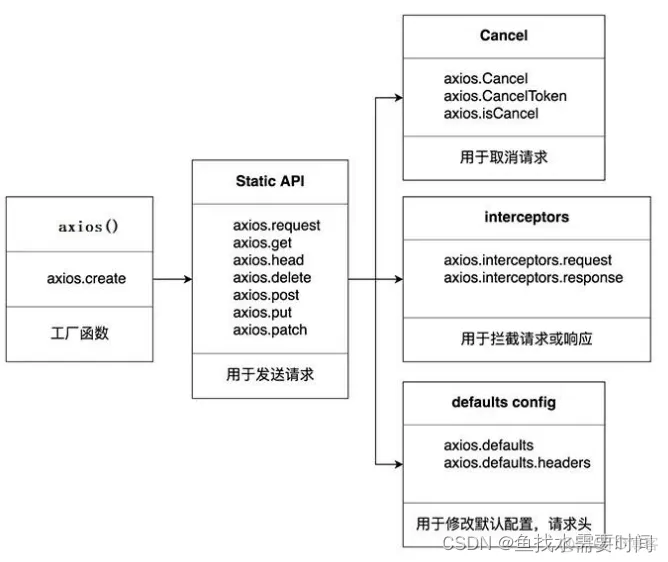
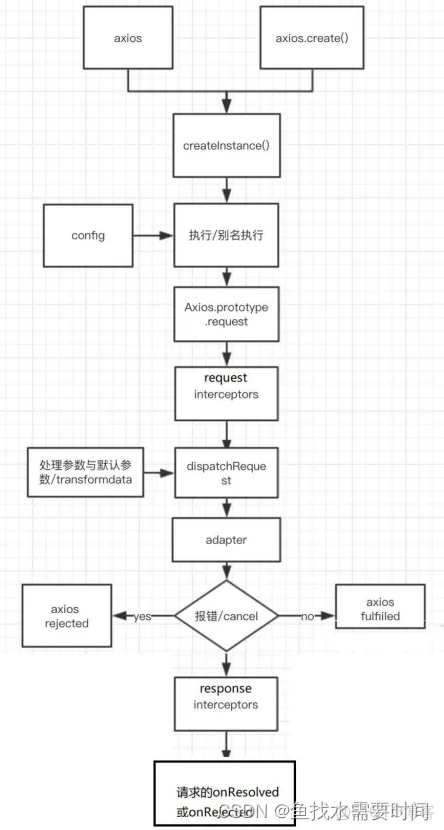

基于 Promise 的 HTTP 客户端，适用于浏览器和 node.js。

- 文档地址：https://axios-http.com/zh/docs/intro
- GitHub：https://github.com/axios/axios

特性：

- 基于 Promise
- 支持浏览器和 node.js环境
- 可添加请求、响应拦截器和转换请求和响应数据
- 请求可以取消、中断
- 自动转换 JSON 数据
- 客户端支持防范 XSRF
- 基于 Promise 封装

### 常用语法

1. `axios(config)`：通用，发任意类型请求
2. `axios(url[, config])`：指定 url 发 `GET` 请求
3. `axios.request(config)`：等同于 `axios(config)`
4. `axios.get(url[, config])`：发 `GET` 请求
5. `axios.post(url[, data[, config]])`：发 `POST` 请求
6. `axios.put(url[, data[, config]])`：发 `PUT` 请求
7. `axios.patch(url[, data,[, config]])`：发 `PATCH` 请求
8. `axios.delete(url[, config])`：
9. `axios.head(url[, config])`：
10. `axios.options(url[, config])`：

