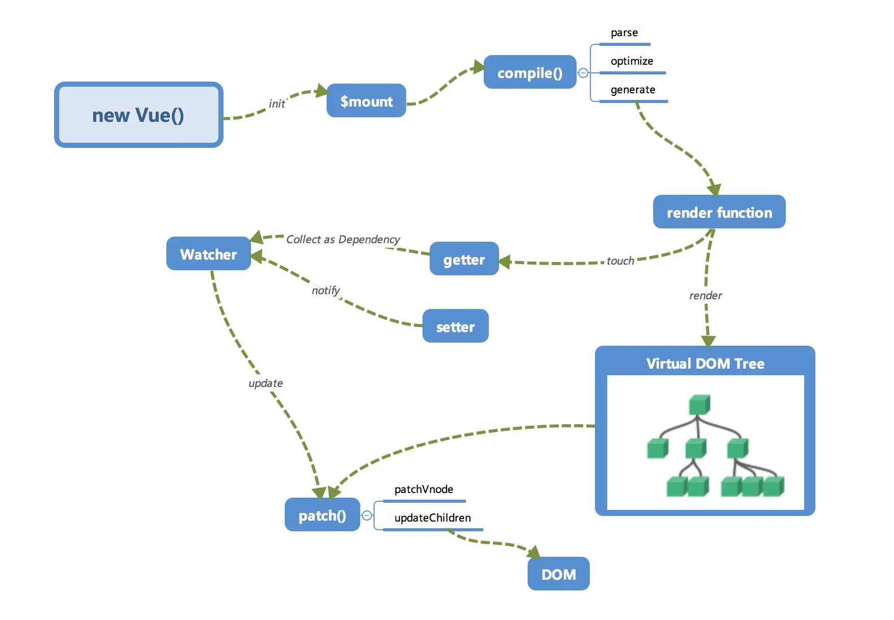
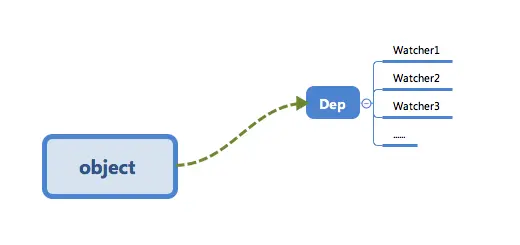
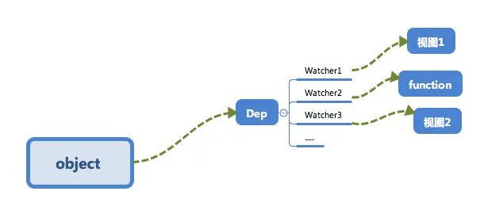

# Vue2 原理

## 概览



### 初始化 & 挂载

在 `new Vue()` 之后。 Vue 会调用 `_init` 函数进行初始化，也就是这里的 `init` 过程，它会初始化生命周期、事件、 props、 methods、 data、 computed 与 watch 等。其中最重要的是通过 `Object.defineProperty` 设置 `setter` 与 `getter` 函数，用来实现「**响应式**」以及「**依赖收集**」。

初始化之后调用 `$mount` 会挂载组件，如果是运行时编译，即不存在 render function 但是存在 `template` 的情况，需要进行「**编译**」步骤。

<br />

### 编译

`compile` 编译可以分成 `parse`、`optimize` 与 `generate` 三个阶段，最终需要得到 render function。

- `parse`： 会用正则等方式解析 template 模板中的指令、class、style等数据，形成AST。

- `optimize`：的主要作用是标记 static 静态节点，这是 Vue 在编译过程中的一处优化，后面当 `update` 更新界面时，会有一个 `patch` 的过程， diff 算法会直接跳过静态节点，从而减少了比较的过程，优化了 `patch` 的性能。

- `generate`：是将 AST 转化成 render function 字符串的过程，得到结果是 render 的字符串以及 staticRenderFns 字符串。

在经历过 `parse`、`optimize` 与 `generate` 这三个阶段以后，组件中就会存在渲染 VNode 所需的 render function 了。

<br />

### 响应式

这里的 `getter` 跟 `setter` 已经在之前介绍过了，在 `init` 的时候通过 `Object.defineProperty` 进行了绑定，它使得当被设置的对象被读取的时候会执行 `getter` 函数，而在当被赋值的时候会执行 `setter` 函数。

当 render function 被渲染的时候，因为会读取所需对象的值，所以会触发 `getter` 函数进行「**依赖收集**」，「**依赖收集**」的目的是将观察者 Watcher 对象存放到当前闭包中的订阅者 Dep 的 subs 中。形成如下所示的这样一个关系。

在修改对象的值的时候，会触发对应的 `setter`， `setter` 通知之前「**依赖收集**」得到的 Dep 中的每一个 Watcher，告诉它们自己的值改变了，需要重新渲染视图。这时候这些 Watcher 就会开始调用 `update` 来更新视图，当然这中间还有一个 `patch` 的过程以及使用队列来异步更新的策略。



<br />

### Virtual DOM

render function 会被转化成 VNode 节点。Virtual DOM 其实就是一棵以 JavaScript 对象（ VNode 节点）作为基础的树，用对象属性来描述节点，实际上它只是一层对真实 DOM 的抽象。最终可以通过一系列操作使这棵树映射到真实环境上。由于 Virtual DOM 是以 JavaScript 对象为基础而不依赖真实平台环境，所以使它具有了跨平台的能力，比如说浏览器平台、Weex、Node 等。

<br />

### 更新视图

在修改一个对象值的时候，会通过 `setter -> Watcher -> update` 的流程来修改对应的视图，那么最终是如何更新视图的呢？

当数据变化后，执行 render function 就可以得到一个新的 VNode 节点，我们如果想要得到新的视图，最简单粗暴的方法就是直接解析这个新的 VNode 节点，然后用 `innerHTML` 直接全部渲染到真实 DOM 中。但是其实我们只对其中的一小块内容进行了修改，这样做似乎有些「**浪费**」。

那么我们为什么不能只修改那些「改变了的地方」呢？这个时候就要介绍我们的「**`patch`**」了。我们会将新的 VNode 与旧的 VNode 一起传入 `patch` 进行比较，经过 diff 算法得出它们的「**差异**」。最后我们只需要将这些「**差异**」的对应 DOM 进行修改即可。

<br />

## 响应式

```js
/*
    obj: 目标对象
    prop: 需要操作的目标对象的属性名
    descriptor: 描述符

    return value 传入对象
*/
Object.defineProperty(obj, prop, descriptor)
```

定义一个 `defineReactive` ，这个方法通过 `Object.defineProperty` 来实现对对象的「**响应式**」化，入参是一个 obj（需要绑定的对象）、key（obj的某一个属性），val（具体的值）。经过 `defineReactive` 处理以后，我们的 obj 的 key 属性在「读」的时候会触发 `reactiveGetter` 方法，而在该属性被「写」的时候则会触发 `reactiveSetter` 方法。

需要在上面再封装一层 `observer` 。这个函数传入一个 value（需要「**响应式**」化的对象），通过遍历所有属性的方式对该对象的每一个属性都通过 `defineReactive` 处理。（注：实际上 observer 会进行递归调用，为了便于理解去掉了递归的过程）。

```js
function defineReactive(obj, key, val) {
  Object.defineProperty(obj, key, {
    enumerable: true, /* 属性可枚举 */
    configurable: true, /* 属性可被修改或删除 */
    get: function reactiveGetter() {
      return val /* 实际上会依赖收集，下一小节会讲 */
    },
    set: function reactiveSetter(newVal) {
      if (newVal === val)
        return
      cb(newVal)
    }
  })
}

function observer(value) {
  if (!value || (typeof value !== 'object')) {
    return
  }

  Object.keys(value).forEach((key) => {
    defineReactive(value, key, value[key])
  })
}

class Vue {
  /* Vue构造类 */
  constructor(options) {
    this._data = options.data
    observer(this._data)
  }
}

const vm = new Vue({
  data: {
    test: 'I am test.'
  }
})
vm._data.test = 'hello,world.' /* 视图更新啦～ */
```

<br />

## 依赖收集追踪



### 订阅者Dep

- 作用：用来存放 `Watcher` 观察者对象。
  - 用 `addSub` 方法可以在目前的 `Dep` 对象中增加一个 `Watcher` 的订阅操作；
  - 用 `notify` 方法通知目前 `Dep` 对象的 `subs` 中的所有 `Watcher` 对象触发更新操作。

```js
class Dep {
  constructor() {
    /* 用来存放Watcher对象的数组 */
    this.subs = []
  }

  /* 在subs中添加一个Watcher对象 */
  addSub(sub) {
    this.subs.push(sub)
  }

  /* 通知所有Watcher对象更新视图 */
  notify() {
    this.subs.forEach((sub) => {
      sub.update()
    })
  }
}
```

<br />

### 观察者Watcher

```js
class Watcher {
  constructor() {
    /* 在new一个Watcher对象时将该对象赋值给Dep.target，在get中会用到 */
    Dep.target = this
  }

  /* 更新视图的方法 */
  update() {
    console.log('视图更新啦～')
  }
}

Dep.target = null
```

<br />

### 依赖收集

在闭包中增加了一个 Dep 类的对象，用来收集 `Watcher` 对象。在对象被「读」的时候，会触发 `reactiveGetter` 函数把当前的 `Watcher` 对象（存放在 Dep.target 中）收集到 `Dep` 类中去。之后如果当该对象被「**写**」的时候，则会触发 `reactiveSetter` 方法，通知 `Dep` 类调用 `notify` 来触发所有 `Watcher` 对象的 `update` 方法更新对应视图。

```js
function defineReactive(obj, key, val) {
  /* 一个Dep类对象 */
  const dep = new Dep()

  Object.defineProperty(obj, key, {
    enumerable: true,
    configurable: true,
    get: function reactiveGetter() {
      /* 将Dep.target（即当前的Watcher对象存入dep的subs中） */
      dep.addSub(Dep.target)
    },
    set: function reactiveSetter(newVal) {
      if (newVal === val)
        return
      /* 在set的时候触发dep的notify来通知所有的Watcher对象更新视图 */
      dep.notify()
    }
  })
}

class Vue {
  constructor(options) {
    this._data = options.data
    observer(this._data)
    /* 新建一个Watcher观察者对象，这时候Dep.target会指向这个Watcher对象 */
    new Watcher()
    /* 在这里模拟render的过程，为了触发test属性的get函数 */
    console.log('render~', this._data.test)
  }
}
```

首先在 `observer` 的过程中会注册 `get` 方法，该方法用来进行「**依赖收集**」。在它的闭包中会有一个 `Dep` 对象，这个对象用来存放 Watcher 对象的实例。其实「**依赖收集**」的过程就是把 `Watcher` 实例存放到对应的 `Dep` 对象中去。`get` 方法可以让当前的 `Watcher` 对象（Dep.target）存放到它的 subs 中（`addSub`）方法，在数据变化时，`set` 会调用 `Dep` 对象的 `notify` 方法通知它内部所有的 `Watcher` 对象进行视图更新。

这是 `Object.defineProperty` 的 `set/get` 方法处理的事情，那么「**依赖收集**」的前提条件还有两个：

1. 触发 `get` 方法；
2. 新建一个 Watcher 对象。

这个我们在 Vue 的构造类中处理。新建一个 `Watcher` 对象只需要 new 出来，这时候 `Dep.target` 已经指向了这个 new 出来的 `Watcher` 对象来。而触发 `get` 方法也很简单，实际上只要把 render function 进行渲染，那么其中的依赖的对象都会被「读取」，这里我们通过打印来模拟这个过程，读取 test 来触发 `get` 进行「依赖收集」。

<br />

## VNode

```js
class VNode {
  constructor(tag, data, children, text, elm) {
    /* 当前节点的标签名 */
    this.tag = tag
    /* 当前节点的一些数据信息，比如props、attrs等数据 */
    this.data = data
    /* 当前节点的子节点，是一个数组 */
    this.children = children
    /* 当前节点的文本 */
    this.text = text
    /* 当前虚拟节点对应的真实dom节点 */
    this.elm = elm
  }
}

function render() {
  return new VNode(
    'span',
    {
      /* 指令集合数组 */
      directives: [
        {
          /* v-show指令 */
          rawName: 'v-show',
          expression: 'isShow',
          name: 'show',
          value: true
        }
      ],
      /* 静态class */
      staticClass: 'demo'
    },
    [new VNode(undefined, undefined, undefined, 'This is a span.')]
  )
}
```

<br />

## template 编译

```js
const ncname = '[a-zA-Z_][\\w\\-\\.]*'
const singleAttrIdentifier = /([^\s"'<>/=]+)/
const singleAttrAssign = /(?:=)/
const singleAttrValues = [
  /"([^"]*)"+/.source,
  /'([^']*)'+/.source,
  /([^\s"'=<>`]+)/.source
]
const attribute = new RegExp(
  `^\\s*${singleAttrIdentifier.source
  }(?:\\s*(${singleAttrAssign.source})`
  + `\\s*(?:${singleAttrValues.join('|')}))?`
)

const qnameCapture = `((?:${ncname}\\:)?${ncname})`
const startTagOpen = new RegExp(`^<${qnameCapture}`)
const startTagClose = /^\s*(\/?)>/

const endTag = new RegExp(`^<\\/${qnameCapture}[^>]*>`)

const defaultTagRE = /\{\{((?:.|\n)+?)\}\}/g

const forAliasRE = /(.*?)\s+(?:in|of)\s+(.*)/
```

<br />

## 异步更新策略

- Vue.js在默认情况下，每次触发某个数据的 `setter` 方法后，对应的 `Watcher` 对象其实会被 `push` 进一个队列 `queue` 中，在下一个 tick 的时候将这个队列 `queue` 全部拿出来 `run`（ `Watcher` 对象的一个方法，用来触发 `patch` 操作） 一遍。

- Vue.js 实现了一个 `nextTick` 函数，传入一个 `cb` ，这个 `cb` 会被存储到一个队列中，在下一个 tick 时触发队列中的所有 `cb` 事件。因为目前浏览器平台并没有实现 `nextTick` 方法，所以 Vue.js 源码中分别用 `Promise`、`setTimeout`、`setImmediate` 等方式在 microtask（或是task）中创建一个事件，目的是在当前调用栈执行完毕以后（不一定立即）才会去执行这个事件。
- 需要执行一个过滤的操作，同一个的 `Watcher` 在同一个 tick 的时候应该只被执行一次，也就是说队列 `queue` 中不应该出现重复的 `Watcher` 对象。

```js
const callbacks = []
let pending = false

function nextTick(cb) {
  callbacks.push(cb)

  if (!pending) {
    pending = true
    setTimeout(flushCallbacks, 0)
  }
}

function flushCallbacks() {
  pending = false
  const copies = callbacks.slice(0)
  callbacks.length = 0
  for (let i = 0; i < copies.length; i++) {
    copies[i]()
  }
}
```

<br />

## 插槽

> 作用：让父组件可以向子组件指定位置插入 `html` 结构，也是一种组件间通信方式，适用于 **父组件 ==> 子组件**
>
> 分类：默认插槽、具名插槽、作用域插槽

<br />

### 默认插槽

```vue
// 父组件
<Category>
  <div>html结构1</div>
</Category>

// 子组件
<template>
  <div>
    <slot>插槽默认内容。。。</slot>
  </div>
</template>
```

<br />

### 具名插槽

```vue
// 父组件
<Category>
  <template slot="center">
    <div>html结构1</div>
  </template>

  <template v-slot:footer>
    <div>html结构2</div>
  </template>
</Category>

// 子组件
<template>
  <div>
    <slot name="center">
      插槽默认内容。。。
    </slot>
    <slot name="footer">
      插槽默认内容。。。
    </slot>
  </div>
</template>
```

<br />

### 作用域插槽

数据在组件的自身，但根据数据生成的结构需要组件的使用者来决定

```vue
// 父组件
<Category>
  <template scope="scopeData">
    <div>{{ scopeData.XXX }}</div>
  </template>
</Category>

// 子组件
<script>
export default {
  name: 'Category',
  data() {
    return {
      games: [xxx]
    }
  }
}
</script>

<template>
  <div>
    <slot :games="games">
      插槽默认内容。。。
    </slot>
  </div>
</template>
```

<br />

## vuex

在 `Vue` 中实现集中式状态（数据）管理的一个 `Vue` 插件，对 `Vue` 应用中多个组件的共享状态进行集中式的管理（读/写），也是一种组件间的通信方式，且适用于任意组件间的通信。

<br />

### 搭建环境

1. 创建文件 `src/store/index.js`

   ```js
   // 引入vue核心库
   import Vue from 'vue'
   // 引入vuex
   import Vuex from 'vuex'
   // 应用vuex插件
   Vue.use(Vuex)

   // 准备actions对象 -- 响应组件中用户的动作
   const actions = {}
   // 准备mutations对象 -- 修改state中的数据
   const mutations = {}
   // 准备state对象 -- 保存具体的数据
   const state = {}

   // 创建并暴露store
   export default new Vuex.store({
     actions,
     mutations,
     state
   })
   ```

2. 在 `main.js` 中创建 `vm` 时传入 `store` 配置项

   ```js
   // 引入store
   import store from './store'

   // 创建vm
   new Vue({
     el: '#app',
     store,
     render: h => h(app)
   })
   ```

<br />

### 基本使用

1. 初始化数据、配置 `actions` 、配置 `mutations` ，操作文件 `store.js`

   ```js
   import Vue from 'vue'
   import Vuex from 'vuex'
   Vue.use(Vuex)

   const actions = {
     // 响应组件中 加 的动作
     jia(context, value) {
       context.commit('JIA', value)
     }
   }

   const mutations = {
     // 执行加
     JIA(state, value) {
       state.sum += value
     }
   }

   // 初始化数据
   const state = {
     sum: 0
   }

   // 创建并暴露store
   export default new Vuex.store({
     actions,
     mutations,
     state
   })
   ```

2. 组件中读取 `vuex` 中的数据：`$store.stata.sum`

3. 组件中修改 `vuex` 中的数据：`$store.dispatch('action中的方法名', 数据)` 或 `$store.commit('mutations中的方法名', 数据)`

::: info

若没有网络请求或其他业务逻辑，既非异步处理，组件中也可以越过 `actions`，即不写`dispatch`， 直接编写 `commit`

:::

<br />

### getters

> 当 `state` 中的数据需要经过加工后再使用时，可以使用 `getters` 加工

1. 在 `store.js` 中追加 `getters` 配置

   ```js
   const getters = {
     bigSum(state) {
       return state.sum * 10
     }
   }

   // 创建并暴露stsore
   export default new Vuex.store({
     actions,
     mutations,
     state,
     getters
   })
   ```

2. 组件中读取数据：`$store.getters.bigSum`

<br />

### map方法

#### mapState

> 映射 `state` 中的数据为计算属性

```js
computed: {
  // 借助mapState生成计算属性，sum、school、subject（对象写法）
  ...mapState({ sum: 'sum', school: 'school', subject: 'subject' }),

  // 借助mapState生成计算属性，sum、school、subject（数组写法）
    ...mapState(['sum', 'school', 'subject'])
}
```

<br />

#### mapGetters

> 映射 `getters` 中的数据为计算属性

```js
computed: {
  // 借助mapGetters生成计算属性，bigSum（对象写法）
  ...mapGetter({ bigSum: 'bigSum' }),

  // 借助mapGetters生成计算属性，bigSum（数组写法）
    ...mapGetter(['bigSum'])
}
```

<br />

#### mapActions

> 帮助生成与 `actions` 对应的方法，即：包含 `$store.dispatch(xxx)` 的函数

```js
methods: {
  // 靠mapActions生成，incrementOdd、incrementWait（对象形式）
  ...mapActions({ incrementOdd: 'jiaOdd', incrementWait: 'jiaWait' }),

  // 靠mapActions生成，incrementOdd、incrementWait（数组形式）
    ...mapActions(['incrementOdd', 'incrementWait'])
}
```

<br />

#### mapMutations

> 帮助生成与 `mutations` 对应的方法，即：包含 `$store.commit(xxx)` 的函数

```js
methods: {
  // 靠mapMutations生成，increment、decrement（对象形式）
  ...mapMutations({ increment: 'JIA', decrement: 'JIAN' }),

  // 靠mapMutations生成，increment、decrement（数组形式）
    ...mapMutations(['increment', 'decrement'])
}
```

::: warning

`mapActions` 与 `mapMutations` 使用时，若需要传递参数，要在模板中绑定事件时传递好参数，否则参数是事件对象

:::

<br />

### 模块化+命名空间

作用：可以让代码更好维护，让多种数据分类更加明确。

1. 修改 `store.js`

   ```js
   const countAbout = {
       namespaced: true, // 开启命名空间
       state: {x: 1},
       actions: {...},
       mutations: {...},
       getters:{
           bigSum(state) {
               return state.sum * 10
           }
       }
   }

   const personAbout = {
       namespaced: true,
       state: {...},
       actions: {...},
       mutations: {...},
       getters: {...}
   }

   const store = new Vuex.store({
       modules: {
           countAbout,
           personAbout
       }
   })
   ```

2. 开启命名空间后，组件中读取 `state` 数据：

   ```js
   // 方式一：自己直接读取
   this.$store.state.personAbout.list

   // 方式二：借助mapState读取
   ...mapState('countAbout', ['sum', 'school', 'subject'])
   ```

3. 开启命名空间后，组件中读取 `getters` 数据：

   ```js
   // 方式一：自己直接读取
   this.$store.getters('personAbout/firstPersonName')

   // 方式二：借助mapGetters读取
   ...mapGetters('countAbout', ['bigSum'])
   ```

4. 开启命名空间后，组件中调用 `dispatch`

   ```js
   // 方式一：自己直接dispatch
   this.$store.dispatch('personAbout/addPersonWang', person)

   // 方式二：借助mapActions
   ...mapActions('countAbout', {incrementOdd: 'jiaOdd', incrementWait: 'jiaWait'})
   ```

5. 开启命名空间后，组件中调用 `commit`

   ```js
   // 方式一：自己直接commit
   this.$store.commit('personAbout/ADD_PERSON', person)

   // 方式二：借助mapMutations
   ...mapMutations('countAbout', {increment: 'JIA', decrement: 'JIAN'})
   ```

<br />

## vue-router

1. 理解：一个路由（route）就是一组映射关系（key-value），多个路由需要路由器（router）进行管理。
2. 前端路由：key是路径，value是组件。

### 基本使用

1. 安装 `vue-router`

2. 应用插件：`Vue.use(Router)`

3. 编写 `router/index.js`：

   ```js
   import Router from 'vue-router'
   import About from './views/About'
   import Home from './views/Home'

   // 创建router实例对象，去管理一组一组的路由规则
   const router = new Router({
     routes: [
       {
         path: '/about',
         component: About
       },
       {
         path: '/home',
         component: Home
       }
     ]
   })
   ```

4. 实现切换（active-class可配置高亮样式）

   ```vue
   <router-link active-class="active" to='/about'>
   About
   </router-link>
   ```

5. 指定展示位置（即组件渲染出口）：

   ```vue
   <router-view></router-view>
   ```

::: info

1. 路由组件通常存放在 `pages` 文件夹，一般组件通常存放在 `components` 文件夹
2. 通过切换，隐藏了的路由组件，默认是被销毁掉的，需要的时候再去挂载
3. 每个组件都有自己的 `$route` 属性，里面存储着自己的路由信息
4. 整个应用只有一个 `router`，可以通过组件的 `$router` 属性获取到

:::

### 嵌套路由

1. 配置路由规则，使用 `children` 配置项：

   ```js
   routes: [
     {
       path: '/home',
       component: Home,
       children: [
         {
           path: 'news',
           component: News
         }
       ]
     }
   ]
   ```

2. 跳转（要写完整路径）：

   ```vue
   <router-link to="/home/news">
   News
   </router-link>
   ```

<br />

### 路由参数

<br />

#### query

```vue
<router-link to="/home/message/detail?id=666&title=你好">
跳转
</router-link>

<router-link
  :to="{
     path: '/home/message/detail' ,
     query: {
       id: 666,
       title: '你好'
     }
}"
>
跳转
</router-link>
```

<br />

#### params

1. 配置路由，声明接收params参数

   ```js
   {
       path: '/demo',
       component: Demo,
       children: [
           {
               path: 'test',
               component: Test,
               children: [
                   {
                       name: 'hello', // 给路由命名
                       path: 'welcome/:id/:title', // 使用占位符声明接收params参数
              			component: Hello
                   }
               ]
           }
       ]
   }
   ```

2. 传递参数

   ```vue
   <router-link :to="/demo/test/welcome/666/你好">
   跳转
   </router-link>

   <router-link
       :to="{
          name: 'hello',
          params: {
            id: 666,
            title: '你好'
          }
       }"
   >
   跳转
   </router-link>
   ```

   ::: danger

   使用 params 参数时，若使用to的对象写法，则不能使用 `path` 配置项，必须使用 `name` 配置

   :::

3. 接收参数：

   ```js
   this.$route.params.id
   this.$route.params.title
   ```

<br />

### 命名路由

作用：可以简化路由的跳转。

1. 给路由命名：

   ```js
   {
       path: '/demo',
       component: Demo,
       children: [
           {
               path: 'test',
               component: Test,
               children: [
                   {
                       name: 'hello', // 给路由命名
                       path: 'welcome',
              					component: Hello
                   }
               ]
           }
       ]
   }
   ```

2. 简化跳转：

   ```vue
   <!-- 简化前，要写完整的路径 -->
   <router-link to="/demo/test/welcome">
   跳转
   </router-link>

   <!-- 简化后，直接通过名字跳转 -->
   <router-link :to="{name: 'hello'}">
   跳转
   </router-link>

   <!-- 简化写法配合传递参数 -->
   <router-link
       :to="{
          name: 'hello',
          query: {
            id: 666,
            title: '你好'
          }
       }"
   >
   跳转
   </router-link>
   ```

<br />

### 路由props

作用：让路由组件更方便的收到参数

```js
{
    name: 'xiangqing',
    path: 'detail/:id',
    component: Detail,
    // 第一种写法：props值为对象，该对象中所有的key-value的组合最终都会通过props传给Detail组件
    // props: { a: 1 }

    // 第二种写法：props值为布尔值，布尔值为true，则把路由收到的所有params参数通过props传给Detail组件
    // props: true

    // 第三种写法：props值为函数，该函数返回的对象中每一组key-value都会通过props传给Detail组件
    props(route) {
        return {
            id: route.query.id,
            title: route.query.title
        }
    }
}
```

<br />

### 编程式路由导航

作用：不借助 `<router-link>` 实现路由跳转，让路由跳转更加灵活

```js
this.$router.push({
  name: 'xiangqing',
  params: {
    id: xxx,
    title: xxx
  }
})

this.$router.replace({
  name: 'xiangqing',
  params: {
    id: xxx,
    title: xxx
  }
})
```

<br />

### 缓存路由组件

作用：让不展示的路由组件保持挂载，不被销毁。

```vue
// 缓存一个路由组件
<keep-alive include="News">
	<router-view></router-view>
</keep-alive>

// 缓存多个路由组件
<keep-alive :include="['News', 'Message']">
	<router-view></router-view>
</keep-alive>
```

对应的生命周期函数，用于捕获路由组件的激活状态：

- `activated` 路由组件被激活时触发

- `deactivated` 路由组件失活时触发

<br />

### 路由守卫

> 作用：对路由进行权限控制
>
> 分类：全局守卫、路由独享守卫、组件内守卫

<br />

#### 全局守卫

```js
// 全局前置守卫，初始化时执行，每次路由切换前执行
router.beforeEach((to, from, next) => {
  console.log('beforeEach:', to, from)
  if (to.meta.isAuth) {
    if (localStorage.getItem('token')) {
      next()
    }
    else {
      alert('暂无权限查看')
    }
  }
  else {
    next() // 放行
  }
})

// 全局后置守卫，初始化时执行，每次路由切换后执行
router.afterEach((to, from) => {
  console.log('afterEach:', to, from)
  if (to.meta.title) {
    document.title = to.meta.title // 修改网页的title
  }
  else {
    document.title = '默认'
  }
})
```

<br />

#### 路由独享守卫

```js
router.beforeEnter(to, from, next) {
  console.log('beforeEnter:', to, from)
  if (to.meta.isAuth) {
    if (localStorage.getItem('school') === 'atguigu') {
	  	next()
    } else {
	  	alert('暂无权限查看')
    }
  } else {
		next() // 放行
  }
)
```

<br />

#### 组件内守卫

```js
// 进入守卫，通过路由规则，进入该组件时被调用
beforeRouteEnter(to, from, next) {

}

// 离开守卫，通过路由规则，离开该组件时被调用
beforeRouteLeave (to, from, next) {

}
```

<br />

### 工作模式

1. `hash` 模式：
   1. 地址中永远带着 # 号，不美观
   2. 若以后将地址通过第三方手机 `app` 分享，若 `app` 校验严格，则地址会被标记为不合法
   3. 兼容性较好
   4. 不会包含在 `HTTP` 请求中，即：`hash` 值不会带给服务器
2. `history` 模式：
   1. 地址干净、美观
   2. 兼容性和 `hash` 模式相比略差
   3. 应用部署上线时需要后端人员支持，解决刷新页面服务端404的问题

<br />

## vue-cli 配置代理

方式一：

在`vue.config.js`中添加如下配置：

```js
devServer: {
  proxy: 'http://localhost:5000'
}
```

::: info

优点：配置简单，请求资源时直接发给前端（8080）即可

缺点：不能配置多个代理，不能灵活控制请求是否走代理

工作方式：若按照上述配置代理，当请求了前端不存在的资源时，那么该请求会转发给服务器（优先匹配前端资源）

:::

方式二：

编写`vue.config.js`配置具体代理规则：

```js
devServer: {
    proxy: {
        '/api1': { // 匹配所有以'/api1'开头的请求路径
            target: 'http://localhost:5000', // 代理目标的基础路径
            changeOrigin: true,
            pathRewrite: {'^/api1': ''}
        },
        '/api2': { // 匹配所有以'/api2'开头的请求路径
            target: 'http://localhost:5001', // 代理目标的基础路径
            changeOrigin: true,
            pathRewrite: {'^/api2': ''}
        }
    }
}

/*
	cnangeOrigin设置为true时，服务器收到的请求头中的host为：localhost：5000
	cnangeOrigin设置为false时，服务器收到的请求头中的host为：localhost：8000
	cnangeOrigin默认值为true
*/
```

::: info

优点：可以配置多个代理，且可以灵活的控制请求是否走代理。

缺点：配置略微繁琐，请求资源时必须加前缀。

:::
