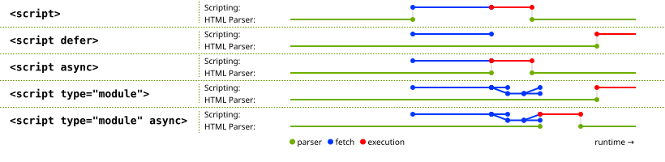

### 有哪些数据类型

ECMAScript 一共定义了 Undefined、Null、Boolean、Number、BigInt、Symbol、String、Object 这 8 种类型。

<br />

### 数据类型判断方法有哪些

1. 基本类型：typeof
2. 引用类型：instanceof，用于检查对象是否属于特定类型的实例；constructor.name，对象的 `constructor` 属性指向创建该对象的构造函数
3. **Object.prototype.toString**：调用 `Object.prototype.toString.call(variable)`，可以返回一个以 "[object 类型]" 的形式表示对象类型的字符串。

<br />

### 堆和栈的区别

JavaScript中的堆（Heap）和栈（Stack）是内存中两个不同的存储区域，用于存储不同类型的数据。

1. **堆（Heap）**：
   - 堆是用来存储引用类型（Reference Type）数据的区域。
   - 引用类型的值是对象，存储在堆中的数据是通过引用访问的。
   - 在堆中分配的数据通过引用复制，多个变量可以指向同一个对象。
   - 堆中的数据由垃圾回收机制管理，不再被引用时会被自动回收。
   - 堆的大小由操作系统分配和管理，一般比较大。
2. **栈（Stack）**：
   - 栈是用来存储值类型（Value Type）数据的区域。
   - 值类型的值直接存储在栈中，占据固定的内存空间。
   - 栈中的数据通过复制整个值进行传递。
   - 栈的大小由编译器和操作系统决定，一般比较小。
   - 栈的操作速度比堆快，分配和释放内存更高效。

<br />

### 引用类型和值类型的区别

1. **引用类型**：
   - 引用类型的值是对象，存储在堆中。
   - 使用引用来访问和操作引用类型的值。
   - 通过引用复制，多个变量可以指向同一个对象。
   - 传递引用类型的值时，传递的是引用的副本。
2. **值类型**：
   - 值类型的值是简单的数据类型，直接存储在栈中。
   - 使用变量名来直接访问和操作值类型的值。
   - 值类型的值被直接复制，每个变量都有自己的独立副本。
   - 传递值类型的值时，传递的是值的副本。

<br />

### 什么是变量提升

是指在代码执行前，JavaScript引擎会将变量的声明部分提升到作用域的顶部，但是变量的赋值操作仍然保留在原来的位置。这意味着可以在变量声明之前访问变量。变量提升只影响声明，而不影响变量的赋值。

1. **变量声明的提升**：
   - 使用`var`关键字声明的变量会被提升到当前作用域的顶部。这意味着可以在变量声明之前引用变量，而不会导致引用错误。
2. **函数声明的提升**
   - 使用`function`关键字声明的函数会被整体提升到当前作用域的顶部，包括函数名和函数体。

<br />

### 什么是包装类型

包装对象就是当基本类型以对象的方式去使用时，js会转换成对应的包装类型，相当于new了一个对象，内容和基本类型内容一致，操作完成后包装对象会销毁。

`number, string, boolean` 都有对应的包装对象。

<br />

### 类型转换

ECMAScript 规范定义的一个内部函数 `ToString()`。没错，规范已经盘点好了各种类型转换的需求，其他的还有 ToBoolean、ToNumber、ToObject，甚至还有一些场景化的转换，比如 ToLength、ToPropertyKey、ToIndex，还有一个相当重要的 `ToPrimitive`。

ECMAScript 一共定义了 Undefined、Null、Boolean、Number、BigInt、Symbol、String、Object 这 8 种类型，按理说 `==` 需要兼顾到这 8 种的排列组合。但是实际上可以大大简化，我们看：

1. **Object 在比较的时候，总会转换成 Primitive，因此可以去掉 Object；**
2. **Boolean 在比较的时候，总会转换成 Number，因此可以去掉 Boolean；**
3. **Undefined 和 Null 只有互相比较的时候返回 true，和其他任意类型都返回 false，因此也可以去掉 Null、Undefined；**
4. **Symbol 和任意类型比较都返回 false，因此还可以去掉 Symbol。**

最后我们就剩 String、Number、BigInt 这三种类型了，而后两者还可以归结为 Numeric。String 在和 Numeric 比较的时候，总会尝试把自身转换为对方的类型，而 Numeric 内部的 Number 和 BigInt 之间的比较又会看数值。

这就是 `==` 简化后的东西了，**`就是 String 和 Numeric 而已`**。


<br />

### 什么是严格模式

是一种在代码中启用严格语法和错误检查的模式。通过在代码或函数的开头添加`"use strict";`（或在脚本文件的开头）即可启用严格模式。

严格模式带来了以下的限制和变化：

1. **禁止使用未声明的变量**：
   - 在严格模式下，必须先声明变量后才能使用，否则会抛出`ReferenceError`错误。
2. **删除变量或函数声明**：
   - 严格模式下，使用`delete`操作符删除变量、函数或函数参数会导致`SyntaxError`错误。
3. **禁止变量重复声明**：
   - 在严格模式下，同一个作用域内重复声明同一个变量会导致`SyntaxError`错误。
4. **禁止使用八进制字面量**：
   - 在严格模式下，使用八进制字面量（如`0123`）会导致`SyntaxError`错误。
5. **限制`this`的值**：
   - 在严格模式下，全局作用域中的`this`的值是`undefined`，而不是默认指向全局对象（如`window`）。
   - 在函数内部，`this`的值取决于函数的调用方式。
6. **禁止使用`arguments.callee`和`arguments.caller`**：
   - 在严格模式下，无法通过`arguments.callee`来引用当前函数，也无法通过`arguments.caller`来引用调用当前函数的函数。
7. **函数中的`eval`和`arguments`作为变量**：
   - 在严格模式下，函数内部的`eval`和`arguments`不能作为变量被赋值或重新声明。

<br />

### 如何理解原型和原型链

- js中每个对象都有一个原型对象，可以通过`__proto__` 属性来访问对象的原型对象
- 构造函数的prototype属性指向一个对象，这个对象是该构造函数实例化出来的对象的原型对象
- 原型对象的constructor属性指向其构造函数
- 实例对象的constructor属性是从原型对象上面访问到的


<br />

### 对执行上下文的理解

执行上下文（Execution Context）是JavaScript代码执行时的环境，包含了变量、函数、作用域链和this指向等信息。每当JavaScript代码执行时，都会创建一个新的执行上下文。

执行上下文可以分为三种类型：

1. 全局执行上下文（Global Execution Context）：在代码执行之前就创建了全局执行上下文。它是最顶层的执行上下文，包含了全局变量、函数声明和全局对象（如`window`对象）等。在浏览器环境中，全局执行上下文是在打开新页面或刷新页面时创建的。
2. 函数执行上下文（Function Execution Context）：每当函数被调用时，都会创建一个对应的函数执行上下文。每个函数都有自己的作用域，它包含了函数内部定义的变量、函数声明和函数的参数等。
3. eval执行上下文（Eval Execution Context）：当使用`eval()`函数执行动态代码时，会创建一个eval执行上下文。eval执行上下文在严格模式下会创建一个新的词法环境，否则会共享调用它的执行上下文。

每个执行上下文都有自己的词法环境（Lexical Environment），它存储了变量和函数的定义。词法环境实际上是由环境记录（Environment Record）和对外部词法环境的引用（Outer Environment Reference）组成。环境记录是一个存储变量和函数的地方，而外部词法环境引用指向了当前执行上下文所在的外部上下文（即创建当前上下文的上层上下文）。通过外部词法环境引用，JavaScript可以建立作用域链（Scope Chain）。

作用域链是由一系列词法环境组成的链式结构，用于查找变量和函数的定义。当访问一个变量时，JavaScript引擎首先在当前执行上下文的环境记录中查找，如果找不到，就会沿着作用域链向上一层层查找，直到找到变量或到达全局执行上下文。这个过程称为作用域查找。

此外，执行上下文还包含了this指向，它指向了当前执行上下文所在的对象。在全局执行上下文中，this指向全局对象（如`window`对象）。在函数执行上下文中，this的值由函数的调用方式决定。

<br />

### 执行上下文的生命周期和特点

1. 创建阶段：
   - 创建变量对象（Variable Object）：变量对象包含了在上下文中定义的变量、函数声明和函数参数，并赋值为undefined。
   - 建立作用域链（Scope Chain）：作用域链通过引用外部词法环境来创建，用于变量查找。
   - 确定this指向：this的值由函数的调用方式决定，在创建阶段确定其指向。
2. 执行阶段：
   - 分配变量的内存空间和初始化：变量对象中的变量被赋予初始值（undefined）。
   - 执行代码：按照代码的顺序执行，遇到函数调用时创建新的函数执行上下文并压入执行栈（函数调用栈）。
3. 销毁阶段：
   - 函数执行完毕或当前执行上下文被强制销毁时，执行上下文进入销毁阶段。
   - 内存回收：释放执行上下文所占用的内存空间。

执行上下文的特点包括：

1. 嵌套关系：JavaScript中的执行上下文可以形成嵌套关系，函数的执行上下文可以嵌套在其他函数执行上下文中，形成执行上下文栈（Execution Context Stack），也称为调用栈（Call Stack）。
2. 同一时间只有一个执行上下文处于活动状态：在同一个线程中，一次只能执行一个执行上下文，当前活动的执行上下文位于调用栈的顶部。
3. 执行顺序：按照代码的顺序执行，但在执行过程中可能会遇到异步操作，会将异步操作放入任务队列（Task Queue）中，等待执行栈为空时执行。
4. 作用域和作用域链：每个执行上下文都有自己的作用域，通过作用域链来进行变量查找。作用域链是由当前执行上下文的变量对象和外部环境的引用组成，可以访问外部上下文中的变量和函数。
5. 闭包：当内部函数引用了外部函数的变量时，会形成闭包，内部函数可以通过作用域链访问外部函数的变量，即使外部函数的执行上下文已经被销毁。

<br />

### 如何理解作用域和作用域链

作用域（Scope）是指在程序中定义变量的区域，它决定了变量的可访问性和生命周期。作用域规定了在何处和如何查找变量，以及在何处可以访问这些变量。

作用域链（Scope Chain）是一种机制，用于在当前作用域无法找到变量时，沿着作用域链向上一层层查找变量的过程。作用域链是由多个执行上下文中的词法环境组成的链式结构。

1. 作用域：
   - 作用域定义了变量在代码中的可见性和生命周期。它决定了在何处可以访问变量以及变量在何处可见。
   - JavaScript中有全局作用域、函数作用域和块级作用域（ES6之后引入）。
   - 全局作用域是整个程序范围内可见的作用域，全局变量在全局作用域中定义。
   - 函数作用域是在函数内部定义的作用域，函数参数和在函数内部声明的变量在函数作用域中可见。
   - 块级作用域是由花括号（{}）包围的代码块中定义的作用域，例如if语句、循环语句和函数内部的代码块。
2. 作用域链：
   - 每个执行上下文都有一个对外部环境的引用，形成了作用域链。作用域链用于在当前作用域无法找到变量时向上查找变量。
   - 作用域链是由执行上下文中的词法环境组成的链式结构。
   - 当代码中需要访问一个变量时，JavaScript引擎首先在当前执行上下文的词法环境中查找，如果找不到，就沿着作用域链向上一层层查找，直到找到变量或到达全局作用域。
3. 作用域和作用域链的关系：
   - 作用域决定了变量的可见性和生命周期，它规定了在何处可以访问变量。
   - 作用域链是用于在作用域中查找变量的机制，它是由执行上下文中的词法环境组成的链式结构。
   - 作用域链的建立是在函数定义时确定的，它在函数的执行过程中保持不变。

<br />

### 垃圾回收机制

JavaScript的垃圾回收（Garbage Collection）机制是一种自动管理内存的机制。它负责在程序运行过程中，自动识别和回收不再被使用的内存，以避免内存泄漏和资源浪费。

下面是对JavaScript垃圾回收机制的解释：

1. 标记-清除算法（Mark and Sweep）：这是JavaScript中最常用的垃圾回收算法。它的原理是通过标记不再使用的对象，然后清除被标记的对象的内存空间。
   - 标记阶段：垃圾回收器从根对象（通常是全局对象）开始，标记所有被根对象引用的对象。然后，它遍历所有被标记的对象，继续标记这些对象引用的对象。这个过程递归进行，直到无法继续找到被引用的对象。
   - 清除阶段：垃圾回收器遍历堆内存，清除未被标记的对象，并回收它们所占用的内存空间。
2. 引用计数算法（Reference Counting）：这是一种简单的垃圾回收算法，它通过记录对象的引用数量来判断对象是否仍然被引用。当引用计数为零时，说明对象不再被引用，可以被回收。
   - 引用计数：当对象被引用时，引用计数加一；当对象的引用被释放时，引用计数减一。
   - 缺点：引用计数算法难以处理循环引用的情况，即两个或多个对象互相引用，并且没有被其他对象引用。在这种情况下，引用计数算法无法将它们判断为垃圾对象。
3. 垃圾回收器的触发条件：垃圾回收器并不是实时执行的，它会根据一些特定的触发条件来启动垃圾回收过程。常见的触发条件包括：
   - 分代回收：将内存分为不同的代，根据对象的存活时间来选择不同的回收策略。
   - 空闲时间回收：当CPU处于空闲状态时，触发垃圾回收操作，以减少对程序性能的影响。

V8 将内存分为两个主要代（Generations）：

- **新生代（Young Generation）**：存放生命周期较短的对象。
- **老生代（Old Generation）**：存放生命周期较长的对象。

这种分代设计基于“弱代假说”（Weak Generational Hypothesis），即大多数对象的生命周期很短，只有少数对象会存活较长时间。

<br />

### 判断一个对象是不是数组

1. Array.isArray：返回true/false

2. instanceOf

3. constructor.name === 'Array'

4. **Object.prototype.toString.call() 方法**

<br />

### ES6有哪些新特性

1. **块级作用域（Block Scope）**：引入了 `let` 和 `const` 关键字，允许在块级作用域中声明变量和常量，解决了 `var` 声明的变量提升和作用域问题。
2. **箭头函数（Arrow Functions）**：引入了箭头函数表达式 `=>`，提供了更简洁的函数定义语法，以及改变函数内部 `this` 的行为。
3. **模板字面量（Template Literals）**：使用反引号 ``` 定义字符串，可以在字符串中插入表达式，支持多行字符串和字符串插值。
4. **解构赋值（Destructuring Assignment）**：允许从数组或对象中提取值，并赋给对应的变量，简化了变量赋值的操作。
5. **扩展运算符（Spread Operator）**：使用 `...` 语法，可以将数组、对象等可迭代对象展开成多个值，或将多个值组合成数组或对象。
6. **类（Classes）**：引入了基于原型的面向对象编程的语法糖，可以使用 `class` 关键字定义类、构造函数和继承等。
7. **模块化（Modules）**：引入了模块化的语法，使用 `import` 和 `export` 关键字来导入和导出模块，实现了模块的封装和复用。
8. **迭代器和生成器（Iterators and Generators）**：提供了更灵活的迭代方式，通过迭代器和生成器可以自定义对象的迭代行为。
9. **Promise**：引入了 `Promise` 对象，用于处理异步操作，提供了更好的异步编程方式，解决了回调地狱问题。
10. **新的数据结构和方法**：引入了 `Map`、`Set`、`WeakMap`、`WeakSet` 等新的数据结构，以及新的数组方法（如 `map`、`filter`、`reduce` 等）和字符串方法（如模式匹配和替换）。
11. **模块化的迭代（for...of 循环）**：提供了更简洁的迭代数组、字符串、集合等可迭代对象的方式。
12. **默认参数和剩余参数**：允许在函数参数中设置默认值，以及使用剩余参数语法来接收多余的参数。
13. **Symbol**：引入了一种新的基本数据类型 `Symbol`，用于创建唯一的标识符。
14. **代理（Proxy）**：允许创建一个代理对象，可以拦截对目标对象的操作，提供了更细粒度的对象操作控制。
15. `async/await` 提供了一种更直观、更线性的方式来处理异步操作，避免了回调地狱和复杂的 Promise 链式调用。它使得异步代码的编写和阅读更加简单和清晰。

<br />

### 箭头函数和普通函数的区别

1. **绑定 `this`**：

   - 箭头函数没有自己的 `this` 上下文，它会继承父级作用域中的 `this` 值。这意味着在箭头函数中使用的 `this` 是词法上绑定的，而不是动态绑定的。
   - 普通函数的 `this` 值由调用方式决定，可能会在不同的上下文中指向不同的对象。

2. **不能用作构造函数**：

   - 箭头函数不能使用 `new` 关键字来创建对象，因此不能用作构造函数来实例化对象。

3. **没有 `arguments` 对象**：

   - 箭头函数没有自己的 `arguments` 对象，它会继承父级作用域中的 `arguments` 对象。在箭头函数中使用 `arguments` 实际上是引用父级作用域中的 `arguments` 对象。

4. **没有 `super` 对象**：

   - 箭头函数没有自己的 `super` 对象，它会继承父级作用域中的 `super` 对象。在箭头函数中使用 `super` 实际上是引用父级作用域中的 `super` 对象。

<br />

### 如何更改this指向

**指向**：

​ **全局上下文（Global Context）**：当函数在全局作用域中调用时，`this` 指向全局对象，在浏览器环境中通常是 `window` 对象。严格模式下为undefined。

​ **方法调用（Method Invocation）**：当函数作为对象的方法调用时，`this` 指向调用该方法的对象。

​ **构造函数调用（Constructor Invocation）**：当函数作为构造函数使用 `new` 关键字创建对象时，`this` 指向新创建的对象。

​ **箭头函数**：箭头函数没有自己的 `this` 上下文，它会继承父级作用域中的 `this` 值

**更改this指向：**

1. call：允许显式地指定函数执行时的 `this` 值，并立即调用该函数。接受多个参数列表
2. apply：允许显式地指定函数执行时的 `this` 值，并立即调用该函数。接受一个包含参数的数组
3. bind：创建一个新的函数，并将指定的对象绑定为新函数中的 `this` 值
4. 箭头函数：箭头函数没有自己的 `this` 绑定，它继承外部作用域的 `this` 值。

<br />

### map、set、object、weakmap、weakset区别

| 特点/功能    | Map              | Set              | Object           | WeakMap                | WeakSet                |
| ------------ | ---------------- | ---------------- | ---------------- | ---------------------- | ---------------------- |
| 存储键值对   | 是               | 否               | 否               | 是                     | 否                     |
| 键的类型     | 任意类型         | 任意类型         | 仅限字符串和符号 | 仅限对象作为键         | 仅限对象作为值         |
| 键的唯一性   | 唯一键           | 唯一值           | 不适用           | 键必须是对象且唯一     | 值必须是对象且唯一     |
| 键的顺序     | 保留插入顺序     | 无序             | 无序             | 不适用                 | 不适用                 |
| 弱引用支持   | 否               | 否               | 否               | 是                     | 是                     |
| 成员数的查找 | O(1)             | O(1)             | O(1)             | O(1)                   | O(1)                   |
| 内存回收影响 | 无               | 无               | 无               | 键被引用时不会阻止回收 | 值被引用时不会阻止回收 |
| 应用场景     | 适用于存储键值对 | 适用于存储唯一值 | 存储普通对象     | 适用于附加数据         | 适用于附加数据         |

总结：

- Map：存储键值对，键可以是任意类型，保留插入顺序，支持对键值对的操作和遍历。
- Set：存储唯一值，适用于存储唯一值的集合，不允许重复值的存在，支持对值的操作和遍历。
- Object：普通的JavaScript对象，用于存储属性和值的键值对，键仅限于字符串和符号。
- WeakMap：类似于Map，但键是弱引用，键必须是对象，键被垃圾回收后，对应的值也会被自动移除。
- WeakSet：类似于Set，但值是弱引用，值必须是对象，当值被垃圾回收后，对应的值也会被自动移除。

需要根据具体的需求来选择合适的数据结构。Map和Object适用于存储键值对，Set适用于存储唯一值的集合，WeakMap和WeakSet适用于需要使用弱引用的场景，且对垃圾回收友好。

下面是Map、Set、WeakMap和WeakSet这四个数据结构常用的API方法的对比：

| 方法             | Map                 | Set                 | WeakMap               | WeakSet               |
| ---------------- | ------------------- | ------------------- | --------------------- | --------------------- |
| 构造函数         | new Map(iterable)   | new Set(iterable)   | new WeakMap(iterable) | new WeakSet(iterable) |
| 大小             | size                | size                | 不可直接获取          | 不可直接获取          |
| 添加元素         | set(key, value)     | add(value)          | set(key, value)       | add(value)            |
| 获取元素         | get(key)            | -                   | get(key)              | -                     |
| 删除元素         | delete(key)         | delete(value)       | delete(key)           | delete(value)         |
| 判断是否包含元素 | has(key)            | has(value)          | has(key)              | has(value)            |
| 清空所有元素     | clear()             | clear()             | 不可直接清空          | 不可直接清空          |
| 迭代所有键值对   | forEach(callbackFn) | forEach(callbackFn) | 不支持迭代            | 不支持迭代            |
| 迭代所有键       | keys()              | -                   | 不支持迭代            | 不支持迭代            |
| 迭代所有值       | values()            | values()            | 不支持迭代            | 不支持迭代            |
| 迭代所有条目     | entries()           | entries()           | 不支持迭代            | 不支持迭代            |
| 迭代器           | @@iterator          | @@iterator          | 不支持迭代            | 不支持迭代            |

需要注意的是，WeakMap和WeakSet相对于Map和Set，在迭代和清空元素方面有一些限制。WeakMap和WeakSet的设计目的是为了提供一种在键或值被垃圾回收时自动删除对应条目的数据结构。因此，它们不支持直接获取大小、迭代所有条目的功能，也不能直接清空所有元素。

根据具体的需求，选择适合的数据结构和相应的API方法进行操作。

<br />

### 深拷贝和浅拷贝有何区别

深拷贝（Deep Copy）和浅拷贝（Shallow Copy）是两种不同的对象复制方式，它们的区别在于复制的程度。

深拷贝是指创建一个新的对象，将原始对象的所有属性和嵌套对象递归地复制到新对象中。这意味着原始对象和新对象是完全独立的，对其中一个对象的修改不会影响到另一个对象。

浅拷贝是指创建一个新的对象，并将原始对象的属性值复制到新对象中。如果属性是基本类型（如数字、字符串等），则直接复制值；如果属性是引用类型（如数组、对象等），则复制的是引用，新对象和原始对象仍然共享相同的引用，修改其中一个对象的属性会影响到另一个对象。

下面是深拷贝和浅拷贝的实现方法：

1. 浅拷贝的实现方法：

   - 直接赋值
   - 手动遍历和复制对象的属性到新对象中，可以使用`Object.assign()`或展开运算符（`...`）进行简便操作。
   - 对于数组，可以使用`Array.from()`或展开运算符（`...`）进行浅拷贝。

2. 深拷贝的实现方法：
   - 递归复制对象及其嵌套对象，可以使用递归函数遍历对象的属性，并在复制时进行判断和递归复制。
   - JSON序列化和反序列化，使用`JSON.stringify()`将对象转换为JSON字符串，再用`JSON.parse()`将JSON字符串转换为新对象，这种方法可以实现简单的深拷贝，但会忽略函数、undefined和循环引用等特殊情况。

需要注意的是，对于循环引用的对象（即对象之间相互引用，形成环），无论是深拷贝还是浅拷贝都无法处理。在进行拷贝时，需要特别注意处理循环引用的情况，避免进入无限循环的复制过程。

<br />

### 什么是柯里化

柯里化（Currying）是一种函数转换技术，它将接受多个参数的函数转换为一系列只接受一个参数的函数。

柯里化的过程是通过部分应用（Partial Application）来实现的。部分应用是指固定函数的一个或多个参数，返回一个新函数，新函数接受剩余的参数。通过多次部分应用，可以将一个多参数函数转化为一系列单参数函数的组合。

柯里化的优势在于提供了更高的灵活性和可复用性，它可以根据需要创建更专注、更特定的函数。

以下是柯里化的实际应用场景：

1. 参数复用：通过柯里化，可以将函数的一部分参数固定，生成一个新的函数，这样可以在后续调用中复用这些参数，减少重复代码。

2. 函数组合：柯里化使得函数可以很方便地进行组合，通过将一个函数的输出作为另一个函数的输入，可以构建复杂的函数管道。

3. 延迟执行：柯里化可以将函数的执行延迟到传递足够的参数时才触发，这对于需要动态生成函数的场景非常有用。

4. 部分应用：柯里化可以方便地进行部分应用，生成特定参数的新函数。这对于创建特定行为的函数非常有用。

5. 函数适配：柯里化可以将一个多参数函数适配成接受部分参数的函数，这在函数式编程中常用于处理需要特定参数形式的函数。

总结来说，柯里化是一种将多参数函数转换为一系列单参数函数的技术。它提供了更高的灵活性和可复用性，可以应用于参数复用、函数组合、延迟执行、部分应用和函数适配等多种场景。

<br />

### js中有哪些尺寸和位置

**DOM相关：**

`offsetParent`：该属性是获取当前元素的离自己最近的并且定位了的祖先元素，该祖先元素就是当前元素的 `offsetParent`。如果找不到，则为 `body` 元素。

- 只读属性：
  - **clientWidth,、clientHeight**：元素可视部分宽度和高度，即content + padding
  - **offsetWidth、offsetHeight**：元素所有部分宽度和高度，即content + padding + 滚动条 + border
  - **clientLeft、clientTop**：元素的border的宽度和高度
  - **offsetLeft、offsetTop**：相对于其 `offsetParent` 左边距离和上边距离，即当前元素的border到包含它的 offsetParent 的border的距离。
  - **scrollWidth、scrollHeight**：当元素内部的内容超出其宽度和高度的时候，元素内部内容的实际宽度和高度；如果没有超出，就返回可视宽度和高度，和 clientWidth、clientTop相同。scrollWidth和scollHeight等于文档内容的宽度，而clientWidth和clientHeight等于视口的大小。
- 可读可写属性：
  - **scrollLeft、scrollTop**：当元素其中的内容超出其宽高后，元素被卷起的宽度和高度。
  - dom.style.xxx属性：只能获取行内样式

**event相关：**

- **clientX、clientY**：鼠标位置相对于浏览器（可视区）的坐标，即浏览器左上角坐标的（0,0）
- **screenX、screenY**：鼠标位置相对于屏幕的坐标，以设备屏幕的左上角为原点。
- **offsetX、offsetY**：当事件发生时，鼠标位置相对于该事件源的位置，即点击该DOM元素，以该DOM元素左上角为原点来计算鼠标点击位置的坐标。
- **pageX、pageY**：事件发生时鼠标相对于页面的位置，当页面没有滚动条时，和clientX、clientY等价。存在滚动条时，通常大于clientX、clientY，因为页面有滚动

<br />

### 字符串长度问题

Unicode编码：0x0000～0x10FFFF，一个字符2byte或4byte即（1个码元或2个码元），码元是编码的基本单位。

基本多文种平面（BMP）：0x0000~0xFFFF，包含了大部分常用字符，包括ASCII字符、拉丁字母、汉字、符号等等。

辅助平面（SP）：0x100000~0x10FFFF，用于表示一些不常用的字符，如一些少数民族文字、历史文字、表情符号等。

Emoji长度问题：Emoji 的一个叫做“修饰序列（Modifier Sequence）”的功能造成的：在一个基础的 Emoji 编码后面，添加修饰符的编码，中间用 0x200D 来分隔，这样产生的一系列码元，只会显示成一个 Emoji 外观。


<br />

### 如何让 a == 1 && a == 2 && a == 3 成立

方案1：隐式类型转换，a为引用类型，默认调用toString方法转换为基本类型，重写valueOf或toString方法

```js
const a = {
  _a: 0,
  toString() {
    return ++a._a
  }
}
```

方案2：a为引用类型，定义get属性描述符

```js
Object.defineProperties(window, {
  _a: {
    value: 0,
    writable: true
  },
  a: {
    get() {
      return ++_a
    }
  }
})
```

<br />

### 如何找出数组中的重复元素

1. 双层循环遍历

2. 使用哈希表/对象

   ```js
   function findDuplicates(arr) {
     const hashtable = {}
     const duplicates = []
     for (let i = 0; i < arr.length; i++) {
       if (!hashtable[arr[i]]) {
         hashtable[arr[i]] = true
       }
       else {
         duplicates.push(arr[i])
       }
     }
     return duplicates
   }
   ```

<br />

### 数组去重

1. set：`[...new Set(arr)]`

2. 循环遍历

3. filter和indexOf：`arr.filter((item, index) => arr.indexOf(item) === index)`

4. Map结构的键唯一性：`Array.from(new Map(arr.map(item => [item, item])).values())`

5. reduce和includes：

   ```js
   arr.reduce((result, current) => {
     if (!result.includes(current)) {
       result.push(current)
     }
     return result
   }, [])
   ```

<br />

### 数组扁平化

1. Array.flat

2. 递归
3. join

<br />

### requestAnimationFrame有何作用

用于在下一次浏览器重绘之前执行动画或视觉更新，确保动画流畅。`requestAnimationFrame` 接受一个回调函数作为参数，这个回调函数会在浏览器下一次重绘之前被调用。回调函数会传入一个 DOMHighResTimeStamp 参数，表示动画开始时的时间戳，单位为毫秒。

使用 `requestAnimationFrame` 的作用：

1. **性能优化**：`requestAnimationFrame` 是浏览器在下一次重绘时执行的，它会根据浏览器的帧率进行调整，确保动画的执行在合适的时机，从而避免不必要的计算和绘制，提高动画性能和性能表现。
2. **避免闪烁**：使用 `requestAnimationFrame` 可以避免在动画中出现闪烁或撕裂的现象，因为它在每次重绘时才执行动画逻辑，确保动画平滑流畅。
3. **自动暂停**：当用户切换到其他标签页或最小化浏览器时，浏览器会自动暂停 `requestAnimationFrame` 的执行，节省了系统资源和电池寿命。
4. **与 CSS 动画配合**：`requestAnimationFrame` 可以与 CSS 动画（如 `transition` 或 `animation`）结合使用，使得 JavaScript 控制的动画与 CSS 控制的动画同步，从而实现更复杂的动画效果。

## requestIdleCallback

用于在浏览器空闲时执行低优先级的任务，避免影响关键任务（如动画、用户交互等）的性能。

- **`deadline.timeRemaining()`**：返回当前帧剩余的空闲时间（以毫秒为单位）。
- **`deadline.didTimeout`**：如果任务因超时被强制执行，则为 `true`。

**使用场景**

- 执行非关键任务，例如日志上报、数据预加载、缓存清理等。
- 将耗时任务拆分为多个小任务，避免阻塞主线程。

<br />

## 异步加载async 与 defer 有何区别



在正常情况下，即 `<script>` 没有任何额外属性标记的情况下，有几点共识

1. JS 的脚本分为**加载、解析、执行**几个步骤，简单对应到图中就是 `fetch` (加载) 和 `execution` (解析并执行)
2. **JS 的脚本加载(fetch)且执行(execution)会阻塞 DOM 的渲染**，因此 JS 一般放到最后头

而 `defer` 与 `async` 的区别如下:

- 相同点: **异步加载 (fetch)**
- 不同点:
  - async 加载(fetch)完成后立即执行 (execution)，因此可能会阻塞 DOM 解析；
  - defer 加载(fetch)完成后延迟到 DOM 解析完成后才会执行(execution)，但会在事件 `DomContentLoaded` 之前

<br />

## 如何理解js的单线程

JavaScript语言的执行环境是单线程的,也就是说JS引擎中负责解释和执行JS代码的线程只有一个。这意味着同一时间只能执行一段JS代码,如果有多个代码需要执行,就需要排队一个接一个地执行。

JS的单线程是基于它的执行机制:JS引擎采用事件循环(event loop)来执行代码。所有的代码执行都需要在主线程上排队执行。一段代码执行完毕,主线程才会去获取队列中的下一个代码进行执行。这就是JS的单线程机制。

JS的单线程避免了多线程可能造成的状态共享问题,从而避免了复杂的同步操作。但因为一次只能做一件事,如果其中一个任务耗时很长,就会阻塞其他任务的执行,这就是JS单线程可能带来的问题。

为了解决这个问题,HTML5提出了Web Worker标准,允许JS脚本创建多个线程。同时AJAX请求、DOM事件等异步API的出现也很大程度上避免了JS单线程模型的缺点。总体来说,JS单线程+事件驱动的非阻塞模式在大多数场景下都能很好地工作。

<br />

## 如何理解 JS 的异步

1. JS是一门单线程的语言，这是因为它运行在浏览器的渲染主线程中，而渲染主线程只有一个。而渲染主线程承担着诸多的工作，渲染页面、执行 JS 都在其中运行。

2. 如果使用同步的方式，就极有可能导致主线程产生阻塞，从而导致消息队列中的很多其他任务无法得到执行。这样一来，一方面会导致繁忙的主线程白白的消耗时间，另一方面导致页面无法及时更新，给用户造成卡死现象。

3. 所以浏览器采用异步的方式来避免。具体做法是当某些任务发生时，比如计时器、网络、事件监听，主线程将任务交给其他线程去处理，自身立即结束任务的执行，转而执行后续代码。当其他线程完成时，将事先传递的回调函数包装成任务，加入到消息队列的末尾排队，等待主线程调度执行。

4. 在这种异步模式下，浏览器永不阻塞，从而最大限度的保证了单线程的流畅运行。

<br />

## 什么是事件循环

1. 事件循环又叫做消息循环，是浏览器渲染主线程的工作方式。

2. 在 Chrome 的源码中，它开启一个不会结束的 for 循环，每次循环从消息队列中取出第一个任务执行，而其他线程只需要在合适的时候将任务加入到队列末尾即可。

3. 过去把消息队列简单分为宏队列和微队列，这种说法目前已无法满足复杂的浏览器环境，取而代之的是一种更加灵活多变的处理方式。

4. 根据 W3C 官方的解释，每个任务有不同的类型，同类型的任务必须在同一个队列，不同的任务可以属于不同的队列。不同任务队列有不同的优先级，在一次事件循环中，由浏览器自行决定取哪一个队列的任务。但浏览器必须有一个微队列，微队列的任务一定具有最高的优先级，必须优先调度执行。

事件循环（Event Loop）是JavaScript执行异步任务的一种机制，用于处理任务队列中的事件，并将它们逐个执行。它确保在JavaScript单线程中，异步任务可以按照预期的顺序和时间被执行。

事件循环的执行过程如下：

1. **执行同步任务**：JavaScript引擎首先执行当前执行栈中的所有同步任务，这些任务是按照代码在程序中的顺序执行的。

2. **处理微任务**：在执行同步任务后，JavaScript引擎会检查微任务队列，执行队列中的所有微任务。微任务包括Promise的回调函数、MutationObserver的回调等。微任务执行完毕后，会再次检查微任务队列，直到队列为空为止。

3. **执行宏任务**：在处理完所有微任务后，JavaScript引擎会检查宏任务队列，选择其中的一个任务执行。宏任务包括定时器回调、I/O操作、事件处理等。执行完当前宏任务后，会再次检查微任务队列。

4. **重复**：上述过程会不断重复，即执行同步任务、处理微任务、执行宏任务，直到任务队列和微任务队列都为空。

关于最新的Chrome中的任务队列，Chrome在其V8引擎的更新版本中对任务队列做了调整，引入了多个任务队列。这些队列可以根据任务的不同类型来区分，目的是为了更好地管理和优化异步任务的执行顺序。

最新的Chrome中，主要的任务队列有以下几个：

1. **Macrotasks Queue（宏任务队列）**：存放宏任务，如定时器回调、I/O事件等。在每次事件循环中，只会执行一个宏任务。

2. **Microtasks Queue（微任务队列）**：存放微任务，如Promise的回调、MutationObserver等。微任务会在每个宏任务执行结束后立即执行，确保在下一个宏任务之前执行。

3. **AnimationFrame Queue（动画帧队列）**：这是专门用于处理动画相关的任务队列，通过`requestAnimationFrame`方法添加的回调会进入该队列。它的执行频率通常与屏幕的刷新率相匹配，大约每秒60次。

4. **Idle Queue（空闲队列）**：用于处理空闲时执行的任务，这些任务会在主线程没有更重要任务时执行，以免影响关键的用户交互。

将异步任务分成多个队列可以更好地管理任务的执行顺序和优先级，确保不同类型的任务能够合理地被调度和执行。这样的优化可以提高JavaScript的性能和响应性。但是具体的任务队列数量和名称可能会随着浏览器版本的更新而有所调整，因此最好查阅最新的文档和规范来了解特定版本的浏览器中的任务队列情况。

<br />

## JS 中的计时器能做到精确计时吗

不行，因为：

1. 计算机硬件没有原子钟，无法做到精确计时
2. 操作系统的计时函数本身就有少量偏差，由于 JS 的计时器最终调用的是操作系统的函数，也就携带了这些偏差
3. 按照 W3C 的标准，浏览器实现计时器时，如果嵌套层级超过 5 层，则会带有 4 毫秒的最少时间，这样在计时时间少于 4 毫秒时又带来了偏差
4. 受事件循环的影响，计时器的回调函数只能在主线程空闲时运行，因此又带来了偏差

<br />

## 前端路由的实现原理

1. Hash 模式：利用 URL 中的 **hash 部分（`#` 后面的内容）** 来实现路由的。Hash 的变化不会导致浏览器向服务器发起请求，但会触发 `hashchange` 事件，从而可以根据 hash 的变化动态渲染内容。

   **实现原理：**

   - **URL 结构**：`http://example.com/#/home`
   - **特点**：
     - Hash 的变化不会触发页面刷新。
     - 通过监听 `hashchange` 事件来响应 URL 的变化。
     - 兼容性较好，支持老版本浏览器。

2. History模式：利用 HTML5 的 **History API**（`pushState` 和 `replaceState`）来实现路由的。它可以直接修改 URL 的路径部分（`/home`），而不会触发页面刷新。

   **实现原理：**

   - **URL 结构**：`http://example.com/home`
   - **特点**：
     - URL 更加美观，没有 `#`。
     - 需要服务器支持，避免刷新页面时返回 404。
     - 通过监听 `popstate` 事件来响应 URL 的变化。

   在 History 模式下，`popstate` 事件只能监听到通过浏览器导航（如点击后退/前进按钮）或调用 `history.back()`、`history.forward()`、`history.go()` 触发的 URL 变化，而无法监听到通过 `history.pushState()` 或 `history.replaceState()` 触发的 URL 变化。

   为了解决这个问题，通常需要 **手动触发路由变化的事件**，并在路由变化时执行相应的逻辑。

<br />

## 二进制数据如何处理

- File/Blob API
- TypedArray/ArrayBuffer API
- FileReader API

`FileReader` 是 JavaScript 中的一个内置对象，用于异步读取文件内容。它通常用于读取用户通过 `<input type="file">` 选择的文件，并将文件内容转换为文本、二进制数据、Data URL 等形式。

**主要用途：**

- 读取文件内容并转换为文本、二进制数据、Data URL 等格式。
- 处理用户上传的文件（如图片、文本文件等）。
- 在浏览器中预览文件内容。

`FileReader` 提供了以下几种读取文件的方法：

- **`readAsText(file, encoding)`**：将文件读取为文本。
- **`readAsDataURL(file)`**：将文件读取为 Data URL（Base64 编码的字符串）。
- **`readAsArrayBuffer(file)`**：将文件读取为二进制数组（`ArrayBuffer`）。

`FileReader` 是异步读取文件的，因此需要通过事件监听来获取读取结果。常用的事件包括：

- **`onload`**：文件读取成功时触发。
- **`onerror`**：文件读取失败时触发。
- **`onprogress`**：文件读取过程中触发，用于监控读取进度。

<br />

## 闭包的作用

闭包是指一个函数能够记住并访问它的词法作用域，即使这个函数在其词法作用域之外执行。换句话说，闭包是函数和其周围状态（词法环境）的组合。

1. 数据封装和私有变量
2. 回调函数和高阶函数
3. 模块化开发

<br />

## 函数设计

- **参数个数**：最好不要超过3个，2个参数更好。参数应尽可能使用简单类型，因为简单类型更安全；如果要修改引用类型的传入参数，建议复制一份数据，在复制的数据上进行修改

- **可选参数**：要放到函数的最后面，当可选参数多于两个时，建议使用对象化思路

- **返回值**：大部分查询或操作函数的返回值就是操作结果，在各种条件下，函数返回值的类型应该保持一致

- **参数防御**：

  - **对必须参数进行校验和转换的规则如下**：
    - 如果参数传递给系统函数，可以把校验下沉给系统函数处理
    - 对于`object、array、function` 类型函数，要做强制校验，如果校验失败，则执行【异常流程】
    - 对于 `number、string、boolean` 类型参数，要做自动转换：
      - 数字使用 `Number()` 函数进行转换
      - 整数使用 `Math.round()` 函数进行转换
      - 字符串使用 `String()` 函数进行转换
      - 布尔值使用 `!!` 进行转换
    - 对于 `number` 类型参数，如果转换完是 `NaN`，就执行【异常流程】
    - 对于复合类型的内部数据，也要进行上面的步骤
  - **对可选参数进行校验和转换的规则如下**：
    - 如果参数传递给系统函数，可以把校验下沉给系统函数处理
    - 对于`object、array、function` 类型函数，要做强制校验，如果类型不对，则要设置默认值
    - 对于 `number、string、boolean` 类型参数，要做自动转换：
      - 数字使用 `Number()` 函数进行转换
      - 整数使用 `Math.round()` 函数进行转换
      - 字符串使用 `String()` 函数进行转换
      - 布尔值使用 `!!` 进行转换
    - 对于 `number` 类型参数，如果转换完是 `NaN`，就执行【异常流程】
    - 对于复合类型的内部数据，也要进行上面的步骤

- **副作用处理**：避免修改环境信息和函数参数

- **浏览器兼容性**：参考维度为浏览器数据，一般来说，占比超过1%的浏览器都是值得兼容的，参考 caniuse

- **支持TS**：TypeScript 会默认查找库目录下的 `index.d.ts` 文件，并使用里面的类型作为库的类型

- **暴露方法冻结**：将对外的接口冻结，避免被更改

  | 方法                         | 修改原型指向 | 添加属性 | 修改属性配置 | 删除属性 | 修改属性 |
  | ---------------------------- | ------------ | -------- | ------------ | -------- | -------- |
  | `Object.preventExtensions()` | 否           | 否       | 是           | 是       | 是       |
  | `Object.seal()`              | 否           | 否       | 否           | 否       | 是       |
  | `Object.freeze()`            | 否           | 否       | 否           | 否       | 否       |

::: warning 注意：

这些方法都是浅冻结(shallow freeze)，只能防止对象本身的属性被修改，但对于对象属性值如果是引用类型，仍然可以被修改。如果需要深层次的冻结，可以使用递归或其他方式实现。

:::

<br />

## 防范原型污染

1. 冻结 `Object.prototype` ，使原型不能扩充属性。 `Object.freeze()` 方法可以冻结一个对象，如果一个对象被冻结，则该对象的原型也不能被修改
2. 规避不安全的递归性合并，类似 `Lodash` 库的修复手段，对敏感属性名跳过处理
3. `Object.create(null)` 的返回值不会连接到 `Object.prototype` ，这样一来，无论如何扩充对象，都不会干扰到原型了
4. 采用新的Map数据类型代替Object类型。Map对象用于保存键值对，是键值对的集合，不会存在Object原型污染状况

<br />

## 私有属性

- 第一种：社区约定，添加前缀 `_`，但是外部依然可用修改

- 第二种：把私有属性放到函数作用域中，一般是放到构造函数 `constructor` 中

- 第三种：`ES2022` 带来了原生私有属性，添加 `#` 前缀，外部无法访问原生私有属性

  ```js
  class Guid {
    #count = 1

    constructor() {
      this.guid = () => {
        return this.#count++
      }
    }
  }
  ```

<br />

## 使用对象代替 if 及 switch

适用于循环判断一次赋值的情况，如果判断过后有较多处理逻辑的还需要使用 if 或 switch 等方法。

```js
/* 优化前 */
let name = 'lisi';
let age = 18;

if (name === 'zhangsan') {
    age = 21;
} else if (name === 'lisi') {
    age = 18;
} else if (name === 'wangwu') {
    age = 12;
}

// 或者
switch(name) {
    case 'zhangsan':
        age = 21;
        break
    case 'lisi':
        age = 18;
        break
    case 'wangwu':
        age = 12;
        break
}

/* 优化后 */
let name = 'lisi';
let obj = {
    zhangsan: 21,
    lisi: 18,
    wangwu: 12
};

let age = obj[name] || 18;
```

<br />

## 请求并发控制

<br />
