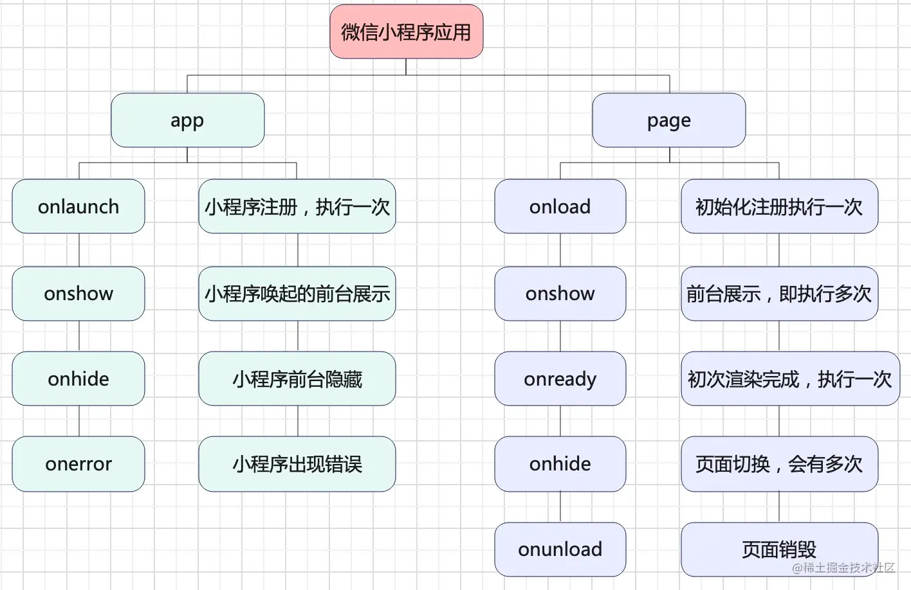
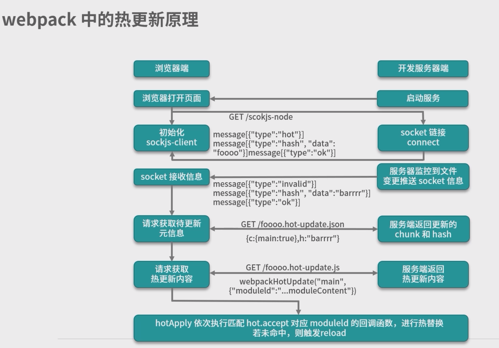
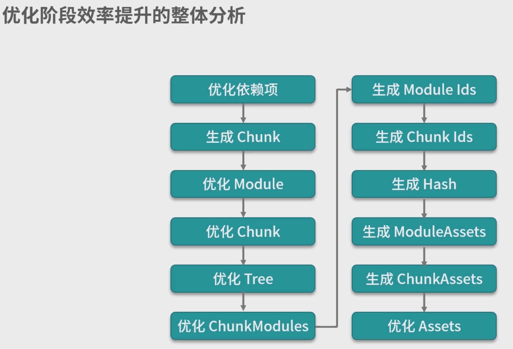

## 1. 前端工程项目流程

1. 需要有 package.json，它是 npm 依赖管理体系下的基础配置文件
2. 选择使用 npm 或 Yarn 作为包管理器，这会在项目里添加上对应的 lock 文件，来确保在不同环境下部署项目时的依赖稳定性。

3. 确定项目技术栈，团队习惯的技术框架是哪种？使用哪一种数据流模块？是否使用 TypeScript？使用哪种 CSS 预处理器？等等。在明确选择后安装相关依赖包并在 src 目录中建立入口源码文件。

4. 选择构建工具，目前来说，构建工具的主流选择还是 webpack （除非项目已先锋性地考虑尝试 nobundle 方案），对应项目里就需要增加相关的 webpack 配置文件，可以考虑针对开发/生产环境使用不同配置文件。

5. 打通构建流程，通过安装与配置各种 Loader 、插件和其他配置项，来确保开发和生产环境能正常构建代码和预览效果。

6. 优化构建流程，针对开发/生产环境的不同特点进行各自优化。例如，开发环境更关注构建效率和调试体验，而生产环境更关注访问性能等。

7. 选择和调试辅助工具，例如代码检查工具和单元测试工具，安装相应依赖并调试配置文件。

8. 最后是收尾工作，检查各主要环节的脚本是否工作正常，编写说明文档 README.md，将不需要纳入版本管理的文件目录记入 .gitignore 等。

<br>

## 移动端

### 1. 移动端适配是如何实现的？

1. 媒体查询 `@media`
2. 视口设置：`width=device-width`: 将视口宽度设置为设备的宽度，避免缩放。`initial-scale=1.0`: 初始缩放比例设置为1，即不进行缩放。
3. Rem 方案实现方法：
   - 使用 JavaScript 动态设置根元素的字体大小，根据设备宽度自动调整。
   - 将页面元素的大小单位设置为 Rem，可以根据根元素的字体大小自动适应不同屏幕。
4. Flexible Box Model 实现方法：
   - 使用 CSS 弹性盒模型布局，通过 `flex` 属性来调整元素的尺寸和布局。
   - 使用 `@media` 媒体查询配合弹性盒模型，实现在不同屏幕宽度下的布局调整。

### 2. h5的rem有用过吗，实现原理是什么，怎么初始化rem的？初始化方法写在哪？

Rem（Root EM）是一种相对长度单位，它相对于根元素（通常是 HTML 标签）的字体大小来计算。Rem 单位的使用可以让页面元素根据根元素的字体大小进行自适应调整，从而实现页面的响应式布局。

Rem 的原理：

1. 默认情况下，浏览器的根元素（即 HTML 标签）的字体大小是 16px。
2. 当使用 Rem 单位时，浏览器会将 Rem 转换为像素值，计算方法是：`Rem 值 * 根元素的字体大小`。

例如，如果根元素的字体大小为 16px，且页面中一个元素的宽度设置为 2 Rem，那么该元素的宽度将是 32px。

配置 Rem 实现适配的步骤如下：

1. 设置根元素的字体大小为视口宽度的一部分（例如屏幕宽度的 1/10），以便在不同设备上自动调整大小。

2. 使用 Rem 单位来设置页面元素的尺寸，这样它们将相对于根元素的字体大小进行自适应。

   ```js
   <!DOCTYPE html>
   <html lang="en">
   <head>
     <meta charset="UTF-8">
     <meta name="viewport" content="width=device-width, initial-scale=1.0">
     <title>Rem 实现适配</title>
     <style>
       /* 设置根元素的字体大小为视口宽度的 1/10，以实现适配 */
       html {
         font-size: 10vw;
       }
       /* 使用 Rem 单位设置元素的大小 */
       .box {
         width: 2rem;
         height: 2rem;
         background-color: #f00;
       }
     </style>
   </head>
   <body>
     <div class="box"></div>
   </body>
   </html>
   ```

## TypeScript

### 1. 有哪些顶级类型？

在 TypeScript 中，有以下几种顶级类型（也称为原始类型或基本类型）：

1. **number:** 用于表示数值类型，包括整数和浮点数。

2. **string:** 用于表示字符串类型，可以包含文本和字符。

3. **boolean:** 用于表示布尔类型，只能是 `true` 或 `false`。

4. **null:** 表示一个空值，表示变量没有值。

5. **undefined:** 表示一个未定义的值，通常用于未初始化的变量。

6. **symbol:** 是 ES6 引入的一种新的数据类型，表示唯一的、不可变的值。

7. **bigint:** 是 ES10 引入的一种新的数据类型，用于表示任意精度的整数。

8. **void:** 用于表示没有任何返回值的函数，或者表示一个没有值的表达式。

9. **never:** 表示永远不会发生的类型，通常用于表示抛出异常、进入死循环等情况。

10. **any:** 表示任意类型，用于绕过类型检查，不推荐在大型项目中使用。

11. **unknown:** 用于表示未知类型，与 `any` 类似，但比 `any` 更安全。

### 2. any和unknown有什么区别？

- `any` 类型允许绕过类型检查，适用于不确定类型或需要动态类型的情况，但可能导致类型不安全和维护困难。
- `unknown` 类型强制进行类型检查和类型断言，可以更安全地处理不确定类型的值，但使用时需要显式地处理类型转换。

`unknown`类型跟`any`类型的不同之处在于，它不能直接使用。主要有以下几个限制：

- `unknown`类型的变量，不能直接赋值给其他类型的变量（除了`any`类型和`unknown`类型）
- 不能直接调用`unknown`类型变量的方法和属性
- `unknown`类型变量能够进行的运算是有限的，只能进行比较运算（运算符`==`、`===`、`!=`、`!==`、`||`、`&&`、`?`）、取反运算（运算符`!`）、`typeof`运算符和`instanceof`运算符这几种，其他运算都会报错
- 只有经过“类型缩小”，`unknown`类型变量才可以使用。所谓“类型缩小”，就是缩小`unknown`变量的类型范围，确保不会出错

总之，`unknown`可以看作是更安全的`any`。一般来说，凡是需要设为`any`类型的地方，通常都应该优先考虑设为`unknown`类型。

在集合论上，`unknown`也可以视为所有其他类型（除了`any`）的全集，所以它和`any`一样，也属于 TypeScript 的顶层类型。

<br />

### 3. ts有哪些工具类型？

1. `Partial<T>:` 将类型 T 中的所有属性设为可选。
2. `Required<T>:` 将类型 T 中的所有属性设为必选。
3. `Readonly<T>:` 将类型 T 中的所有属性设为只读，防止属性值被修改。
4. `Record<K, T>:` 创建一个由类型 K 中的键值对决定的新类型 T。
5. `Pick<T, K>:` 从类型 T 中选择指定属性 K，生成一个新类型。
6. `Omit<T, K>:` 从类型 T 中移除指定属性 K，生成一个新类型。
7. `Exclude<T, U>:` 从类型 T 中排除可以赋值给类型 U 的属性。
8. `Extract<T, U>:` 从类型 T 中提取可以赋值给类型 U 的属性。
9. `NonNullable<T>:` 从类型 T 中排除 null 和 undefined 类型。
10. `ReturnType<T>:` 获取函数类型 T 的返回值类型。
11. `Parameters<T>:` 获取函数类型 T 的参数类型元组。
12. `InstanceType<T>:` 获取构造函数类型 T 的实例类型。
13. `RequiredExcept<T, K>:` 将类型 T 中除了 K 属性之外的其他属性设为必选。
14. `PartialExcept<T, K>:` 将类型 T 中除了 K 属性之外的其他属性设为可选。
15. `Mutable<T>:` 将类型 T 中所有属性设为可修改。
16. `Brand<T, Name>:` 给类型 T 添加一个唯一的标识符 Name，用于区分相似类型。
17. `Merge<A, B>:` 将两个类型 A 和 B 合并成一个新类型。
18. `ThisType<T>:` 用于在对象字面量中指定 this 的类型。

### 3. keyof和infer 是什么？

`keyof` 是一个索引类型查询操作符，用于获取一个类型的所有属性名组成的联合类型。通过 `keyof` 关键字，可以将一个类型的属性名抽取出来，生成一个联合类型。这在许多场景下很有用，比如用于限制函数参数只能是对象的某些属性。

`infer` 是 TypeScript 中的条件类型操作符，用于在条件类型中推断类型变量。它允许我们在条件类型中获取并推断某个类型的具体类型，并将其用作其他类型的组成部分。通常与 `extends` 结合使用，用于条件判断。

### 4. tsconfig.json

```json
{
  "compilerOptions": {
    /* 使用的 ECMAScript 版本 */
    "target": "es6",

    /* 输出文件的模块规范 */
    "module": "commonjs",

    /* 是否允许编译器对代码进行优化 */
    "optimize": true,

    /* 是否生成对源文件的映射文件，用于调试 */
    "sourceMap": true,

    /* 是否在输出文件中保留注释 */
    "removeComments": true,

    /* 是否严格检查代码 */
    "strict": true,

    /* 是否允许隐式的 "any" 类型 */
    "noImplicitAny": true,

    /* 是否启用严格的 null 检查 */
    "strictNullChecks": true,

    /* 是否启用严格的函数类型检查 */
    "strictFunctionTypes": true,

    /* 是否启用严格的对象字面量检查 */
    "strictPropertyInitialization": true,

    /* 是否启用严格的类检查 */
    "strictBindCallApply": true,

    /* 是否允许类型断言的非空断言 */
    "noUncheckedIndexedAccess": true,

    /* 是否允许未使用的局部变量和参数 */
    "noUnusedLocals": true,
    "noUnusedParameters": true,

    /* 是否允许只声明而不使用的 private 属性 */
    "noUnusedPrivate": true,

    /* 是否生成声明文件(.d.ts) */
    "declaration": true,

    /* 是否生成输出目录下的类型定义文件的声明文件(.d.ts) */
    "declarationDir": "./types",

    /* 是否生成输出文件 */
    "noEmit": false,

    /* 是否检查引入的模块是否在 package.json 中存在 */
    "noResolve": true,

    /* 是否在编译时报告所有的编译器错误 */
    "noEmitOnError": true,

    /* 是否启用严格的字符串枚举检查 */
    "strictStringEnums": true,

    /* 是否在检查类型时忽略 JavaScript 语言服务(LSP)的版本检查 */
    "skipLibCheck": true,

    /* 是否启用 ES 模块的引用检查 */
    "esModuleInterop": true,

    /* 是否允许引入默认导出和命名导出的合并 */
    "allowSyntheticDefaultImports": true,

    /* 是否启用异步函数的类型检查 */
    "downlevelIteration": true,

    /* 是否允许 @ts-ignore 注释 */
    "suppressImplicitAnyIndexErrors": true,

    /* 是否开启实验性的装饰器支持 */
    "experimentalDecorators": true,

    /* 是否开启实验性的装饰器元数据支持 */
    "emitDecoratorMetadata": true,

    /* 是否开启实验性的装饰器元数据支持 */
    "importHelpers": true,

    /* 是否开启实验性的 ES7 类装饰器提案支持 */
    "useDefineForClassFields": true
  },

  /* 配置文件选项 */
  "include": [
    "src/**/*.ts"
  ],
  "exclude": [
    "node_modules"
  ]
}
```

### 5. strictNullChecks启用了是什么作用?

`strictNullChecks` 是 TypeScript 的一个编译选项，它用于启用严格的 null 和 undefined 类型检查。当 `strictNullChecks` 启用时，TypeScript 会对 null 和 undefined 的使用进行更加严格的检查，以帮助开发者避免一些常见的空值错误。

### 6. 顶级类型的声明规则有哪些？

**基本类型之间的子类型关系：**

- TypeScript 中的基本类型（例如 number、string、boolean、null、undefined 等）之间是存在子类型关系的，其中 null 和 undefined 是所有类型的子类型，而其他基本类型之间并不存在子类型关系。
- **对象类型之间的子类型关系：**
  - 对象类型之间的子类型关系在 TypeScript 中是根据属性和方法的赋值兼容性来判断的。当对象类型 A 中的属性和方法都可以在对象类型 B 中找到相应的对应属性和方法时，A 是 B 的子类型。
- `unknown` 类型与其他基本类型和对象类型之间没有直接的兼容性关系，需要经过类型检查或类型断言才能将其赋值给其他类型。

### 7. 关键字有哪些，和工具类型的区别？

关键字（Keywords）和工具类型（Utility Types）是TypeScript中两个不同的概念。

1. **关键字（Keywords）**：

关键字是编程语言中的保留字，具有特殊用途和含义，并且不能用作标识符（例如变量名、函数名等）。在TypeScript中，关键字用于定义变量、函数、类、接口、枚举等等，用于构建代码的结构和逻辑。例如：`let`、`const`、`class`、`interface`、`function`等都是TypeScript的关键字。这些关键字在语法规则中有特定的用法和行为，它们是TypeScript语言的基础构建块。

2. **工具类型（Utility Types）**：

工具类型是TypeScript中预定义的一些泛型类型，用于处理和转换其他类型的数据。这些工具类型通过泛型机制和预定义的类型操作，允许我们对类型进行更复杂的转换和操作。工具类型并不是关键字，而是预先定义的类型别名。

在TypeScript中，有一些常见的工具类型，比如：

- `Partial<T>`：将类型T中的所有属性都变为可选的。
- `Required<T>`：将类型T中的所有属性都变为必需的。
- `Pick<T, K>`：从类型T中选取一部分属性，由属性键K指定。
- `Record<K, T>`：创建一个包含一组属性键K和其对应值类型T的对象类型。
- `Readonly<T>`：将类型T中的所有属性都变为只读的。
- `Omit<T, K>`：从类型T中排除指定属性键K的属性。
- `Exclude<T, U>`：从类型T中排除可以赋值给类型U的属性。
- `ReturnType<T>`：获取函数类型T的返回类型。

工具类型是TypeScript提供的一种强大的类型操作工具，它们能够帮助我们更灵活地处理和操作类型，从而增强代码的可读性和类型安全性。但请注意，工具类型并不是JavaScript中的一部分，它们是TypeScript特有的功能。

## 小程序

### 1. 小程序的生命周期？



1. 打开微信小程序的生命周期执行次序：(App)onLaunch --> (App)onShow --> (Page)onLoad --> (Page)onShow --> (Page)onReady。
2. 当进入下一个页面的生命周期执行次序：(当前页面)onHide --> (下一个页面)onLoad --> (下一个页面)onShow --> (下一个页面)onReady。
3. 当返回上一个页面的生命周期执行次序：(当前页面)onUnload --> (上一个页面)onShow。
4. 当离开小程序的生命周期执行次序：(App)onHide。
5. 当再次进入小程序的生命周期执行次序：
   - 微信小程序未销毁 --> (App)onShow --> (Page)onLoad --> (Page)onShow --> (Page)onReady；
   - 小程序被销毁-->（App)onLaunch--> (App)onShow --> (Page)onLoad --> (Page)onShow --> (Page)onReady。

### 2. 微信的openId和unionID和APPID的区别？

**code：**

- `wx.login()`获取。
- 临时登录凭证。
- 有效期五分钟。
- 使用 `code` 换取 `openid`、`unionid`、`session_key` 等信息。

**openid：**

- 用户在当前小程序的唯一标识。

**unionid：**

- 微信开放平台帐号下的唯一标识。

**session_key：**

- 会话密钥（对用户数据进行 [加密签名](https://link.juejin.cn?target=https%3A%2F%2Fdevelopers.weixin.qq.com%2Fminiprogram%2Fdev%2Fframework%2Fopen-ability%2Fsignature.html) 的密钥）。
- 用户越频繁使用小程序，`session_key` 有效期越长。
- `wx.login` 调用时，用户的 `session_key` **可能**会被更新而致使旧 `session_key` 失效（刷新机制存在最短周期，如果同一个用户短时间内多次调用 `wx.login`，并非每次调用都导致 `session_key` 刷新）。

**值得注意：**

- `code`的时效 与 `session_key` 时效 无关。
- `wx.login` 一定会改变 `code`， 不一定会改变`session_key`。

### 小程序如何手写canvas？

可以使用`canvas`组件来绘制图形和实现自定义的绘图功能。`canvas`组件提供了一个画布，你可以通过JavaScript代码来操作画布上的图形元素。

使用`wx.createCanvasContext('myCanvas')`获取了一个`canvas`上下文对象，然后通过该上下文对象设置绘图样式，并使用相应的绘图方法绘制矩形、直线和文字。最后，通过调用`ctx.draw()`来完成绘图。

### 小程序支付的流程是什么，如何开发？

微信小程序支付的流程涉及以下几个主要步骤：

1. **商户申请接入支付功能：**
   在开始之前，商户需要在微信支付商户平台上进行注册和认证，并申请接入支付功能。完成认证后，商户会获得商户号（MCHID）和支付密钥（API密钥）等关键信息。

2. **小程序端用户发起支付请求：**
   在小程序中，用户选择了商品或服务，并点击支付按钮。小程序前端收集支付相关信息，如订单号、支付金额等，并通过调用小程序支付API发起支付请求。

3. **小程序后端向微信支付服务器请求：**
   小程序前端将支付信息传递给后端服务器。后端服务器收到请求后，需要进行安全验证，并按照微信支付接口规范生成签名，并将相关支付参数发送给微信支付服务器。

4. **微信支付服务器处理支付请求：**
   微信支付服务器接收到支付请求，验证签名和支付参数的合法性。如果验证通过，服务器会返回一个预支付交易会话标识（prepay_id）。

5. **小程序前端调起支付：**
   小程序前端收到预支付交易会话标识后，使用微信小程序支付API调起支付功能。用户会看到微信支付弹窗，进行支付授权和密码输入。

6. **微信支付服务器确认支付结果：**
   用户完成支付后，微信支付服务器会向商户的服务器发送支付结果通知。商户服务器需要接收和处理这些支付结果通知，进行支付结果验证和订单处理。

7. **支付成功/失败处理：**
   商户服务器处理支付结果通知后，将支付结果返回给小程序前端。前端根据支付结果，展示支付成功或失败的提示信息，完成支付流程。

### 小程序onload和onshow的区别？

- `onLoad`在页面初始化加载时触发，而`onShow`在每次页面显示时触发。
- `onLoad`只触发一次，用于页面初始化操作；`onShow`在每次页面显示时都会触发，用于每次显示都需要执行的逻辑。

### uniapp不支持动态组件，如何实现？

全部异步引入，通过v-if判断渲染

### 小程序中webview做过吗，如何通信的？

- 在小程序中打开的网页需要支持 HTTPS。
- `web-view`与小程序是在不同的上下文中运行的，因此它们之间的通信需要通过`postMessage`方法进行。
- `postMessage`方法的参数只能是字符串类型。

通过这种方式，小程序与`web-view`之间就可以进行简单的消息通信，你可以根据需要在小程序和网页之间传递数据和执行相应的逻辑。

### 小程序云开发用的什么后端？

nodeJS

### 小程序bindTap和catchTap的区别？

`bindTap`和`catchTap`都是用于处理组件的点击事件，它们的主要区别在于事件冒泡和事件捕获的机制。

`bindTap`可以让点击事件冒泡传递到父节点，而`catchTap`则会阻止事件冒泡，仅在当前组件内部处理。

### 小程序与 h5 及小程序之间的跳转的一些规则

1. 小程序的分享，只能是小程序打开；

2. 公众号的分享只能是公众号打开；

3. 小程序内通过`web-view`，可以打开 h5；

4. 小程序跳转小程序是没什么限制的，只要知道对方的 appid 以及跳转的目标页面就可以了，也可以设置跳转的是体验版/开发版/正式版本。正式版本只能跳转正式版本；

5. h5 打开小程序，h5 需要引入微信的 sdk，设置调用的功能，然后通过[开放标签](https://link.juejin.cn?target=https%3A%2F%2Fdevelopers.weixin.qq.com%2Fdoc%2Foffiaccount%2FOA_Web_Apps%2FWechat_Open_Tag.html%23%E5%BC%80%E6%94%BE%E6%A0%87%E7%AD%BE)跳转；

6. 小程序不能跳转公众号，但是可以使用 `official-account` 组件关注关联的公众号；

7. [打开 App](https://link.juejin.cn?target=https%3A%2F%2Fdevelopers.weixin.qq.com%2Fminiprogram%2Fdev%2Fframework%2Fopen-ability%2FlaunchApp.html)，当小程序从 APP 打开的场景打开时（场景值 1069），小程序会获得**返回 APP 的能力**，此时用户点击按钮可以打开拉起该小程序的 APP。即小程序不能打开任意 APP，只能 跳回 APP。

### 小程序分包是什么？

小程序分包是一种优化机制，用于将小程序的代码分割成不同的包，使得小程序在运行时可以按需加载不同的包，从而提高小程序的启动速度和性能。限制单个包2M，总包不超过20M。

在小程序中，分包主要用于解决以下问题：

1. **首次加载性能优化：** 小程序初次启动时，如果所有页面和组件都在一个主包中，可能导致包大小过大，加载时间较长。通过分包，可以将一些页面或组件放在不同的分包中，实现页面的按需加载，减少首次加载时间。
2. **模块化开发：** 小程序分包机制支持模块化开发，可以将小程序功能模块拆分成独立的包，提高代码的可维护性和复用性。

小程序分包的使用步骤如下：

1. **配置分包信息：** 在小程序的 `app.json` 文件中，使用 `subPackages` 字段配置分包信息。每个分包包含 `root`（分包路径）和 `pages`（分包内的页面路径数组）两个属性。
2. **按需加载：** 小程序会根据分包配置，在运行时按需加载分包的代码。主包中只包含小程序的启动页面和一些必要的代码，而分包中的代码在进入对应页面时才会被加载。
3. 需要注意的是，小程序的分包总数不能超过 16 个，且主包不可直接调用分包中的资源，需通过 wx.navigateTo 等路由方式来触发分包的页面。

## 业务

### 1. 权限管理如何实现？

1. 菜单权限：接口返回用户权限，通过 addRoutes 实现
2. 按钮权限：通过自定义指令实现按钮DOM的控制隐藏

### 2. 埋点如何实现？

**1. 手动埋点：** 在需要监测的页面或事件中手动添加代码，通常使用JavaScript代码，例如在按钮点击、页面加载、表单提交等关键事件中插入埋点代码。手动埋点较为灵活，可以精确控制需要监测的事件，但需要开发人员手动添加埋点代码，容易出现遗漏或维护困难。

**2. 自动埋点：** 利用前端框架或工具的特性，在页面或组件中自动插入埋点代码。例如，使用React、Vue等框架时，可以通过中间件或插件来自动添加埋点代码，减少手动添加的工作量。

**3. 可视化埋点：** 使用可视化埋点工具，通过拖拽、配置等方式实现埋点，无需手动编写代码。这样非技术人员也能够轻松实现埋点，方便运营和产品团队进行数据采集和分析。

**4. 脚本注入：** 在页面中插入脚本代码，例如通过`<script>`标签引入第三方埋点脚本，来实现数据采集和上报。这种方式适用于第三方埋点工具的集成。

**5. Web API监听：** 使用Web API来监听特定事件，例如`click`、`submit`等，当这些事件触发时，进行相应的埋点数据采集。

**6. URL参数：** 使用URL参数来标记特定的行为，当用户进行某些操作时，将相应的标记信息添加到URL中，通过后端服务器来解析和采集数据。

### 3. 前端数据mock怎么实现的？

前端数据 Mock 是在开发和测试阶段模拟后端接口的一种技术，以便在没有实际后端接口的情况下进行前端开发和调试。通过数据 Mock，前端开发人员可以模拟后端接口返回的数据，使得前端应用可以正常运行并处理各种接口返回情况。

在前端数据 Mock 中，可以使用以下几种方法来实现：

**1. 手动 Mock 数据：** 在前端代码中手动编写模拟数据，以实现不同接口返回不同的数据。这种方法简单直接，但对于大型项目或复杂接口，需要手动编写大量的模拟数据，维护成本较高。

**2. 使用 Mock.js：** Mock.js 是一个非常流行的前端数据 Mock 框架，可以通过简单的语法快速生成模拟数据。Mock.js支持随机生成数据、生成符合规则的数据，可以模拟不同的HTTP方法和状态码等。可以通过`npm install mockjs`安装Mock.js，然后在前端代码中引入并使用。

**3. 使用 JSON 文件：** 将模拟数据保存在 JSON 文件中，然后在前端应用中通过 AJAX 或 Fetch 请求加载 JSON 数据。这种方法简单易用，便于维护和管理模拟数据。

**4. 使用本地 Server：** 搭建一个本地的 Mock Server，用于处理前端的模拟接口请求，并返回模拟的数据。可以使用 Express、json-server 等工具来快速搭建本地 Server，模拟后端接口。

**5. 使用在线 Mock 平台：** 有一些在线 Mock 平台可以帮助前端快速搭建模拟接口和数据，例如 Mocky.io、JSONPlaceholder 等。这些平台允许用户创建和管理模拟接口，可以方便地在前端应用中使用。

### 4. 第三方登录如何实现的？

第三方登录是指允许用户使用其他互联网服务提供商（如Google、Facebook、微信等）的账号来登录你的网站或应用，而不是使用传统的用户名和密码登录。通过第三方登录，用户可以避免创建新的账号和密码，提高了用户登录的便捷性和体验。实现第三方登录主要涉及以下几个步骤：

1. **申请第三方登录API密钥：**
   在使用第三方登录之前，你需要到对应的第三方服务提供商的开发者平台申请 API 密钥或授权信息。不同的第三方平台可能有不同的申请流程，但通常你需要创建一个应用，并获取相应的密钥或授权码。

2. **前端集成：**
   在前端应用中，需要将第三方登录的按钮（如“使用Google登录”、“使用微信登录”等）放置在登录界面上，并绑定相应的事件处理函数。当用户点击这些按钮时，前端将跳转到对应第三方平台的登录页面。

3. **重定向和授权：**
   用户在第三方登录页面上输入账号密码后，第三方平台将向你的应用发起重定向，携带授权码或令牌等认证信息。你的应用需要接收并解析这些认证信息。

4. **后端认证：**
   在后端，你的应用需要根据接收到的认证信息，与第三方平台进行交互，验证认证信息的合法性，并获取用户的基本信息（如用户ID、用户名、头像等）。后端还需要对这些信息进行处理和存储，以便后续用户登录和操作。

5. **用户绑定（可选）：**
   如果用户之前已经用传统方式注册了你的网站或应用，你可能需要将第三方登录的用户与现有账号进行绑定。这样用户可以使用不同的登录方式登录到同一个账号。

6. **会话管理：**
   完成用户登录认证后，你的应用需要维护用户的登录状态，并为其创建对应的会话，以便用户在不同页面之间保持登录状态。

需要注意的是，不同的第三方平台可能有不同的实现方式和要求。因此，在实现第三方登录时，你需要查阅对应第三方平台的开发文档，了解其具体的接入方式和协议，以便正确集成和使用第三方登录功能。

### 5. 瀑布流如何实现？

**原理**：动态调整每一列的高度，使得每一列的高度都尽可能平衡，并且整体布局看起来比较自然。

**实现：**

1. 创建指定列数的容器：首先需要确定要创建的列数，可以使用CSS Grid、多列布局或者其他方式创建一个容器，用来容纳要展示的内容。
2. 加载内容并计算高度：根据实际需要加载要展示的内容，例如图片、博客文章等等。在加载的过程中，需要获取每个内容项的高度（或者根据内容动态计算高度），以便后续的布局调整。
3. 动态调整每一列的高度：每当一个内容项加载完成后，就需要将其放置到当前高度最小的列中。通过不断更新每一列的高度，可以实现瀑布流布局。这样可以让内容项尽可能均匀地填充到各个列中，避免出现过大或者过小的空白区域。
4. 响应窗口变化：在瀑布流布局中，窗口大小的变化可能会导致列数或者列宽发生改变。因此，需要在窗口大小变化时重新计算和调整布局，以确保布局的合理性和适应性。

**方法：**

1. 多列布局

   ```css
   .container {
     column-count: 3;
     column-gap: 20px;
   }

   .item {
     break-inside: avoid; /* 防止内容被拆分到不同列 */
   }

   ``

   ``
   ```

2 grid布局

````css
.container {
  display: grid;
  grid-template-columns: repeat(auto-fill, minmax(200px, 1fr));
  grid-gap: 20px;
}

.item {
  /* 可以根据需要设置自动放置元素的样式 */
}

``

``

3 第三方库：如`Masonry.js`、`Isotope.js`

### 6. 登录auth 认证流程

单点登录：登录成功后拿到code值，通过code值换取token；token有时限、加密的（登录时间、用户信息等）

token过期需要使用code值换取新的token

### 7. 后端返回100W条数据，前端如何处理

1. 分页
2. 虚拟列表：如何实现
3. 多线程
4. 时间切片

### 8. 首屏加载如何优化?

优化首屏加载对于提升用户体验和网页性能至关重要。以下是一些优化首屏加载的常见方法：

1. **减少HTTP请求数量：**
   将多个小文件合并成一个大文件，减少HTTP请求的数量，从而降低首屏加载时间。使用CSS Sprites来合并多个小图片，使用图标字体或SVG代替图像等也是减少HTTP请求数量的有效方法。

2. **使用浏览器缓存：**
   启用浏览器缓存，使得重复访问的资源可以被缓存，从而减少了资源的加载时间。设置合适的缓存头信息，确保资源在合理的时间内过期并更新。

3. **压缩和合并资源：**
   压缩CSS、JavaScript和HTML文件，以减少文件大小。同时，将多个CSS和JavaScript文件合并成一个文件，减少了文件的数量和大小，加快了首屏加载。

4. **延迟加载非关键资源：**
   将非关键资源，如广告、社交媒体插件等，延迟加载。这些资源不会影响首屏的展示，可以在用户滚动页面时再加载，减少首屏加载时间。

5. **按需加载：**
   对于一些复杂页面或大型应用，可以使用按需加载的技术，例如使用动态导入（Dynamic Import）来加载页面中的部分内容。这样可以将首屏加载时间缩减为只加载必要的内容。

6. **优化图片加载：**
   使用适当大小和格式的图片，避免过大的图片加载。使用图片懒加载，仅加载用户可见区域的图片，而不是一次性加载所有图片。

7. **服务端渲染（SSR）：**
   使用服务端渲染技术，将部分页面在服务器端预先渲染好，并返回给客户端，加快首屏展示时间。

8. **减少不必要的重定向：**
   确保网页的URL没有不必要的重定向，以避免额外的网络请求和延迟。

9. **优化关键渲染路径：**
   优化页面中的关键渲染路径，确保首屏内容可以尽快渲染出来，提高用户的感知速度。

10. **使用CDN：**
    使用内容分发网络（CDN），将网站资源分布到全球多个节点，加速资源的加载速度，提高首屏加载性能。

通过以上一些常见的优化方法，可以显著提升网页的首屏加载性能，提供更好的用户体验。优化首屏加载对于网站的SEO、用户留存和转化率等指标也有着重要的影响。

### 9. axios如何封装，什么是axios中间件？

在使用 axios 发起 HTTP 请求时，可以通过封装自定义的 axios 实例来统一配置和处理请求，以及使用 axios 中间件来在请求发送和响应处理的过程中添加额外的逻辑。

中间件包括：请求拦截器设置请求头，响应拦截器设置错误处理

### 10. websocket的用法？

WebSocket 是一种基于 TCP 的协议，用于在客户端和服务器之间实现全双工通信，即双向的实时数据传输。它允许服务器主动向客户端推送数据，而不需要客户端发起请求。WebSocket 在 Web 开发中被广泛应用，特别适用于实时聊天、通知推送、在线游戏等需要高实时性和双向通信的场景。

使用 WebSocket 可以通过以下步骤：

1. **建立连接**： 客户端通过向服务器发起 WebSocket 握手请求来建立连接。握手请求中包含一些特定的 HTTP 头，如 `Upgrade: WebSocket` 和 `Connection: Upgrade`，表示客户端希望升级到 WebSocket 协议。
2. **建立成功**： 一旦服务器接受了握手请求并响应了握手成功的消息，WebSocket 连接就建立成功了。之后客户端和服务器就可以通过该连接进行双向通信。
3. **双向通信**： 一旦连接建立，客户端和服务器可以随时发送和接收数据。数据可以是文本或二进制数据。客户端可以通过 WebSocket 对象的 `send()` 方法发送消息，服务器则可以通过监听 `message` 事件来接收消息。

优点：

- 实时性：相比传统的 HTTP 请求，WebSocket 可以实现更快的实时数据传输，更适合需要即时响应的场景。
- 双向通信：WebSocket 支持客户端和服务器之间的双向通信，无需客户端频繁发起请求。
- 减少网络流量：WebSocket 使用长连接，在连接建立后只需少量的数据交换头，减少了网络流量开销。

缺点：

- 兼容性：WebSocket 在一些旧版本的浏览器中可能不完全支持，需要进行兼容性处理。
- 状态管理：WebSocket 连接是长时间保持的，服务器需要管理大量连接和状态，增加了服务器的负担。
- 安全性：由于 WebSocket 支持跨域通信，需要谨慎处理安全问题，避免出现跨站点请求伪造（CSRF）等安全问题。

```js
class MyWebSocket {
  constructor(url, maxReconnectAttempts = 3, heartbeatInterval = 5000) {
    this.url = url
    this.maxReconnectAttempts = maxReconnectAttempts
    this.heartbeatInterval = heartbeatInterval
    this.reconnectAttempts = 0
    this.websocket = null

    this.connect()
  }

  connect() {
    this.websocket = new WebSocket(this.url)

    this.websocket.onopen = () => {
      console.log('WebSocket connected')
      this.reconnectAttempts = 0

      // 开启心跳
      this.startHeartbeat()
    }

    this.websocket.onmessage = (event) => {
      console.log('Received message:', event.data)
      // 处理收到的消息
    }

    this.websocket.onclose = (event) => {
      console.log('WebSocket closed:', event.code, event.reason)

      if (this.reconnectAttempts < this.maxReconnectAttempts) {
        console.log('Attempting to reconnect...')
        this.reconnectAttempts++
        setTimeout(() => this.connect(), 2000) // 2秒后尝试重连
      }
      else {
        console.log('Reached maximum reconnection attempts. Cannot reconnect.')
      }
    }

    this.websocket.onerror = (event) => {
      console.error('WebSocket error:', event)
    }
  }

  send(message) {
    if (this.websocket.readyState === WebSocket.OPEN) {
      this.websocket.send(message)
    }
    else {
      console.error('WebSocket is not open. Cannot send message:', message)
    }
  }

  startHeartbeat() {
    this.heartbeatIntervalId = setInterval(() => {
      if (this.websocket.readyState === WebSocket.OPEN) {
        this.websocket.send('heartbeat')
      }
    }, this.heartbeatInterval)
  }

  stopHeartbeat() {
    clearInterval(this.heartbeatIntervalId)
  }

  close() {
    this.stopHeartbeat()
    this.websocket.close()
  }
}

// 使用示例
const wsUrl = 'wss://example.com/ws'
const myWebSocket = new MyWebSocket(wsUrl)

// 发送消息
myWebSocket.send('Hello, WebSocket!')

// 关闭连接
// myWebSocket.close();
````

### 11. webGL是什么？

WebGL（Web Graphics Library）是一种用于在Web浏览器中实现3D图形渲染的技术，它是基于OpenGL ES 2.0标准的一个JavaScript API。通过WebGL，开发者可以在网页上创建复杂的、交互式的3D图形和动画，实现更加沉浸式的用户体验。

WebGL的特点和功能包括：

1. **硬件加速**：WebGL利用计算机的GPU（图形处理单元）进行硬件加速，使得3D图形渲染速度更快，效率更高。
2. **高性能图形渲染**：WebGL支持高性能的图形渲染，可以处理大规模的3D模型和复杂的视觉效果。
3. **兼容性**：WebGL是HTML5的一部分，因此几乎所有现代的Web浏览器都支持WebGL，不需要安装任何插件。
4. **开放标准**：WebGL基于OpenGL ES 2.0标准，因此开发者可以使用熟悉的OpenGL ES API进行开发。
5. **与HTML5集成**：WebGL可以与其他HTML5技术（如Canvas、SVG等）结合使用，实现更加丰富多样的Web内容和交互。

### 12. webRTC是什么？

WebRTC（Web Real-Time Communication）是一种用于实现实时音视频通信的开放标准技术。它是一个支持浏览器之间点对点传输音频、视频和数据的通信协议，不需要任何插件或额外的软件即可在支持 WebRTC 的浏览器中实现实时通信。

WebRTC 提供了一组 API，使得开发者可以在网页上轻松实现音频和视频通话、屏幕共享、文件传输和数据传输等功能。WebRTC 使用了底层的 UDP 和 SCTP 协议来传输数据，以实现低延迟和高质量的实时通信。

WebRTC 主要的组成部分包括：

1. **MediaStream API**：
   允许访问设备的媒体设备，如摄像头和麦克风，并将其流式传输到远程端。

2. **RTCPeerConnection API**：
   允许建立点对点的连接，通过 UDP 或 SCTP 协议传输音频、视频和数据。

3. **RTCDataChannel API**：
   允许在对等连接之间传输任意数据，实现点对点的数据传输。

WebRTC 的应用场景包括：

- 实时音视频通话：WebRTC 可以用于在浏览器中实现实时的音频和视频通话，支持多方参与。

- 屏幕共享：WebRTC 可以用于实现屏幕共享功能，方便在线会议和远程协作。

- 文件传输：WebRTC 可以用于在浏览器之间实现文件传输，方便快速共享文件。

- 数据传输：WebRTC 的数据通道可以用于实现点对点的数据传输，用于游戏和实时应用。

需要注意的是，WebRTC 只提供了点对点的通信能力，不提供服务器端的信令处理和媒体转发功能。在实际应用中，通常需要结合服务器端的信令服务来协调和建立通信连接。

### 13. OAuth2.0是什么？

OAuth 2.0（Open Authorization 2.0）是一种用于授权的开放标准协议，用于允许用户让第三方应用访问其在某个网站上存储的私密资源，而无需将用户名和密码分享给第三方应用。OAuth 2.0 协议旨在提供一种安全、简单、标准化的授权机制，让用户有选择地授权第三方应用访问其受保护的资源。

OAuth 2.0 协议的主要角色包括以下几个：

1. **资源所有者（Resource Owner）：** 资源所有者是指控制受保护资源的用户，通常是网站的注册用户。
2. **客户端（Client）：** 客户端是指需要访问资源的第三方应用程序，比如移动应用、网站等。
3. **授权服务器（Authorization Server）：** 授权服务器是负责对资源所有者进行认证和授权的服务器，它颁发访问令牌（Access Token）给客户端。
4. **资源服务器（Resource Server）：** 资源服务器是存储受保护资源的服务器，它负责验证访问令牌并向客户端提供受保护资源。

OAuth 2.0 协议的授权流程如下：

1. 客户端向资源所有者请求授权，引导用户访问授权服务器的授权页面。
2. 资源所有者在授权服务器上进行认证并决定是否授权给客户端。
3. 如果资源所有者授权给客户端，授权服务器将向客户端颁发一个访问令牌。
4. 客户端使用访问令牌向资源服务器请求受保护资源。
5. 资源服务器验证访问令牌的合法性，如果有效，则向客户端提供受保护资源。

### 14. 前端有哪些内存泄露，如何解决？

前端中常见的内存泄露问题主要涉及以下几个方面：

1. 闭包：当一个函数持有对外部函数作用域中变量的引用时，即使外部函数执行完毕，这些变量也不会被释放，导致内存泄露。

2. DOM引用：在JavaScript中保留了对DOM元素的引用，但在后续的代码中没有释放这些引用，导致DOM元素无法被回收。

3. 定时器：未正确清除定时器(setTimeout、setInterval)可能会导致函数持续执行，从而造成内存泄露。

4. 事件监听器：注册了事件监听器但未正确移除，导致被监听的对象无法被回收。

5. 被遗忘的对象或数据结构：在代码中创建了一些对象或数据结构，但后续没有使用或引用，也未进行正确的清理，导致内存泄露。

解决这些内存泄露问题的方法有：

1. 使用合理的变量作用域和释放资源：确保不再需要的变量及时释放，避免过多的闭包引用。

2. 清除DOM引用：在不需要使用DOM元素时，将其引用设置为null，以便让垃圾回收机制回收。

3. 正确使用定时器：使用clearTimeout()和clearInterval()来清除定时器，确保不再需要时及时清除。

4. 移除事件监听器：在销毁元素之前，务必使用removeEventListener()来移除事件监听器，以免导致元素无法回收。

5. 使用性能分析工具：使用浏览器的开发者工具或性能分析工具来检测内存泄露问题，定位和解决问题。

6. 手动释放资源：对于一些自定义的对象或数据结构，确保在不需要时手动释放资源，例如清空数组、对象等。

7. 使用工具和规范：使用ESLint等工具来检查代码中潜在的内存泄露问题，遵循最佳实践和规范。

总结来说，避免内存泄露需要留意变量作用域、DOM引用、定时器和事件监听器的使用，并在合适的时机手动释放资源。同时，使用性能分析工具和代码检查工具有助于及时发现和解决潜在的内存泄露问题。

<br>

### 15. 前端拖拽实现的原理是什么？

1. 声明初始化坐标x，y值，是否拖动中标志位
2. 目标区域内鼠标按下时记录x，y坐标值，同时为了避免浏览器选中文字的默认行为样式，需要阻止默认行为
3. 窗口中鼠标移动时，判断是否在拖动中，不是则返回；是则获取当前的x，y坐标值，同时滚动到上一次坐标值减去当前坐标值的位置，更新上一次坐标值为当前坐标值
4. 窗口中鼠标抬起时，将拖动中标志位清除

<br>

### 16. 大屏自适应方案是什么？

来源于视频播放器，无论如何缩放窗口大小，视频画面总是等比例缩放然后居中。

1. 设置变换起始位置为左上角
2. 获取缩放大小，缩放计算方式为 `const scaleX = window.innerWidth / width`，取x和y缩放的最小值 `const scale = Math.min(scaleX, scaleY)`
3. 设置居中偏移量：`const left = (window.innerWidth - width * scale) / 2`
4. 设置目标转换样式：`el.style.transform = translate(${left}px, ${top}px) scale(${scale})`
5. 监听浏览器缩放事件 `resize` 和初始化，设置自动缩放，增加防抖，做性能优化

> 代码见【[工具库-JavaScript-大屏自适应](../FrontEnd/function/js#大屏自适应)】

<br>

### 17. 前端异常处理方式

1. **全局异常捕获**

   - 使用 `window.onerror` 或 `window.addEventListener('error')` 捕获全局未处理的异常。
   - 适用于捕获运行时错误、未处理的 Promise 异常等。

2. #### **Promise 异常捕获**

   - 使用 `.catch()` 或 `try-catch`（配合 `async/await`）捕获 Promise 异常。
   - 适用于处理异步操作中的错误。

3.

<br />

### 长列表渲染优化

1. **滚动到可视区域加载（懒加载）**

   - **原理**：监听滚动事件，当用户滚动到列表底部或某个位置时，动态加载更多数据。

   - **适用场景**：适用于分页加载的场景，数据是分批加载的。

   - **优点**：实现简单，适合数据量较大的分页场景。

   - **缺点**：DOM 元素会随着数据加载不断增加，可能导致性能问题。

2. **虚拟滚动**

   - **原理**：只渲染可视区域内的 DOM 元素，通过动态计算和调整元素的偏移量，模拟完整列表的滚动效果。
   - **适用场景**：适用于超长列表（如数万条数据），需要高性能渲染的场景。
   - **优点**：无论数据量多大，DOM 元素数量始终保持恒定，性能极佳。
   - **缺点**：实现复杂，需要精确计算每个元素的位置。

| 特性           | 滚动到可视区域加载             | 虚拟滚动                    |
| :------------- | :----------------------------- | :-------------------------- |
| **实现原理**   | 动态加载数据，DOM 元素逐渐增加 | 只渲染可视区域内的 DOM 元素 |
| **适用场景**   | 分页加载，数据量较大           | 超长列表，数据量极大        |
| **性能**       | DOM 元素逐渐增加，性能较差     | DOM 元素恒定，性能极佳      |
| **实现复杂度** | 简单                           | 复杂                        |

<br />

### 文件切片上传

> 核心：动态并发控制 + 优先级 + 错误重传

```typescript
import axios, { AxiosError } from 'axios';

// 文件切片大小（1MB）
const CHUNK_SIZE = 1024 * 1024;

// 上传文件的函数
async function uploadFile(file: File, onProgress: (percentage: number) => void) {
  // 1. 计算文件的唯一标识（MD5）
  const fileHash = await calculateFileHash(file);

  // 2. 查询已上传的切片
  const uploadedChunks = await checkUploadedChunks(fileHash);

  // 3. 切片文件
  const chunks = createFileChunks(file);

  // 4. 上传切片（加入动态并发控制、优先级和错误重传）
  await uploadChunks(chunks, fileHash, uploadedChunks, onProgress);

  // 5. 通知服务器合并切片
  await mergeChunks(file.name, fileHash);
}

// 计算文件的 MD5 哈希值
async function calculateFileHash(file: File): Promise<string> {
  return new Promise((resolve) => {
    const spark = new SparkMD5.ArrayBuffer();
    const reader = new FileReader();

    reader.onload = (e) => {
      spark.append(e.target?.result as ArrayBuffer);
      resolve(spark.end());
    };

    reader.readAsArrayBuffer(file);
  });
}

// 查询已上传的切片
async function checkUploadedChunks(fileHash: string): Promise<string[]> {
  const response = await axios.get(`/api/check-upload?fileHash=${fileHash}`);
  return response.data.uploadedChunks;
}

// 将文件切片
function createFileChunks(file: File): Blob[] {
  const chunks: Blob[] = [];
  let start = 0;

  while (start < file.size) {
    const chunk = file.slice(start, start + CHUNK_SIZE);
    chunks.push(chunk);
    start += CHUNK_SIZE;
  }

  return chunks;
}

// 上传切片
async function uploadChunks(
  chunks: Blob[],
  fileHash: string,
  uploadedChunks: string[],
  onProgress: (percentage: number) => void
) {
  const totalChunks = chunks.length;
  let uploadedCount = uploadedChunks.length;

  // 动态并发控制
  let concurrency = 5; // 初始并发数
  const MAX_RETRIES = 3; // 最大重试次数
  const queue: Promise<void>[] = [];

  // 上传单个切片（支持重试）
  const uploadChunk = async (chunk: Blob, chunkHash: string, retries = 0): Promise<void> => {
    try {
      const formData = new FormData();
      formData.append('file', chunk);
      formData.append('chunkHash', chunkHash);
      formData.append('fileHash', fileHash);

      await axios.post('/api/upload-chunk', formData, {
        onUploadProgress: (progressEvent) => {
          // 更新上传进度
          const percentage = Math.round(
            ((uploadedCount + progressEvent.loaded / progressEvent.total) / totalChunks) * 100
          );
          onProgress(percentage);
        },
      });

      uploadedCount++;
    } catch (error) {
      if (retries < MAX_RETRIES) {
        console.warn(`切片 ${chunkHash} 上传失败，重试中... (${retries + 1}/${MAX_RETRIES})`);
        await uploadChunk(chunk, chunkHash, retries + 1); // 重试
      } else {
        throw new Error(`切片 ${chunkHash} 上传失败，已达最大重试次数`);
      }
    }
  };

  // 优先级排序：优先上传前面的切片
  const prioritizedChunks = chunks
    .map((chunk, index) => ({ chunk, index }))
    .sort((a, b) => a.index - b.index);

  // 动态调整并发数
  const adjustConcurrency = () => {
    const networkSpeed = 1024 * 1024; // 模拟网络速度（1MB/s）
    concurrency = Math.max(1, Math.min(10, Math.floor(networkSpeed / CHUNK_SIZE)));
  };

  // 启动上传任务
  for (const { chunk, index } of prioritizedChunks) {
    const chunkHash = `${fileHash}-${index}`;

    // 跳过已上传的切片
    if (uploadedChunks.includes(chunkHash)) {
      continue;
    }

    // 动态调整并发数
    adjustConcurrency();

    // 创建上传任务
    const task = uploadChunk(chunk, chunkHash)
      .catch((error) => {
        console.error('上传失败:', error);
      })
      .finally(() => {
        // 任务完成后从队列中移除
        queue.splice(queue.indexOf(task), 1);
      });

    queue.push(task);

    // 控制并发数
    if (queue.length >= concurrency) {
      await Promise.race(queue);
    }
  }

  // 等待所有任务完成
  await Promise.all(queue);
}

// 通知服务器合并切片
async function mergeChunks(filename: string, fileHash: string) {
  await axios.post('/api/merge-chunks', { filename, fileHash });
}
```

<br />

### 并发请求控制

```typescript
class RequestQueue {
  constructor(maxConcurrent) {
    this.maxConcurrent = maxConcurrent // 设置最大并发数
    this.currentRunning = 0 // 当前正在运行的请求数
    this.queue = [] // 等待执行的请求队列
  }

  // 将请求封装成一个函数，推入队列，并尝试执行
  enqueue(url) {
    return new Promise((resolve, reject) => {
      const task = () => {
        // 当请求开始时，currentRunning 加 1
        this.currentRunning++
        sendRequest(url).then(resolve).catch(reject).finally(() => {
          // 请求结束后，currentRunning 减 1，并尝试执行下一个请求
          this.currentRunning--
          this.dequeue()
        })
      }
      this.queue.push(task)
      this.dequeue() // 每次添加请求后尝试执行请求
    })
  }

  dequeue() {
    // 如果当前运行的请求小于最大并发数，并且队列中有待执行的请求
    if (this.currentRunning < this.maxConcurrent && this.queue.length) {
      // 从队列中取出一个请求并执行
      const task = this.queue.shift()
      task()
    }
  }
}

// 这个函数是模拟发送请求的，实际中你可能需要替换成真实的请求操作
function sendRequest(url) {
  console.log(`Sending request to ${url}`)
  return new Promise((resolve) => {
    setTimeout(() => {
      console.log(`Response received from ${url}`)
      resolve(`Result from ${url}`)
    }, Math.random() * 2000) // 随机延时以模拟请求处理时间
  })
}

// 使用 RequestQueue
const requestQueue = new RequestQueue(3) // 假设我们限制最大并发数为3

// 模拟批量请求
const urls = ['url1', 'url2', 'url3', 'url4', 'url5', 'url6']
urls.forEach((url) => {
  requestQueue.enqueue(url).then((result) => {
    console.log(result)
  })
})
```

```html
<input type="file" id="file-input" />
<div id="progress">上传进度: 0%</div>

```

```js
// 使用示例
const fileInput = document.getElementById('file-input') as HTMLInputElement;
const progress = document.getElementById('progress') as HTMLDivElement;

fileInput.addEventListener('change', async (e) => {
  const file = (e.target as HTMLInputElement).files?.[0];
  if (file) {
    await uploadFile(file, (percentage) => {
      progress.textContent = `上传进度: ${percentage}%`;
    });
    console.log('上传完成！');
  }
});
```

> 第三方库：[p-limit](https://www.npmjs.com/package/p-limit)

<br />

## 前端工程化

### 1. 前端模块化标准和区别？

最常用的包括 CommonJS、AMD、UMD 和 ES Modules。

1. CommonJS： CommonJS 是一种用于服务器端 JavaScript 的模块化标准，主要用于 Node.js 环境。它采用同步加载模块的方式，通过 `require` 函数引入模块，使用 `module.exports` 导出模块。这种同步的加载方式适用于服务器端，因为服务器环境下文件系统通常是同步的。然而，在浏览器环境中使用 CommonJS 的模块化会阻塞页面渲染，因为浏览器是异步加载资源的。
2. AMD (Asynchronous Module Definition)： AMD 是一种异步加载模块的标准，适用于浏览器端的 JavaScript。AMD 的代表性实现是 RequireJS。AMD 通过定义模块时指定依赖关系，使模块的加载和执行可以异步进行，不会阻塞页面渲染。它使用 `define` 函数定义模块，通过 `require` 函数引入模块。AMD 在浏览器环境中具有较好的兼容性和广泛应用，但由于需要异步加载模块，代码书写和调试相对复杂。
3. UMD (Universal Module Definition)： UMD 是一种通用的模块化标准，旨在兼容多种环境（包括浏览器、Node.js 等）。UMD 根据当前环境的不同采用不同的模块化规范，一般会优先检测是否支持 AMD，如果不支持，则使用 CommonJS。UMD 的代码兼容性较好，可以在多种环境中运行，但也增加了一些额外的复杂性。
4. ES Modules： ES Modules 是 ECMAScript 标准中定义的模块化规范，也称为 ESM 或 ES6 Modules。它是 JavaScript 原生支持的模块化方式，逐渐成为前端开发的主流标准。ES Modules 使用 `import` 和 `export` 语法来导入和导出模块。它具有静态导入和导出的特性，使得编译器可以在静态分析阶段确定模块的依赖关系，从而进行更高效的模块加载。ES Modules 在浏览器环境中需要使用 `<script type="module">` 标签来加载模块，可以实现异步加载，不会阻塞页面渲染。ES Modules 的兼容性逐渐提高，可以通过 Babel 等工具将 ES Modules 转换为其他模块化标准以实现更广泛的兼容性。

总结：

- CommonJS 适用于服务器端 JavaScript，采用同步加载模块的方式。
- AMD 适用于浏览器端 JavaScript，采用异步加载模块的方式。
- UMD 是一种通用的模块化标准，兼容多种环境。
- ES Modules 是 JavaScript 的标准模块化规范，逐渐成为前端开发的主流标准，具有静态导入和导出的特性。

### 2. ESM与commonJS模块化的区别？

**1. 语法差异：**

- ESM 使用 `import` 和 `export` 关键字来导入和导出模块。
- CommonJS 使用 `require()` 函数来导入模块，使用 `module.exports` 或 `exports` 对象来导出模块。

**2. 加载方式：**

- ESM 是在静态解析阶段进行模块加载的，模块的依赖关系在编译时确定。
- CommonJS 是在运行时进行模块加载的，模块的依赖关系在运行时确定。

**3. 引用类型：**

- ESM 导出的是值的引用，即模块中的变量是绑定的。当导出的变量在其他模块中改变时，会影响到原始模块中的变量。
- CommonJS 导出的是值的拷贝，即模块中的变量是独立的。当导出的变量在其他模块中改变时，不会影响到原始模块中的变量。

**4. 异步加载：**

- ESM 支持动态异步加载模块，可以使用 `import()` 函数来动态加载模块。
- CommonJS 不原生支持动态异步加载模块，需要使用第三方工具或语法糖来实现。

**5. 浏览器兼容性：**

- ESM 在现代浏览器中原生支持，并且可以通过 `<script type="module">` 标签引入。
- CommonJS 主要用于服务器端开发，需要借助工具（如 Browserify、Webpack）将其转换为浏览器可识别的代码。

**ES6 在语言标准的层面上，实现了模块功能，而且实现得相当简单，完全可以取代 CommonJS 和 AMD 规范，成为浏览器和服务器通用的模块解决方案**。


### 3. npx是什么？


### 4. npm init的作用？


### 5. npm模块安装机制是什么？


### 6. 介绍一下webpack的作用域提升？


### 7. webpack5更新了什么？

1. 自动清除输出目录：开箱即用，无需安装 `clean-webpack-plugin`

   ```js
   module.exports = {
     output: {
       clean: true
     }
   }
   ```

2. 支持顶级 await

3. 打包体积优化：对模块的合并、作用域提升、tree-shaking更加智能。

4. 打包缓存开箱即用：webpack4需要使用cache-loader缓存打包结果以优化之后的打包性能，在webpack5中默认已经开启了打包缓存，无需再安装cache-loader。默认情况下，webpack5是将模块的打包结果缓存到内存中，可通过cache配置进行更改。

   ```js
   const path = require('node:path')

   module.exports = {
     cache: {
       // 缓存类型，支持：memory、filesystem
       type: 'filesystem',
       // 缓存目录，仅类型为 filesystem 有效
       cacheDirectory: path.resolve(__dirname, 'node_modules/.cache/webpack')
     }
   }
   ```

5. 资源模块：在webpack4中，针对资源型文件我们通常使用 `file-loader`、`url-loader`、`raw-loader` 进行处理，webpack5原生支持了资源型模块。

6. 模块联邦

### 8. webpack的运行流程是什么？

`webpack` 的运行流程是一个串行的过程，从启动到结束会依次执行以下流程：首先会从配置文件和 `Shell` 语句中读取与合并参数，并初始化需要使用的插件和配置插件等执行环境所需要的参数；初始化完成后会调用`Compiler`的`run`来真正启动`webpack`编译构建过程，`webpack`的构建流程包括`compile`、`make`、`build`、`seal`、`emit`阶段，执行完这些阶段就完成了构建过程。

**初始化**

`entry-options 启动`

从配置文件和 `Shell` 语句中读取与合并参数，得出最终的参数。

`run 实例化`

`compiler`：用上一步得到的参数初始化 `Compiler` 对象，加载所有配置的插件，执行对象的 `run` 方法开始执行编译

**编译构建**

`entry 确定入口`

根据配置中的 `entry` 找出所有的入口文件

`make 编译模块`

从入口文件出发，调用所有配置的 `Loader` 对模块进行翻译，再找出该模块依赖的模块，再递归本步骤直到所有入口依赖的文件都经过了本步骤的处理

`build module 完成模块编译`

经过上面一步使用 `Loader` 翻译完所有模块后，得到了每个模块被翻译后的最终内容以及它们之间的依赖关系

`seal 输出资源`

根据入口和模块之间的依赖关系，组装成一个个包含多个模块的 `Chunk`，再把每个 `Chunk` 转换成一个单独的文件加入到输出列表，这步是可以修改输出内容的最后机会

`emit 输出完成`

在确定好输出内容后，根据配置确定输出的路径和文件名，把文件内容写入到文件系统

### 9. webpack代码分包如何处理，externals如何处理？

Webpack 提供了多种方式来实现代码分包，其中比较常用的方法是使用动态 import（import()）和使用 SplitChunksPlugin。

1. 动态 import 是 ES6 中的语法，它可以在运行时根据条件来动态地加载模块。在 Webpack 中，使用动态 import 可以实现代码分包。

2. `SplitChunksPlugin` 是 Webpack 的内置插件，用于自动将公共模块拆分成单独的块。这样可以确保公共代码不会重复加载，从而减小了初始加载的文件大小。

   ```js
   // webpack.config.js
   module.exports = {
     // ...其他配置
     optimization: {
       splitChunks: {
         chunks: 'all',
       },
     },
   }
   ```

`externals` 配置项用于告诉 Webpack 在打包时不将某些库或模块打包进输出的文件中，而是期望用户在运行时从外部引入这些依赖。这在一些情况下是有用的，例如在使用 CDN 或者希望用户自行引入某些库的情况下。

```js
// webpack.config.js
module.exports = {
  // ...其他配置
  externals: {
    // 将 lodash 库排除在打包范围之外，期望用户自行引入
    lodash: '_',
  },
}
```

使用 `optimize-css-assets-webpack-plugin` 对 CSS 文件进行压缩，并使用 `html-webpack-plugin` 对生成的 HTML 文件进行压缩和优化。`terser-webpack-plugin` 对js压缩。

### 10. vite是什么组成的？

开发时：esbuild

生产时：rollup

### 11. babel的AST是如何实现的？

Babel（以及其他许多编译器和工具）使用抽象语法树（Abstract Syntax Tree，AST）来表示源代码的抽象结构，并通过对AST进行操作来进行代码转换和分析。

AST是源代码的抽象表示，它类似于树状结构，每个节点代表代码中的一个语法结构，例如函数、变量声明、表达式等。AST中的每个节点都包含有关该语法结构的信息，例如类型、属性、位置信息等。

Babel的AST实现主要分为以下几个步骤：

1. **词法分析（Lexical Analysis）：**
   在词法分析阶段，Babel会将源代码拆分成一个个的词法单元（tokens），例如标识符、关键字、运算符等。这些词法单元是代码的基本组成部分。

2. **语法分析（Syntactic Analysis）：**
   在语法分析阶段，Babel将词法单元转换成一个抽象语法树（AST）。通过解析词法单元的组织和关系，Babel构建了表示源代码结构的AST。

3. **转换和操作（Transformation）：**
   一旦AST生成，Babel可以对AST进行修改、转换和操作。开发者可以定义自己的插件，通过访问和修改AST节点来实现代码转换。

4. **代码生成（Code Generation）：**
   最后，在代码生成阶段，Babel会将经过修改的AST转换回源代码，从而得到经过转换处理后的代码。

Babel使用了各种工具和库来实现这些步骤。其中，词法分析和语法分析通常使用工具如`@babel/parser`，转换和操作阶段则使用自定义的插件或工具链。在转换阶段，Babel的插件可以访问和操作AST节点，对代码进行修改或添加新的代码。

通过AST，Babel能够理解和操作源代码的结构，使得开发者可以轻松地实现自定义的代码转换、语法扩展和优化等功能。这使得Babel成为了一个强大的代码转换工具，被广泛应用于前端开发中。

### 13. babel-loader是如何实现的？

`babel-loader`通过Babel工具链来实现代码转换，它负责将Webpack中指定的文件传递给Babel进行处理，然后将转换后的代码返回给Webpack，使得代码在构建过程中得到转换和优化。这样，开发者就可以使用最新的JavaScript语法特性，同时兼容旧版本浏览器。

1. **安装依赖：** 首先，你需要在项目中安装`babel-loader`和相关的Babel插件和预设。通常还需要安装`@babel/core`作为核心库。

2. **配置Webpack：** 在Webpack的配置文件中，添加对`babel-loader`的配置。在`module.rules`中指定哪些文件需要经过`babel-loader`处理，并指定相应的Babel插件和预设。

   ```js
   module.exports = {
     module: {
       rules: [
         {
           test: /\.js$/,
           exclude: /node_modules/,
           use: {
             loader: 'babel-loader',
             options: {
               presets: ['@babel/preset-env'], // 预设，用于指定需要转换的语法特性
               plugins: [], // 插件，用于扩展Babel的转换能力
             },
           },
         },
       ],
     },
   }
   ```

3. **Babel配置文件：** 除了在Webpack配置中指定Babel的预设和插件，你还可以在项目根目录下创建一个`.babelrc`或`babel.config.js`文件来配置Babel。这样可以将Babel的配置从Webpack配置文件中分离出来，使得配置更加清晰。

### 14. webpack常见配置项、api有哪些？

**常见配置项：**

1. **entry：** 指定入口文件，Webpack从该文件开始构建依赖图。
2. **output：** 配置输出文件的路径和名称。
3. **module：** 配置模块的处理规则，使用`rules`配置项指定各种loader。
4. **plugins：** 配置Webpack插件，用于执行各种任务，例如压缩代码、拷贝静态文件等。
5. **resolve：** 配置模块解析规则，设置模块的搜索路径和别名。
6. **devServer：** 配置开发服务器，用于快速开发和调试。
7. **optimization：** 配置优化相关的选项，如代码分割、压缩等。
8. **externals：** 配置外部依赖，用于指定不需要被打包的模块，可以在运行时从外部引入。
9. **mode：** 设置Webpack的构建模式，可以是'production'、'development'或'none'。

**常见API：**

1. **webpack：** Webpack的主入口，可以通过`webpack`命令来运行Webpack。

2. **webpack-cli：** Webpack的命令行工具，用于在命令行中运行Webpack。

3. **webpack-dev-server：** Webpack的开发服务器，用于在开发过程中实时预览和热更新。

4. **Compiler：** Webpack的编译器，用于处理资源文件，生成编译后的输出。

5. **Configuration：** Webpack的配置对象，用于存储和管理Webpack的配置信息。

6. **Module：** Webpack的模块对象，用于处理模块相关的操作，如解析、编译等。

7. **Loader：** Webpack的加载器，用于对模块进行转换和处理。

8. **Plugin：** Webpack的插件，用于执行各种任务，如优化、拷贝文件、注入环境变量等。

9. **HotModuleReplacementPlugin：** Webpack的热模块替换插件，用于实现模块的热更新。

### 15. CJS为什么做不了tree-shaking？

Tree Shaking的实现基于ES6的模块系统，即ES6模块（ESM）。ES6模块有一些特性使得Tree Shaking成为可能，这些特性在CommonJS中并不存在，因此CJS无法做Tree Shaking的主要原因如下：

1. **静态导入和导出：** 在ES6模块中，导入和导出是静态的，意味着在编译时就能够确定模块的依赖关系。这使得工具可以在编译时静态分析模块的依赖关系，并且知道哪些导入的成员会被使用。而在CommonJS中，导入和导出是动态的，只有在运行时才能确定模块的依赖关系，这导致了工具无法在编译时进行静态分析。
2. **模块整体导入：** 在ES6模块中，可以通过`import * as module`的方式将整个模块导入，但只使用其中的部分成员。Tree Shaking可以识别出只使用了部分成员，并且将其他未使用的成员排除掉。而在CommonJS中，没有这种整体导入的语法，导入的是整个模块对象，因此无法做到对未使用的成员进行排除。
3. **动态导入：** ES6模块支持动态导入，即在运行时动态地导入模块。虽然动态导入不适用于所有场景，但在需要按需加载模块时，它可以帮助实现更高效的Tree Shaking。在CommonJS中，动态导入是不支持的，这也限制了Tree Shaking的效果。

综上所述，由于CommonJS的模块系统不具备ES6模块的静态导入和导出特性，以及其他一些支持Tree Shaking的特性，所以CJS无法做到像ES6模块那样有效地进行Tree Shaking。如果想要享受Tree Shaking的好处，推荐使用ES6模块作为模块系统。

### 16. webpack中的watch和hot配置的区别？

1. Watch 模式： `watch` 模式是Webpack的默认模式，它会监听文件的变化，并在文件发生变化后自动重新构建项目。当开发者保存文件时，Webpack会重新执行构建过程，然后将更新后的输出文件发送到浏览器，实现页面的实时刷新。这种模式下，整个页面会被刷新，因此状态和数据会丢失。在 `webpack.config.js` 配置中，可以通过 `watch` 字段来启用 `watch` 模式
2. Hot 模式（Hot Module Replacement，简称HMR）： `Hot` 模式是Webpack中的热模块替换功能。它在开发环境下，使得在不刷新整个页面的情况下，只更新修改的部分。通过HMR，应用程序可以在保持当前状态的情况下，仅更新已修改的模块，从而提供更快的开发体验。通常是通过Webpack Dev Server来实现。从 webpack-dev-server v4 开始，HMR 是默认启用的。它会自动应用 [`webpack.HotModuleReplacementPlugin`](https://webpack.docschina.org/plugins/hot-module-replacement-plugin/)，这是启用 HMR 所必需的。

### 18. 页面白屏或者崩溃如何定位解决？

页面白屏或崩溃是前端开发中常见的问题，通常是由代码错误、资源加载问题、网络请求问题或性能瓶颈等引起的。定位和解决这类问题需要一步步排查，以下是一些建议的方法：

1. 检查浏览器控制台：
   打开浏览器的开发者工具，查看控制台中是否有报错信息。错误信息可以帮助定位代码错误或资源加载问题。

2. 查看网络请求：
   检查网络请求是否有错误或超时。确保资源文件正确加载，如果有报错或失败的请求，查看错误信息以确定问题所在。

3. 检查代码错误：
   检查代码中是否有语法错误或逻辑错误。使用代码审查工具或打印日志来帮助找出错误的位置和原因。

4. 检查依赖和版本问题：
   确保项目的依赖项已经正确安装，并且版本兼容。有时候依赖项的版本不匹配会导致问题。

5. 逐步注释代码：
   如果无法找到错误，可以尝试逐步注释掉代码，以确定哪一部分代码引起了问题。

6. 性能分析：
   使用性能分析工具，检查页面加载速度和性能瓶颈。优化页面加载和性能可以解决页面白屏或崩溃问题。

7. 查看日志：
   在线上环境中，查看服务器日志和前端错误日志，以便获取更多有用的信息。

8. 测试环境和线上环境的区别：
   如果问题只出现在特定环境中，比如线上环境，而在测试环境中没有问题，那么需要检查配置和环境差异。

9. 与其他团队成员沟通：
   如果无法解决问题，可以与其他团队成员讨论，进行代码复查或代码协同解决。

根据不同的具体情况，可能需要综合使用以上的方法来定位和解决页面白屏或崩溃的问题。在解决问题时，耐心和细心是非常重要的，同时也需要对前端技术栈有一定的理解和经验。

### 19. 虚拟列表滚动太快如何优化，怎么实现？

列表下发数据预加载。

<br />

### 公共库打包体积过大，如何优化？

1. 代码分割（Code Splitting）

- 按需加载：使用动态导入（如 import()）实现按需加载，避免一次性加载所有代码。

- 路由级代码分割：在路由层面进行分割，确保用户只加载当前页面所需的代码。

2. Tree Shaking

   - 移除未使用代码：确保打包工具（如 Webpack、Rollup）支持 Tree Shaking，删除未使用的代码。

   - ES6 模块语法：使用 ES6 的 import 和 export，以便打包工具更好地分析依赖。

3. 依赖优化

   - 减少依赖：移除不必要的第三方库，或寻找更轻量级的替代品。

   - 外部化依赖：将不常变动的库（如 React、Lodash）通过 CDN 引入，减少打包体积。

4. 压缩与混淆

- 代码压缩：使用工具（如 Terser）压缩 JavaScript 代码。

- 混淆代码：通过混淆减少代码可读性，进一步压缩体积。

5. 图片与资源优化

   - 压缩图片：使用工具（如 ImageOptim）压缩图片，或使用 WebP 等现代格式。

   - 字体优化：按需加载字体，或使用子集字体减少文件大小。

6. Gzip/Brotli 压缩

   - 启用压缩：在服务器上启用 Gzip 或 Brotli 压缩，减少传输体积。

7. 分析打包体积

   - 使用分析工具：通过 Webpack Bundle Analyzer 等工具分析打包文件，找出体积较大的模块并优化。

8. 缓存策略

   - 长效缓存：为静态资源设置长效缓存，利用浏览器缓存减少重复加载。

9. 使用更轻量的替代方案

   - 轻量库：选择更轻量的库替代功能相似的重量级库。

10. 服务端渲染（SSR）

    - SSR：对首屏加载性能要求高的应用，考虑使用服务端渲染，减少初始加载体积。

11. Webpack 配置优化

    - 优化配置：通过 splitChunks 配置拆分公共代码，或使用 DllPlugin 预编译不常变动的库。

12. 使用现代 JavaScript

    - 现代语法：使用现代 JavaScript 语法和 API，减少 Polyfill 的使用。

13. 移除不必要的 Polyfills

    - 按需引入 Polyfills：根据目标浏览器按需引入 Polyfills，避免全量引入。

14. 优化 CSS

    - CSS 压缩：使用工具（如 CSSNano）压缩 CSS。

    - 移除未使用 CSS：通过 PurgeCSS 等工具删除未使用的 CSS。

<br />

## nodeJS

### 1. 什么是nodeJS中台？

Node.js 中台（Node.js Backend）是指使用 Node.js 作为后端技术栈的中台开发架构。负责处理服务器端的业务逻辑，提供服务接口、数据处理、文件操作等功能。

Node.js 中台的优势和特点包括：

1. 高性能和可伸缩性：Node.js 的非阻塞 I/O 模型和单线程事件循环机制，使其能够处理大量并发请求，具有较高的性能和可扩展性。
2. 统一的开发语言：使用 JavaScript 作为前后端编程语言，使得前端开发人员可以更容易地转向后端开发，减少学习成本和团队协作障碍。
3. 快速开发和迭代：Node.js 的轻量级特性和丰富的包管理工具使开发人员能够快速构建原型、迭代开发和快速上线。
4. 可构建微服务架构：Node.js 的模块化和松耦合的特点使得它适合构建微服务架构，将复杂的业务拆分为独立的服务单元，提高系统的可维护性和扩展性。
5. 生态系统丰富：在 Node.js 生态系统中，有大量的第三方模块和框架可供选择，如 Express、Koa、Nest.js 等，能够满足各种不同需求的应用场景。

### 2. nodeJS的运行机制是什么？

- V8引擎解析js脚本
- 解析后的代码，调用Node API
- libuv库负责Node API的执行，将不同的任务分配给不同的线程，形成一个事件循环，以异步的方式将任务的执行结果返回给V8引擎
- V8引擎再将结果返回给用户

### 3. 如何理解nodeJS的事件循环？

libuv引擎中的事件循环分为6个阶段，会按照顺序反复执行，每当进入某一个阶段的时候，都会从对应的回调队列中取出函数去执行，当队列为空或者执行的回调函数数量达到系统设定的阈值，就会进入下一阶段。

事件循环顺序：外部输入数据 -> 轮询阶段(poll) -> 检查阶段(check) -> 关闭事件回调阶段(close callback) -> 定时器检测阶段(timer) -> I/O事件回调阶段(I/O callbacks) -> 闲置阶段(idle, prepare) -> 轮询阶段(按照该顺序反复运行)

**timers阶段**：**执行timer（setTimeout、setInterval）的回调。**

I/O callbacks阶段：处理一些上一轮循环中的少数未执行的I/O回调。

idle、prepare阶段：仅NodeJS内部使用。

**poll阶段**：**获取新的I/O事件，适当的条件下Nodejs将阻塞在这里。**

**check阶段：执行setImmediate的回调**。相当于 `setTimeout(fn, 0)`

close callbacks阶段：执行socket的close事件回调。

_注意：上面六个阶段都不包括process.nextTick()。_

**process.nextTick**

是独立于事件循环之外的，有一个自己的队列（也是微任务队列），当每个阶段完成后，如果存在nextTick队列，就会清空队列中的所有回调函数，并且优于其他微任务执行。

### 4. nodeJS中v8对js是怎么解析的?

1. **词法分析（Lexical Analysis）**：V8 首先对 JavaScript 代码进行词法分析，将代码转换成一个个 token，token 是代码中的最小语法单元，比如关键字、标识符、运算符、常量等。
2. **语法分析（Syntax Analysis）**：接着 V8 将 token 组成语法树（Abstract Syntax Tree，AST），AST 是代码的抽象表示，它描述了代码的结构和层次。
3. **解释和编译**：V8 采用了即时编译（Just-In-Time Compilation，JIT）的技术，它会对 AST 进行解释执行，同时对热点代码进行编译成机器码，以提高执行效率。V8 使用了一种称为“隐藏类”（Hidden Classes）和“内联缓存”（Inline Caches）的技术来优化代码执行。
4. **优化**：V8 还会根据代码的执行情况进行优化，比如内联（Inlining）、代码内联缓存（Inline Caches）、函数内联缓存（Function Inline Caches）、即时分析（HotSpot Profiling）等技术，以提高代码的性能和执行效率。
5. **垃圾回收**：V8 还包含垃圾回收机制，用于自动管理内存，回收不再使用的对象，防止内存泄漏。

### 5. nestJS和express、koa有何区别？

NestJS、Express 和 Koa 都是 Node.js 后端开发的框架，它们有一些共同点，也有一些区别。

1. **Express**：
   Express 是 Node.js 社区最流行和广泛使用的 Web 应用框架。它是一个轻量级、简单灵活的框架，提供了一组基本的功能和中间件，可以快速构建简单的 Web 应用和 API。由于其灵活性，开发者可以自由选择所需的中间件和组件。

   优点：

   - 简单易用，上手快，适合构建小型应用。
   - 生态系统非常丰富，拥有大量的第三方中间件和插件。
   - 可以与其他 Node.js 模块无缝集成。

   缺点：

   - 对于大型应用，需要自己设计和组织代码结构。
   - 缺少一些高级特性，如依赖注入、模块化等。

2. **Koa**：
   Koa 是由 Express 的原班人马开发的下一代 Web 应用框架。与 Express 不同，Koa 更加轻量，它的核心是基于 Promise 的中间件处理方式。Koa 2 支持 async/await，使得异步处理更加方便，代码更易读。

   优点：

   - 简洁优雅，易于理解和维护。
   - 支持 async/await，更加便捷地处理异步操作。
   - 可以使用 Koa 中间件，轻松实现功能扩展。

   缺点：

   - 生态系统相对较小，相比 Express，第三方中间件和插件数量较少。
   - 不支持 Express 中的某些特性，可能需要自己实现或找到相应的中间件。

3. **NestJS**：
   NestJS 是一个基于 TypeScript 的渐进式 Node.js 框架，它结合了 Express 和 Angular 的概念，提供了一种现代化、模块化和可扩展的体系结构。NestJS 的设计目标是提供一种强大的架构，适用于大型企业级应用。

   优点：

   - 使用 TypeScript，提供了强类型和面向对象的编程特性，增加了代码的可维护性和可读性。
   - 提供了依赖注入和模块化，使得代码结构更加清晰和模块化。
   - 丰富的生态系统和插件，支持大型应用的开发。

   缺点：

   - 相对于 Express 和 Koa，学习成本较高。
   - 需要 TypeScript 的支持，可能需要引入额外的构建配置。

综合来说，Express 是一个简单易用的框架，适合快速构建小型应用；Koa 是更轻量、灵活的框架，支持异步处理；NestJS 是一个现代化、模块化的框架，适用于大型企业级应用。选择合适的框架取决于项目需求和开发团队的技术栈。

### 6. nodejs常用的变量和api有哪些？

截止到我的知识截止日期（2021年9月），以下是最新的 Node.js（当前版本为 Node.js 14 LTS）中常用的一些全局变量和 API：

**全局变量：**

1. `global`：全局对象，类似于浏览器中的 `window` 对象，可以在任何地方访问。

2. `process`：包含有关当前 Node.js 进程的信息，以及对进程进行控制的方法。

3. `require`：用于引入模块的函数，使得我们可以在代码中引用其他模块。

4. `__dirname`：表示当前模块的文件夹路径。

5. `__filename`：表示当前模块的文件路径。

**常用 API：**

1. 文件系统 API (`fs`)：用于与文件系统进行交互，包括读写文件、创建文件夹、删除文件等操作。

2. HTTP 模块 (`http`)：用于创建 HTTP 服务器和客户端，处理 HTTP 请求和响应。

3. HTTPS 模块 (`https`)：用于创建 HTTPS 服务器和客户端，处理加密的 HTTP 请求和响应。

4. 模块系统 API：用于创建、导入和管理模块的加载。

5. `path` 模块：用于处理文件路径和目录路径。

6. `url` 模块：用于解析和格式化 URL。

7. `querystring` 模块：用于解析和格式化 URL 查询参数。

8. `util` 模块：提供一些实用工具方法，如继承、格式化、日志等。

9. `os` 模块：提供与操作系统相关的信息，如 CPU、内存、网络等。

10. `buffer` 模块：用于处理二进制数据，提供了处理字节数组的方法。

11. `events` 模块：用于实现事件和事件监听器。

12. `stream` 模块：用于处理数据流，如读取大文件、网络数据传输等。

13. `crypto` 模块：用于提供加密和解密功能。

14. `child_process` 模块：用于创建子进程，可以运行其他的命令和程序。

下面列出一些常见的全局变量和 API 及其常用的属性和方法：

**全局变量：**

1. `global`:
   - `process`：进程相关信息和控制方法，如 `process.env`、`process.argv`、`process.exit()` 等。
   - `console`：控制台输出方法，如 `console.log()`、`console.error()` 等。

**文件系统 API (`fs`)：**

文件系统 API 是 Node.js 中用于与文件系统进行交互的模块，它包含了许多方法来处理文件和文件夹。

- `fs.readFile(path[, options], callback)`: 读取文件内容。
- `fs.writeFile(file, data[, options], callback)`: 写入文件内容。
- `fs.existsSync(path)`: 判断文件或目录是否存在。
- `fs.mkdir(path[, options], callback)`: 创建目录。
- `fs.unlink(path, callback)`: 删除文件。
- `fs.readdir(path[, options], callback)`: 读取目录内容。

**HTTP 模块 (`http`)：**

HTTP 模块用于创建 HTTP 服务器和客户端，处理 HTTP 请求和响应。

- `http.createServer([options][, requestListener])`: 创建 HTTP 服务器。
- `http.ServerResponse`: 代表服务器响应，可使用方法如 `response.writeHead()`、`response.write()`、`response.end()` 等。
- `http.ClientRequest`: 代表客户端请求，可使用方法如 `request.end()`、`request.write()` 等。
- `http.get(options[, callback])`: 发起 GET 请求。
- `http.request(options[, callback])`: 发起 HTTP 请求。

**模块系统 API：**

- `require(id)`: 引入模块。
- `module.exports` 和 `exports`: 用于导出模块的成员。

**path 模块：**

- `path.join([...paths])`: 将多个路径拼接成一个路径。
- `path.resolve([...paths])`: 将多个路径解析成一个绝对路径。
- `path.basename(path[, ext])`: 返回路径的最后一部分（文件名）。
- `path.dirname(path)`: 返回路径的目录名。

**url 模块：**

- `url.parse(urlString[, parseQueryString[, slashesDenoteHost]])`: 解析 URL 字符串为 URL 对象。
- `url.format(urlObject)`: 将 URL 对象格式化成 URL 字符串。

**querystring 模块：**

- `querystring.parse(str[, sep[, eq[, options]]])`: 解析 URL 查询参数字符串为对象。
- `querystring.stringify(obj[, sep[, eq[, options]]])`: 将对象转换成 URL 查询参数字符串。

**util 模块：**

- `util.format(format[, ...args])`: 格式化字符串。
- `util.inherits(constructor, superConstructor)`: 实现对象间的原型继承。

**os 模块：**

- `os.cpus()`: 返回 CPU 信息。
- `os.totalmem()`: 返回系统内存总量。
- `os.freemem()`: 返回系统空闲内存量。

**buffer 模块：**

Buffer 用于处理二进制数据。

- `Buffer.alloc(size[, fill[, encoding]])`: 创建指定大小的 Buffer 对象，并初始化填充值。
- `Buffer.from(array)`: 从字节数组创建 Buffer 对象。

**events 模块：**

- `events.EventEmitter`: 用于实现事件和事件监听器。
- `eventEmitter.on(eventName, listener)`: 添加事件监听器。
- `eventEmitter.emit(eventName[, ...args])`: 触发事件。

**crypto 模块：**

- `crypto.createHash(algorithm)`: 创建哈希对象。
- `hash.update(data[, inputEncoding])`: 更新哈希对象。
- `hash.digest([encoding])`: 计算哈希值。

**child_process 模块：**

- `child_process.exec(command[, options][, callback])`: 执行外部命令。

以上仅列举了一些常见的全局变量和 API 以及它们的常见属性和方法。Node.js 拥有非常丰富的内置模块和 API，开发者可以根据实际需求查阅官方文档来深入了解这些模块和 API 的更多功能和用法。

### 7. commonJS模块加载过程是什么？

通过 `require(参数)` 导入

1. 判断是否有缓存，如果有缓存，那么直接使用缓存
2. 如果没有缓存，判断参数是否为**路径写法**
3. 如果是路径写法，就转换为绝对路径，找到对应的文件，如果没有找到，就添加其他后缀格式，如 `.js，.cjs，.node` 等
4. 如果不是路径写法，判断是否是内置模块
5. 如果不是内置模块，就在当前的 `node_modules` 目录下查找，如果找不到，就递归父级目录
6. 最终将找到的模块添加到缓存并返回，然后结束

<br>

## 设计模式

### 1. 发布-订阅模式？

发布-订阅模式其实是一种对象间一对多的依赖关系，当一个对象的状态发送改变时，所有依赖于它的对象都将得到状态改变的通知。

订阅者（Subscriber）把自己想订阅的事件注册（Subscribe）到调度中心（Event Channel），当发布者（Publisher）发布该事件（Publish Event）到调度中心，也就是该事件触发时，由调度中心统一调度（Fire Event）订阅者注册到调度中心的处理代码。

典型：微信公众号文章推送

实现方法：

1. 创建一个对象作为调度中心
2. 在该对象上创建一个缓存列表
3. on 方法用来把函数 fn 都加到缓存列表中（订阅者注册事件到调度中心）
4. emit 方法取到 arguments 里第一个当做 event，根据 event 值去执行对应缓存列表中的函数（发布者发布事件到调度中心，调度中心处理代码）
5. off 方法可以根据 event 值取消订阅（取消订阅）

```js
class Event {
  constructor() {
    // 创建一个对象 在该对象上创建一个缓存列表（调度中心）
    this.list = {}
  }

  on(event, fn) {
    // on 方法用来把函数 fn 都加到缓存列表中（订阅者注册事件到调度中心）
    (this.list[event] || (this.list[event] = [])).push(fn)
    return this
  }

  emit() {
    // emit 方法取到 arguments 里第一个当做 event，
    // 根据 event 值去执行对应缓存列表中的函数（发布者发布事件到调度中心，调度中心处理代码）
    const event = [].shift.call(arguments)
    if (this.list[event]) {
      this.list[event].forEach((event) => {
        event.apply(this, arguments)
      })
    }
    else {
      throw 'There is no such event'
      return
    }
  }

  off(event, fn) {
    // off 方法可以根据 event 值取消订阅（取消订阅）
    if (!this.list[event])
      return false
    if (!fn) {
      this.list[event] && (this.list[event].length = 0)
    }
    else {
      const index = this.list[event].findIndex(v => v === fn)
      this.list[event].splice(index, 1)
    }
  }
}
function u1(params) {
  console.log(1, params)
}
function u2(params) {
  console.log(2, params)
}
const bus = new Event()
bus.on('ready', u1)
bus.on('ready', u2)
bus.off('ready', u2)
bus.emit('ready', '123')
```

## Git

### 1. git组成的四个区域，有何区别？

1. **工作目录（Working Directory）**： 工作目录是项目的实际工作目录，其中包含项目的源代码和文件。工作目录是开发者进行实际代码编辑和修改的地方。

2. **暂存区（Staging Area）**： 暂存区是位于 Git 仓库内部的一个区域，用于暂存即将提交的更改。在进行代码提交之前，开发者需要将更改的文件添加到暂存区，以便在提交时一次性提交多个更改。

3. **本地仓库（Local Repository）**： 本地仓库是 Git 项目的一个重要组成部分，包含项目的所有版本历史和元数据信息。本地仓库位于 `.git` 目录中，其中包括对象数据库、分支信息、配置文件等。

4. **远程仓库（Remote Repository）**： 远程仓库是位于服务器或其他计算机上的 Git 仓库，用于多个开发者之间共享代码。开发者可以从远程仓库拉取最新代码、推送本地代码，并与其他开发者协同工作。

### 2. Git工作流是什么？

Gitflow 是一种比较复杂的工作流，适用于大型团队和复杂项目。Gitflow 工作流定义了几种长期存在的分支，包括 `master`、`develop`、`feature`、`release` 和 `hotfix` 分支。

- `master` 分支：主分支，用于保存稳定的、可发布的代码。
- `develop` 分支：开发分支，用于集成开发成果。
- `feature` 分支：功能分支，用于开发新功能。
- `release` 分支：发布分支，用于准备发布的版本。
- `hotfix` 分支：热修复分支，用于紧急修复生产问题。

Gitflow 工作流通过这些长期存在的分支来管理不同阶段的开发和版本发布，对项目的版本管理和协作提供了更为结构化和规范化的方法。

### 3. git常用命令有哪些？

1. **创建和初始化仓库**：
   - `git init`: 在当前目录创建一个新的 Git 仓库。
   - `git clone <url>`: 克隆远程仓库到本地。
2. **提交和修改代码**：
   - `git add <file>`: 将文件添加到暂存区。
   - `git add .`: 将所有修改过的文件添加到暂存区。
   - `git commit -m "message"`: 将暂存区的修改提交到本地仓库，并添加提交消息。
3. **查看状态和历史**：
   - `git status`: 查看工作目录的状态，显示文件的修改情况。
   - `git log`: 查看提交历史。
   - `git diff`: 查看工作目录和暂存区之间的差异。
4. **分支操作**：
   - `git branch`: 查看所有分支。
   - `git branch <branch-name>`: 创建一个新分支。
   - `git checkout <branch-name>`: 切换到指定分支。
   - `git merge <branch-name>`: 将指定分支合并到当前分支。
   - `git stash`: 保存当前工作目录的临时更改。
   - `git stash pop`: 恢复之前保存的临时更改。
5. **远程仓库**：
   - `git remote -v`: 查看远程仓库的详细信息。
   - `git pull`: 拉取远程仓库的更新到本地。
   - `git push`: 推送本地修改到远程仓库。
   - `git remote add origin <url>`: 将本地仓库关联到远程仓库。
6. **撤销和回退**：
   - `git reset HEAD <file>`: 取消暂存区的修改，将文件移出暂存区。
   - `git reset --hard <commit>`: 回退到指定的提交，丢弃之后的修改。
   - `git revert <commit>`: 创建一个新的提交，撤销指定的提交。
7. **其他**：
   - `git config`: 配置 Git 环境，如用户名和邮箱等。
   - `git remote`: 管理远程仓库。
   - `git tag`: 打标签，用于版本发布。
   - `git ignore`: 配置忽略文件。

### 4. gitflow命令有哪些？

- `git clone <url>`: 克隆远程仓库到本地。
- `git flow init`: 初始化 Gitflow 工作流。
- `git flow feature start <feature-name>`: 创建并切换到新的功能分支。
- (在功能分支上进行开发和提交)
- `git flow feature finish <feature-name>`: 完成功能分支开发，合并到 develop 分支。
- `git flow release start <version>`: 开始一个新的发布分支。
- (在发布分支上进行版本准备和测试)
- `git flow release finish <version>`: 完成发布，合并到 develop 和 master 分支，并打标签。
- `git push --tags`: 推送所有标签到远程仓库。

## electron

### 1. 线程如何通信的？

Electron 应用程序由一个主进程和一个或多个渲染进程组成。主进程负责管理窗口、系统级别的操作和执行后台任务，而渲染进程则用于展示用户界面和处理与用户交互的逻辑。

以下是主进程和渲染进程之间通信的几种常见方式：

1. 主进程和渲染进程之间的 IPC：
   - Electron 提供了 `ipcMain` 和 `ipcRenderer` 模块，用于主进程和渲染进程之间的事件传递和消息通信。
   - 主进程可以使用 `ipcMain` 监听事件，渲染进程可以使用 `ipcRenderer` 发送事件和消息给主进程，通过事件和消息的传递来实现双向通信。
2. 远程调用（Remote Module）：
   - Electron 提供了 `remote` 模块，它允许在渲染进程中调用主进程中的模块和方法。
   - 渲染进程可以使用 `remote` 模块获取主进程的对象实例，然后直接调用主进程中的方法进行通信。
3. 使用进程间共享的上下文：
   - 在 Electron 中，主进程和渲染进程共享了相同的前端技术栈（如 JavaScript、HTML 和 CSS），因此可以通过共享的上下文进行通信。
   - 例如，可以使用共享的 `localStorage`、`IndexedDB` 或共享文件系统等本地存储机制在进程之间传递数据。

需要注意的是，主进程和渲染进程之间的通信是异步的。为了确保通信的安全性和可靠性，可以使用事件、回调函数或 Promise 来处理通信过程中的错误和异步操作。

### 2. electron如何减小体积？

1. 压缩资源：使用压缩工具（如 UglifyJS、Terser、cssnano）来压缩 JavaScript 和 CSS 文件，以减少文件大小。对于图片和其他静态资源，可以使用图片压缩工具（如 ImageOptim、ImageMin）来减小文件尺寸。
2. 按需加载：将应用程序分割成小块，并根据需要动态加载。这可以通过 Webpack、Rollup 等构建工具和代码分割技术实现。这样可以确保只在需要时加载必要的模块，而不是在应用程序启动时一次性加载全部模块。
3. 删除不必要的模块：检查项目中是否存在不必要的模块和代码。例如，是否包含了未使用的第三方库、无用的文件和测试代码。删除这些不必要的模块和代码可以有效减小应用程序的体积。
4. 使用 asar 打包：Electron 支持使用 asar（Atom Shell Archive）格式将应用程序的资源和源代码打包成一个压缩文件。使用 asar 可以减少磁盘上的文件数量，并降低应用程序的体积。
5. 选择合适的 Electron 版本：每个 Electron 版本都有不同的依赖项和默认配置。根据应用程序的需求和目标，选择适合的 Electron 版本，并合理配置依赖项，以减小应用程序的体积。
6. 使用压缩工具：可以使用工具如 UPX（Executable Packer）等来对 Electron 应用程序的可执行文件进行压缩和优化。

## 打包部署

### 1. HTML模板处理方案有几种？

1. SPA项目：不存在HTML模板的概念，所有的HTML实体内容均由js在浏览器下生成。所以SPA项目中可以将HTML文件作为静态资源处理。
2. HTML模板由服务端部署的项目：最终的HTML模板需要与服务端代码一同打包部署。由于静态文件必须由HTML引入，为了避免“套模板”，开发阶段前端工程师直接编写HTML模板更有利于快速开发和问题定位。
3. 大前端项目：前端工程师负责与客户端相关的所有文件，包括静态文件和HTML模板，这是最理想的模式。

### 2. 部署方案有哪些？

**针对SPA项目：**

`html` 文件不需要在服务端渲染，理论上可以与其他静态资源一同部署到静态资源服务器。

::: danger 注意

不能令浏览器将 `html` 文件强制缓存到本地

:::

解决方案：

1. 用户手动清除缓存（不可取）
2. 使用一刀切的方案，所有静态资源均使用协商缓存策略
3. 分为为 `html` 文件和其他静态资源设置不同的缓存策略。`html` 文件可以使用协商缓存策略（http状态码304），其他静态资源使用强缓存策略（http状态码200 from cache）

**针对HTML模板由服务端部署的项目：**

- 静态资源部署到静态文件服务器
- HTML模板文件编写完成之后由前端工程师同步到代码仓库，后端工程师拉取代码后将模板文件和服务端代码一同部署

### 8. 云函数serverless用过吗

云函数（Cloud Functions）和 Serverless 是现代云计算和后端开发中的两个重要概念。

1. **云函数**：
   云函数是一种无服务器计算（Serverless Computing）服务，它允许开发者在云端运行代码，无需管理服务器和基础设施。开发者可以将自己编写的函数部署到云服务提供商的服务器上，并通过触发事件来执行这些函数。云函数具有以下特点：

   - 按需运行：云函数只在被触发时执行，没有请求时不占用计算资源，实现了弹性和高效利用。

   - 自动扩缩容：云函数会自动根据负载和请求量进行扩缩容，不需要手动配置服务器的数量和规模。

   - 事件驱动：云函数通常由特定的事件触发，例如 HTTP 请求、定时任务、文件上传等。

   - 无状态：云函数不保留之前的状态，每次执行都是独立的，需要依赖外部存储来保存数据。

2. **Serverless**：
   Serverless 是一种云计算架构模式，也被称为无服务器架构。它并不意味着没有服务器，而是开发者无需关心底层服务器的配置和管理，只需关注业务逻辑的实现。Serverless 架构的特点包括：

   - 事件驱动：Serverless 应用通常由事件触发执行，例如 HTTP 请求、消息队列事件、数据库触发器等。

   - 按需计算：Serverless 应用根据实际的负载和请求量动态扩缩容，没有请求时不占用资源。

   - 无状态：Serverless 应用是无状态的，不保留之前的状态，每次执行都是独立的。

   - 逐量计费：Serverless 应用按照实际的执行时间和资源使用量进行计费，避免了传统计算资源预付费和闲置资源的浪费。

云函数是 Serverless 架构的一种实现，它是无服务器计算的具体应用，允许开发者编写函数并在云端执行，实现了高效利用计算资源和简化后端开发的目标。云服务提供商如 AWS Lambda、Azure Functions、阿里云函数计算等都提供了云函数服务，让开发者可以轻松部署和运行函数，而无需关心底层的服务器管理。

## webpack中自动更新编译如何配置？

此配置只会实现监听更新自动编译，浏览器预览并不会自动刷新

- 配置文件中增加 `watch: true`
- cli 命令中增加 `--watch`

<br>

## webpack中live load如何实现？

通过与浏览器的websocket通信实现整个页面刷新，状态无法保存。配置文件中添加：

```js
{
  devServer: {
    contentBase: './dist', // 为./dist目录中的静态页面文件提供本地服务渲染
    open: true // 启动服务后自动打开浏览器网页
  }
}
```

<br>

## webpack中HMR如何实现？

为了解决页面刷新导致的状态丢失问题，在配置中开启 `hot: true` 并不意味着任何代码的变更都能实现热替换，既依赖 webpack 核心代码中 `HotModuleReplacementPlugin` 所提供的相关 API，也依赖在具体模块的加载器中实现相应 API 的更新替换逻辑。当开发时遇到 hmr 不生效的情况时，可以优先确认对应加载器是否支持该功能，以及是否使用了正确的配置。

配置文件中添加：

```js
{
  devServer: {
    hot: true
  }
}
```

<br>

## webpack中的热更新原理？

1. 基于 Node.js 中提供的文件模块 fs.watch 来实现对文件和文件夹的监控
2. 使用 sockjs-node 或 socket.io 来实现 Websocket 的通信
3. webpack 中的模块解析与替换功能



<br>

## webpack中sourcemap关键字作用？

- `false` ：不开启source map功能，其他不符合上述规则的赋值也等价于false
- `eval` ：在编译器中使用 `EvalDevToolModulePlugin` 作为 sourcemap 的处理插件
- `[xxx-]source-map`：根据 devtool对应值中是否含有 eval 关键字来决定使用 `EvalSourceMapDevToolPlugin` 或 `SourceMapDevToolPlugin` 作为 sourcemap 的处理插件，其余关键字则决定传入到插件的相关字段赋值
- `inline`：决定是否传入插件的 filename 参数，作用是决定单独生成 sourcemap 文件还是在行内显示，**该参数在 `eval-` 参数存在时无效**
- `hidden`：决定传入插件的 append 的赋值，作用是判断是否添加 SourceMappingURL 的注释，**该参数在 `eval-` 参数存在时无效**
- `module`：为true时传入插件的 module 为true，作用是为加载器(loader) 生成sourcemap
- `cheap`：当module为false时，它决定插件module参数的最终取值，最终取值与cheap相反；决定插件columns参数的取值，作用是决定生成的sourcemap 中是否包含列信息，在不包含列信息的情况下，调试时只能定位到指定代码所在的行
- `nosource`：决定插件中 noSource 变量的取值，作用是决定生成的sourcemap中是否包含源代码信息，不包含源代码情况下只能显示调用堆栈信息

<br>

## sourcemap 处理插件有哪些？

- `EvalDevToolModulePlugin`：模块代码后添加 `sourceURL=webpack:///+模块引用路径`，不生成sourcemap内容，模块产物代码通过eval()封装
- `EvalSourceMapDevToolPlugin `：生成base64格式的sourcemap并附加在模块代码之后，sourcemap后添加 `sourceURL=webpack:///+模块引用路径`，模块产物代码通过eval()封装
- `SourceMapDevToolPlugin `：生成单独的.map文件，模块产物代码不通过eval()封装

<br>

## webpack中devtool值预设效果有何区别？

对应的调试便捷性依次降低：

**源代码 > 缺少列信息的源代码 > loader转换后的代码 > 生成后的产物代码 > 无法显示代码**

对应对质量产生影响的预设关键字优先级：

`source-map = eval-source-map > cheap-module > cheap > eval = none > nosource`

构建速度：

- 在开发环境下，eval- 对应的 `EvalSourceMapDevToolPlugin` 整体快于不带 eval- 的 `SourceMapDevToolPlugin`
- 优先考虑使用 `eval-cheap-module-sourcep-map`，它的质量与初次/再次构建速度都属于次优级
- 对质量要求更高或对速度要求更高，可以考虑使用 `eval-source-map` 或 `eval-cheap-source-map`

<br>

## webpack中的打包流程？

- `module`：指在模块化编程中我们把应用程序分割成的独立功能的代码模块
- `chunk`：指模块间按照引用关系组合成的代码块，一个 chunk 中可以包含多个 module
- `chunk group`：指通过配置入口点(entry point)区分的块组，一个 `chunk group` 中可以包含一到多个 `chunk`
- `bundling`：webpack打包的过程
- `asset/bundle`：打包产物

打包思想可以简化为 3 点：

1. 一切源代码文件均可通过各种 Loader 转换为 JS 模块 （module），模块之间可以互相引用。

2. webpack 通过入口点（entry point）递归处理各模块引用关系，最后输出为一个或多个产物包 js(bundle) 文件。

3. 每一个入口点都是一个块组（chunk group），在不考虑分包的情况下，一个 chunk group 中只有一个 chunk，该 chunk 包含递归分析后的所有模块。每一个 chunk 都有对应的一个打包后的输出文件（asset/bundle）。

<br>

## webpack编译优化手段？

大致可以分为三个方向：

1. 减少执行编译的模块
2. 提升单个模块构建的速度
3. 并行构建以提升总体效率

**减少执行构建的模块**

- `ignorePlugin`：在构建时直接剔除那些需要被排除的模块

```js
// 移除moment中的国际化语言包
{
  plugin: [
    new webpack.IgnorePlugin({
      resourceRegExp: /^\.\/locale$/,
      contextRegExp: /moment$/
    })
  ]
}
```

- 按需引入模块：`babel-plugin-import` 等

- `DllPlugin / Externals`：将项目依赖的框架等模块单独构建打包，与普通构建流程区分开

  ::: tip 区别

  1. 在 Webpack 的配置方面，externals 更简单，而 DllPlugin 需要独立的配置文件。

  2. DllPlugin 包含了依赖包的独立构建流程，而 externals 配置中不包含依赖框架的生成方式，通常使用已传入 CDN 的依赖包。

  3. externals 配置的依赖包需要单独指定依赖模块的加载方式：全局对象、CommonJS、AMD 等。

  4. 在引用依赖包的子模块时，DllPlugin 无须更改，而 externals 则会将子模块打入项目包中。

  :::

**提升单个模块构建的速度**

- `include/exclude`：通过 include/exclude 排除的模块，并非不进行编译，而是使用 Webpack 默认的 js 模块编译器进行编译（例如推断依赖包的模块类型，加上装饰代码等）。在一个 loader 中的 include 与 exclude 配置存在冲突的情况下，优先使用 exclude 的配置，而忽略冲突的 include 部分的配置。

- `noParse`：Webpack 配置中的 module.noParse 则是在上述 include/exclude 的基础上，进一步省略了使用默认 js 模块编译器进行编译的时间

- typescript编译优化：2种方式

  - `ts-loader` + 配置项 `transpileOnly: true` 可以忽略类型检查，提升ts模块的编译速度

  - `@babel/preset-typescript` ：效率同上，也忽略了类型检查，通常配合 `ForkTsCheckerWebpackPlugin` 使用 (babel7之前还是需要使用 `ts-loader`)

- `Resolve`：Webpack 中的 resolve 配置制定的是在构建时指定查找模块文件的规则，例如：

  - `resolve.modules`：指定查找模块的目录范围。

  - `resolve.extensions`：指定查找模块的文件类型范围。

  - `resolve.mainFields`：指定查找模块的 package.json 中主文件的属性名。

  - `resolve.symlinks`：指定在查找模块时是否处理软连接。

**并行构建以提升总体效率**

- `thread-loader`：开启多进程方式加速编译

- `paraller-webpack`：针对多配置构建，默认串行执行，通过此方式实现并行执行构建

<br>

## webpack打包优化手段？



分为两个方向：

1. 针对某些任务，使用效率更高的工具或配置项，从而提升当前任务的工作效率
2. 提升特定任务的优化效果，以减少传递给下一任务的数据量，从而提升后续环节的工作效率

**提升当前任务的工作效率**

一般在项目的优化阶段，主要耗时的任务有两个：

- 一个是生成 ChunkAssets，即根据 Chunk 信息**生成 Chunk 的产物代码**；主要在 Webpack 引擎内部的模块中处理，相对而言优化手段较少，主要集中在利用缓存方面。

- 另一个是优化 Assets，即**压缩 Chunk 产物代码** :

  1. `TerserWebpackPlugin`：压缩js代码，配置项优化为 `compress: false` 可以减少压缩阶段耗时

  2. `CSSMinimizerWebpackPlugin | OptimizeCSSNanoPlugin | OptimizeCSSAssetsPlugin`：都是基于 cssnano 实现，`CSSMinimizerWebpackPlugin` 支持缓存和多进程，更优化，默认开启多进程选项 parallel，项目较小时可以关闭减少多进程的通信时间。

**提升后续环节的工作效率**

主要分为 `Split Chunks(分包)` 和 `Tree Shaking(树摇)` 。

- 分包：指在 Chunk 生成之后，将原先以入口点来划分的 Chunks 根据一定的规则（例如异步引入或分离公共依赖等原则），分离出子 Chunk 的过程。设置为 `chunks: 'all'`，则能够将所有的依赖情况都进行分包处理，从而减少了重复引入相同模块代码的情况。

- 树摇：指在构建打包过程中，移除那些引入但未被使用的无效代码，只有ES6类型的模块才能使用；以 default 方式引入的模块，无法被 Tree Shaking；而引入单个导出对象的方式，无论是使用 `import * as xxx` 的语法，还是 `import {xxx}` 的语法，都可以进行 Tree Shaking

  ::: warning 注意

  1. 引入的模块需要是 ES6 类型的，CommonJS 类型的则不支持。

  2. 引入方式不能使用 default。

  3. 引用第三方依赖包的情况下，对应的 package.json 需要设置 sideEffects:false 来表明无副作用。
  4. 使用 Babel 的情况下，需要注意不同版本 Babel 对于模块化的预设不同。

  :::

<br>

## webpack缓存优化手段？

**编译阶段**：

- `babel-loader`：

  - `cacheDirectory`：默认为 false，即不开启缓存。当值为 true 时开启缓存并使用默认缓存目录（./node_modules/.cache/babel-loader/），也可以指定其他路径值作为缓存目录。

  - `cacheIdentifier`：用于计算缓存标识符。默认使用 Babel 相关依赖包的版本、babelrc 配置文件的内容，以及环境变量等与模块内容一起参与计算缓存标识符。如果上述内容发生变化，即使模块内容不变，也不能命中缓存。

  - `cacheCompression`：默认为 true，将缓存内容压缩为 gz 包以减小缓存目录的体积。在设为 false 的情况下将跳过压缩和解压的过程，从而提升这一阶段的速度。

- `cache-loader`：用在其他loader之后，顺序是从左到右，放在左边，如 `use: ['cache-loader', 'babel-loader']`

**打包阶段**：

- `TerserWebpackPlugin` 和 `CSSMinimizerWebpackPlugin` 默认支持缓存（webpack5中默认关闭，需自行手动配置官方cache）

<br>

## webpack5优化点？

1. 持久化缓存：将缓存数据写入文件系统，不放在内存中，实现持久化，基本配置：

   - `cache.type`：缓存类型。值为 memory 或 filesystem，分别代表基于内存的临时缓存，以及基于文件系统的持久化缓存。在选择 filesystem 的情况下，下面介绍的其他属性生效。

   - `cache.cacheDirectory`：缓存目录。默认目录为 node_modules/.cache/webpack。

   - `cache.name`：缓存名称。同时也是 cacheDirectory 中的子目录命名，默认值为 Webpack 的 ` ${config.name}-${config.mode}`。

   - `cache.cacheLocation`：缓存真正的存放地址。默认使用的是上述两个属性的组合：`path.resolve(cache.cacheDirectory, cache.name)`。该属性在赋值情况下将忽略上面的 cacheDirectory 和 name 属性。

   ```js
   {
     cache: {
       type: 'filesystem',
       cacheLocation: path.resolve(__dirname, '.appcache'),
       buildDependencies: {
         config: [__filename],
       },
     }
   }
   ```

2.

<br>

## HR问题

### 为什么要跳槽？

1. 合同快到期了，看一看机会
2. 对薪资方面有提升考虑，看看机会

### 对我们公司了解吗（要舔着脸夸我们公司）？

了解，知晓公司的主营业务、产品优势、口碑。。。

### 对创业公司怎么看待？

我觉得创业公司很好，可以和公司一同进步、成长，我在创业公司也可以得到很快的提升，有很多的机会

### 你认为你能够胜任这份工作吗，能怎样胜任这份工作？

可以胜任，积极学习、了解公司业务需求， 满足公司技术要求

### 你的缺点是什么？

目前技术还有提升空间，接触更多的业务需求，跟随公司共同进步成长

### 工作中遇到过哪些问题？

罕见的技术点，HR不懂的，可以糊弄

### 工作中压力大如何处理（抗压能力、处理态度）？

我觉得有压力是好事，有压力才能有进步的动力；

1. 首先我会去思考压力的来源
2. 和同事沟通处理
3. 解决不了的向上级反馈处理

### 可以接受出差和加班吗（是否服从公司安排）？

可以接受，如果团队需要加班，可以共同奋斗

### 平时学习方法和途径

1. 掘金
2. GitHub学习别人的优秀代码
3. 前端书籍

### 前端未来规划是如何（隐式含义：能在公司待多久）？

我要在这个岗位积极学习，和公司一起成长

### 领导给你的活比较重，给其他人的活比较轻松，如何处理？

我认为：这是我的工作，我需要完成我的本职工作，如果我的压力真的非常大，我会反馈，跟其他人没有关系
