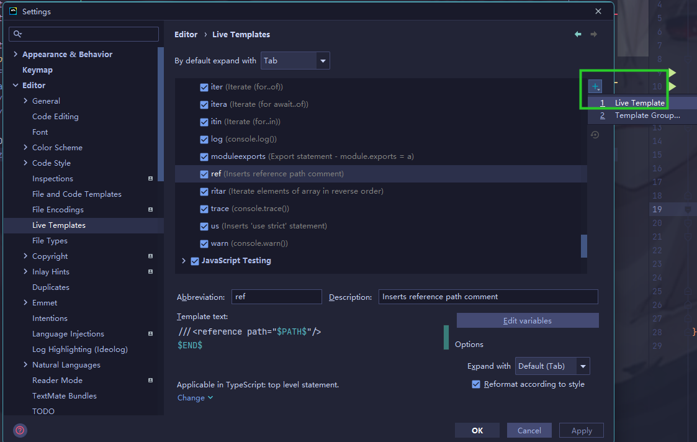
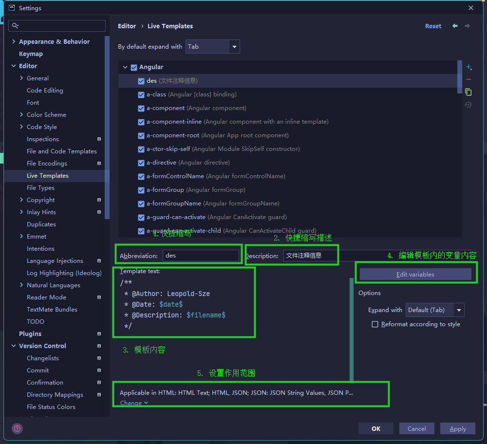
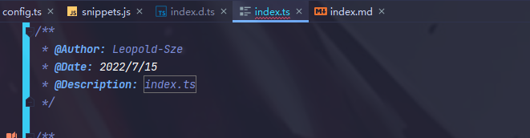

# WebStorm

## 推荐插件

| 名称                     | 功能                                                               |
| :----------------------- | :----------------------------------------------------------------- |
| `.env files support`     | 支持.env环境变量文件                                               |
| `.ignore`                | 各种 `ignore` 文件支持                                             |
| `Atom Material Icons`    | 项目目录及文件图标                                                 |
| `Background Image Plus`  | 更换编辑器背景图                                                   |
| `Browserlist`            | 配置browserlist适配                                                |
| `CodeGlance Pro`         | 右侧文件缩略图，快速滚动                                           |
| `GitHub Copilot`         | AI代码辅助工具                                                     |
| `GitToolBox`             | Git提交工具                                                        |
| `IDE Features Trainer`   | `IDE` 基本操作训练                                                 |
| `Indent Rainbow`         | 彩色缩进对应展示                                                   |
| `Json Parser`            | JSON解析                                                           |
| `Key Promoter X`         | 快捷键提示                                                         |
| `LogIt`                  | 快速插入或者删除 `console.log`：`Alt + L` 插入，`Alt + ↑ + L` 删除 |
| `Material Theme UI Lite` | 轻量版免费主题，推荐 `Moonlight`，与 `new UI` 好像有冲突           |
| `Randomness`             | 生成并插入随机数据，`Alt + R` 选择对应类型                         |
| `Rainbow Brackets`       | 彩色括号对应显示                                                   |
| `Power mode II`          | 编码爆炸效果                                                       |
| `String Manipulation`    | 字符串处理                                                         |
| `Tetris Game`            | 俄罗斯方块，摸鱼                                                   |
| `TONGYI Lingma`          | 通易灵码，AI辅助工具                                               |
| `Translation`            | 翻译插件，需配置相关授权                                           |
| `Uniapp Tool`            | 支持uni-app及小程序 (2022.3+)                                      |

::: details 手动安装插件

1. `Ctrl + Alt + s` 打开设置
2. 选择 `Plugins`
3. 选择 `Install Plugin from Disk`
4. 选择要安装的插件压缩包，确定

:::

 

## 快捷键

| 快捷键       | 作用         |
| ------------ | ------------ |
| `双击 Shift` | 全局任意搜索 |
|              |              |
|              |              |
|              |              |
|              |              |
|              |              |
|              |              |
|              |              |
|              |              |

 

## Live Templates

1. 打开 `webstorm` → 设置 `setting` → `Editor` → `Live Templates` →添加一个 `Live Templates`

   

2. 配置 `Live Templates`

   

3. 使用 → `des` → `Tab` 键

   

> 参考：[设置头部注释模板](https://www.cnblogs.com/byx1024/p/12208009.html)

 

## File and Code Templates

1. `setting` → `File and Code Templates` → +
