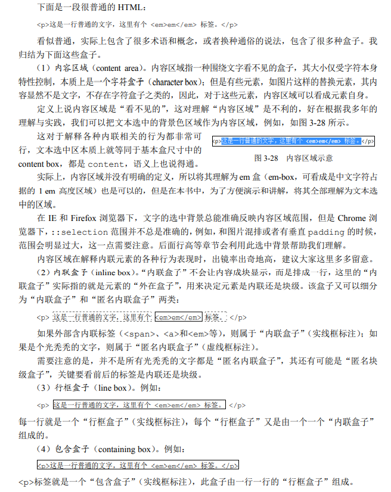
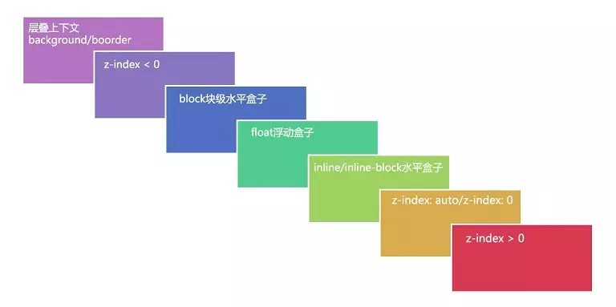

# CSS 2.1
## 元素与基本尺寸
### 块级元素
+ 基本特征：一个水平流上只能单独显示一个元素，多个块级元素则换行显示

```plain
 /* 常见作用：清除浮动 */
 .clear::after {
     content: '';
     display: block; // 也可以是table，或者是list-item。注意：list-item对IE伪元素兼容性不好
     clear: both;
 }
```

:::info
+ `list-item` 元素出现项目符号的原因：生成了一个附加的盒子，学名“标记盒子”(marker box)，专门用来放圆点、数字这些项目符号。
+ 每个元素都有两个盒子，外在盒子和内在盒子，外在盒子负责元素是可以一行显示，还是只能换行显示；内在盒子负责宽高、内容呈现什么的，又称为”容器盒子“。
+ 内在盒子又被分成了4个盒子，分别是 `content-box, padding-box, border-box, margin box`。
+ 按照 `display` 属性值的不同，值为 `block` 的元素的盒子实际由外在的“块级盒子“和内在的”块级容器盒子“组成；值为 `inline-block` 的元素则由外在的“内联盒子”和内在的“块级容器盒子”组成；值为 `inline` 的元素则内外均是“内联盒子”。
+ 除了盒子，显示也分为“内部显示”和“外部显示”；同样地，尺寸也分“内部尺寸”和“外部尺寸”。外部尺寸宽度由外部元素决定，内部尺寸宽度由内部元素决定。
+ 默认情况下，`width/height` 作用在内在盒子(也就是“容器盒子”)的 `content-box`。

:::

  


#### width & height
`width` 默认值 `auto` 包含了4种不同的宽度表现：

1. 充分利用可用空间：块级元素宽度默认是100%与父级容器的
2. 收缩与包裹：收缩到合适，典型代表就是浮动、绝对定位、`inline-block` 元素或 `table` 元素
3. 收缩到最小
4. 超出容器限制：除非有明确的 `width` 相关设置，否则上面3种情况尺寸都不会主动超过父级容器宽度。_**特殊情况：内容很长的连续的英文和数字，或者内联元素被设置了 **_`white-space: nowrap`_**。**_

上述情况，只有第一种情况是“外部尺寸”，也是“流”的精髓所在，其余全部是“内部尺寸”。

  


**外部尺寸与流体特性**

_**三无准则：无宽度、无图片、无浮动。**_

1. 正常流宽度：表现为外部尺寸的块级元素一旦设置了宽度，流动性就丢失了。流动性是指一种 `margin/border/padding` 和 `content` 内容区域自动分配水平空间的机制。
2. 格式化宽度：仅出现在“绝对定位模型”中，也就是出现在 `position: absolute / fixed` 的元素中。在默认情况下，绝对定位元素的宽度表现是“包裹性”，宽度由内部尺寸决定。对于非替换元素，当 `left/right` 或 `top/bottom` 对立方位的属性值同时存在的时候，元素的宽度表现为“格式化宽度”，其宽度大小相对于最近的具有定位特性(`position` 属性值不是 `static`)的祖先元素计算。和上面正常流宽度一样，格式化宽度具有完全的水平和垂直方向的流体性。
3. 格式化高度：`height: auto` 的表现，仅针对“绝对定位模型”。

  


**内部尺寸与流体特性**

+ 内部尺寸判断：假如元素没有内容，宽度为0，就是应用的”内部尺寸”
1. 包裹性：除了“包裹”，还有“自适应性”。所谓“自适应性”，指的是元素尺寸由内部元素决定，但永远小于“包含块”容器的尺寸(除非容器尺寸小于元素的“首选最小宽度”)。除了 `inline-block` 元素，浮动元素以及绝对定位元素都具有包裹性，均有类似的智能宽度行为。
2. 首选最小宽度：指的是元素最适合的最小宽度
    - 东亚文字(如中文)最小宽度为每个汉字的宽度
    - 西方文字最小宽度由特定的连续的英文字符单元组成
    - 类似图片这样的替换元素的最小宽度就是该元素内容本身的宽度
3. 最大宽度：等同于“包裹性”元素设置 `white-space: nowrap` 声明后的宽度。如果内部没有块级元素或者块级元素没有设定宽度值，则“最大宽度”实际上是最大的连续内联盒子的宽度。连续内联盒子指的全部都是内联级别的一个或一堆元素，中间没有任何的换行标签 `<br>` 或其他块级元素。

:::info
就是 `CSS` 中的 `width` 属性不与影响宽度的 `padding/border` (有时候也包括 `margin` )属性共存。

`width` 独立占用一层标签，而 `padding , border, margin` 利用流动性在内部自适应呈现。

因为宽度设置存在不合理点：

1. 流动性丢失
2. 与现实世界表现不一致的困扰

:::

  


**box-sizing**

+ 作用：`box-sizing: border-box / content-box;` 设置宽度作用规则，默认宽度作用于 `content-box`

:::info
避免全局重置，用于替换元素的自适应问题

:::

  


**height: 100%**

:::warning
对于 `width` 属性，就算父元素 `width` 为 `auto` ，其子元素百分比值也是支持的；但是对于 `height` 属性，如果父元素 `height` 为 `auto`，只要子元素在文档流中，其百分比值完全就被忽略了。

**对于普通文档流中的元素，百分比高度值要想起作用，其父级必须有一个可以生效的高度值！**

:::

::: tip 如何设置支持 `height: 100%`

1. 设置显示的高度值
2. 使用绝对定位。绝对定位元素和非绝对定位元素的百分比计算是有区别的：绝对定位的宽高百分比计算是相对于 `padding-box` 的，也就是说会把 `padding` 大小值计算在内，但是非绝对定位元素则是相对于 `content-box` 计算的。

:::info
  


#### min/max-width/height
`width/height` 的默认值是 `auto` ，而 `max-*` 系列初始值是 `none`，`min-*` 系列初始值是 `auto`。

**超越!important**：指的是 `max-width` 会覆盖 `width`，比 `!important` 权重还高。

**超越最大**：指的是 `min-width` 会覆盖 `max-width` ，此规则发生在 `min-width` 和 `max-width` 冲突的时候。

  


### 内联元素
+ 定义：“内联”特指“外在盒子”，即 `display: inline | inline-*`
+ 特征：可以和文字在一行显示

  


#### 内联盒模型


1. 内容区域：指一种围绕文字看不见的盒子，其大小仅受字符本身特性控制，本质上是一个字符盒子。可以把文本选中的背景色区域作为内容区域，对于替换元素，可以看成是元素本身。
2. 内联盒子：元素的“外在盒子”，用来决定元素是内联还是块级。可以细分为“内联盒子”(外部含内联元素标签)和“匿名内联盒子”(仅文本元素)两类。
3. 行框盒子：每一行就是一个行框盒子，由一个个“内联盒子”组成。
4. 包含盒子：指的是标签本身，由一个个行框盒子组成。

  


#### 幽灵空白节点
+ 表现：假想盒，是一个存在于每个“行框盒子”前面，同时具有该元素的字体和行高属性的0宽度的内联盒

:::

仅针对HTML5文档声明

:::info
  


## 盒模型
### content
**替换元素**

根据“外在盒子”是内联还是块级我们可以把元素分为内联元素和块级元素；二根据是否具有可替换内容，我们也可以把元素分为替换元素和非替换元素。

+ 定义：这种通过修改某个属性值呈现的内容就可以被替换的元素就称为“替换元素”。常见的 `, <object>, <video>, <iframe>, <textarea>, <input>` 都是典型的替换元素。
+ 特性：
    1. 内容的外观不受页面上的 `CSS` 的影响
    2. 有自己的尺寸：很多替换元素在没有明确尺寸设定的情况下，其默认的尺寸(不包括边框) 是 `300x150` 像素。
    3. 在很多 `css` 属性上有自己的一套表现规则：替换元素基线默认为元素的下边缘，非替换元素基线为 `x` 的下边缘。

:::

所有的替换元素都是内联水平元素(即 `inline` 或 `inline-block`)，也就是替换元素和替换元素、替换元素和文字都是可以在一行显示的。

:::info
  


**替换元素的尺寸计算规则**

无论替换元素的 `display` 值是什么，尺寸计算规则都是一样的。

从内而外分为三类：固有尺寸、`html` 尺寸和 `css` 尺寸。

1. 固有尺寸指的是替换内容原本的尺寸。
2. `HTML` 尺寸只能通过 `HTML` 原生属性改变，包括`` 的 `width` 和 `height` 属性、`<input>` 的 `size` 属性、`<textarea>` 的 `cols` 和 `rows` 属性等。
3. `css` 尺寸特指可以通过`css` 属性设置的尺寸，对应盒尺寸中的 `content box`。

计算规则：

+ 如果没有 `CSS` 尺寸和 `HTML` 尺寸，则使用固有尺寸作为最终的宽高。
+ 如果没有 `CSS` 尺寸，则使用 `HTML` 尺寸作为最终的宽高。
+ 如果有 `CSS` 尺寸，则最终尺寸由 `CSS` 属性决定。
+ 如果“固有尺寸”含有固有的宽高比例，同时仅设置了宽度或仅设置了高度，则元素依然按照固有的宽高比例显示。
+ 如果上面的条件都不符合，则最终宽度表现为300像素，高度为150像素，宽高比2 : 1
+ 内联替换元素和块级替换元素使用上面同一套尺寸计算规则。

:::

``：这里的 `` 直接没有 `src` 属性，`src=""` 在很多浏览器下依然会有请求，而且请求的是当前页面数据。当图片的 `src` 属性缺省的时候，图片不会有任何请求，是最高效的实现方式。

:::info
:::

无法改变替换元素内容的固有尺寸

:::info
  


**替换元素和非替换元素区别**

1. 只隔了一个 `src` 属性。
2. 只隔了一个 `content` 属性：`Chrome` 下默认所有元素都支持 `content` 属性，而其他浏览器仅在 `::before/::after` 伪元素中才支持。

:::

`content` 属性改变的仅仅是视觉呈现，当我们以右键或其他形式保存这张图片的时候，所保存的还是原来 `src` 对应的图片。使用 `content` 属性还可以让普通标签元素变成替换元素。

:::info
  


**content 与替换元素的关系**

我们把 `content` 属性生成的对象称为“匿名替换元素”，生成的内容都是替换元素

:::

1. 使用 `content` 生成的文本是无法选中、无法复制的，好像设置了 `user-select: none` 一般，但是普通元素的文本可以被轻松选中。同时，生成的文本无法被屏幕阅读器读取，也无法被搜索引擎抓取
2. 不能左右 `:empty` 伪类，此伪类当元素里面无内容时匹配，元素内容为空时还是会匹配，不管伪元素内容是否为空
3. `content` 动态生成值无法获取

:::info
:::

1. 辅助元素生成，如清除浮动

```css
// 清除浮动
.clear::before {
  content: '';
  display: block;
  clear: both;
}

```

2. 字符内容生成，如 `Unicode` 字符
3. 图片内容生成，如

```css
// base64 图片由于内联在 css 文件中，因此直接出现，没有尺寸为0的状态，同时无须额外设置 display 属性值为块状，css 代码更省。
div::before {
  content: url(1.jpg);
}
```

4. attr属性值内容生成，如

```css
.icon::before {
    content: attr(data-title); // 属性值名称不能加引号
}
```

:::info
  


### padding
**元素尺寸**

因为 CSS 中默认的 `box-sizing` 是 `content-box`，所以使用 `padding` 会增加元素的尺寸。

对于块级元素，如果 `padding` 足够大，此时 `width` 会无效，里面的内容表现为“首选最小宽度”。

内联元素的 `padding` 在垂直方向同样会影响布局，影响视觉表现。只是因为内联元素没有可视宽度和可视高度的说法（`clientWidth` 和 `clientHeight` 永远是0），垂直方向上的行为表现完全受 `line-height` 和 `vertical-align` 的影响，视觉上并没有改变上一行和下一行的间距，因此感觉垂直 `padding` 没起作用。

CSS中还有很多其他场景或属性会出现这种不影响其他元素布局而是出现层叠效果的现象。层叠效果分类：

+ 纯视觉层叠，不影响外部尺寸，如 `box-shadow` 以及 `outline`
+ 影响外部尺寸：如 `padding`

区分方式：如果父容器 `overflow: auto` ，层叠区域超过父容器的时候，没有滚动条出现，则是纯视觉的；如果出现滚动条，则会影响尺寸、影响布局。

内联元素 `padding` 对视觉层和布局层具有双重影响。

对于非替换的内联元素，不仅 `padding` 不会加入行盒高度的计算，`margin` 和 `border` 也都是如此，都是不计算高度，但实际上在内联盒周围发生了渲染。

  


**百分比值**

1. `padding` 属性不支持负值
2. 百分比值无论是水平方向还是垂直方向均是相对于父级宽度计算的
3. 作用于内联元素会断行
4. 内联元素的垂直 `padding` 会让”幽灵空白节点“显现，因此相等 `padding` 百分比展现为矩形。由于内联元素默认的高度完全受 `font-size` 大小控制，因此设置 `font-size: 0` 即可

  


### margin
**元素尺寸**

**元素尺寸**：包括 `padding` 和 `border` ，也就是元素的 `border box` 的尺寸，在原生 DOM API 中写作 `offsetWidth` 和 `offsetHeight`，也称为“元素偏移尺寸”。

**元素内部尺寸**：包括`padding` 但不包括 `border` ，也就是元素的 `padding box` 的尺寸，在原生 DOM API 中写作 `clientWidth` 和 `clientHeight`，也称为“元素可视尺寸”。

**元素外部尺寸**：包括`padding`、`border` 和 `margin`，也就是元素的 `margin box` 的尺寸。大小可能是负数。

:::

1. 对于 `padding`，元素设定了 `width` 或者保持了“包裹性”的时候，会改变元素可视尺寸；对于 `margin` 则相反，元素设定了 `width` 值或者保持了“包裹性”的时候，对可视尺寸没有影响，只有元素是“充分利用可用空间”状态的时候，才可以改变元素的可视尺寸。
2. 只要元素的尺寸表现符合“充分利用可用空间”，无论是垂直方向还是水平方向，都可以通过margin改变尺寸。

:::info
:::

1. 只能使用子应用的 `margin-bottom` 来实现滚动容器的底部留白。
2. 内联元素垂直方向的 `margin` 是没有任何影响的，既不会影响外部尺寸，也不会影响内部尺寸。对于水平方向，由于内联元素宽度表现为“包裹性”，也不会影响内部尺寸。

:::info
  


**百分比值**

和padding一样，无论是水平方向还是垂直方向都是相对于宽度计算的。

  


**margin合并**

:::

1. 块级元素，但不包括浮动和绝对定位元素(尽管浮动和绝对定位可以让元素块状化)
2. 只发生在垂直方向（在不考虑writing-mode的情况下）

:::info
:::

1. 相邻兄弟元素margin合并
2. 父级和第一个/最后一个子元素的margin合并
    - 虽然在子元素上设置的margin-top，但实际上就等同于在父元素上设置了margin-top，但不等于就是，使用 `getComputedStyle` 方法获取父元素的margin-top值还是CSS属性中设置值，并非margin合并的表现值
    - 对于margin-top合并，任选如下一项操作：
        * 父元素设置为块状格式化上下文元素
        * 父元素设置border-top值
        * 父元素设置paddin-top值
        * 父元素和第一个子元素之间添加内联元素进行分隔
    - 对于margin-bottom合并，任选如下一项操作：
        * 父元素设置为块状格式化上下文元素
        * 父元素设置border-bottom值
        * 父元素设置paddin-bottom值
        * 父元素和第一个子元素之间添加内联元素进行分隔
        * 父元素设置height、min-height或max-height
3. 空块级元素的margin合并
    - 任选如下一项操作：
        * 设置垂直方向的border
        * 设置垂直方向的padding
        * 里面添加内联元素（直接Space键空格是没用的）
        * 设置height或者min-height

:::info
:::

1. 正正取大值
2. 正负值相加
3. 负负最负值

:::info
  


**margin: auto**

1. 如果想让某个块状元素右对齐，脑子里不要就一个 `float: right` ，很多时候，`margin-left: auto` 才是最佳实践。margin属性的auto计算就是为块级元素左中右对齐而设计的，和内联元素使用 `text-align` 控制左中右对齐正好遥相呼应。
2. 对于替换元素，如果设置 `display: block`，则 `margin: auto` 的计算规则同样适合。

  


### border
`border-color` 默认颜色就是 `color` 色值，当没有指定边框颜色的时候，会使用当前元素的color计算值作为边框色。具有类似特性的CSS属性还有 `outline、box-shadow、text-shadow` 等。

  


## 内联元素与流
### 基线
:::

1. 在各种内联相关模型中，凡是涉及垂直方向的排版或者对齐的，都离不开最基本的基线（baseline）。
2. `line-height` 行高的定义就是两基线的间距，`vertical-align` 的默认值就是基线。
3. `x-height` 指的就是小写字母x的高度，术语描述就是等分线（mean line，也称为中线midline）和基线（baseline）之间的距离。
4. `vertical-align: middle`：指的是基线往上1/2 `x-height` 的高度，近似理解为字母x的交叉点位置，和中线不是一个意思。
5. 相对单位ex：指的是小写字母x的高度，就是指 `x-height`，价值在于不受字体和字号影响的内联元素的垂直居中对齐效果。

:::info
  


### line-height
内联元素的高度由固定高度和不固定高度组成，这个不固定的高度就是“行距”。`line-height` 之所以起作用，就是通过改变“行距”来实现的。

在css中，行距分散在当前文字的上方和下方，也就是即使是第一行文字，其上方也是有“行距”的，只不过这个“行距”的高度仅仅是完整“行距”高度的一半，因此也被称为”半行距“。

:::

行距 = 行高 - (em-box)，即 `行距 = line-height - font-size `

:::info
:::

1. 让单行文字垂直居中，只需要 `line-height` 一个属性就可以
2. 多行文本或者替换元素的垂直居中，需要 `vertical-align: middle` 才可以

:::info
:::

无论内联元素 `line-height` 如何设置，最终父级元素的高度都是由数值大的那个 `line-height` 决定的。

:::info
:::

如果里面没有内联元素，或者 `overflow` 属性不是 `visible` ，则该元素的基线就是其margin底边缘。

:::info
  


### vertical-align
1. 属性值：
+ 线类：如 `baseline(默认值)`、top、middle、bottom
+ 文本类：如 `text-top`、`text-bottom`
+ 上标下标类：如 `sub`、`super`
+ 数值百分比类：如20px、2em、20%等，渲染规则相同，根据计算值的不同，决定相对于基线往上或者往下偏移，正值让上偏移，负值往下偏移

:::

`margin` 和 `padding` 是相对于宽度计算的，`line-height` 是相对于 `font-size` 计算的，`vertical-align` 则是相对于 `line-height` 的计算值计算的。

:::info
:::

只能应用于内联元素以及display值为 `table-cell` 的元素。_**即只能作用于display计算值为 **_`inline、line-block、inline-table、table-cell`_** 的元素，浮动和绝对定位会导致元素块状化，从而让此属性失效。**_

:::info
:::

对字符而言，`font-size` 越大字符的基线位置越往下，因为文字默认全部都是基线对齐，所以当字号大小不一样的两个文字出现在一起的时候，彼此就会发生上下位移，如果位移距离足够大，就会超过行高的限制，而导致出现意料之外的高度。

:::info
2. vertical-align: top/bottom
3. vertical-align: middle
4. vertical-align 文本类

假设元素后面有一个和父元素 `font-size、font-family` 一模一样的文字内容，则 `vertical-align: text-top` 表示元素和这个文字内容区域的上边缘对齐。

  


## 流的破坏与保护
### float
1. 特性：
    - 包裹性
    - 块状化并格式化上下文
    - 破坏文档流
    - 没有任何margin合并

:::

行框盒子如果和浮动元素的垂直高度有重叠，则行框盒子在正常定位状态下只会跟随浮动元素，而不会发生重叠。

:::info
:::

float 元素的“浮动参考”是“行框盒子”，也就是 float 元素在当前“行框盒子”内定位，不是外面的包含块盒子之类。

:::info
2. 清除浮动影响
    - **clear 属性让自身不能和前面的浮动元素相邻，对后面的浮动元素无效**
    - **clear 属性只有块级元素才有效，而伪元素默认都是内联水平，所以借助伪元素清除浮动影响时需要设置display属性值**
3. 完美清除浮动：BFC
4. overflow
    - 默认值：visible
    - 当子元素内容超过容器宽高限制时，剪裁的边界是border box的内边缘，而非padding box的内边缘，如果想实现元素剪裁同时四周留有间隙效果的话，可以使用透明边框，因为IE和Firefox会忽略padding-bottom。
    - 不可能实现一个方向溢出剪裁或移动，另一方向内容溢出显示的效果
    - 在PC端，无论是什么浏览器，默认滚动条均来自 `<html>`，而不是 `<body>` 标签，移动端则不是
    - 滚动条会占据容器的可用宽度或高度，移动端滚动条一般都是悬浮模式，不会占据可用宽度，PC端Windows系统下各个浏览器都是 `17px`

  


### position: absolute
:::

+ `position: absolute` 和 `float: left/right` 都具有“块状化”、“包裹性”、“破坏性“等特性
+ 当 absolute 和 float 同时存在的时候，float 无效，因此，没有任何理由同时使用 absolute 和 float
+ 元素一旦 postion 属性值设置了 `absolute` 或 `fixed`，其 display 计算值就是 `block` 或 `table`

:::info
#### 包含块
:::

1. 根元素（`<html>`）被称为“初始包含块”，其尺寸等同于浏览器可视窗口的大小
2. 对于其他元素，如果该元素的 position 是 relative 或 static，则“包含块”由其最近的块容器祖先盒子的 content-box边界形成
3. 如果元素 `position: fixed` ，则“包含块”是“初始包含块“
4. 如果元素 `position: absolute` ，则“包含块”由最近的 position 不为 static 的祖先元素建立，具体方式为：

如果没有符合条件的祖先元素，则“包含块”是“初始包含块”。

    - 如果该祖先元素是纯 inline 元素，则：
        * 假设给内联元素的前后各生成一个宽度为0的内联盒子，则这两个内联盒子的 padding-box 外面的包含盒就是内联元素的“包含块”
        * 如果该内联元素跨行分割了，那么“包含块”是未定义的，由浏览器自行发挥
    - 否则：“包含块”由该祖先的 padding-box 边界形成

:::info
  


#### 无依赖绝对定位
  


#### 与overflow
  


#### clip
:::

使用 clip 进行裁剪的元素其 `clientWidth、clientHeight` 包括样式计算的宽高都还是原来的大小，隐藏仅仅是决定了哪部分是可见的，非可见部分无法响应点击事件。

:::info
  


#### 流体特性
绝对定位元素的 `margin: auto` 的填充规则和普通流体元素的一模一样。

  


### position: relative
相对定位元素的 `left/top/right/bottom` 的百分比值是相对于包含块计算的，而不是自身。虽然定位位移是相对自身，但是百分比值的计算值不是。

  


## 层叠
`z-index` 属性只有和定位元素(position 不为 static 的元素)在一起的时候才有作用，可以是正数也可以是负数。

+ 层叠上下文：如果一个元素含有层叠上下文，可以理解为这个元素在z轴上就“高人一等”。可以把层叠上下文理解为一种“层叠结界”，自成一个小世界。这个小世界中可能有其他的“层叠结界”，而自身也可能处于其他“层叠结界”中。
+ 层叠水平：决定了同一个层叠上下文中元素在z轴上的显示顺序。
+ 层叠顺序：表示元素发生层叠时有着特定的垂直显示顺序，是显示规则。
+ 层叠上下文的创建：
    1. 天生派：页面根元素天生具有层叠上下文，称为根层叠上下文
    2. 正统派： `z-index` 值为数值的定位元素的传统“层叠上下文”
    3. 扩招派：其他 CSS3 属性

 ::: tip 层叠顺序

1. `background/border`：位于最下面的 `background/border` 特指层叠上下文元素的边框和背景色。每一个层叠顺序规则仅适用于当前层叠上下文元素的小世界。
2. 负值 `z-index`
3. block 块状水平盒子
4. float 浮动盒子
5. inline 水平盒子：指的是包括 `inline/inline-block/inline-table` 元素的“层叠顺序”，它们都是同级别的
6. `z-index: auto` 或 `z-index: 0` 不依赖 z-index 的层叠上下文
7. 正值 `z-index`

:::

:::info
1. 谁大谁上：当具有明显的层叠水平标识的时候，如生效的 `z-index` 属性值，在同一个层叠上下文领域，层叠水平值大的那一个覆盖小的那一个
2. 后来居上：当元素的层叠水平一致、层叠顺序相同的时候，在DOM流中处于后面的元素会覆盖前面的元素

:::

:::info
1. 元素为 flex 布局元素(父元素 `display: flex | inline-flex`)，同时 `z-index` 值不是 auto
2. 元素的 `opacity` 值不是1
3. 元素 `transform` 值不是 none
4. 元素 `mix-blend-mode` 值不是 normal
5. 元素的 `filter` 值不是 none
6. 元素的 `isolation` 值是 `isolate`
7. 元素的 `will-change` 属性值为上面2~6的任意一个(如 `will-change: opacity` 等)
8. 元素的 `-webkit-overflow-scrolling` 设为 `touch`

:::

1. 如果层叠上下文元素不依赖 `z-index` 数值，则其层叠顺序是 `z-index: auto` ，可看成 `z-index: 0` 级别
2. 如果层叠上下文元素依赖 `z-index` 数值，则其层叠顺序由 `z-index` 值决定

  


## 文本类处理
### font-family
支持两类属性，一类是“字体名”，一类是“字体族”。如果字体名包含空格，需要使用引号包起来。如果有多个字体设定，从左往右依次寻找本地是否有对应字体即可。字体名和字体族同时使用，字体族要放在最后。

:::info
+ `serif`：衬线字体，就是笔画开始、结束的地方有额外装饰且笔画的粗细会有所不同的字体
+ `sans-serif`：无衬线字体
+ `monospace`：等宽字体
+ `cursive`：手写字体
+ `fantasy`：奇幻字体
+ `system-ui`：系统UI字体

:::

font 属性缩写：`[[font-style || font-variant || font-weight] ? font-size [ / line-height] ? font-family]`

  


### @font-face
  


### text-indent
1. 仅对第一行内联盒子内容有效
2. 非替换元素以外的 display 计算值为 inline 的内联元素设置 text-indent 值无效。如果计算值是 `inline-block/inline-table` 则会生效。因此，如果父级块状元素设置了 text-indent 属性值，子 `inline-block/inline-table` 需要设置 `text-indent: 0` 重置
3. `<input>` 标签按钮 text-indent 值无效

  


### letter-spacing
可以用来控制字符之间的间距，包括英文字母、汉字以及空格等。有以下特性：

+ 继承性
+ 默认值是normal
+ 支持负值，且值足够大的时候，会让字符形成重叠，甚至反向排列
+ 负值仅能让字符重叠，但是不能让替换元素或者 `inline-block/inline-table` 元素发生重叠
+ 和 `text-indent` 属性一样，无论值多大或多小，第一行一定会保留至少一个字符
+ 支持小数
+ 不支持百分比值

  


### word-spacing
用来控制字符之间的间距，仅作用于空格字符，增加空格的间隙宽度，有空格就有效。有以下特性：

+ 继承性
+ 默认值是normal
+ 支持负值，且值足够大的时候，会让字符形成重叠，甚至反向排列
+ 负值仅能让字符重叠，但是不能让替换元素或者 `inline-block/inline-table` 元素发生重叠
+ 和 `text-indent` 属性一样，无论值多大或多小，第一行一定会保留至少一个字符
+ 支持小数

  


### white-space
声明如何处理元素内的空白字符，包括Space(空格)键、Enter(回车)键、Tab(制表符)键产生的空白。因此可以决定图文内容是否在一行显示(回车空格是否生效)，是否显示大段连续空白(空格是否生效)等。

属性值包括：

+ `normal`：合并空白字符和换行符
+ `pre`：空白字符不合并，并且内容只在有换行符的地方换行
+ `nowrap`：该值和 normal 一样会合并空白字符，但不允许文本环绕
+ `pre-wrap`：空白字符不合并，并且内容只在有换行符的地方换行，同时允许文本环绕
+ `pre-line`：合并空白字符，但只在有换行符的地方换行，允许文本环绕

| 属性 | 换行 | 空白和制表 | 文本环绕 |
| :---: | :---: | :---: | :---: |
| `normal` | 合并 | 合并 | 环绕 |
| `nowrap` | 合并 | 合并 | 不环绕 |
| `pre` | 保留 | 保留 | 不环绕 |
| `pre-wrap` | 保留 | 保留 | 环绕 |
| `pre-line` | 保留 | 合并 | 环绕 |


:::info
+ 如果合并空格，会让多个空格变成1个
+ 如果合并换行，会把多个连续换行合并成1个，并当作1个普通空格处理
+ 如果文本环绕，一行文字内容超出容器宽度时，会自动从下一行开始显示

:::

  


### 元素装饰与美化
+ `background-image`：在父元素非 `display: none` 情况下会产生请求
+ `background-position`：值支持1~4个值，可以是具体数值，也可以是百分比值，还可以是left、top、right、bottom、center等关键字，如果缺省偏移关键字，则会认为是 center。

  


## 包含块
就是元素的尺寸和位置，会受它的包含块所影响。

对于一些属性，例如 width, height, padding, margin，绝对定位元素的偏移值（比如 position 被设置为 absolute 或 fixed），当我们对其赋予百分比值时，这些值的计算值，就是通过元素的包含块计算得来。

包含块分为两种，一种是根元素（HTML 元素）所在的包含块，被称之为初始包含块（**initial containing block**）。对于浏览器而言，初始包含块的的大小等于视口 viewport 的大小，基点在画布的原点（视口左上角）。它是作为元素绝对定位和固定定位的参照物。

另外一种是对于非根元素，对于非根元素的包含块判定就有几种不同的情况了。大致可以分为如下几种：

+ 如果元素的 `positiion` 是 relative 或 static ，那么包含块由离它最近的块容器（block container）的内容区域（content area）的边缘建立。
+ 如果 `position` 属性是 fixed，那么包含块由视口建立。
+ 如果元素使用了 absolute 定位，则包含块由它的最近的 position 的值不是 static （也就是值为fixed、absolute、relative 或 sticky）的祖先元素的内边距区的边缘组成。

前面两条实际上都还比较好理解，第三条往往是初学者容易比较忽视的，我们来看一个示例：

```html
<body>
  <div class="container">
    <div class="item">
      <div class="item2"></div>

    </div>

  </div>

</body>

```

```css
.container {
  width: 500px;
  height: 300px;
  background-color: skyblue;
  position: relative;
}
.item {
  width: 300px;
  height: 150px;
  border: 5px solid;
  margin-left: 100px;
}
.item2 {
  width: 100px;
  height: 100px;
  background-color: red;
  position: absolute;
  left: 10px;
  top: 10px;
}

```

首先阅读上面的代码，然后你能在脑海里面想出其大致的样子么？或者用笔和纸画一下也行。

公布正确答案：


实际上对于非根元素来讲，包含块还有一种可能，那就是如果 position 属性是 absolute 或 fixed，包含块也可能是由满足以下条件的最近父级元素的内边距区的边缘组成的：

+ `transform` 或 `perspective` 的值不是 none
+ `will-change` 的值是 `transform` 或 `perspective`
+ `filter` 的值不是 `none` 或 `will-change` 的值是 `filter`(只在 Firefox 下生效).
+ `contain` 的值是 `paint` (例如: contain: paint;)

我们还是来看一个示例：

```html
<body>
  <div class="container">
    <div class="item">
      <div class="item2"></div>

    </div>

  </div>

</body>

```

```css
.container {
  width: 500px;
  height: 300px;
  background-color: skyblue;
  position: relative;
}
.item {
  width: 300px;
  height: 150px;
  border: 5px solid;
  margin-left: 100px;
  transform: rotate(0deg); /* 新增代码 */
}
.item2 {
  width: 100px;
  height: 100px;
  background-color: red;
  position: absolute;
  left: 10px;
  top: 10px;
}

```

我们对于上面的代码只新增了一条声明，那就是 `transform: rotate(0deg)`，此时的渲染效果却发生了改变，如下图所示：


可以看到，此时对于 div.item2 来讲，包含块就变成了 div.item。

我们再把 CSS 规范中所举的例子来看一下。

```html
<html>
  <head>
    <title>Illustration of containing blocks</title>

  </head>

  <body id="body">
    <div id="div1">
      <p id="p1">This is text in the first paragraph...</p>

      <p id="p2">
        This is text
        <em id="em1">
          in the
          <strong id="strong1">second</strong>

          paragraph.
        </em>

      </p>

    </div>

  </body>

</html>

```

上面是一段简单的 HTML 代码，在没有添加任何 CSS 代码的情况下，你能说出各自的包含块么？

对应的结果如下：

| 元素 | 包含块 |
| --- | --- |
| `html` | `initial C.B. (UA-dependent)` |
| `body` | `html` |
| `div1` | `body` |
| `p1` | `div1` |
| `p2` | `div1` |
| `em1` | `p2` |
| `strong1` | `p2` |


首先 HTML 作为根元素，对应的包含块就是前面我们所说的初始包含块，而对于 body 而言，这是一个 static 定位的元素，因此该元素的包含块参照第一条为 html，以此类推 div1、p1、p2 以及 em1 的包含块也都是它们的父元素。

不过 strong1 比较例外，它的包含块却是 p2，而非 em1。为什么会这样？建议你再把非根元素的第一条规则读一下：

+ 如果元素的 positiion 是 relative 或 static ，那么包含块由离它最近的**块容器（block container）**的内容区域（content area）的边缘建立。

没错，因为 em1 不是块容器，而包含块是**离它最近的块容器**的内容区域，所以是 p2。

接下来添加如下的 CSS：

```css
#div1 {
  position: absolute;
  left: 50px;
  top: 50px;
}

```

上面的代码我们对 div1 进行了定位，那么此时的包含块会发生变化么？你可以先在自己思考一下。

答案如下：

| 元素 | 包含块 |
| --- | --- |
| `html` | `initial C.B. (UA-dependent)` |
| `body` | `html` |
| `div1` | `initial C.B. (UA-dependent)` |
| `p1` | `div1` |
| `p2` | `div1` |
| `em1` | `p2` |
| `strong1` | `p2` |


可以看到，这里 div1 的包含块就发生了变化，变为了初始包含块。这里你可以参考前文中的这两句话：

+ 初始包含块（**initial containing block**）。对于浏览器而言，初始包含块的的大小等于视口 viewport 的大小，基点在画布的原点（视口左上角）。它是作为元素绝对定位和固定定位的参照物。
+ 如果元素使用了 absolute 定位，则包含块由它的最近的 position 的值不是 static （也就是值为fixed、absolute、relative 或 sticky）的祖先元素的内边距区的边缘组成。

是不是一下子就理解了。没错，因为我们对 div1 进行了定位，因此它会应用非根元素包含块计算规则的第三条规则，寻找离它最近的 position 的值不是 static 的祖先元素，不过显然 body 的定位方式为 static，因此 div1 的包含块最终就变成了初始包含块。

接下来我们继续修改我们的 CSS：

```css
#div1 {
  position: absolute;
  left: 50px;
  top: 50px;
}
#em1 {
  position: absolute;
  left: 100px;
  top: 100px;
}

```

这里我们对 em1 同样进行了 absolute 绝对定位，你想一想会有什么样的变化？

没错，聪明的你大概应该知道，em1 的包含块不再是 p2，而变成了 div1，而 strong1 的包含块也不再是 p2 了，而是变成了 em1。

如下表所示：

| 元素 | 包含块 |
| --- | --- |
| `html` | `initial C.B. (UA-dependent)` |
| `body` | `html` |
| `div1` | `initial C.B. (UA-dependent)` |
| `p1` | `div1` |
| `p2` | `div1` |
| `em1` | `div1`（因为定位了，参阅非根元素包含块确定规则的第三条） |
| `strong1` | `em1`（因为 em1 变为了块容器，参阅非根元素包含块确定规则的第一条） |


  


## 属性值的计算过程
1. 确定声明值：找到作者样式表和浏览器默认样式表没有**冲突**的样式，直接作为计算后的样式。
2. 层叠：解决冲突的样式
    1. 比较重要性：重要性从高到低
        1. 带有 `!important` 的作者样式
        2. 带有 `!important` 的默认样式
        3. 作者样式
        4. 默认样式
    2. 比较特殊性：对每个样式分别计数
        1. 内联
        2. id
        3. 类、属性、伪类
        4. 元素、伪元素
    3. 比较源次序：源码中靠后的覆盖靠前的
3. 继承：对**仍然没有值**的属性，若**可以继承**，则使用继承
4. 使用默认值：对**仍然没有值**的属性，直接使用默认值

以下关键字全部在计算过程前两步确定：

`inherit`：直接继承使用父元素属性值。

`initial`：将属性值设置为默认值。

`unset`：跳过计算前两步，自动完成后续步骤。

`revert`：应用浏览器的默认样式。

  


## BEM
> 格式：`block-name__<element-name>--<modifier-name>-<modifier-value>`
>

:::info
+ Block必须存在，Element和Modifier可选
+ 所有实体的命名均使用小写字母，复合词使用连词符 `-` 连接
+ Block 和 Element之间使用双下划线 `__` 连接
+ Modifier与Block/Element使用双连词符 `--` 连接
+ modifier-name和modifier-value使用单下划线 `_` 连接

:::

  


## 颜色的alpha通道
> 定义：标识了色彩的透明度，是一个0~1之间的取值，0表示完全透明，1表示不透明，使用 `rgba()` 为颜色添加alpha通道
>

```css
.alpha {
  color: rgba(0, 0, 0, 0); // 等同于transparent
  color: rgba(0, 0, 0, 1); // 等同于rgb
  color: rgba(0 0 0 / 50%); // 等于(0, 0, 0, 0.5)
  color: #000000000;
}
```

  


## 尺寸的百分比
> 定义：绝大部分可以书写尺寸的地方，都可以书写百分比，百分比是一个相对单位，其相对于元素的参考系
>

比如：

+ 普通元素的参考系为**父元素的内容区域**
+ 绝对/固定定位元素的参考系为父元素中**第一个定位元素的padding区域**

| css属性 | 百分比相对于 | 备注 |
| --- | --- | --- |
| width | 参考系的**宽度** |  |
| height | 参考系的**高度** | 参考系高度受本身宽度影响时，设置无效 |
| padding | 参考系的**宽度** |  |
| border | 参考系的**宽度** |  |
| margin | 参考系的**宽度** |  |


  


## 最大最小宽高
+ 最大宽度：`max-width`
+ 最大高度：`max-height`
+ 最小宽度：`min-width`
+ 最小高度：`min-height`

  


